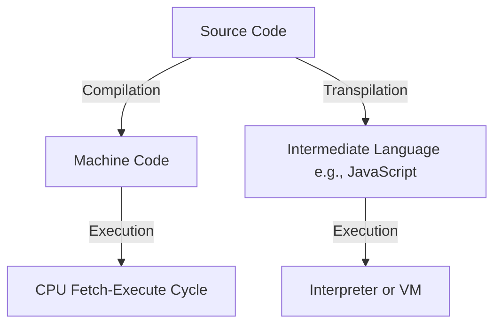
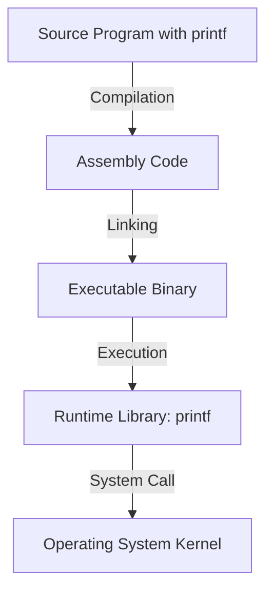

# Chapter 2 – Programming Language Stacks

## 2.1 Introduction
In the second lecture, Professors Cisternino and Corradini introduced the **architecture of programming languages**, focusing on the distinction between **compiled** and **interpreted** languages, the role of **types**, and the historical evolution of programming language semantics【28†Trascrizione】.

The discussion emphasized that programming languages are not only technical tools but also cultural artifacts, shaped by design debates, historical contingencies, and the need to balance **human readability** with **machine executability**.

## 2.2 Historical Perspectives
Every symbol and syntactic convention in programming languages has a history. For example, the syntax for **assignment** varies between languages: while C uses the `=` operator, Pascal historically used `:=`, aligning more closely with the mathematical notion of equality as a relation rather than an operation. Such design choices reflect philosophical debates about clarity, formality, and usability【28†Trascrizione】.

A notable anecdote concerned the early 2000s development of **C# generics** (parametric polymorphism). At Microsoft Research, teams debated for days about the placement of angle brackets and commas to preserve formal grammar properties. Such details illustrate how even apparently trivial syntactic decisions embody deep theoretical concerns.

## 2.3 Compiled vs. Interpreted Languages
The lecture explored the distinction between compiled and interpreted languages. In simplified terms:
- **Compiled languages** translate source code into a *target language* (usually machine code) before execution.
- **Interpreted languages** execute source code more directly, often line by line, through a program that acts as an interpreter.

However, this distinction is not absolute:
- A CPU itself implements a **fetch-execute cycle**, effectively behaving as an interpreter at the hardware level.
- Many modern languages employ **hybrid strategies**, such as Java, which compiles into bytecode executed by the Java Virtual Machine (JVM).
- Intermediate cases include **transpilers**, e.g., TypeScript → JavaScript.

Thus, compilation and interpretation exist on a **continuum** rather than as mutually exclusive categories【28†Trascrizione】.

*Figure 2.1 – Simplified view of compilation and interpretation pathways.*

## 2.4 Formal Specifications and Machines
The concept of a *machine* is central. Each machine (physical or virtual) has a language of instructions it can execute. Compilers map a **source language** (e.g., C, Java) into the target language of the machine, preserving semantics. Interpreters, on the other hand, directly execute the source or an intermediate representation.

Importantly, **pure interpreters** or **pure compilers** are rare. Even compiled languages rely on runtime libraries (e.g., `printf` in C) that are not compiled into machine code but provided separately. Conversely, interpreters often perform preprocessing steps, creating optimized intermediate forms before execution【28†Trascrizione】.

## 2.5 The Example of `printf` in C
A central case discussed in class was the **`printf` function in C**. Students often assume that C is a “fully compiled” language, but this is not entirely true. When a program containing `printf("Hello, world!\n")` is compiled:
1. The C compiler translates the source into assembly.
2. The **runtime library** provides the implementation of `printf`, which is **not compiled into machine code by the user’s compiler** but instead linked at runtime.
3. At execution, the compiled code prepares the arguments, pushes them onto the **stack**, and calls the `printf` function provided by the runtime.

The stack plays a crucial role in function calls. Arguments are loaded into memory following a **calling convention** (e.g., in C, the caller is responsible for cleaning up the stack, unlike Pascal-style conventions where the callee cleans it). This distinction is essential because `printf` accepts a **variable number of arguments**, making it impossible for the callee to know how many arguments were passed. Thus, only the caller can clean the stack correctly【28†Trascrizione】.

In class, a **GPT-based code window** was also used to show the compilation process, displaying the generated assembly instructions. This live demonstration illustrated how `printf` is invoked: first pushing the format string and parameters, then executing a `CALL` to the runtime’s `printf` implementation. The assembly revealed both the **compiled portion** of the program and the **runtime dependency**, underscoring that no language is purely compiled.

*Figure 2.2 – Flow of control when using `printf` in a C program.*

## 2.6 Runtime Systems
A key theme was the role of **runtime systems**. Beyond the compiler, runtimes provide essential services:
- Memory management (including garbage collection)
- Input/output libraries
- Networking and concurrency support

Historical examples include the **C runtime**, the **Java Virtual Machine**, and Microsoft’s **.NET Universal Runtime (URT)**, originally conceived as a “modern C runtime” to integrate features such as garbage collection, networking, and graphics【28†Trascrizione】.

These runtimes blur the line between compilation and interpretation, as they embed interpreters and additional services into what might otherwise be considered a compiled language environment.

## 2.7 Types and Type Systems
Types are a fundamental organizing principle in programming languages. A type can be defined as:
- A **set of values** (e.g., integers, strings)
- A set of **operations** permissible on those values

Programming languages differ in how strictly they enforce type rules:
- **Strongly typed languages** (e.g., Java, Haskell) strictly enforce type rules and prevent operations on incompatible types.
- **Weakly typed languages** (e.g., C, C++) allow unsafe operations such as pointer casts, placing responsibility on the programmer.

### Static vs. Dynamic Typing
- **Statically typed languages** (e.g., C, Java) check types at compile time.
- **Dynamically typed languages** (e.g., Python, JavaScript) defer type checking to runtime.

Hybrid cases exist. For instance, **Java** performs compile-time checks but requires runtime checks for operations such as **downcasting** (e.g., casting a `Control` object to a `Button`). Generics in Java reduce the need for such casts, but their implementation strategy (type erasure) means that certain checks still occur at runtime【28†Trascrizione】.

### Duck Typing
In dynamically typed languages, **duck typing** permits operations on objects if they “quack like a duck,” i.e., if they provide the expected methods, regardless of formal type declarations. This philosophy underlies languages such as Python and JavaScript.

## 2.8 Type Constructors and Language Expressivity
An important classification concerns whether a language supports **type constructors**—the ability to define new composite types. Some languages (e.g., Java, C++) provide robust mechanisms for creating new types, while others (e.g., JavaScript, Lua, early Lisp dialects) lack true type constructors, instead relying on flexible object/dictionary models【28†Trascrizione】.

JavaScript in particular exemplifies this: although it provides a `class` keyword, its underlying type system is based on objects and dictionaries, with syntactic sugar (`a.b` as shorthand for `a["b"]`) providing the illusion of class-based structure. The `this` keyword further complicates semantics, as it dynamically binds to the calling context.

## 2.9 Language Classification
Programming languages can be classified along several axes:
- **Compiled vs. Interpreted**
- **Statically vs. Dynamically typed**
- **Strongly vs. Weakly typed**
- **With or without type constructors**

For example:
- **Rust**: compiled, statically typed, strongly typed, with type constructors.
- **Python**: interpreted, dynamically typed, weakly typed, without traditional type constructors.
- **JavaScript**: interpreted, dynamically typed, with limited type construction via objects.

These categories are **idealizations**, and most real languages occupy hybrid positions along a spectrum【28†Trascrizione】.

## 2.10 Conclusion
The lecture highlighted the **continuum** between compilation and interpretation, the centrality of **types**, and the historical and cultural dimensions of programming language design. Students were encouraged to critically evaluate new or unfamiliar languages by asking:
- To what extent is it compiled or interpreted?
- Is it statically or dynamically typed?
- Is it strongly or weakly typed?
- Does it support type constructors?

These questions provide a framework for systematically analyzing programming languages, preparing students to engage critically with both classical and modern paradigms.

