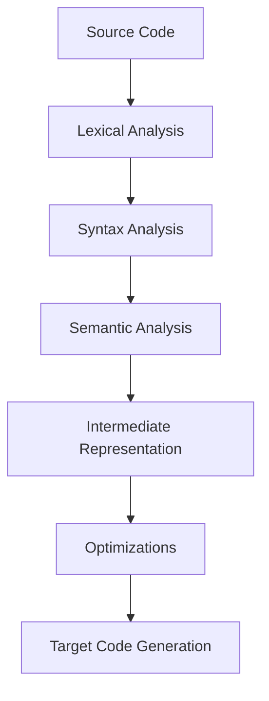
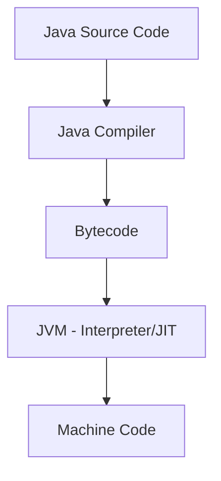
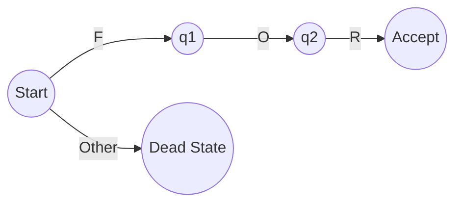

# Chapter 3 – The Transformation Architecture of Programming Languages

## 3.1 Introduction
The third lecture began by clarifying the distinction between **programming languages** and **markup languages**. For example, **HTML** is not a programming language but a markup language, designed for structuring documents rather than controlling computation. More modern and lightweight alternatives such as **Markdown** and **Mermaid** were also introduced: the latter allows diagrams to be represented in textual form and rendered automatically, a technique that demonstrates how text manipulation can produce structured and interpretable artifacts【42†Trascrizione】.

This introduction connected naturally to the theme of the lecture: programming languages as systems that transform text into structured representations through a **pipeline of transformations**. Understanding this architecture is crucial, both to build compilers and interpreters, and to analyze or manipulate programs—a skill increasingly central in the age of **AI-driven code generation**.

## 3.2 Metaprogramming
One of the first conceptual topics was **metaprogramming**. A program is not always the final artifact to be executed by a machine: sometimes, programs themselves become the **input** to other programs that transform or generate new programs. This recursive view is fundamental to modern computing:
- **Compilers and interpreters**: programs that read and transform other programs.
- **Frameworks such as TypeScript or React**: they translate higher-level notations into JavaScript and HTML.
- **Object-relational mapping (ORM) systems**: they transform high-level code into SQL queries.

Metaprogramming reflects the natural inclination of programmers to automate repetitive tasks: after writing the same pattern multiple times, the temptation is to build a generator that automates it. This becomes even more relevant with AI tools, which essentially perform metaprogramming at scale.

## 3.3 The Compiler Pipeline
A compiler (or interpreter) typically  processes a program through several **ordered phases**:



*Figure 3.1 – General architecture of a programming language processor.*

### 3.3.1 Lexical Analysis
- Input: a stream of characters.
- Task: group characters into **tokens** (keywords, identifiers, numbers, symbols).
- Removes irrelevant details such as whitespace and comments.
- Often implemented using **finite automata**, derived from **regular languages**.

### 3.3.2 Syntax Analysis (Parsing)
- Input: a stream of tokens.
- Task: build a **tree representation** (parse tree or abstract syntax tree, AST).
- Example: an arithmetic expression like `a + b` becomes a tree with `+` as the root and `a`, `b` as children.

### 3.3.3 Semantic Analysis
- Input: an AST.
- Task: enforce rules about **types** and other semantic properties.
- Example: ensure that variables are used consistently with their declared type.
- Enables **type inference**, where the compiler deduces types from usage (e.g., `let a = 2` implies `a` is an integer).

### 3.3.4 Code Transformation and Optimization
- Intermediate representation (IR) allows systematic **tree-to-tree transformations**.
- Goals: (1) map high-level constructs into target constructs, (2) optimize code for performance.

### 3.3.5 Target Code Generation
- Produces machine code, assembly, or bytecode.
- Examples: GCC uses RTL as IR, Java compiles to **bytecode**, and .NET compiles to **CIL** (Common Intermediate Language).

## 3.4 Determinism and Safety in Language Processing
A key property of programming languages is **determinism**: given the same input, the compiler/interpreter must produce the same output. Non-determinism is unacceptable in critical domains (e.g., aerospace). A historical case: the **Ariane 5 rocket explosion** (1996), caused by an integer overflow in reused software from Ariane 4, illustrates the catastrophic consequences of inadequate attention to determinism【42†Trascrizione】.

## 3.5 Intermediate Representations and Virtual Machines
The lecture emphasized the role of **intermediate code**:
- Early example: **P-code** in Pascal (portable intermediate representation).
- Java’s **bytecode**: more expressive than machine code, but less expressive than Java itself. It retains **metadata** about classes and methods, supporting reflection and portability.
- .NET’s **CLR (Common Language Runtime)**: designed for multi-language integration, ensuring that C#, VB.NET, and F# could interoperate by compiling into the same IR.
- **LLVM**: a modern framework designed to manipulate intermediate representations, enabling powerful optimizations and portability across platforms.



*Figure 3.2 – Java compilation into bytecode and execution on the JVM.*

## 3.6 Automata and Regular Languages
Lexical analysis relies on **finite automata**, which recognize patterns in character streams. However, automata have limits: they cannot, for example, check for **balanced parentheses**. For that, more powerful models such as **context-free grammars** are needed.

### Regular Expressions
Regular expressions, widely used in text editors and code, are a practical application of automata theory:
- Operators: concatenation, alternation (`|`), repetition (`*`, `+`, `{n,m}`).
- Shorthands: character classes (`\d`, `\w`), ranges (`[a-z]`).
- Greedy vs. lazy quantifiers: `*` matches as much as possible, while `*?` matches as little as possible.

Regular expressions extend beyond strict regular languages in most implementations (e.g., **Perl-style regexes**), introducing backtracking and thus Turing-complete expressivity.



*Figure 3.3 – Automaton recognizing the keyword `for`.*

## 3.7 Tokenizers and Practical Examples
A **tokenizer** converts character streams into tokens. In class, a GPT-assisted demonstration showed how to generate a simple tokenizer for recognizing keywords like `for`, `while`, identifiers, and numeric literals. This illustrated how **regular expressions** and **state machines** translate directly into practical code【42†Trascrizione】.

```csharp
if (char.IsLetter(c) || c == '_') {
    // Recognize identifier or keyword
    while (char.IsLetterOrDigit(c)) advance();
    if (lexeme == "for") return Token.For;
    if (lexeme == "while") return Token.While;
    return Token.Identifier;
}
else if (char.IsDigit(c)) {
    while (char.IsDigit(c)) advance();
    return Token.Number;
}
```

*Figure 3.4 – Simplified tokenizer logic.*

## 3.8 Conclusion
This lecture highlighted the **two halves of programming language processing**:
1. **Analysis**: lexical, syntax, and semantic analysis.
2. **Synthesis**: code transformation, optimization, and generation.

Students were encouraged to remember that programming languages are deeply conservative systems: they evolve slowly because of their complexity and the critical importance of reliability. Understanding the **pipeline of transformations**, from text to tokens, from trees to machine code, equips programmers to reason rigorously about both traditional compilers and modern AI-based code generators.

