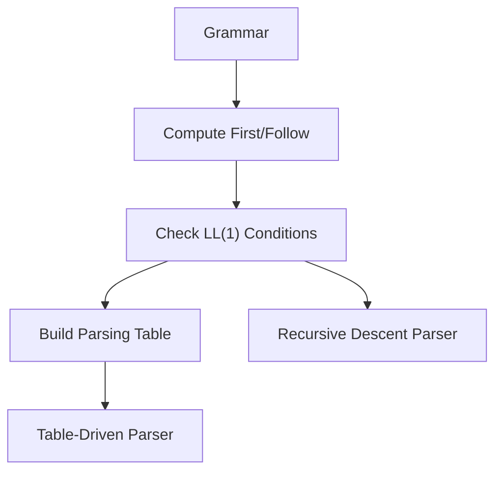
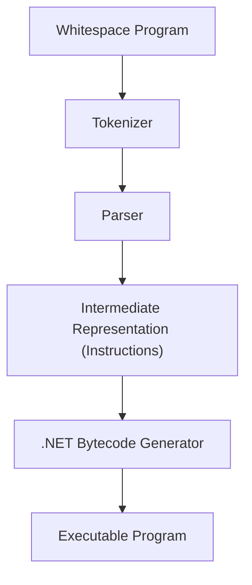

# Chapter 5 – Predictive Parsing and the Whitespace Compiler

## 5.1 Introduction
The lecture of September 29 was divided into two parts. In the first hour, Professor Corradini concluded his presentation on **predictive parsing**, focusing on the formal definitions of **First** and **Follow** sets and on the construction of LL(1) parsers. In the second hour, Professor Cisternino led a hands-on exercise by examining and running the **Whitespace compiler**, a playful yet instructive project demonstrating how compiler theory translates into practice【58†Trascrizione】.

## 5.2 Predictive Parsing: First and Follow Sets
Predictive parsing relies on the ability to choose the correct production at each step using only one lookahead token. This requires computing:

- **First(α):** the set of tokens that may appear at the beginning of strings derived from α.
  - If α begins with a terminal, that terminal is in First(α).
  - If α begins with a non-terminal, First(α) includes the union of First of all its productions.
  - If α can derive ε (epsilon, the empty string), then First(α) also contains ε.

- **Follow(A):** the set of tokens that can appear immediately after a non-terminal A in some sentential form.
  - If a production contains `A β`, then everything in First(β) (except ε) is added to Follow(A).
  - If β can derive ε, then everything in Follow of the left-hand side symbol is added to Follow(A).
  - For the start symbol S, the end-of-input marker `$` is included in Follow(S).

A grammar is **LL(1)** if, for every non-terminal, the sets of possible lookaheads for its productions are disjoint. This ensures that parsing is deterministic without backtracking【58†Trascrizione】.

### Recursive Descent vs. Table-Driven Parsing
- **Recursive descent**: each non-terminal corresponds to a procedure; lookahead determines which production to apply.
- **Table-driven**: uses a parsing table indexed by (non-terminal, lookahead) to decide the production. The parser maintains a stack of symbols, consulting the table at each step.

Both methods are equivalent for LL(1) grammars.


*Figure 5.1 – Constructing LL(1) parsers.*

## 5.3 Error Handling in Parsing
Compilers must handle errors gracefully rather than stopping at the first mistake. Strategies include:
- **Panic mode**: skip tokens until a synchronizing token (e.g., `;` or `}`) is found.
- **Phrase-level recovery**: insert or delete minimal tokens to continue parsing.
- **Error productions**: extend the grammar to explicitly handle common mistakes.
- **Global correction**: find the least-cost set of edits to make the input valid (rare in practice).

LL(1) parsers enjoy the **viable prefix property**: they can detect errors as soon as the current prefix cannot be extended into a valid string【58†Trascrizione】.

## 5.4 The Whitespace Language
The second half of the lecture introduced the **Whitespace language**, an esoteric programming language invented as a parody of conventional syntax. In Whitespace:
- Only spaces, tabs, and line feeds are meaningful tokens.
- All visible characters are ignored.
- Programs are defined entirely through sequences of whitespace characters.

The language, though humorous in origin, is **Turing complete**. It includes:
- **Stack manipulation**: push, pop, duplicate, swap.
- **Arithmetic operations**: addition, subtraction, multiplication, division.
- **Heap access**: memory read/write.
- **Flow control**: labels, jumps, subroutines.
- **I/O operations**: input and output for integers and characters【58†Trascrizione】.


*Figure 5.2 – Architecture of the Whitespace compiler implemented in C#.*

## 5.5 Architecture of the Whitespace Compiler
The **Whitespace compiler** implemented by Professor Cisternino in 2003 (and later modernized) demonstrates how compiler theory applies even to a joke language:

1. **Tokenizer**: converts spaces, tabs, and line feeds into tokens. Other characters are ignored.
2. **Parser**: a recursive descent parser that interprets Whitespace grammar rules and builds an internal representation (a list of instructions).
3. **Intermediate Representation**: each instruction (push, add, jump, etc.) is represented by a class instance. Control-flow instructions use a table of labels for jump targets.
4. **Code Generation**: emits .NET bytecode via reflection. A separate `Stack` object is created to maintain Whitespace semantics, since it differs from the .NET runtime stack.
5. **Executable Output**: produces a runnable .NET program (`.dll` and `.exe`) faithfully implementing the Whitespace code【58†Trascrizione】.

### Example Program
A program that pushes `6`, pushes `1`, adds them, and prints the result (`7`) looks like an empty file, but internally it is:
- **Source (invisible):** `[space][number 6][LF][space][number 1][LF][tab][space][LF][tab][LF]`
- **Human-readable (via pretty-printer):**
  ```
  PUSH 6
  PUSH 1
  ADD
  PRINT_INT
  END
  ```
- **Execution result:** `7`

This shows how invisible whitespace translates into meaningful computation.

### Fibonacci Example
A more complex program included in the repository computes the Fibonacci sequence. Written in Whitespace, it uses stack operations, loops, and I/O to generate terms. With comments interspersed, the code becomes readable; otherwise, it is entirely whitespace.

## 5.6 Stack Machines and Compilation
Both Java and .NET virtual machines are **stack-based**, meaning operands are pushed and popped from a stack rather than stored in registers. This design simplifies compiler implementation (no need to manage a fixed number of registers).

The Whitespace compiler illustrates these principles. Each instruction in Whitespace is compiled into a corresponding .NET bytecode sequence. For example:
- `PUSH n` → `ldc.i4 n` then `call Stack.Push`
- `ADD` → `call Stack.Pop` twice, then `add`, then `call Stack.Push`

By tracking the stack height, the compiler can even perform **static checks** (e.g., ensuring enough operands exist before applying `ADD`). This is an instance of **abstract interpretation**, proving properties about the program without running it.

## 5.7 Modernization with AI Assistance
The original compiler was written in C# 1.0. To update it for .NET 9, Professor Cisternino used **GitHub Copilot / GPT-based tools** to:
- Suggest replacements for deprecated constructs.
- Refactor code for readability (e.g., replacing explicit type declarations with `var`).
- Automatically generate pull requests for modernization.

The result is a working modern compiler, partially rewritten with AI assistance—demonstrating how future programming will increasingly involve **human oversight of AI-generated code**【58†Trascrizione】.

## 5.8 Conclusion
This lecture bridged **theory and practice**. The first half detailed how grammars, First/Follow sets, and LL(1) parsing guarantee determinism and efficiency. The second half demonstrated these ideas through the Whitespace compiler: from tokenizer to parser to .NET bytecode. Beyond its humorous origin, the project shows how compiler concepts apply universally, and how AI tools are reshaping the very way compilers and software are maintained.

