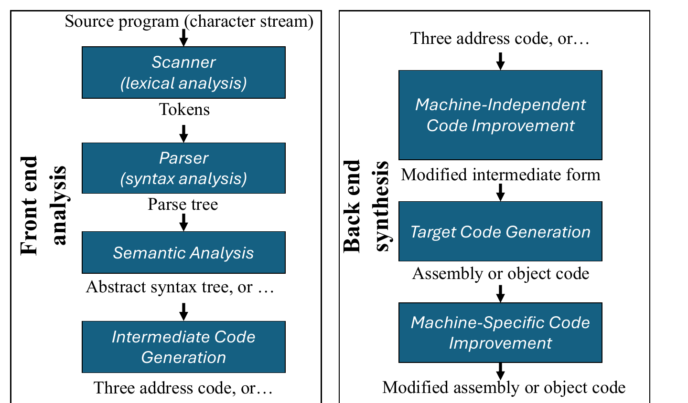
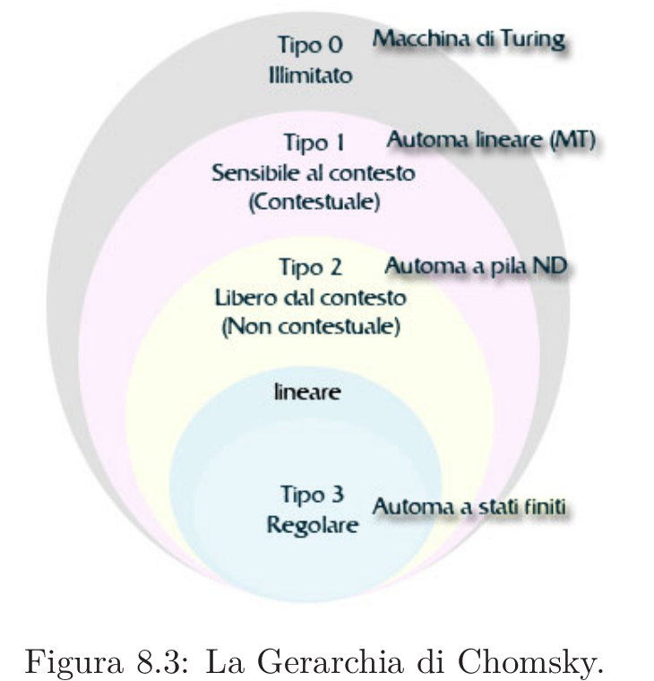
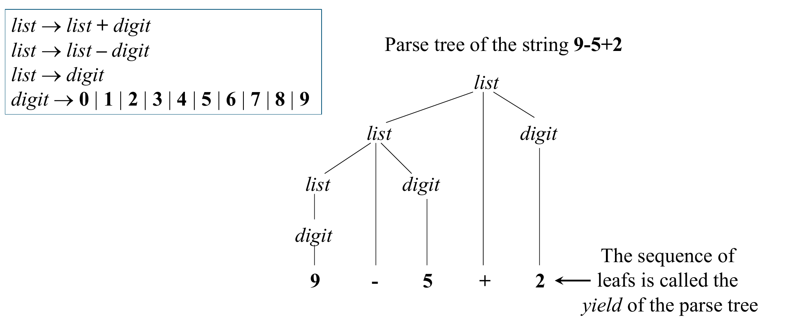
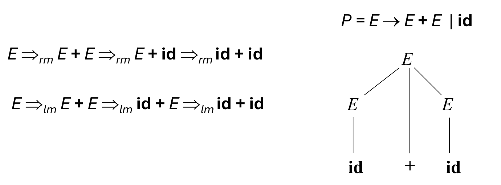
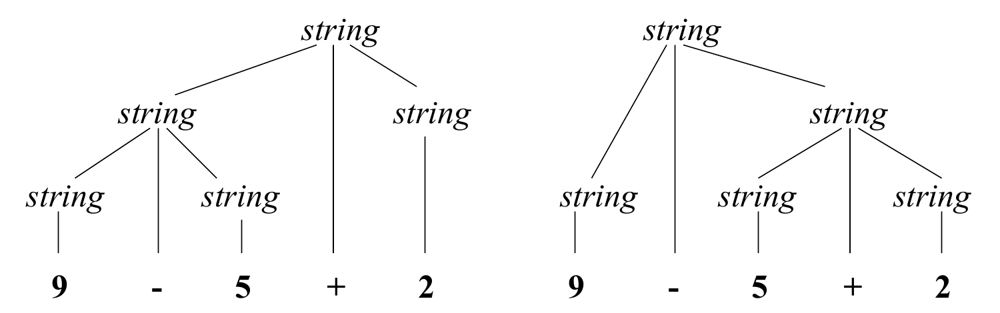
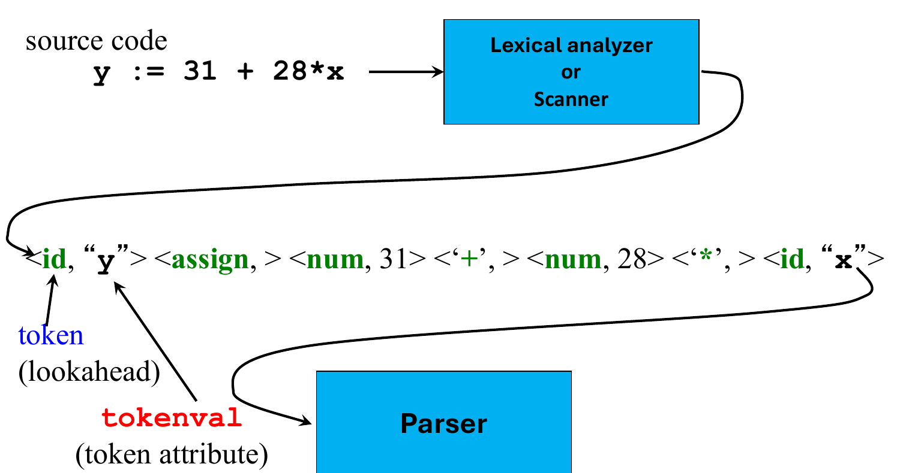
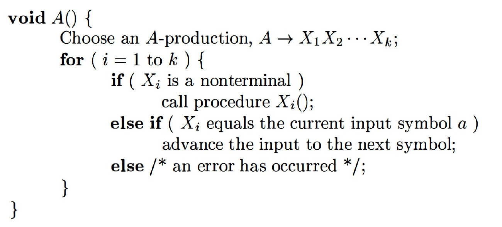
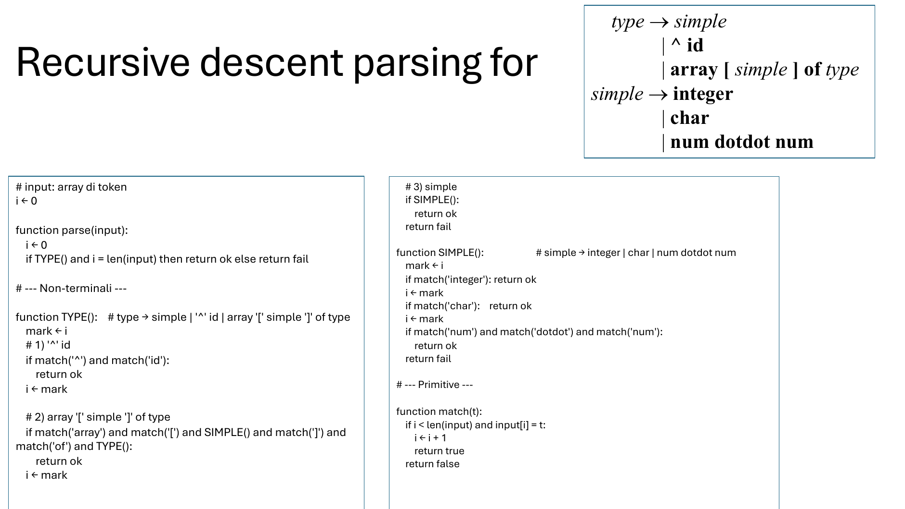

# 02 — Syntax and Grammars

> **Primary:** `lecture_notes/03-AP-25-09-25-Parsing.pdf` pp.1–26
> **Supporting:** `DOCS/03-ALSU-ch4.pdf` §4.1–4.4 · `DOCS/03-Scott-ch2.pdf` · `DOCS/02-GM-ch2.pdf` · `lecture_notes/03 - top_down_parsing.md`
> **Notation:** [`NOTATION.md`](../NOTATION.md) §1–2 — grammars and derivations
> **Continues in:** [03 — Top-Down Parsing](03-top-down-parsing.md) (deck pp.27–63)

Lecture of 25 September 2025 (A. Corradini). Everything here was read off the
rendered slides; the deck's formal notation cannot be extracted as text
([`SOURCES.md`](../SOURCES.md) fault A).

---

## 2.1 Where syntax sits: the compiler pipeline

The lecture opens by placing syntax analysis in the compiler as a whole
[Parsing p.2]. The front end *analyses*, the back end *synthesises*, and each
arrow is a change of representation:



*Figure 2.1 — Compiler front- and back-end [Parsing p.2].*

The chain of representations is the thing to remember:

| Phase | Input | Output |
|---|---|---|
| Scanner (lexical analysis) | source program (character stream) | **tokens** |
| Parser (syntax analysis) | tokens | **parse tree** |
| Semantic analysis | parse tree | abstract syntax tree, or … |
| Intermediate code generation | AST | three address code, or … |
| Machine-independent code improvement | three address code | modified intermediate form |
| Target code generation | modified intermediate form | assembly or object code |
| Machine-specific code improvement | assembly or object code | modified assembly or object code |

This chapter is about the second row; §2.7 covers the first.

## 2.2 Syntax, semantics, pragmatics

> **Definition.** A PL is defined via **syntax**, **semantics** and **pragmatics**.
>
> - The **syntax** is concerned with the form of programs: how *expressions*,
>   *commands*, *declarations*, and other constructs must be arranged to make a
>   well-formed program.
> - The **semantics** is concerned with the meaning of (well-formed) programs:
>   how a program may be expected to behave when executed on a computer.
> - The **pragmatics** is concerned with the way in which the PL is intended to
>   be used in practice.
>
> [Parsing p.3]

This three-way split is Morris's, and `DOCS/02-GM-ch2.pdf` §2.1 develops it at
length under the names *grammar*, *semantics* and *pragmatics* — note that
Gabbrielli–Martini say "grammar" where the slide says "syntax".

## 2.3 Grammars

> **Definition (grammar).** A **grammar** is a 4-tuple `G = (N, T, P, S)` where
>
> - `T` is a finite set of tokens (*terminal* symbols)
> - `N` is a finite set of *nonterminals*
> - `P` is a finite set of *productions* of the form
>
>       α → β
>
>   where `α ∈ (N∪T)* N (N∪T)*` and `β ∈ (N∪T)*`
> - `S ∈ N` is a designated *start symbol*
>
> [Parsing p.4]

The constraint on `α` says the left-hand side must contain **at least one
nonterminal** — you cannot rewrite a string of pure terminals.

> The component order is `(N, T, P, S)`, nonterminals first. Aho et al. and most
> other textbooks put terminals first. Keep the lecture's order.

Two set operations are fixed on the same slide and used throughout:

- `A*` is the set of finite sequences of elements of `A`. If `A = {a,b}` then
  `A* = {ε, a, b, aa, ab, ba, bb, aaa, …}` — note `ε`, the empty string, is a
  member.
- `AB = {ab | a ∈ A, b ∈ B}` — concatenation of two sets of strings.

### Notational conventions

The deck fixes its metavariables explicitly [Parsing p.5], and the rest of both
chapters depends on them:

| Class | Metavariables | Range | Examples given |
|---|---|---|---|
| Terminals | `a, b, c, …` | `∈ T` | `0`, `1`, `id`, `+` |
| Nonterminals | `A, B, C, …` | `∈ N` | *expr*, *term*, *stmt* |
| Grammar symbols | `X, Y, Z` | `∈ (N∪T)` | |
| Strings of terminals | `u, v, w, x, y, z` | `∈ T*` | |
| Strings of grammar symbols | `α, β, γ` | `∈ (N∪T)*` | |

`δ` joins `α, β, γ` as a fourth grammar-symbol string from [Parsing p.9]. In the
slides specific nonterminals are *italic* and specific terminals **bold**.

> **Why this matters more than it looks.** In the FOLLOW definition of
> [§3.3](03-top-down-parsing.md#33-follow), `α`, `β` and `ε` are Greek letters
> set in Symbol font. Text extraction turns them into the Latin letters `a`, `b`
> and `e` — which are *also* legal metavariables in this table, standing for
> terminals. A definition copied from extracted text therefore reads as a
> well-formed statement about terminals rather than the intended statement about
> strings of grammar symbols. Only the rendered page distinguishes them.

### Grammar classification (Chomsky hierarchy)

> **Definition.** A grammar `G` is said to be
>
> - **Regular** if it is *right linear*, where each production is of the form
>
>       A → w B        or        A → w
>
>   or *left linear*, where each production is of the form
>
>       A → B w        or        A → w              (w ∈ T*)
>
> - **Context free** if each production is of the form
>
>       A → α
>
>   where `A ∈ N` and `α ∈ (N ∪ T)*`
>
> - **Context sensitive** if each production is of the form
>
>       α A β → α γ β
>
>   where `A ∈ N`, `α, γ, β ∈ (N ∪ T)*`, `|γ| > 0`
>
> - **Unrestricted**
>
> [Parsing p.6]

Read the context-sensitive form as: `A` may be rewritten to `γ`, but only *in the
context* `α … β`, which is carried across unchanged. The side condition
`|γ| > 0` forbids erasing `A`, which is what keeps the class decidable.

Regular is a restriction of context free (`A → w B` is a particular `A → α`), and
context free is the `α = β = ε` case of context sensitive, so each class contains
the previous one.

### Classes of languages

Two different `L`s appear on [Parsing p.7] and must not be conflated:

- `L(G)` — the language generated by the grammar `G` (defined in §2.4)
- `ℒ(T)` — script L, the *class* of all languages of grammar type `T`:

      ℒ(T) = { L(G) | G is of type T }

The inclusions are strict:

    ℒ(regular) ⊂ ℒ(context free) ⊂ ℒ(context sensitive) ⊂ ℒ(unrestricted)

with the deck's witnesses:

- every **finite** language is regular (construct a FSA for the strings in `L(G)`)
- `L₁ = { aⁿbⁿ | n ≥ 0 }` is context free
- `L₂ = { aⁿbⁿcⁿ | n ≥ 0 }` is context sensitive

Each grammar class corresponds to a class of recognising automaton. The deck
shows this with a figure taken from an Italian textbook [Parsing p.8]:



*Figure 2.2 — The Chomsky hierarchy and the corresponding automata
[Parsing p.8]. The figure is in Italian; translated:* Tipo 0 Illimitato =
Type 0 unrestricted, *Macchina di Turing* = Turing machine; Tipo 1 *Sensibile al
contesto* = context sensitive, *Automa lineare (MT)* = linear bounded automaton;
Tipo 2 *Libero dal contesto* = context free, *Automa a pila ND* =
nondeterministic pushdown automaton; Tipo 3 *Regolare* = regular, *Automa a
stati finiti* = finite state automaton. The unlabelled inner ring *lineare* is
the class of linear languages, between regular and context free.

The automaton column is the practical content: a stack is exactly what
distinguishes context-free recognition from regular recognition, which is why
`{ aⁿbⁿ }` needs one and why a scanner (finite state) cannot match brackets.

## 2.4 Derivations

This is the slide whose extracted text is worst corrupted; every symbol below is
from the render.

> **Definition (one-step derivation).** A *one-step derivation* is defined by
>
>     γ α δ  ⇒  γ β δ
>
> where `α → β` is a production in the grammar.
>
> In addition, we define
>
> - `⇒` is *leftmost* `⇒ₗₘ` if `γ` does not contain a nonterminal
> - `⇒` is *rightmost* `⇒ᵣₘ` if `δ` does not contain a nonterminal
> - **Transitive closure** `⇒*` (zero or more steps)
> - **Positive closure** `⇒⁺` (one or more steps)
>
> `α` is a **sentential form** if `S ⇒* α`.
>
> The **language generated by G** is defined by
>
>     L(G) = { w ∈ T* | S ⇒⁺ w }
>
> [Parsing p.9]

Note the definition of leftmost: it constrains `γ`, the part *to the left* of the
rewritten `α`, to be free of nonterminals — i.e. everything to the left is
already terminal, so `α` begins at the leftmost nonterminal. Rightmost is the
mirror image on `δ`.

> Two points where the slide differs from the usual textbook statement, kept as
> the slide has them:
> - `⇒*` is labelled the *transitive* closure although "zero or more steps"
>   makes it the reflexive-transitive closure.
> - `L(G)` is defined with `⇒⁺`, not `⇒*`. For a start symbol `S ∈ N` the two
>   agree on terminal strings (`S` itself is not in `T*`), so nothing breaks.

### Example

[Parsing p.10] Grammar `G = ({E}, {+,*,(,),-,id}, P, E)` with productions

    P =   E → E + E
          E → E * E
          E → ( E )
          E → - E
          E → id

Example derivations, showing each notation in use:

    E ⇒ - E ⇒ - id
    E ⇒ᵣₘ E + E ⇒ᵣₘ E + id ⇒ᵣₘ id + id
    E ⇒* E
    E ⇒* id + id
    E ⇒⁺ id * id + id

`E ⇒* E` holds by zero steps — this is exactly the reflexivity that the "positive
closure" `⇒⁺` would not give you.

### A second grammar, and a leftmost derivation

[Parsing p.11] Here the tuple is written with angle brackets; the component order
is the same.

    G = <{list, digit}, {+,-,0,1,2,3,4,5,6,7,8,9}, P, list>

    P =   list  → list + digit
          list  → list – digit
          list  → digit
          digit → 0 | 1 | 2 | 3 | 4 | 5 | 6 | 7 | 8 | 9

A leftmost derivation of `9-5+2`, with the nonterminal about to be rewritten
underlined on the slide:

    list
    ⇒ₗₘ  list + digit
    ⇒ₗₘ  list - digit + digit
    ⇒ₗₘ  digit - digit + digit
    ⇒ₗₘ  9 - digit + digit
    ⇒ₗₘ  9 - 5 + digit
    ⇒ₗₘ  9 - 5 + 2

The `|` in `digit → 0 | 1 | … | 9` is shorthand for ten separate productions, not
a symbol of the grammar.

## 2.5 Parse trees

> **Definition (parse tree).** Tree-shaped representation of derivations.
>
> - The *root* of the tree is labeled by the start symbol
> - Each *leaf* of the tree is labeled by a terminal (= token) or `ε`
> - Each *internal node* is labeled by a nonterminal
> - If an internal node is labeled by `A`, there is a production
>
>       A → X₁ X₂ … Xₙ
>
>   such that the node has immediate children labeled by `X₁, X₂, …, Xₙ`,
>   or a single node labeled by `ε` if `A → ε`
>
> [Parsing p.12]

Parse trees are defined for **context-free grammars** — the slide title says so
explicitly, and the reason is visible in the definition: a node labelled `A`
expands by a production whose left-hand side is exactly `A`, which is only
guaranteed in the context-free case.

*(The slide writes the empty string as `ε` in the leaf clause and as the lunate
`ϵ` in the last clause. These are the same symbol; the notes use `ε` throughout.)*



*Figure 2.3 — A parse tree for the string `9-5+2` [Parsing p.13].*

> **Definition (yield).** The sequence of leafs is called the **yield** of the
> parse tree. [Parsing p.13]

### Parse trees versus derivations

- A parse tree may correspond to **several** derivations.
- A parse tree has a **unique** rightmost (leftmost) derivation.

[Parsing p.14]



*Figure 2.4 — One parse tree, two derivations, for `P = E → E + E | id`
[Parsing p.14].*

    E ⇒ᵣₘ E + E ⇒ᵣₘ E + id ⇒ᵣₘ id + id
    E ⇒ₗₘ E + E ⇒ₗₘ id + E ⇒ₗₘ id + id

So the parse tree is the *canonical* object: it abstracts away the order in which
independent nonterminals were expanded, while still pinning down the structure.
That is why the parser's output is a tree and not a derivation sequence.

## 2.6 Ambiguity

[Parsing p.15] Consider the context-free grammar

    G = <{string}, {+,-,0,1,2,3,4,5,6,7,8,9}, P, string>

    P =   string → string + string | string - string | 0 | 1 | … | 9

> **Definition (ambiguous).** This grammar is **ambiguous**, because more than
> one parse tree represents the string `9-5+2`. [Parsing p.15]



*Figure 2.5 — Two parse trees for the same string [Parsing p.16].*

The two trees group the input differently — `(9-5)+2` and `9-(5+2)` — and since
semantics is assigned by walking the parse tree, an ambiguous grammar gives one
program two meanings. Contrast the grammar of §2.4, which generates the same
strings but is unambiguous: making `digit` a separate nonterminal and recurring
only on the left (`list → list + digit`) forces left grouping.

Ambiguity is a property of the **grammar**, not of the language. The usual
industrial fixes — encoding precedence and associativity into the nonterminal
layering, as `list`/`digit` does — are developed in `DOCS/03-ALSU-ch4.pdf` §4.3
and in Scott §2.1.3. The classic remaining case is the *dangling else*, resolved
by convention (attach `else` to the nearest unmatched `if`) rather than by
grammar.

## 2.7 The syntax of programming languages: two grammars

> The syntax of a programming language is typically defined by **two grammars**
> [Parsing p.17]:
>
> - **Lexical grammar**
>   - Regular, often presented as regular expressions
>   - Terminal symbols are **characters**
>   - Defines tokens
> - **Syntax grammar**
>   - Context-free, often presented in Backus-Naur form
>   - Terminal symbols are **tokens**
>   - Defines constructs of the language, not expressible with REs

The two grammars are chained: the output alphabet of the first is the input
alphabet of the second. The terminals of the syntax grammar are the tokens
produced by the lexical grammar — which is why `id` and `num` appear as single
bold terminals in every example grammar in this chapter.

### Not everything is context free

The slide notes there are **non-context free** syntactic constructs, with the
abstract language each one reduces to [Parsing p.17]:

| Construct | Abstract form |
|---|---|
| Variables are declared before use | `{ wcw \| w ∈ (a\|b)* }` |
| Number of actual/formal parameters | `{ aⁿbᵐcⁿdᵐ \| n > 0, m > 0 }` |

Both are the same phenomenon: an unbounded correspondence between two separated
parts of the input, which a stack cannot check because it must be consumed to
reach the second part. Constraints like these are not enforced by the parser at
all — they are left to **semantic analysis** (the next box in Figure 2.1).

Where to find a real one: the Java Language Specification, chapter 19, at
<https://docs.oracle.com/javase/specs/index.html> [Parsing p.18].

## 2.8 Lexical analysis

### Why it is a separate phase

[Parsing p.19]

- **Simplifies the design of the compiler** — LL(1) or LR(1) parsing with 1
  token lookahead would not be possible (multiple characters/tokens to match)
- **Provides efficient implementation** — systematic techniques to implement
  lexical analyzers by hand or automatically from specifications; stream
  buffering methods to scan input
- **Improves portability** — non-standard symbols and alternate character
  encodings can be normalized (e.g. UTF8, trigraphs)

The first reason is the substantive one. One token of lookahead is only enough to
choose a production if the units of lookahead are tokens; at character
granularity, distinguishing `if` from `ifx` would need unbounded lookahead.

### Tokenization



*Figure 2.6 — The main goal of lexical analysis: tokenization [Parsing p.20].*

The source `y := 31 + 28*x` becomes

    <id, "y">  <assign, >  <num, 31>  <'+', >  <num, 28>  <'*', >  <id, "x">

Each pair is a **token** together with a **tokenval** (the token attribute). The
figure labels the token as the *lookahead* — the single unit the predictive
parser of [chapter 03](03-top-down-parsing.md) inspects. Note that `assign` and
the operator tokens carry no attribute: the token identity is all the parser
needs, whereas `id` and `num` must carry `"y"` and `31` forward for semantic
analysis.

### Additional tasks of the lexical analyzer

[Parsing p.21]

- Remove comments and useless white spaces / tabs from the source code
- Correlate error messages of the parser with source code (e.g. keeping track of
  line numbers)
- Expansion of macros

## 2.9 Parsing

> **Definition (parsing).** Parsing = *process of determining if a string of
> tokens can be generated by a grammar*. [Parsing p.22]

- For any CF grammar there is a parser that takes at most **O(n³)** time to
  parse a string of `n` tokens
- **Linear** algorithms suffice for parsing programming language source code
- *Top-down parsing* "constructs" a parse tree from root to leaves
- *Bottom-up parsing* "constructs" a parse tree from leaves to root

The scare quotes around "constructs" are the slide's: a parser need not build the
tree as a data structure, it only has to traverse it. The gap between O(n³) and
linear is the whole subject: we accept restrictions on the grammar in exchange
for linear time.

### Parsing algorithms

[Parsing p.23]

- ***Universal*** (any C-F grammar)
  - Cocke–Younger–Kasami, Earley
  - Based on dynamic programming, O(n³)
- ***Top-down*** (C-F grammar with restrictions)
  - Recursive descent (predictive parsing)
  - **LL** (**L**eft-to-right, **L**eftmost derivation) methods
  - Linear on certain grammars; easier to do manually
- ***Bottom-up*** (C-F grammar with restrictions)
  - Operator precedence parsing
  - **LR** (**L**eft-to-right, **R**ightmost derivation) methods — SLR,
    canonical LR, LALR
  - Linear on certain grammars; typically generated by tools

*(The slide spells the first name "Cocke-Younger-Kasimi"; the standard spelling
is Kasami.)*

The expansion of the acronyms is worth memorising because it explains §2.5: LL
methods produce a **leftmost** derivation, LR methods a **rightmost** one, and
both scan the input left to right. This chapter and the next follow the top-down
branch.

## 2.10 Recursive descent parsing

> **Definition.** **Recursive descent parsing** is a top-down parsing method.
>
> - Each nonterminal has one (recursive) procedure that is responsible for
>   parsing the nonterminal's syntactic category of input tokens
> - When a nonterminal has multiple productions, they are tried in sequence till
>   one succeeds. If all fail, the procedure for the nonterminal fails.
> - Backtracking is necessary, and complexity is exponential in general
>
> [Parsing p.24]

The generic shape of the procedure for a nonterminal `A`:



*Figure 2.7 — Generic procedure for a nonterminal `A` in recursive descent
parsing [Parsing p.25], reproduced from Aho et al. §4.4.1.*

```
void A() {
    Choose an A-production, A → X₁ X₂ ⋯ X_k;
    for ( i = 1 to k ) {
        if ( X_i is a nonterminal )
            call procedure X_i();
        else if ( X_i equals the current input symbol a )
            advance the input to the next symbol;
        else /* an error has occurred */;
    }
}
```

The exponential cost is hidden in the first line. "Choose an A-production" is a
nondeterministic step: with no information to choose by, the implementation tries
each in turn, and a failure deep inside `X_i()` must undo everything and retry —
so the work can multiply at every level of the tree. Removing that guess is
precisely what [chapter 03](03-top-down-parsing.md) does.

### A worked recursive descent parser

The running grammar for the rest of this chapter and much of the next
[Parsing p.26]:

    type   → simple
           | ^ id
           | array [ simple ] of type
    simple → integer
           | char
           | num dotdot num



*Figure 2.8 — Recursive descent parsing for the `type` grammar [Parsing p.26].
The comments in the original are partly in Italian: "# input: array di token" =
"# input: array of tokens", "# --- Non-terminali ---" = "# --- Nonterminals
---".*

```
# input: array of tokens
i ← 0

function parse(input):
    i ← 0
    if TYPE() and i = len(input) then return ok else return fail

# --- Nonterminals ---

function TYPE():      # type → simple | '^' id | array '[' simple ']' of type
    mark ← i
    # 1) '^' id
    if match('^') and match('id'):
        return ok
    i ← mark

    # 2) array '[' simple ']' of type
    if match('array') and match('[') and SIMPLE() and match(']')
                      and match('of') and TYPE():
        return ok
    i ← mark

    # 3) simple
    if SIMPLE():
        return ok
    return fail

function SIMPLE():    # simple → integer | char | num dotdot num
    mark ← i
    if match('integer'): return ok
    i ← mark
    if match('char'):    return ok
    i ← mark
    if match('num') and match('dotdot') and match('num'):
        return ok
    return fail

# --- Primitive ---

function match(t):
    if i < len(input) and input[i] = t:
        i ← i + 1
        return true
    return false
```

Read this as the concrete form of Figure 2.7. Three details carry the lesson:

1. **`mark ← i` / `i ← mark` *is* the backtracking.** `i` is the input position;
   each alternative saves it before trying and restores it after failing. This is
   the state that must be undone, and it is what a predictive parser will not
   need.
2. **`parse` checks `i = len(input)`.** Succeeding on a prefix is not success —
   the whole token array must be consumed, matching `L(G) = { w ∈ T* | S ⇒⁺ w }`.
3. **Alternatives are tried in a chosen order.** Nothing in the grammar says `'^'
   id` should be attempted before `array …`; the implementation picked one. With
   FIRST sets, [chapter 03](03-top-down-parsing.md) replaces the whole
   try-and-restore structure with a single test on the lookahead token.

---

## Summary

| Concept | Statement | Page |
|---|---|---|
| PL definition | syntax, semantics, pragmatics | p.3 |
| Grammar | `G = (N, T, P, S)`, productions `α → β` | p.4 |
| Metavariables | `a`∈T, `A`∈N, `X`∈(N∪T), `w`∈T*, `α,β,γ`∈(N∪T)* | p.5 |
| Chomsky classes | regular ⊂ context free ⊂ context sensitive ⊂ unrestricted | pp.6–7 |
| One-step derivation | `γ α δ ⇒ γ β δ` for a production `α → β` | p.9 |
| Language of `G` | `L(G) = { w ∈ T* \| S ⇒⁺ w }` | p.9 |
| Parse tree | root = `S`, leaves = terminals or `ε`, internal = nonterminals | p.12 |
| Yield | the sequence of leafs | p.13 |
| Tree ↔ derivation | many derivations per tree; one leftmost, one rightmost | p.14 |
| Ambiguous | more than one parse tree for the same string | p.15 |
| Two grammars | lexical (regular, over characters) + syntax (CF, over tokens) | p.17 |
| Parsing | determining if a string of tokens can be generated by a grammar | p.22 |
| Complexity | O(n³) for any CF grammar; linear on restricted grammars | pp.22–23 |
| LL / LR | Left-to-right + Leftmost / Rightmost derivation | p.23 |
| Recursive descent | one procedure per nonterminal; backtracking; exponential | p.24 |

## Exam-style checks

1. Give `G = (N, T, P, S)` for `{ aⁿbⁿ | n ≥ 0 }` and classify it in the Chomsky
   hierarchy. Why is it not regular?
2. State the definition of a one-step derivation, and explain what constrains
   `γ` in a *leftmost* step and `δ` in a *rightmost* one.
3. `L(G)` is defined with `⇒⁺`. Show that replacing it with `⇒*` would not change
   `L(G)` for any grammar with `S ∈ N`.
4. Show that `string → string + string | string - string | 0 | … | 9` is
   ambiguous, then give an unambiguous grammar for the same language and say
   which grouping it forces.
5. Why can "variables are declared before use" not be expressed by a
   context-free grammar? Which compiler phase enforces it?
6. In Figure 2.8, explain what breaks if the lines `i ← mark` are deleted.
7. Recursive descent is exponential in general. Point to the exact line of
   Figure 2.7 responsible, and say what information would remove it.
