# 03 — Top-Down Parsing

> **Primary:** `lecture_notes/03-AP-25-09-25-Parsing.pdf` pp.27–63
> **Supporting:** `DOCS/03-ALSU-ch4.pdf` §4.4 · `DOCS/03-Scott-ch2.pdf` §2.3 · `lecture_notes/04 - predictive_parsing_whitespace.md`
> **Notation:** [`NOTATION.md`](../NOTATION.md) §1–3 — grammars, derivations, FIRST/FOLLOW
> **Continues from:** [02 — Syntax and Grammars](02-syntax-and-grammars.md) (deck pp.1–26)

Chapter 02 ended with recursive descent parsing, which is exponential because it
must *guess* which production to apply and undo the guess when it fails. This
chapter removes the guess. Everything is read off the rendered slides —
[`SOURCES.md`](../SOURCES.md) faults A and B both bite hardest in this range.

---

## 3.1 Predictive parsing

> **Definition.** **Predictive parsing** is a special form of recursive descent
> parsing where one uses **lookahead tokens** to unambiguously determine the
> production to try. Complexity is linear.
>
> - Critical point: to determine which lookahead tokens trigger which production
> - Obtained using the **FIRST** and **FOLLOW** sets of tokens for each
>   nonterminal
>
> [Parsing p.27]

The whole method, as a recipe [Parsing p.43]:

1. Eliminate left recursion from grammar
2. Left factor the grammar
3. Compute FIRST and FOLLOW, and check if the grammar is LL(1)
4. FIRST and FOLLOW are used in the parsing algorithm

with **two variants**:

- Recursive (recursive-descent parsing) — §3.6
- Non-recursive (table-driven parsing) — §3.7

Steps 1 and 2 (§3.4, §3.5) are grammar *transformations* that must happen before
FIRST and FOLLOW are of any use. The order matters: a left-recursive grammar is
never LL(1), so no amount of lookahead computation will save it.

### The predictive parser for the `type` grammar

Compare this with the backtracking version of §2.10, Figure 2.8 — same grammar,
same language, no `mark`:


*Figure 3.1 — Example predictive parser [Parsing p.28].*

```
procedure match(t : token);          procedure type();
begin                                begin
  if lookahead = t then                if lookahead in { 'integer', 'char', 'num' } then
     lookahead := nexttoken()             simple()
  else error()                         else if lookahead = '^' then
end;                                      match('^'); match(id)
                                       else if lookahead = 'array' then
procedure simple();                       match('array'); match('['); simple();
begin                                     match(']'); match('of'); type()
  if lookahead = 'integer' then        else error()
     match('integer')                end;
  else if lookahead = 'char' then
     match('char')
  else if lookahead = 'num' then
     match('num');
     match('dotdot');
     match('num')
  else error()
end;
```

Three points:

1. `type()` dispatches on the lookahead in a **single** `if`/`else if` chain.
   The guard for the first alternative is the set `{ 'integer', 'char', 'num' }`
   — which is exactly `FIRST(simple)`, as §3.2 makes explicit.
2. There is no saved input position and no retry. A guard that matches is a
   guard that is *correct*, so a later failure is a genuine error, not a wrong
   guess.
3. `match` is where the input advances, via `lookahead := nexttoken()`. Anything
   other than the expected token is `error()`.

### The parse as a call tree

The deck then traces the same parser over the input
`array [ num dotdot num ] of integer` across eight animation frames
[Parsing pp.29–36]. Two frames are enough to see the shape.

    type   → simple | ^ id | array [ simple ] of type
    simple → integer | char | num dotdot num

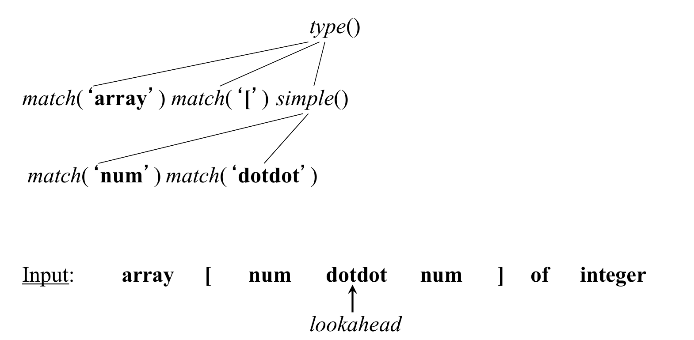

*Figure 3.2 — Execution step 4 [Parsing p.32].*

![Complete call tree for the full input: type() expands to match('array'), match('['), simple(), match(']'), match('of'), type(), with simple() expanding to the num dotdot num matches and the nested type() to simple() then match('integer')](assets/fig-03-AP-25-09-25-Parsing-p36-predictive-trace-step-8.png)

*Figure 3.3 — Execution step 8, the completed parse [Parsing p.36].*

The tree of `match` and procedure calls **is** the parse tree, with nonterminals
replaced by the procedures that recognise them. Two things to notice:

- The lookahead pointer only ever moves **forward**. Compare Figure 2.8, where
  `i ← mark` moved it backwards.
- At each expansion of `type()` the parser committed to one of three
  alternatives on the strength of a single token: `array` chose the third
  production, `num` chose `simple`, `integer` chose `simple` again. §3.2 explains
  what makes that legitimate.

## 3.2 FIRST

> **Definition (FIRST).** `FIRST(α)` is the set of terminals that appear as the
> first symbols of one or more strings generated from `α`. [Parsing p.37]

For the running grammar [Parsing p.37]:

    FIRST(simple) = { integer, char, num }
    FIRST(^ id)   = { ^ }
    FIRST(type)   = { integer, char, num, ^, array }

`FIRST(type)` is the union of the FIRST sets of its three right-hand sides, and
those three sets are pairwise disjoint — which is exactly why the trace in §3.1
could commit on one token.

The deck states FIRST twice. The second, computational statement [Parsing p.44]:

> **Definition (FIRST, revisited).**
>
>     FIRST(α) = { the set of terminals that begin all strings derived from α }
>     FIRST(a) = {a}                        if a ∈ T
>     FIRST(ε) = {ε}
>     FIRST(A) = ∪(A→α) FIRST(α)            for A → α ∈ P
>
>     FIRST(X₁X₂…X_k) =
>         for all i = 1, …, k do
>             if for all j = 1, …, i-1 : ε ∈ FIRST(X_j) then
>                 add non-ε in FIRST(X_i) to FIRST(X₁X₂…X_k)
>             if for all j = 1, …, k : ε ∈ FIRST(X_j) then
>                 add ε to FIRST(X₁X₂…X_k)
>
> [Parsing p.44]

> The two wordings differ: p.37 says "one or more strings", p.44 says "all
> strings". The p.37 reading is the correct one — `FIRST(type)` above contains
> five terminals, and no single string derived from `type` begins with all five.
> Read p.44's phrasing as loose, and note that `ε ∈ FIRST(α)` means `α` can
> derive the empty string.

The sequence clause is the only subtle part. Walking `X₁X₂…X_k` left to right:

- `X_i` contributes its non-`ε` terminals **only if** every symbol before it can
  vanish (`ε ∈ FIRST(X_j)` for all `j < i`) — otherwise `X_i` can never be the
  first thing you see.
- `ε` is contributed only if **every** `X_j` can vanish, since only then can the
  whole string.

### How FIRST is used

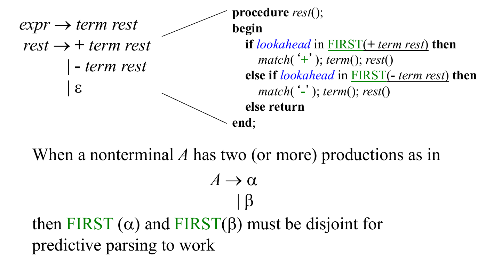

*Figure 3.4 — Using FIRST to write a predictive parser [Parsing p.38].*

    expr → term rest
    rest → + term rest
         | - term rest
         | ε

```
procedure rest();
begin
    if lookahead in FIRST(+ term rest) then
        match('+'); term(); rest()
    else if lookahead in FIRST(- term rest) then
        match('-'); term(); rest()
    else return
end;
```

> When a nonterminal `A` has two (or more) productions as in
>
>     A → α
>       | β
>
> then `FIRST(α)` and `FIRST(β)` must be **disjoint** for predictive parsing to
> work. [Parsing p.38]

That disjointness condition is the germ of the LL(1) definition in §3.3. Note
also the `else return` handling the `ε` production — the parser succeeds without
consuming anything, and §3.6 shows why that branch needs FOLLOW rather than
FIRST to be safe.

## 3.3 FOLLOW

> **Definition (FOLLOW).** `FOLLOW(A) = { the set of terminals that can
> immediately follow nonterminal A }`
>
>     FOLLOW(A) =
>         for all (B → α A β) ∈ P do
>             add FIRST(β)\{ε} to FOLLOW(A)
>         for all (B → α A β) ∈ P and ε ∈ FIRST(β) do
>             add FOLLOW(B) to FOLLOW(A)
>         for all (B → α A) ∈ P do
>             add FOLLOW(B) to FOLLOW(A)
>         if A is the start symbol S then
>             add $ to FOLLOW(A)
>
> [Parsing p.45]

`$` is the end-of-input marker. The three clauses cover the three ways a
terminal can end up after `A`:

1. Something follows `A` inside the production, so whatever can start `β` can
   follow `A` — minus `ε`, which is not a terminal.
2. Something follows `A` but can vanish (`ε ∈ FIRST(β)`), so whatever can follow
   `B` can also follow `A`.
3. `A` is last in the production, so whatever can follow `B` can follow `A`.

Clauses 2 and 3 make FOLLOW **mutually recursive** across nonterminals, so the
computation is a fixed-point iteration: repeat until no set changes.

> **This is the single most corrupted slide in the deck.** Extracted text gives
> `for all (B ® a A b) Î P do / add FIRST(b)\{e} to FOLLOW(A)` <!--raw-->, which
> reads as a statement about the *terminals* `a`, `b` and `e` rather than the
> strings `α`, `β` and the empty string `ε`. Both readings are grammatical under
> the metavariable table of §2.3, which is what makes the corruption dangerous.

### FIRST and FOLLOW: a worked example

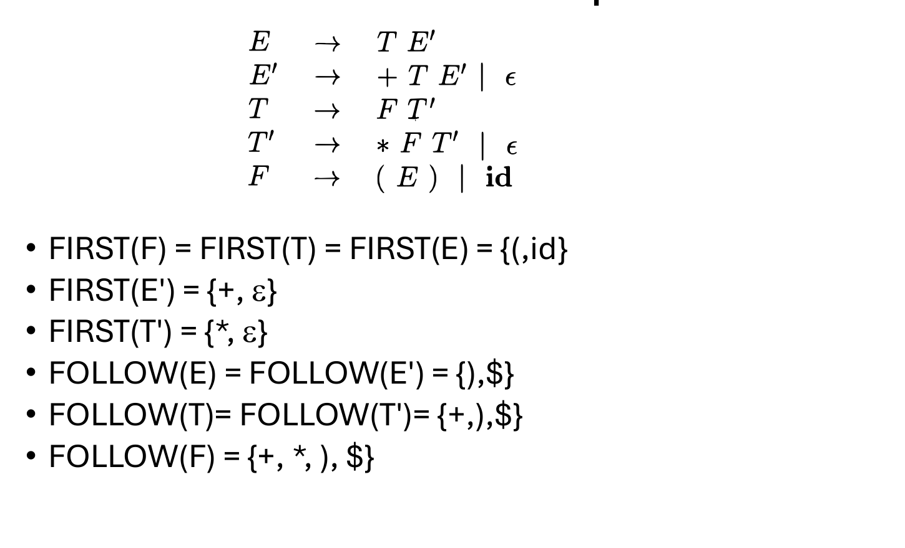

*Figure 3.5 — FIRST and FOLLOW for the expression grammar [Parsing p.49].*

For the expression grammar — this is the grammar that §3.6 will *derive* by
eliminating left recursion from `E → E + T | T` etc., so it is already free of
left recursion:

    E   → T E_R
    E_R → + T E_R | ε
    T   → F T_R
    T_R → * F T_R | ε
    F   → ( E ) | id

the deck gives [Parsing p.49]:

    FIRST(F) = FIRST(T) = FIRST(E) = { ( , id }
    FIRST(E_R) = { + , ε }
    FIRST(T_R) = { * , ε }
    FOLLOW(E) = FOLLOW(E_R) = { ) , $ }
    FOLLOW(T) = FOLLOW(T_R) = { + , ) , $ }
    FOLLOW(F) = { + , * , ) , $ }

Worth checking a few of these by hand against the definitions:

- `FIRST(E) = FIRST(T) = FIRST(F)` because `E → T E_R` and `T → F T_R` both start
  with a nonterminal that cannot vanish, so the FIRST set propagates straight
  down to `F`, whose productions start with `(` and `id`.
- `ε ∈ FIRST(E_R)` and `ε ∈ FIRST(T_R)` because each has an explicit
  `ε`-production.
- `FOLLOW(E) = { ) , $ }`: `$` because `E` is the start symbol, and `)` from
  `F → ( E )` by clause 1.
- `FOLLOW(T) ⊇ FOLLOW(E)`: from `E → T E_R` with `ε ∈ FIRST(E_R)`, clause 2 adds
  `FOLLOW(E)` to `FOLLOW(T)`; clause 1 adds `FIRST(E_R)\{ε} = {+}`. Hence
  `{ + , ) , $ }`.
- `FOLLOW(F) ⊇ FOLLOW(T)` by the same argument one level down, plus
  `FIRST(T_R)\{ε} = {*}`.

> This slide writes the nonterminals with primes (`E'`, `T'`), like the pasted
> figure of §3.6; [Parsing p.53] writes the same grammar with `E_R`, `T_R`. Both
> appear in the deck for the same grammar.

## 3.4 LL(1) grammars

> **Definition (LL(1)).** A grammar `G` is LL(1) if it is **not left recursive**
> and for each collection of productions
>
>     A → α₁ | α₂ | … | αₙ
>
> for nonterminal `A` the following holds:
>
> 1. `FIRST(αᵢ) ∩ FIRST(αⱼ) = ∅` for all `i ≠ j`
> 2. if `αᵢ ⇒* ε` then
>    - a. `αⱼ ⇏* ε` for all `i ≠ j`
>    - b. `FIRST(αⱼ) ∩ FOLLOW(A) = ∅` for all `i ≠ j`
>
> [Parsing p.46]

Condition 1 is §3.2's disjointness, generalised to `n` alternatives: the
lookahead must never be consistent with two alternatives. Condition 2 handles
alternatives that can vanish: 2.a says **at most one** alternative may derive
`ε` (two would both match an empty input), and 2.b says that if `A` may vanish,
no other alternative may start with a token that can follow `A` — otherwise on
seeing such a token the parser cannot tell "take `αⱼ`" from "take the empty
`αᵢ` and let the caller consume the token".

### Non-LL(1) examples

The deck tabulates one grammar per failure mode [Parsing p.47]:

| Grammar | Not LL(1) because |
|---|---|
| `S → S a \| a` | Left recursive |
| `S → a S \| a` | `FIRST(a S) ∩ FIRST(a) ≠ ∅` |
| `S → a R \| ε`<br>`R → S \| ε` | For `R`: `S ⇒* ε` and `ε ⇒* ε` |
| `S → a R a`<br>`R → S \| ε` | For `R`: `FIRST(S) ∩ FOLLOW(R) ≠ ∅` |

Row by row: the first violates the left-recursion clause, the second violates
condition 1, the third violates 2.a (both alternatives of `R` derive `ε`), the
fourth violates 2.b.

## 3.5 Left factoring

> If a nonterminal has two or more productions whose right-hand sides start with
> the same symbol, the grammar is **not LL(1)**. [Parsing p.39]

The example is the dangling else:

```
stmt ::= if expr then stmt else stmt
       | if expr then stmt
```

> **Solution:** replace productions
>
>     A → α β₁ | α β₂ | … | α βₙ | γ
>
> with
>
>     A   → α A_R | γ
>     A_R → β₁ | β₂ | … | βₙ
>
> [Parsing p.39]

Applied to the example:

```
stmt  ::= if expr then stmt stmt'
stmt' ::= else stmt | ε
```

The common prefix `α` is parsed once, and the decision about `β₁ … βₙ` is
*deferred* to a new nonterminal `A_R` — by which time the parser has consumed
`α` and the lookahead is informative. Note this does not make the dangling-else
grammar unambiguous; §3.8 shows the ambiguity resurfacing as a duplicate table
entry.

## 3.6 Left recursion

> **Definition (left-recursive).** A grammar is *left-recursive* if there is a
> nonterminal `A` such that `A ⇒⁺ A η` for some string `η`. [Parsing p.40]

Example of **immediate** left-recursion:

    A → A α | A β | γ | δ

Left recursion can also be **indirect** (via `A ⇒⁺ A η` in more than one step).

> If the grammar is left-recursive, it cannot be LL(*k*): a top-down parser
> **loops forever** on certain inputs. [Parsing p.40]

The reason is immediate from §2.10: the procedure for `A` would begin by calling
the procedure for `A`, with the input position unchanged — infinite recursion, no
lookahead value can prevent it. This is why elimination must precede everything
else.

> **Immediate left recursion elimination** [Parsing p.40]:
>
>     A → γ A_R | δ A_R              A_R → α A_R | β A_R | ε

Read it as: `A` derives one of the non-recursive alternatives (`γ`, `δ`) followed
by a tail; the tail `A_R` repeats the recursive suffixes (`α`, `β`) any number of
times and then stops with `ε`. The generated language is unchanged; the
recursion has moved from the left end to the right end, where a top-down parser
can consume a token before recurring.

### Example

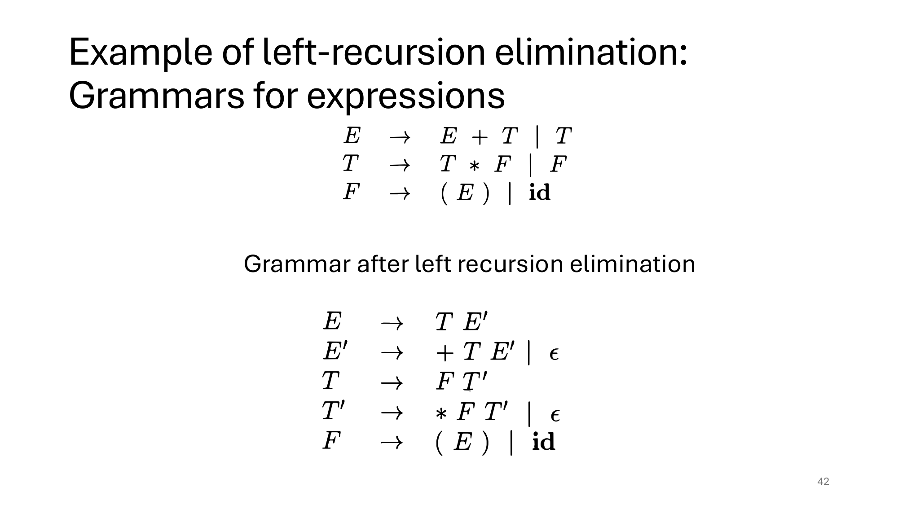

*Figure 3.6 — Left-recursion elimination on the expression grammar
[Parsing p.42], reproduced from Aho et al. This slide is a pasted image, which is
why it is legible while the surrounding page's text layer is not.*

    E → E + T | T                 E  → T E'
    T → T * F | F        ⟹        E' → + T E' | ε
    F → ( E ) | id                T  → F T'
                                  T' → * F T' | ε
                                  F  → ( E ) | id

> The pasted figure writes the new nonterminals `E'`, `T'` (Aho et al.'s
> convention). The deck's own slides from p.53 onward write the same grammar with
> `E_R`, `T_R`, matching the `A_R` of the elimination rule above. They are the
> same grammar; this chapter uses `E_R`/`T_R` outside the figure.

### The general method

Immediate elimination is not enough when the recursion is indirect, so the deck
gives the general algorithm [Parsing p.41]:

```
Input: Grammar G with no cycles or ε-productions
Arrange the nonterminals in some order A₁, A₂, …, Aₙ
for i = 1, …, n do
        for j = 1, …, i-1 do
                replace each
                        Aᵢ → Aⱼ γ
                with
                        Aᵢ → δ₁ γ | δ₂ γ | … | δ_k γ
                where
                        Aⱼ → δ₁ | δ₂ | … | δ_k
        enddo
        eliminate the immediate left recursion in Aᵢ
enddo
```

The inner loop substitutes away every reference from `Aᵢ` to an *earlier*
nonterminal, so after iteration `i` no production of `Aᵢ` can start with `Aⱼ` for
`j < i`. Any surviving left recursion in `Aᵢ` is therefore immediate, and the
last line removes it. The precondition — no cycles, no `ε`-productions — matters:
both can make the substitution fail to terminate or lose the language.

## 3.7 Predictive recursive descent parsing

> - Grammar must be **LL(1)**
> - Every nonterminal has one (recursive) procedure responsible for parsing the
>   nonterminal's syntactic category of input tokens
> - When a nonterminal has multiple productions, each production is implemented
>   in a branch of a **selection statement based on input look-ahead
>   information**
>
> [Parsing p.48]

Compare the recursive descent definition of §2.10: "tried in sequence till one
succeeds" has become "a branch of a selection statement". Sequence-with-undo
became a single choice; that is the whole gain.

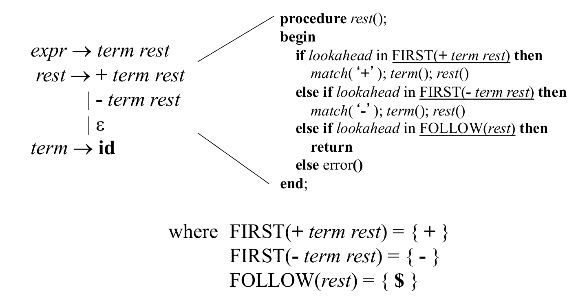

*Figure 3.7 — Using FIRST and FOLLOW in a recursive-descent parser
[Parsing p.50].*

    expr → term rest
    rest → + term rest
         | - term rest
         | ε
    term → id

```
procedure rest();
begin
    if lookahead in FIRST(+ term rest) then
        match('+'); term(); rest()
    else if lookahead in FIRST(- term rest) then
        match('-'); term(); rest()
    else if lookahead in FOLLOW(rest) then
        return
    else error()
end;

where  FIRST(+ term rest) = { + }
       FIRST(- term rest) = { - }
       FOLLOW(rest)       = { $ }
```

This is Figure 3.4 with the `ε` production done properly. The bare `else return`
has become `else if lookahead in FOLLOW(rest) then return`, plus an explicit
`else error()`. The difference is error detection: the earlier version returned
successfully on *any* unexpected token and left the caller to fail later — or not
at all. Taking the `ε` branch is only legitimate when the lookahead is something
that may legally follow `rest`, and that set is precisely `FOLLOW(rest)`.

## 3.8 Non-recursive predictive parsing: table-driven parsing

> Given an LL(1) grammar `G = (N, T, P, S)` construct a table `M` and use a
> *driver program* with a *stack*.
>
> The stack "replaces the runtime stack" of the recursive algorithm. It will
> contain symbols of the grammar.
>
> [Parsing p.51]

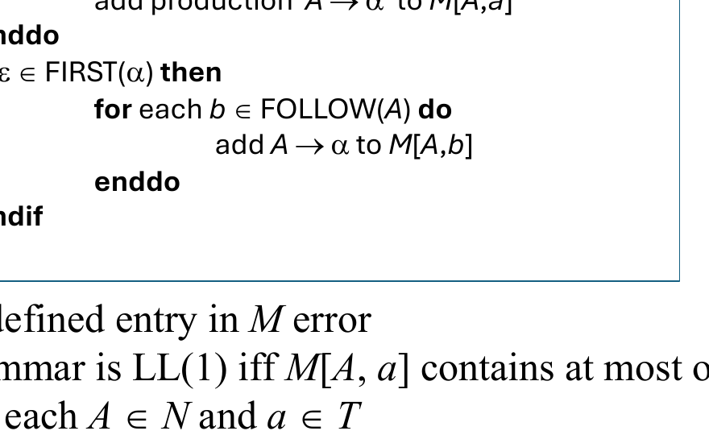

*Figure 3.8 — Table-driven predictive parsing [Parsing p.51].*

Four parts: the **input** (terminated by `$`), the **stack** of grammar symbols
(bottom-most entry `$`), the **driver**, and the **parsing table** `M`. Making
the stack explicit is what removes the recursion — the same information, moved
from the call stack into a data structure.

### Constructing the table

> - Table `M` has one entry `M[A, a]` for each `A ∈ N` and `a ∈ T`
> - Entry `M[A, a]` contains the production to apply when `A` has to be reduced
>   and `a` is the lookahead
>
> ```
> for each production A → α do
>         for each a ∈ FIRST(α) do
>                 add production A → α to M[A,a]
>         enddo
>         if ε ∈ FIRST(α) then
>                 for each b ∈ FOLLOW(A) do
>                         add A → α to M[A,b]
>                 enddo
>         endif
> enddo
> ```
>
> - Mark each undefined entry in `M` **error**
> - **Note:** The grammar is LL(1) **iff** `M[A, a]` contains at most one
>   production for each `A ∈ N` and `a ∈ T`
>
> [Parsing p.52]

The two clauses mirror §3.7 exactly: a production is indexed by the tokens that
can *start* it, and additionally — if it can vanish — by the tokens that can
*follow* the nonterminal. The final note is the useful one: **LL(1) is decidable
by building the table and looking for a collision.** That is a constructive
restatement of the definition in §3.4.

### Example table

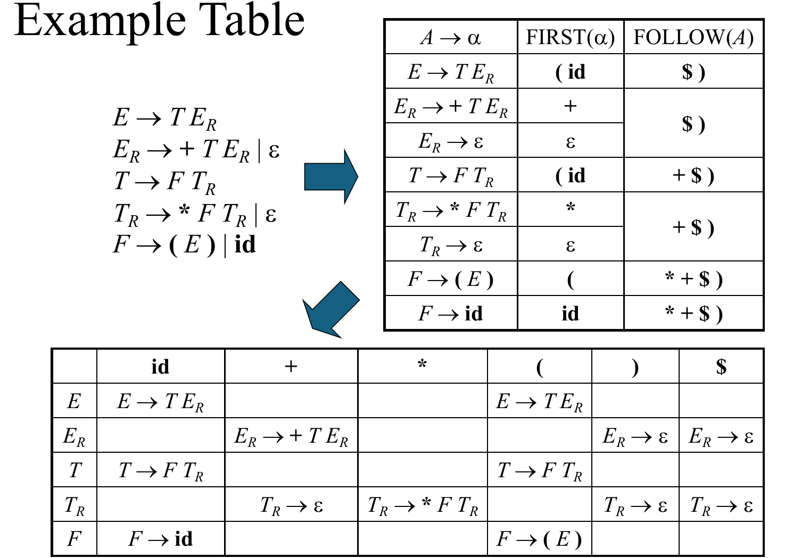

*Figure 3.9 — From grammar, via FIRST and FOLLOW, to the parsing table `M`
[Parsing p.53].*

    E   → T E_R
    E_R → + T E_R | ε
    T   → F T_R
    T_R → * F T_R | ε
    F   → ( E ) | id

| `A → α` | `FIRST(α)` | `FOLLOW(A)` |
|---|---|---|
| `E → T E_R` | `( id` | `$ )` |
| `E_R → + T E_R` | `+` | `$ )` |
| `E_R → ε` | `ε` | `$ )` |
| `T → F T_R` | `( id` | `+ $ )` |
| `T_R → * F T_R` | `*` | `+ $ )` |
| `T_R → ε` | `ε` | `+ $ )` |
| `F → ( E )` | `(` | `* + $ )` |
| `F → id` | `id` | `* + $ )` |

|  | `id` | `+` | `*` | `(` | `)` | `$` |
|---|---|---|---|---|---|---|
| `E` | `E → T E_R` | | | `E → T E_R` | | |
| `E_R` | | `E_R → + T E_R` | | | `E_R → ε` | `E_R → ε` |
| `T` | `T → F T_R` | | | `T → F T_R` | | |
| `T_R` | | `T_R → ε` | `T_R → * F T_R` | | `T_R → ε` | `T_R → ε` |
| `F` | `F → id` | | | `F → ( E )` | | |

Trace one row to see the construction at work. `T_R` has two productions.
`T_R → * F T_R` has `FIRST = {*}`, so it lands in column `*`. `T_R → ε` has
`ε ∈ FIRST`, so it lands in every column of `FOLLOW(T_R) = {+, ), $}`. No cell
receives two productions, so the grammar is LL(1).

### The driver

> ```
> push($)
> push(S)
> a := lookahead
> repeat
>         X := pop()
>         if X is a terminal or X = $ then
>                 match(X)      // moves to next token and a := lookahead
>         else if M[X,a] = X → Y₁Y₂…Y_k then
>                 push(Y_k, Y_{k-1}, …, Y₂, Y₁)  // such that Y₁ is on top
>                 … invoke actions and/or produce IR output …
>         else    error()
>         endif
> until X = $
> ```
>
> [Parsing p.54]

The push order is the detail that matters: `Y_k` first and `Y₁` last, so that
`Y₁` ends up **on top** and is processed first. That is what makes the traversal
left-to-right, and hence the derivation leftmost — the first L in LL. The loop
terminates when `$` is popped, which happens exactly when the start symbol has
been fully expanded and the input fully consumed.

### Example trace

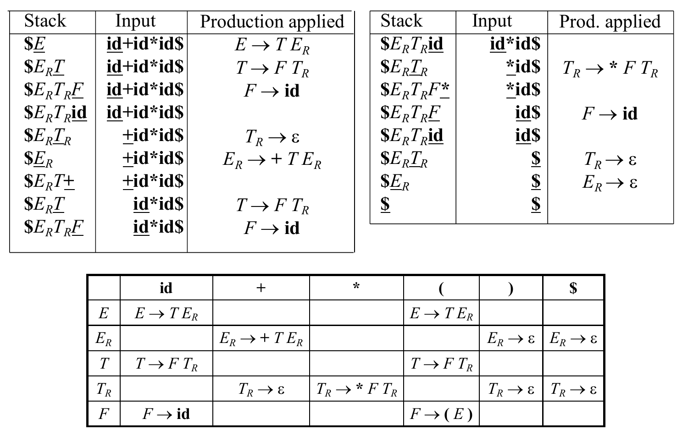

*Figure 3.10 — Table-driven parsing of `id+id*id` [Parsing p.55].*

The first rows, with the stack written top-to-the-right:

| Stack | Input | Production applied |
|---|---|---|
| `$E` | `id+id*id$` | `E → T E_R` |
| `$E_R T` | `id+id*id$` | `T → F T_R` |
| `$E_R T_R F` | `id+id*id$` | `F → id` |
| `$E_R T_R id` | `id+id*id$` | |
| `$E_R T_R` | `+id*id$` | `T_R → ε` |
| `$E_R` | `+id*id$` | `E_R → + T E_R` |

and it ends `$E_R` / `$` with `E_R → ε`, then `$` / `$` — accept. Reading the
"production applied" column top to bottom gives the leftmost derivation of the
input; the stack is the unexpanded remainder of the sentential form.

### LL(1) grammars are unambiguous

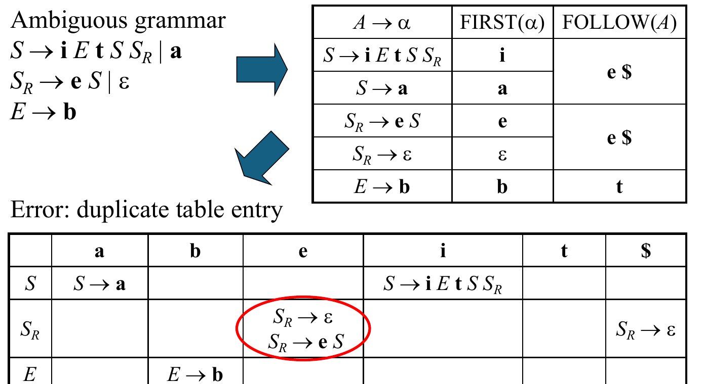

*Figure 3.11 — An ambiguous grammar produces a duplicate table entry
[Parsing p.56].*

The ambiguous grammar (the dangling else, with `i`=`if`, `t`=`then`, `e`=`else`):

    S   → i E t S S_R | a
    S_R → e S | ε
    E   → b

`FOLLOW(S_R) = { e, $ }` and `FIRST(e S) = { e }`, so both `S_R → ε` (via
FOLLOW) and `S_R → e S` (via FIRST) are added to `M[S_R, e]`:

|  | `a` | `b` | `e` | `i` | `t` | `$` |
|---|---|---|---|---|---|---|
| `S` | `S → a` | | | `S → i E t S S_R` | | |
| `S_R` | | | **`S_R → ε`**<br>**`S_R → e S`** | | | `S_R → ε` |
| `E` | | `E → b` | | | | |

The collision *is* the ambiguity: on seeing `else`, the parser cannot tell
whether to attach it to the inner `if` (take `S_R → e S`) or to close the inner
`if` and let an outer one claim it (take `S_R → ε`). Since every LL(1) grammar
has a collision-free table (§3.8), **LL(1) grammars are unambiguous** — and since
this grammar is ambiguous, no left-factoring can make it LL(1). Real languages
resolve it by convention outside the grammar.

## 3.9 Error handling

> A good compiler should assist in identifying and locating errors
> [Parsing p.57]:
>
> - *Lexical errors*: compiler can easily recover and continue
>   (e.g. misspelled identifiers)
> - *Syntax errors*: can almost always recover
>   (e.g. missing `;` or `{`, misplaced `case`)
> - *Static semantic errors*: can sometimes recover
>   (e.g. type mismatches, variable used before declaration)
> - *Dynamic semantic errors*: hard or impossible to detect at compile time,
>   runtime checks are required
>   (e.g. null pointer, division by zero, invalid array access)
> - *Logical errors*: hard or impossible to detect
>   (e.g. `if (b = true) …`)

The list is ordered by how much the compiler can do, and it lines up with the
pipeline of Figure 2.1: the earlier the phase, the more local the error and the
easier the recovery. The last entry is a program that is correct in every formal
sense and still wrong.

### Viable-prefix property

> The *viable-prefix property* of parsers allows early detection of syntax errors
>
> - Enjoyed by LL(1), LR(1) parsers
> - Goal: detection of an error *as soon as possible* without further consuming
>   unnecessary input
> - How: detect an error as soon as the prefix of the input does not match a
>   prefix of any string in the language
>
> [Parsing p.58]

The slide's example is `for (;)`, where the error is detected at the `)`: no
string of the language has `for (;)` as a prefix, and the parser knows it at that
token rather than after reading the rest of the file. This is a property of the
*parser*, and it is what makes column-accurate error messages possible.

### Error recovery strategies

[Parsing p.59]

- **Panic mode** — discard input until a token in a set of designated
  "synchronizing tokens" is found (e.g. `}`, `;`)
- **Phrase-level recovery** — perform local correction on the input to repair
  the error
- **Error productions** — augment grammar with productions for erroneous
  constructs
- **Global correction** — choose a minimal sequence of changes to obtain a global
  least-cost correction

The first three are shown as annotations to the same table `M` of Figure 3.9,
which is the neat part: recovery is implemented by *filling in the error cells*
rather than by changing the driver.

#### Panic mode

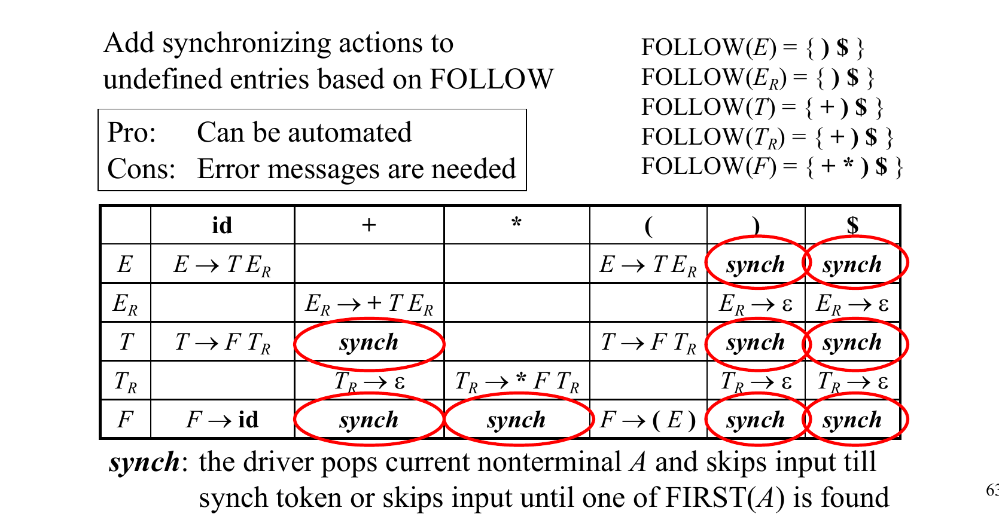

*Figure 3.12 — Panic mode recovery [Parsing p.60].*

> Add synchronizing actions to undefined entries based on FOLLOW.
> **Pro:** can be automated. **Cons:** error messages are needed.
>
> `synch`: the driver pops current nonterminal `A` and skips input till synch
> token or skips input until one of `FIRST(A)` is found.
>
> With `FOLLOW(E) = { ) $ }`, `FOLLOW(E_R) = { ) $ }`, `FOLLOW(T) = { + ) $ }`,
> `FOLLOW(T_R) = { + ) $ }`, `FOLLOW(F) = { + * ) $ }`.

An error cell `M[A, a]` where `a ∈ FOLLOW(A)` is filled with `synch`, meaning:
give up on `A`, assume it was meant to be empty, and resume. Cells that are
neither a production nor `synch` remain plain errors.

#### Phrase-level recovery

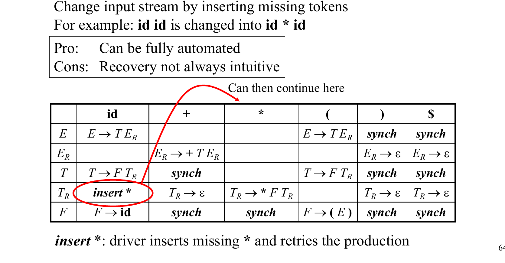

*Figure 3.13 — Phrase-level recovery [Parsing p.61].*

> Change input stream by inserting missing tokens. For example: `id id` is
> changed into `id * id`.
> **Pro:** can be fully automated. **Cons:** recovery not always intuitive.
>
> `insert *`: driver inserts missing `*` and retries the production.

#### Error productions

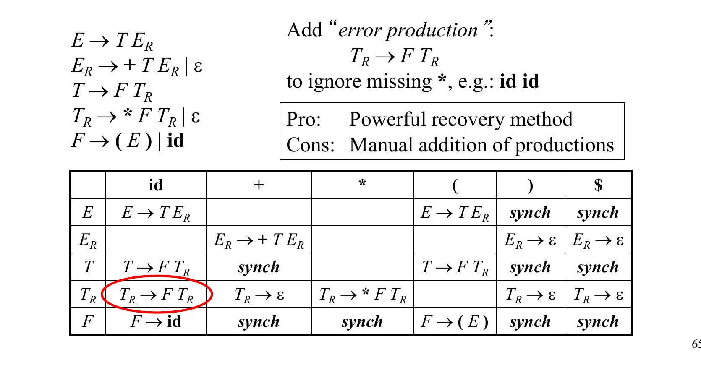

*Figure 3.14 — Error productions [Parsing p.62].*

> Add "error production": `T_R → F T_R` to ignore missing `*`, e.g.: `id id`.
> **Pro:** powerful recovery method. **Cons:** manual addition of productions.

The last two both fix `id id`, from opposite directions: phrase-level patches the
*input* to fit the grammar, error productions extend the *grammar* to accept the
input. The trade-off is automation against control of the diagnostic.

## 3.10 Lecture addendum: the Whitespace compiler

The lecture that accompanied these slides also worked through a compiler for the
**Whitespace** esoteric language, in which only spaces, tabs and line feeds are
significant and all other characters are comments. This material appears only in
the transcript notes (`lecture_notes/04 - predictive_parsing_whitespace.md`) —
there is no slide for it, so it is recorded here as context rather than as
examinable notation:

- The language is a **stack machine**: instructions manipulate a stack and a
  heap, encoded as sequences of space/tab/LF tokens.
- Its *lexical* grammar is trivial (three token classes) which throws the whole
  burden onto the *syntax* grammar — a clean illustration of §2.7's two-grammar
  split with one side degenerate.
- The compilation target was a stack machine, connecting to the "Intermediate
  Code Generation" box of Figure 2.1.

> Treat this section as unverified against primary material. See the gap register
> in [`SOURCES.md`](../SOURCES.md): lesson 04 has no deck.

---

## Summary

| Concept | Statement | Page |
|---|---|---|
| Predictive parsing | recursive descent + lookahead to pick the production; linear | p.27 |
| Recipe | eliminate left recursion → left factor → FIRST/FOLLOW → check LL(1) | p.43 |
| FIRST | terminals that begin one or more strings generated from `α` | p.37 |
| `FIRST(A)` | `∪(A→α) FIRST(α)` | p.44 |
| Disjointness | `A → α \| β` needs `FIRST(α) ∩ FIRST(β) = ∅` | p.38 |
| FOLLOW | terminals that can immediately follow `A`; `$` if `A = S` | p.45 |
| LL(1) | not left recursive + FIRST sets disjoint + `ε` conditions 2.a, 2.b | p.46 |
| Left factoring | `A → α β₁ \| … \| α βₙ \| γ` becomes `A → α A_R \| γ`, `A_R → β₁ \| … \| βₙ` | p.39 |
| Left recursive | `A ⇒⁺ A η`; cannot be LL(*k*), parser loops forever | p.40 |
| Elimination | `A → γ A_R \| δ A_R`, `A_R → α A_R \| β A_R \| ε` | p.40 |
| Table `M` | `M[A,a]` = production for `A` with lookahead `a` | p.52 |
| LL(1) test | LL(1) **iff** every `M[A,a]` holds at most one production | p.52 |
| Driver | stack of grammar symbols; push `Y_k … Y₁` so `Y₁` is on top | p.54 |
| Unambiguous | LL(1) ⇒ unambiguous; ambiguity shows as a duplicate entry | p.56 |
| Viable prefix | error detected as soon as the input prefix is not a prefix of any string of the language | p.58 |
| Recovery | panic mode / phrase-level / error productions / global correction | p.59 |

## Exam-style checks

1. Compute `FIRST` and `FOLLOW` for every nonterminal of
   `E → T E_R`, `E_R → + T E_R | ε`, `T → F T_R`, `T_R → * F T_R | ε`,
   `F → ( E ) | id`, then build `M` and confirm the grammar is LL(1).
2. State the FOLLOW algorithm and explain why clauses 2 and 3 force a
   fixed-point iteration rather than a single pass.
3. Explain conditions 2.a and 2.b of the LL(1) definition, each with a grammar
   that violates only that condition.
4. Why can a left-recursive grammar never be LL(*k*), for any `k`? Argue from the
   procedure of Figure 2.7 (ch.02: the generic recursive-descent procedure for a
   nonterminal `A`).
5. Eliminate left recursion from `S → A a | b`, `A → A c | S d | ε`. Which
   precondition of the general algorithm does this grammar violate, and what
   goes wrong?
6. Left-factor the dangling-else grammar, then show that the resulting grammar
   still yields a duplicate entry in `M`. What does that prove about the
   grammar?
7. In the table-driven driver of §3.8, why must `Y₁` end up on top of the stack?
   What would the parser compute if the push order were reversed?
8. Given `FOLLOW(T) = { + ) $ }`, which cells of row `T` get `synch` under panic
   mode, and what does the driver do when it reads one?

<details>
<summary>Answers</summary>

1. This is exactly Figure 3.9's grammar. `FIRST`:

       FIRST(E) = FIRST(T) = FIRST(F) = { ( , id }
       FIRST(E_R) = { + , ε }
       FIRST(T_R) = { * , ε }

   `FOLLOW`:

       FOLLOW(E) = FOLLOW(E_R) = { ) , $ }
       FOLLOW(T) = FOLLOW(T_R) = { + , ) , $ }
       FOLLOW(F) = { + , * , ) , $ }

   Table `M` (built by indexing each production `A → α` under `FIRST(α)`, and
   additionally under `FOLLOW(A)` when `ε ∈ FIRST(α)`):

   |  | `id` | `+` | `*` | `(` | `)` | `$` |
   |---|---|---|---|---|---|---|
   | `E` | `E → T E_R` | | | `E → T E_R` | | |
   | `E_R` | | `E_R → + T E_R` | | | `E_R → ε` | `E_R → ε` |
   | `T` | `T → F T_R` | | | `T → F T_R` | | |
   | `T_R` | | `T_R → ε` | `T_R → * F T_R` | | `T_R → ε` | `T_R → ε` |
   | `F` | `F → id` | | | `F → ( E )` | | |

   Every cell holds at most one production, so by the §3.8 note ("the grammar
   is LL(1) **iff** `M[A,a]` contains at most one production for each `A ∈ N`
   and `a ∈ T`") the grammar is LL(1).

2. The algorithm [Parsing p.45]:

       FOLLOW(A) =
           for all (B → α A β) ∈ P do
               add FIRST(β)\{ε} to FOLLOW(A)
           for all (B → α A β) ∈ P and ε ∈ FIRST(β) do
               add FOLLOW(B) to FOLLOW(A)
           for all (B → α A) ∈ P do
               add FOLLOW(B) to FOLLOW(A)
           if A is the start symbol S then
               add $ to FOLLOW(A)

   Clauses 2 and 3 both add `FOLLOW(B)` **to** `FOLLOW(A)`, i.e. they define
   `FOLLOW(A)` in terms of `FOLLOW(B)` for some other nonterminal `B`. Since
   `B` can itself be defined in terms of `FOLLOW(A)` (or of some `C` that
   eventually depends on `A`), the equations are mutually recursive across
   nonterminals — there is no fixed order in which to compute them once and be
   done, because computing one set early may still be missing contributions
   that only become known once a later set is computed. The only sound
   approach is to start every `FOLLOW` set empty (plus the `$` for `S`), apply
   all three clauses repeatedly, and stop when a full pass adds nothing — a
   fixed-point iteration.

3. Condition 2.a: if some alternative `αᵢ ⇒* ε`, no other alternative `αⱼ`
   may also derive `ε` — otherwise two productions would both match on an
   empty input and the parser could not choose. Violating *only* 2.a: row 3 of
   the §3.4 table, `S → a R | ε`, `R → S | ε`. For `R`, both alternatives
   (`S` and the literal `ε`) derive `ε` (`S ⇒* ε` via `S → ε`), so 2.a fails;
   condition 1 is not at issue here since the chapter attributes this row's
   failure to 2.a specifically.

   Condition 2.b: if `αᵢ ⇒* ε`, no other alternative `αⱼ` may start with a
   token in `FOLLOW(A)` — otherwise, on seeing such a token, the parser cannot
   tell "take `αⱼ`" from "take the empty `αᵢ` and let the caller consume the
   token". Violating *only* 2.b: row 4 of the same table, `S → a R a`,
   `R → S | ε`. For `R`: `FIRST(S) ∩ FOLLOW(R) ≠ ∅` (both contain `a`), so
   seeing `a` after an `R` is ambiguous between expanding `R → S` and taking
   `R → ε`.

4. Figure 2.7 ([ch.02 §-, p.25](02-syntax-and-grammars.md)) is:

       void A() {
           Choose an A-production, A → X₁ X₂ ⋯ X_k;
           for ( i = 1 to k ) {
               if ( X_i is a nonterminal )
                   call procedure X_i();
               else if ( X_i equals the current input symbol a )
                   advance the input to the next symbol;
               else /* an error has occurred */;
           }
       }

   If `A` is left-recursive, `A ⇒⁺ A η` for some `η`, so some `A`-production
   has `X₁ = A` (immediately, or after other left-recursive productions
   reduce to that case). When `A()` chooses that production, the very first
   step of the loop (`i = 1`) finds `X₁` is the nonterminal `A` and calls
   `A()` again — **before** any `X_i` has advanced the input, since input is
   only advanced by the terminal-matching branch and no terminal has been
   seen yet. The recursive call starts from the identical input position with
   the identical lookahead available to it, so it faces exactly the same
   choice and can again pick `A → A η`, and so on. No lookahead of any fixed
   length `k` can break this, because the input position — and hence
   everything the lookahead could examine — never moves between one call and
   the next; the loop is infinite regardless of how much lookahead the choice
   is allowed to use.

5. `S → A a | b`, `A → A c | S d | ε` is indirectly left-recursive:
   `A ⇒ S d ⇒ A a d`, i.e. `A ⇒⁺ A η` with `η = a d`. Take the nonterminal
   order `A₁ = S`, `A₂ = A` (as listed).

   `i = 1` (`S`): no `j < 1`; `S → A a | b` has no immediate left recursion
   (neither alternative starts with `S`). Unchanged.

   `i = 2` (`A`): `j = 1`, substitute `S`'s alternatives into the production
   `A → S d`:

       A → A c | A a d | b d | ε

   Eliminate the now-immediate left recursion (recursive alternatives `c`,
   `a d`; non-recursive `b d`, `ε`):

       A   → b d A_R | A_R
       A_R → c A_R | a d A_R | ε

   Final grammar:

       S   → A a | b
       A   → b d A_R | A_R
       A_R → c A_R | a d A_R | ε

   This grammar has `A → ε`, an **ε-production**, which is exactly the
   precondition the general algorithm rules out ("Grammar `G` with no cycles
   or ε-productions", [Parsing p.41]). What goes wrong: since `A_R` can
   vanish (`ε ∈ FIRST(A_R)`) and `A → A_R` is now a bare alternative,
   `ε ∈ FIRST(A)`, so `FIRST(A a) = (FIRST(A)\{ε}) ∪ {a} ⊇ {a, b, c}` — it
   picks up `b` because `A` itself can start with `b` (via `A → b d A_R`).
   That collides with `S`'s other alternative, `FIRST(b) = {b}`:
   `FIRST(A a) ∩ FIRST(b) ∋ b`, violating condition 1 of the LL(1) definition
   (§3.4). The elimination produced a grammar that is *still* not LL(1) — the
   ε-production let a left-recursion elimination step manufacture a fresh
   FIRST/FIRST clash that wasn't visible in the original grammar.

6. The dangling-else grammar of §3.5 is `stmt ::= if expr then stmt else stmt
   | if expr then stmt`, common prefix `if expr then stmt`. Left-factoring
   per the §3.5 rule (`A → αβ₁ | … | αβₙ | γ` ⟶ `A → αA_R | γ`,
   `A_R → β₁ | … | βₙ`) gives exactly the grammar already used in §3.8
   (with `i`=`if`, `t`=`then`, `e`=`else`, `a` an atomic stmt, `b` a boolean
   expr):

       S   → i E t S S_R | a
       S_R → e S | ε
       E   → b

   Building `M` for this grammar reproduces Figure 3.11's collision:
   `FOLLOW(S_R) = { e, $ }` and `FIRST(e S) = { e }`, so both `S_R → ε`
   (added via `FOLLOW`) and `S_R → e S` (added via `FIRST`) land in
   `M[S_R, e]` — a duplicate entry, not LL(1). This proves left factoring
   removed only the *symptom* (a shared FIRST prefix across alternatives of
   `stmt`), not the underlying **ambiguity**: since every LL(1) grammar's
   table is collision-free (§3.8), a collision after left-factoring means the
   grammar is still ambiguous, and — as the chapter states — no amount of
   left-factoring can make an ambiguous grammar LL(1).

7. The driver processes symbols by **popping** the stack, and popping removes
   whatever was pushed **last**. Input is scanned left to right, so the
   symbol that must be matched/expanded next is `Y₁`, the leftmost symbol of
   the production's right-hand side; for `Y₁` to be popped first it must be
   pushed last, landing on top (`push(Y_k, …, Y₁)`). This is what keeps the
   stack's top always aligned with the next unread input token and makes the
   sequence of productions applied a **leftmost derivation** — the first `L`
   in LL(1).

   If the push order were reversed (`Y₁` pushed first, `Y_k` on top), the
   driver would pop `Y_k` — the *rightmost* symbol of the production — and try
   to match or expand it against the current (leftmost) input token. For any
   production with more than one right-hand-side symbol this puts the wrong
   symbol on top of the stack relative to the input actually being scanned:
   terminals would be matched out of order and nonterminals expanded before
   the symbols that are supposed to precede them, so the driver would
   generally hit `error()` (a terminal mismatch) rather than compute any
   valid derivation — and on the rare input where symbols happened to match
   anyway, the sequence of productions read off would not correspond to any
   consistent (leftmost or rightmost) derivation of the input.

8. Row `T` has explicit entries only at columns `id` and `(` (from
   `T → F T_R`, `FIRST = { ( , id }`); the remaining columns `+`, `*`, `)`,
   `$` are undefined. Panic mode fills an undefined `M[A, a]` with `synch`
   whenever `a ∈ FOLLOW(A)`. With `FOLLOW(T) = { + , ) , $ }`, the cells
   `M[T, +]`, `M[T, )]`, `M[T, $]` all get `synch`; `M[T, *]` is not in
   `FOLLOW(T)`, so it stays a plain `error`. On reading a `synch` entry the
   driver pops the current nonterminal `T` — treating it as if it had matched
   the empty string and resuming without it — and skips input until it finds
   either the synchronizing token or a token in `FIRST(T)`.

</details>
