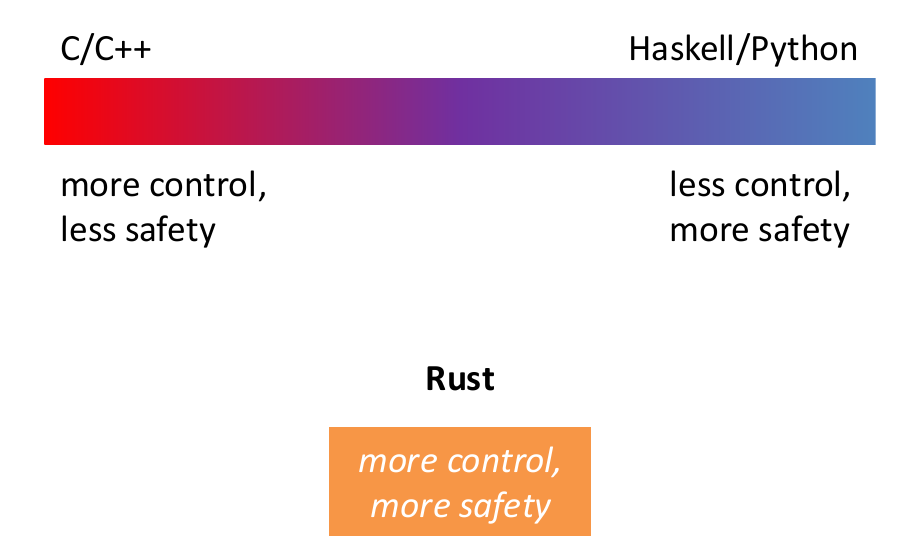
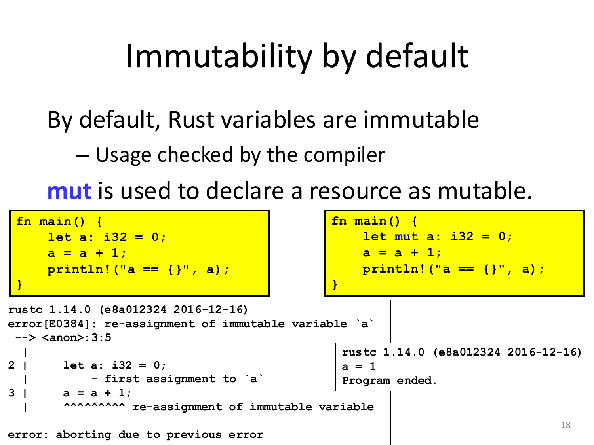
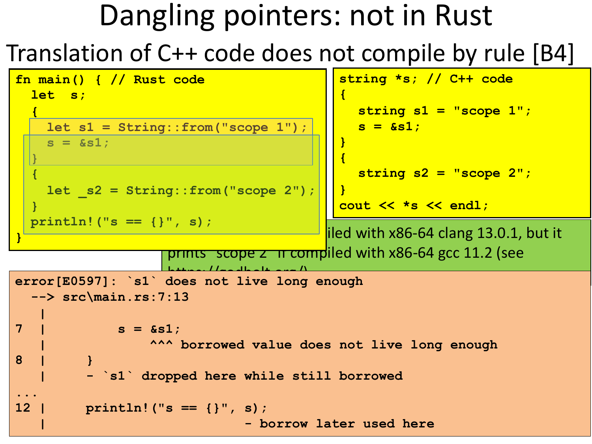
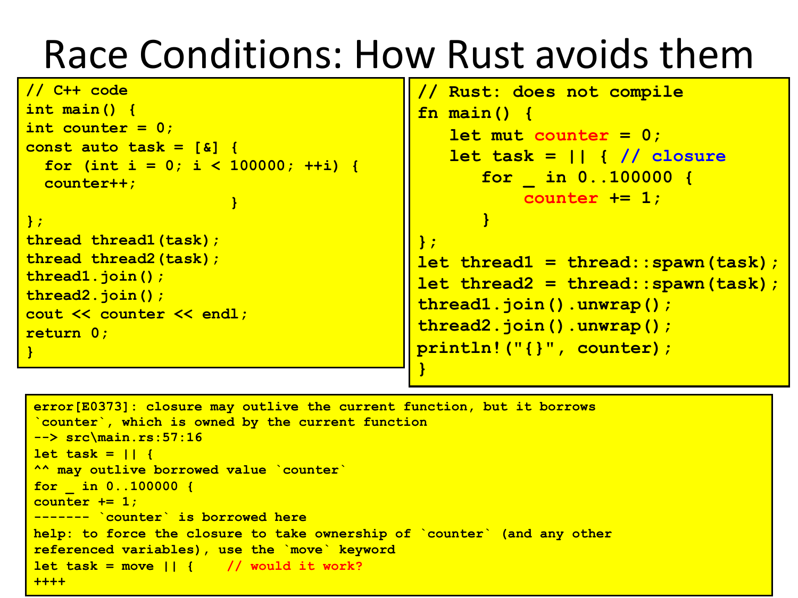
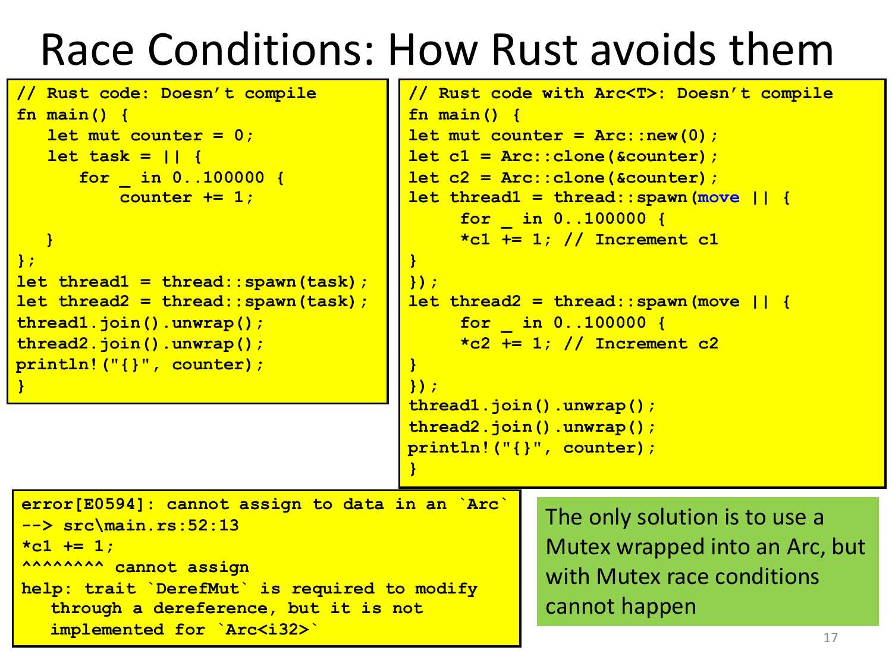
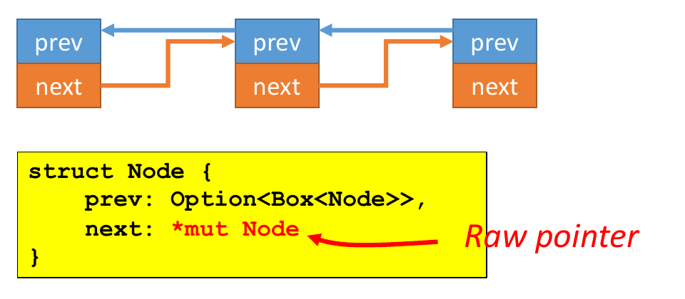

# 05 — Rust: Ownership, Borrowing, Lifetimes

> **Primary:** `lecture_notes/07-AP25-10-06-RUST-1.pdf` · `08-AP25-10-08-RUST-2.pdf` · `09-AP25-10-13-RUST-3.pdf`
> **Notation:** [`NOTATION.md`](../NOTATION.md) §0 — Rust source is reproduced verbatim, ASCII operators unchanged
> **Cited as:** `[R1 p.n]`, `[R2 p.n]`, `[R3 p.n]` for the three decks, by PDF page

Three lectures (6, 8 and 13 October 2025, A. Corradini) covering the same
argument: how Rust gets memory safety without a garbage collector and without
runtime cost. The ownership rules `[O1]–[O3]`, the borrowing rules `[B1]–[B5]`
and the lifetime-inference rules `[R1]–[R3]` are the deck's own labels and are
used throughout.

---

## 5.1 What Rust is for

Rust is a general purpose, **system programming language** with a focus on
safety, especially safe concurrency, supporting both functional and imperative
paradigms. The main goal is **ensuring safety without penalizing efficiency**
[R1 p.5].

Its concrete syntax resembles C and C++ — blocks, `if`-`else`, `while`, `for`,
plus `match` for pattern matching — but the deck is explicit that the
resemblance is superficial: in a deeper sense the syntax is closer to the **ML
family** and to **Haskell** [R1 p.5]. Two consequences of that lineage matter in
practice:

- Nearly every part of a function body is an **expression**, including
  `if`-`else`, so a conditional can be the value a function returns rather than a
  statement that assigns to something.
- There is **no runtime required** — no garbage collector, no dynamic typing or
  dynamic binding — which gives more control over memory allocation and
  destruction than a managed language offers.

### The design point



*Figure 5.1 — Rust's position relative to C/C++ and Haskell/Python [R1 p.6].*

The conventional trade-off runs along one axis. C and C++ give you control over
memory at the cost of safety; Haskell and Python give safety by taking control
away, typically via a garbage collector and dynamic checks. Rust's claim is to
step off the line entirely.

The mechanism by which it does so is summarised as [R1 p.7]:

- **Performance, as with C** — Rust compiles to object code for bare-metal
  performance.
- **But, supports memory safety** — programs dereference only previously
  allocated pointers that have not been freed; out-of-bound array accesses are
  not allowed.
- **With low overhead** — compiler checks make sure the rules for memory safety
  are followed; managing memory is a *zero-cost abstraction*, i.e. no garbage
  collection.
- **Via** — an advanced type system, plus ownership, borrowing and lifetime
  concepts to prevent memory corruption issues.
- **But at a cost** — a *cognitive cost* to programmers, who must think more
  about the rules for using memory and references as they program.

That last item is the honest part of the trade. The checks are free at runtime
because they all happen at compile time; the price is paid by the programmer, who
has to write code the checker can prove correct.

### The safety guarantees

Rust is designed to be memory safe **even in the presence of concurrency**, and
the deck lists the five classes of defect that are ruled out [R1 p.8]:

- No null pointers
- No dangling pointers
- No double frees
- No data races
- No iterator invalidation

> These properties are guaranteed **statically**: if the program compiles it will
> never manifest those problems. [R1 p.8]

Memory safety is obtained with a careful combination of several techniques:
linguistic design choices, memory management policies, and powerful static
(data-flow) analysis. The rest of this chapter is those techniques, one defect
class at a time.

## 5.2 Null pointers

The underlying problem is accessing a variable which does not hold a value.
There are two general approaches to guaranteeing that a variable holds a value
when accessed [R1 p.9]:

1. Check that it has been assigned, via **data flow analysis**
2. Use **default values**

Java uses approach 1 for local variables of methods and approach 2 for instance
and static variables. The reason for the split is practical: approach 2 is much
simpler, and approach 1 is hardly applicable to "global variables", since there
is no single point of control through which the analysis can trace assignment.
Numeric variables typically get `0` as their default.

The deck notes the historical background: Tony Hoare introduced null references
in ALGOL W and later called them *"the billion dollar mistake"*, and
`NullPointerException` is the most-thrown exception in Java [R1 p.9].

### How Rust avoids them

Rust takes a stronger position than either Java approach [R1 p.10]:

- A **null value does not exist** in Rust.
- Data values can only be initialized through a fixed set of forms, requiring
  their inputs to be already initialized.
- **Compile time error** if any branch of code fails to assign a value to the
  variable.
- Static/global variables must be initialized at declaration time.

Notice how this closes the gap Java left open: because globals must be
initialized where they are declared, the case that forced Java into default
values does not arise, and approach 1 can be applied uniformly.

Absence of null does not mean absence of optionality. For nullable types, a
generic `Option<T>` type exists, playing the role of Haskell's `Maybe` or Java's
`Optional` [R1 p.10]:

```rust
enum std::option::Option<T> {
    None,
    Some(T)
}
```

The difference from null is that optionality is now **in the type**. A `T` always
holds a `T`; only an `Option<T>` may hold nothing, and the compiler forces you to
say which case you are in before you can reach the value.

### Using `Option`

The idiomatic consumer is `match`, which the compiler checks for completeness
[R1 p.12]:

```rust
fn checked_division(dividend: i32, divisor: i32) -> Option<i32> {
    if divisor == 0 {
        None
    } else {
        Some(dividend / divisor)
    }
}

fn try_division(dividend: i32, divisor: i32) {
    // `Option` values can be pattern matched, just like other enums
    match checked_division(dividend, divisor) {
        None => println!("{} / {} failed!", dividend, divisor),
        Some(quotient) => {
            println!("{} / {} = {}", dividend, divisor, quotient)
        } } }

fn main() {
    try_division(54,9); try_division(7,0);
    let opt_float = Some(0f32);
    // Unwrapping a `Some` variant will extract the value wrapped.
    println!("{:?} unwraps to {:?}", opt_float, opt_float.unwrap());
}
```

`checked_division` shows the ML/Haskell influence of §5.1 at work: the `if`-`else`
*is* the return value, with no `return` keyword. Note also `unwrap()`, which
extracts the wrapped value and panics on `None` — the one place where you can
still get a runtime failure, which is why it is used sparingly.

When only one of the two cases needs handling, `if let` is shorter than a `match`
[R1 p.13]:

```rust
pub fn main() {
    let name1: Option<&str> = None;
    // In this case, nothing will be printed out
    if let Some(name) = name1 {
        println!("{name}");
    }
    let name2: Option<&str> = Some("Matthew");
    // In this case, the word "Matthew" will be printed out
    if let Some(name) = name2 {
        println!("{name}");
    }
}
```

`if let Some(name) = name2` is a pattern match used as a condition: the body runs
only if the pattern matches, and inside the body `name` is bound to the unwrapped
value.

### Primitive types

For reference, the primitive types [R1 p.11]:

- Numeric: `i8` / `i16` / `i32` / `i64` / `isize`, `u8` / `u16` / `u32` / `u64` /
  `usize`, `f32` / `f64`
- `bool`
- `char` (4-byte unicode)
- Type inference for variable declarations with `let`
- **No overloading for literals**: type annotations to disambiguate
- Tuples: like in Haskell
- Arrays: with fixed length, and a **runtime check** for out-of-bounds

```rust
fn main() {
    let k = 3; // 3u8, 3.0, 3.2f32, ...
    let tup = (500, 6.4, 1);
    let (x, y, z) = tup;
    println!("The value of y is: {}",y);
    println!("The value of tup.1 is: {}",tup.1);
    let a: [i32;5] = [1,2,3,4,5];
    let b: [i32;6] = [3;6]; // [3,3,3,3,3,3]
}
```

Array bounds are the one guarantee from §5.1 enforced at runtime rather than
compile time — the length is in the type (`[i32;5]`), but an index computed at
runtime cannot be checked earlier than runtime. Rust's guarantee is that the
access is *checked*, so an out-of-bounds index panics instead of reading
arbitrary memory.

## 5.3 The three defects Rust removes by ownership

Before the mechanism, the deck shows what goes wrong in C++.

### Dangling pointers

The problem is pointers to an invalid memory location, which arises from
[R1 p.14]:

- Pointers to explicitly deallocated objects
- Pointers to locations beyond the end of an array
- Pointers to objects allocated on the stack

with unpredictable effects: random results, segmentation fault, or corruption of
the memory manager.

```cpp
// C++ code
string *s;
{
  string s1 = "scope 1";
  s = &s1;
}
{
  string s2 = "scope 2";
}
cout << *s << endl;
```

The pointer `s` outlives the block that owns `s1`. What `*s` reads afterwards
depends on what the compiler happened to do with the stack slot: the deck reports
that this prints `"scope 1"` under x86-64 clang 13.0.1 but `"scope 2"` under
x86-64 gcc 11.2 [R1 p.14]. The second block reuses the same stack space for `s2`,
so the program silently reads a different variable. That two conforming compilers
disagree is the point — the behaviour is undefined, not merely unspecified.

### Double free

The problem is a memory location in the heap being reclaimed twice. This can
happen in languages with explicit deallocation of memory, like C and C++. A
double-free error could corrupt the state of the memory manager, causing a
program to crash or modifying execution flow, and **it could be exploited for
software attacks** [R1 p.15].

```cpp
// C++ code
auto *s1 = new string("example");
auto *s2 = s1;
// ...
delete s1;
delete s2;
```

The assignment `s2 = s1` copied the pointer, so both names refer to one heap
allocation, and nothing in the type system records that only one of them should
free it.

### Race conditions

The problem is unpredictable results in concurrent computations [R1 p.16]:

```cpp
// C++ code
int main() {
   int counter = 0;
   const auto task = [&] {
      for (int i = 0; i < 100000; ++i) {
      counter++;
      }
   };
   thread thread1(task);
   thread thread2(task);
   thread1.join();
   thread2.join();
   cout << counter << endl;
   return 0;
}
```

This typically prints values smaller than 20000. `counter++` is not atomic — it
reads, increments and writes back — so two threads interleaving those steps can
each read the same old value and write back the same new one, losing an
increment. The lambda captures `counter` by reference (`[&]`), which is what makes
the sharing possible.

All three defects share a structure: **two names refer to the same resource, and
the language does not track which one is responsible for it.** Ownership is the
answer to that.

## 5.4 Memory management and RAII

Rust uses a **stack** of activation records and a **heap** for dynamically
allocated data structures, as usual. Two things are distinctive [R1 p.17]:

- Rust **favors stack allocation** (the default).
- The user is forced to be aware of where the data are stored: **no implicit
  boxing**.

```rust
fn main() {
    let x = 3;   // 'let' allocates a variable on the stack
    let y = Box::new(3); // y is a reference to 3 on the heap
    println!("x == y is {}", x == *y); // "x == y is true"
}
```

Modern languages either use garbage collection or leave the programmer
responsible for managing the heap, and both have costs [R1 p.17]: GC slows down
or interrupts execution and could be unfeasible for real-time systems, while
manual memory management can introduce subtle errors. Rust avoids both, providing
**deterministic management of resources with very low overhead, using RAII**.

> **RAII (Resource Acquisition Is Initialization).** Resource allocation is done
> during object initialization, by the constructor, while resource deallocation
> (release) is done during object destruction (specifically finalization), by the
> destructor. [R1 p.19]

The idiom is popular in modern C++, where small objects are better allocated on
the stack, while large resources live on the heap (or elsewhere) and are **owned
by an object on the stack**, which is then responsible for releasing the resource
in its destructor [R1 p.19].

Two properties of RAII do the work:

- The object is bound to the **scope** (function, block) where it is declared;
  when the scope closes it is reclaimed, together with any owned resource.
- **Each resource has a unique owner.**

Because scope nesting is known statically, so is the moment of release — which is
what "deterministic" means above, and why no runtime bookkeeping is needed.

### Immutability by default

By default, Rust variables are **immutable**, with usage checked by the compiler;
`mut` is used to declare a resource as mutable [R1 p.18].



*Figure 5.2 — Immutability by default [R1 p.18].*

```rust
fn main() {                    fn main() {
    let a: i32 = 0;                let mut a: i32 = 0;
    a = a + 1;                     a = a + 1;
    println!("a == {}", a);        println!("a == {}", a);
}                              }
```

The left program fails with `error[E0384]: re-assignment of immutable variable
'a'`; the right one prints `a = 1`. This default matters for §5.6: since
mutability must be requested explicitly, the compiler can tell from the
declaration alone whether a value may change, and the borrowing rules can be
stated in terms of it.

## 5.5 The ownership system

Rust has an **ownership system**, which supports RAII in a strict way, based on
the concepts of **ownership** and **borrowing** [R1 p.20].

> **Ownership rules** [R1 p.20]
>
> - **[O1]** Every value is owned by a variable, identified by a name (possibly a
>   path);
> - **[O2]** Each value has at most one owner at a time;
> - **[O3]** When the owner goes out-of-scope, the value is reclaimed /
>   destroyed.

`[O3]` is RAII's scope binding, `[O2]` is RAII's unique owner, and `[O1]` says
there are no ownerless values — every value has a name responsible for it. Taken
together they mean the compiler can always answer "who frees this, and when?"
from the program text.

### Move semantics of assignment

The rules have an immediate consequence for `=`. By default, an assignment
between variables has a **move semantics**: the ownership is moved from the RHS
to the LHS, by `[O2]` [R1 p.21].

```rust
fn main() {
    let x = Box::new(3);
    let _y = x; // underscore to avoid 'unused' warning
    println!("x = {}", x); // error!
}
```

After `let _y = x`, the value on the heap has one owner, `_y`. The name `x` is no
longer a valid owner, so reading it is an error. This is the direct fix for the
double-free of §5.3: it is impossible to reach a state where two names both
believe they own one allocation.

For primitive types and types implementing the **`Copy`** trait, assignment has a
**copy semantics** instead, and `[O2]` is satisfied because *a new value is
created* [R1 p.21]:

```rust
fn main() {                          fn main() {
    let x = 3;                           let x = Option::Some(3);
    let _y = x;                          let _y = x;
    println!("x = {:?}", x); // OK       println!("x = {:?}", x); // OK
}                                    }
```

Both programs are fine, and for the same reason: `_y` owns a *different* value
from `x`, so there are two values with one owner each rather than one value with
two owners. Nothing about `[O2]` is relaxed for `Copy` types.

### Move semantics of parameter passing

The same applies to parameter passing and function return [R1 p.22]:

```rust
fn foo<T>(z: T) -> T { // polymorphic identity function
    z
}

fn main(){                            fn main(){
    let x = Box::new(3);                  let x = 3;
    let _y = foo(x);                      let _y = foo(x);
    println!("x == {}", x); // error      println!("x == {}", x); // OK
}                                     }
```

Passing an argument moves ownership into the formal parameter. Therefore:

- Any value passed to the function will be **reclaimed when it returns**, as the
  formal parameter goes out of scope — by `[O3]`.
- **Only the returned value can survive** (use tuples to return more).

Which gives the idiom for keeping a value you need to pass along:

```rust
fn main(){
    let mut x = Box::new(3);
    x = foo(x);
    println!("x == {}", x); // OK
}
```

The value makes a round trip: ownership moves into `foo`, and the return value
moves back out into `x`. It works, but having to thread values through every call
is exactly the restriction that borrowing (§5.6) exists to lift.

### Unique owner, worked


*Figure 5.3 — Ownership: unique owner [R1 p.23].*

```rust
struct Dummy { a: i32, b: i32 }

fn main() {
  let mut res = Box::new(Dummy {
               a: 0,
               b: 0
           });
  take(res);
  println!("res.a = {}", res.a);   // Compiling Error!
}

fn take(arg: Box<Dummy>) {
}
```

Ownership is moved from `res` to `arg`. When `take` returns, `arg` is out of scope
and the resource is freed automatically — so by the time `println!` runs, the
`Dummy` no longer exists, and the read of `res.a` is rejected at compile time.
`take` has an empty body; it does not have to *do* anything for the move to
happen, because the move is in the signature.

### Double free: not in Rust

Returning to the C++ double free of §5.3 [R1 p.24]. Rust does not allow explicit
memory deallocation at all, and because of RAII memory is freed automatically
when the owner goes out of scope, so the corresponding Rust code is:

```rust
{ // Rust code
    let s1 = String::from("esempio");
    let s2 = s1;
}
```

By rule `[O2]`, each value has only one owner. The move semantics of assignment
guarantees that `s2` alone owns the string, so when `s1` goes out of scope
**nothing is reclaimed**, and the single release happens once, when `s2` goes out
of scope at the closing brace.

## 5.6 Borrowing

> Ownership rules are too restrictive. A resource can be **borrowed** from its
> owner (via assignment or parameter passing). [R2 p.4]

The reason they are too restrictive is §5.5's round trip: if reading a value
requires owning it, then every function that inspects a value must be handed it
and hand it back. Borrowing lets a function access a value without taking
responsibility for freeing it.

The design principle is one sentence, and everything else follows from it:

> To guarantee memory safety, borrowing rules ensure that **ALIASING and
> MUTABILITY cannot coexist**. [R2 p.4]

Values can be passed [R2 p.4]:

- by **immutable reference** (with `x = &y`)
- by **mutable reference** (with `x = &mut y`)
- or **by value** (with `x = y`)

> **Borrowing rules** [R2 p.5]
>
> - **[B1]** At most one mutable reference to a resource can exist at any time
> - **[B2]** If there is a mutable reference, no immutable references can exist
> - **[B3]** If there is no mutable reference, several immutable references to
>   the same resource can exist
>
> During borrowing, ownership is **reduced or suspended**:
>
> - **[B4]** Owner cannot free or mutate its resource while it is immutably
>   borrowed
> - **[B5]** Owner cannot even read its resource while it is mutably borrowed

`[B1]`–`[B3]` are the aliasing/mutability principle spelled out: either one writer
and no readers, or many readers and no writer. `[B4]` and `[B5]` extend the same
rule to the *owner*, which would otherwise be a way around it — an owner that
could still mutate while a reference exists would give you a writer and a reader
at once. `[B5]` is the stronger of the two: while a mutable borrow is out, the
owner cannot even *read*, because the borrower may have changed the value.

### Examples

[R2 p.6]

```rust
let mut s = String::from("example");
let r1 = &mut s;
let r2 = &mut s;
println!("{} {}", r1, r2);    // does not compile by rule B1

let mut s = String::from("example");
let r1 = &s;
let r2 = &mut s;
println!("{} {}", r1, r2);    // does not compile by rule B2

let s = String::from("example");
let r1 = &s;
let r2 = &s;
println!("{} {}", r1, r2);                      // ok by rule B3
```

Note that the third example does not need `mut` on `s` at all: immutable
borrowing of an immutable value is unrestricted, and only the number of
*simultaneous* borrows is at issue in the first two.

### Strings

Two main types for strings [R2 p.7]:

- **`String`**: does not require the length to be known at compilation time, and
  is therefore allocated on the **heap**
- **`&str`**: size must be known statically, allocated on the **stack**

`String::from()` allocates memory on the heap: it takes an argument of type
`&str` and returns a `String`.

A `String` object has three components: a reference to the heap location
containing the character sequence, a **capacity**, and a **length** unsigned
integer value. `String` does not implement `Copy`, so assignment has move
semantics — and the shape of the object explains why that matters: assignment
creates a copy of length, capacity and reference, **but not of the char sequence
in the heap** [R2 p.7]. Two `String`s from one assignment would therefore point
at the same character buffer, which is the double-free configuration again.

### Dangling pointers: not in Rust



*Figure 5.4 — The C++ dangling-pointer example does not compile in Rust
[R2 p.8].*

```rust
fn main() { // Rust code
  let s;
  {
    let s1 = String::from("scope 1");
    s = &s1;
  }
  {
    let _s2 = String::from("scope 2");
  }
  println!("s == {}", s);
}
```

The translation of the C++ code **does not compile, by rule `[B4]`**:

```
error[E0597]: `s1` does not live long enough
  --> src\main.rs:7:13
    |
7 |          s = &s1;
    |            ^^^ borrowed value does not live long enough
8 |      }
    |    - `s1` dropped here while still borrowed
...
12 |     println!("s == {}", s);
    |                        - borrow later used here
```

Compare with §5.3: the C++ version compiled and printed whichever string the
stack happened to contain. Here the compiler names both ends of the problem — the
point where `s1` is dropped and the later point where the borrow is used — and
refuses. The concept that lets it compare those two points is the subject of the
next section.

## 5.7 Lifetimes

> A **lifetime** is a construct that the borrow checker uses to ensure the
> validity of the above rules. [R2 p.9]

The properties of lifetimes [R2 p.9]:

- Lifetimes are associated with **each individual ownership and borrowing**.
- A lifetime **begins when the ownership starts, and ends when it is moved /
  destroyed**.
- For borrowings, it **ends where the borrowed value is accessed the last time**.
- Lifetimes are mostly **inferred**. Sometimes they must be made explicit, using
  the same syntax as generics.
- Using lifetimes, the compiler checks the validity of the rules of ownership and
  borrowing in the expected way.
- In particular, it ensures that **(the owner of) every borrowed
  variable/reference has a lifetime that is longer than the borrower**
  `[B4, B5]`.

The last point is the criterion that rejected Figure 5.4: the owner `s1`'s
lifetime ends at the inner closing brace, the borrower `s`'s use extends to the
`println!`, and the containment fails. Note the third point — a borrow's lifetime
ends at its **last use**, not at the end of its enclosing block. This is why code
can borrow mutably, finish with the reference, and then use the owner again in the
same block.

### A worked example

[R2 p.10]

```rust
fn main() { // Rust code
  let mut s:String = String::from("ex-1");
    println!("s-0 == {}", s);
    let t: &mut String = &mut s;
    *t = String::from("ex-2");
    // println!("s-1 == {}", s); // what happens if uncommented?
    println!("t == {}", t);
    println!("s-2 == {}", s);
    let z: &String = &s;
    println!("s-3 == {}", s);
    let w: &String = z;
    println!("{},{},{}",z,w,s);
}
```

with output

```
s-0 == ex-1
t == ex-2
s-2 == ex-2
s-3 == ex-2
ex-2,ex-2,ex-2
```

Read it against the rules:

- `let t = &mut s` opens a mutable borrow, and `*t = String::from("ex-2")`
  mutates through it.
- The commented-out `println!("s-1 == {}", s)` would read the owner *while the
  mutable borrow is still live* — the borrow is used again on the next line — and
  so violates `[B5]`. Uncommenting it breaks compilation.
- `println!("s-2 == {}", s)` is fine, because `t`'s last use was the line before,
  so the mutable borrow's lifetime has already ended.
- `z` and `w` are two simultaneous immutable borrows, and the owner is read
  alongside them in the final `println!` — permitted by `[B3]`, since no mutable
  reference exists.

The mutation through `t` is visible in `s`: `s-2` prints `ex-2`. There is one
value throughout, viewed through different names at different times.

### Lifetimes and function calls

Borrowed (reference) formal parameters of a function have a lifetime, and if
borrowed values are returned, each must have a lifetime. The compiler tries to
infer lifetimes according to some rules [R2 p.11]:

> - **[R1]** The lifetimes of the borrowed parameters are, by default, all
>   distinct
> - **[R2]** If there is exactly one input lifetime, it will be assigned to each
>   output lifetime
> - **[R3]** If a method has more than one input lifetime, but one of them is
>   `&self` or `&mut self`, then this lifetime is assigned to all output
>   lifetimes
>
> Otherwise explicit lifetimes are necessary.

```rust
fn longest(s1: &str, s2: &str) -> &str { //does not compile
        if s1.len() > s2.len() { s1 }
        else { s2 }
        }

fn longest<'a>(s1: &'a str, s2: &'a str) -> &'a str {
if s1.len() > s2.len() { s1 }
else { s2 }
}
```

The first version fails because of `[R1]` and `[R2]` together: there are two input
lifetimes, so they are distinct and `[R2]` does not apply; `[R3]` does not apply
either since there is no `&self`. The compiler therefore cannot tell which
input's lifetime the output shares — and the answer genuinely depends on runtime
data, since the function returns whichever string is longer.

The second version answers the question by **naming** one lifetime `'a` and
constraining both inputs and the output to it. Read `'a` as "some lifetime at
least as long as both arguments": the caller must supply references that are both
valid for `'a`, and gets back one that is valid for `'a`.

### Explicit lifetimes

[R2 p.12]

```rust
// `print_refs` takes two references to `i32` which have different
// lifetimes `'a` and `'b` (passed as generic parameters).
fn print_refs<'a, 'b>(x: &'a i32, y: &'b i32) {
    println!("x is {} and y is {}", x, y);
}

// A function whith no arguments but with a lifetime parameter `'a`.
fn failed_borrow<'a>() {
    let _x = 12;
    // ERROR: `_x` does not live long enough
    // let y: &'a i32 = &_x; // uncomment this!
    // The lifetime of `&_x` is shorter than that of `y`.
    // A short lifetime cannot be coerced into a longer one.
}

fn main() {
    let (four, nine) = (4, 9); // Create variables to be borrowed
    print_refs(&four, &nine); //Borrows of both variables are passed
    // The lifetime of `four` and `nine` must
    // be longer than that of `print_refs`.
    failed_borrow();
}
```

`print_refs` needs two *distinct* lifetimes because it returns nothing — there is
no output lifetime to tie them together, so there is no reason to constrain them
to be equal. `failed_borrow` shows the direction of the subtyping: a lifetime can
be shortened where a shorter one is expected, but **a short lifetime cannot be
coerced into a longer one**, so a local `_x` can never satisfy a caller-chosen
`'a`.

## 5.8 Data types

### Enums as algebraic data types

Like in Haskell; they replace unions in C/C++ [R2 p.13]:

```rust
enum RetInt {                           enum std::option::Option<T> {
    Fail(u32),                              None,
    Succ(u32)                               Some(T)
}                                       }

fn foo_may_fail(arg: u32) -> RetInt {
    let fail = false;
    let errno: u32;
    let result: u32;
    ...
    if fail {
        RetInt::Fail(errno)
    } else {
        RetInt::Succ(result)
    }
}
```

The difference from a C union is that the variant is **tagged**: a `RetInt` knows
whether it is a `Fail` or a `Succ`, and `match` can therefore be checked for
completeness. A C union has no tag, so nothing stops you reading the wrong member.

Enums may be generic and recursive [R2 p.14]:

```rust
#[derive(Debug)] // needed to print
enum Tree<T> {
    Empty,
    Node(T, Box<Tree<T>>, Box<Tree<T>>)
}

fn main() {
    let tree = Tree::Node(
        42,
        Box::new(Tree::Node(
            0,
            Box::new(Tree::Empty),
            Box::new(Tree::Empty)
        )),
        Box::new(Tree::Empty));
      println!("{:?}", tree);
    // prints Node(42, Node(0, Empty, Empty), Empty)
}
```

The `Box` in the recursive positions is not optional — see §5.9.

### Pattern matching

The compiler enforces that matching is **complete**. Useful for enums, but also
for integral types [R2 p.15]:

```rust
fn main() {
    let x = 5; // try others…
    match x {
        1              => println!("one"),
        2              => println!("two"),
        3|4            => println!("three or four"),
        5..=10         => println!("five to ten"),
        e @ 11..=20    => println!("{}", e),
        i32::MIN..=0   => println!("less than zero"),
        21..           => println!("large"),
        _              => println!("???"),
    }
}
```

The forms on show: alternation `3|4`, inclusive ranges `5..=10`, binding a matched
value with `e @ pattern`, open ranges `21..`, and the wildcard `_`. Completeness
is what makes the wildcard necessary here — without it the compiler must be able
to see that every `i32` is covered.

### Structs and impl

```rust
#[derive(Debug)]
struct Rectangle {     // class
    width: u32,        // instance variable
    height: u32,
}

impl Rectangle {       // methods
    fn area(&self) -> u32 {     // first argument is this
        self.width * self.height // try to change width...
    }
}

fn main() {
    let rect1 = Rectangle {
        width: 30,
        height: 50,
    };
    println!(
       "The area of the rectangle is {} square pixels.", rect1.area()
    );
}
```

Data and methods are declared separately: `struct` gives the fields, `impl` gives
the methods, and the receiver is the explicit first parameter `&self`. Writing it
as `&self` rather than `self` is a borrow — `area` reads the rectangle without
taking ownership of it, so `rect1` is still usable afterwards.

> **No inheritance in Rust!** → Pushing composition over inheritance. [R2 p.16]

### Traits

> Equivalent to **Type Classes** in Haskell and to **Concepts** in C++20, similar
> to **Interfaces** in Java. [R2 p.17]

Properties [R2 p.17]:

- A trait can include **abstract and concrete (default) methods**. It **cannot
  contain fields / variables**.
- A struct can implement a trait providing an implementation for at least its
  abstract methods:

      impl <TraitName> for <StructName>{ … }

- The `#[derive]` clause can be used to derive automatically an implementation of
  a trait, if possible.
- Support for **bounded universal explicit polymorphism** with generics, as in
  Java, where bounds are one or more traits.

The prohibition on fields is what keeps traits from being inheritance: a trait
can require behaviour but cannot contribute state, so there is no data layout to
inherit and no diamond problem. Type classes are covered in
[ch.09](09-haskell-typeclasses.md) and Java's bounded generics in
[ch.08](08-java-generics.md).

### System traits

Traits are widely used as **predicates/annotations on data types**, useful for
the compiler [R3 p.3]:

| Trait | Meaning |
|---|---|
| `Clone` | allows creating a **deep copy** of a value using the method `clone()`. The duplication process might involve running arbitrary code |
| `Copy` | allows duplicating a value **by only copying bits stored on the stack**; no arbitrary code is necessary. Marker trait, requires `Clone` |
| `Debug` | supports default conversion to text, for printing (marker) |
| `Display` | programmable conversion to text, `fmt()` |
| `Deref`, `Drop` | implemented by smart pointers |
| `Sync`, `Send` | declare if a data type can be moved to another thread (marker) |

A **marker trait** carries no methods; it exists so the compiler can check for its
presence. `Copy` is the one that changes the meaning of `=`, as in §5.5.

### `Clone` and `Copy`

[R3 p.4]

- Primitive types implement `Copy`
- Structs can implement `Copy` **only if all fields do**
- `Copy` is a sub-trait of `Clone`

```rust
#[derive(Clone, Copy, Debug)]
struct Foo{       // Copyable
  a:i32
}
===================================
#[derive(Clone, Copy, Debug)]
struct Foo{        // Not copyable
  a:Box<i32>
}
```

The second `Foo` cannot be `Copy` because `Box<i32>` owns a heap allocation.
Copying its bits would duplicate the pointer without duplicating the allocation,
giving two owners of one resource — exactly what `[O2]` forbids. The "all fields
must be `Copy`" rule is therefore not a technicality but the ownership invariant
propagating through composite types.

## 5.9 Smart pointers

> **Smart pointers** act as pointers but with additional metadata and
> capabilities. [R3 p.5]

They originate in C++ and generalize references — borrowing in Rust, `&s`.
Examples include `String` (encapsulating `&str`) and `Vect<T>`. They are typically
structs implementing `Deref` (`*`) and `Drop` (reclaiming when out of scope), and
they participate in *deref coercion* [R3 p.5].

`Drop` is what ties them to §5.4: a smart pointer is a stack object owning a heap
resource, and its `Drop` implementation is the destructor RAII requires.

### `Box<T>`

[R3 p.6]

- Allows storing data of type `T` on the **heap**
- **No performance overhead**
- `Deref` (`*`) returns the value; optional by coercion
- Useful when the size of data is not known statically (e.g. recursive types), or
  for big data whose ownership you want to transfer without copying it

```rust
fn main() {
    let b = Box::new(5);
    println!("b = {}", b);
}
```

```rust
enum Tree<T> { // error         enum Tree<T> { //OK
    Empty,                          Empty,
    Node(T, Tree<T>, Tree<T>)       Node(T, Box<Tree<T>>, Box<Tree<T>>)
} // type has infinite size     }
```

The left version fails because a `Node` would have to contain two `Tree<T>`s
inline, each of which might be a `Node` containing two more — so computing the
size requires solving `size(Tree) = size(T) + 2·size(Tree)`, which has no finite
solution. `Box<Tree<T>>` is a pointer of known size, so the recursion goes through
the heap and the struct's size is finite.

### `Rc<T>`: reference counting

[R3 p.7]

- `Rc<T>` supports **immutable** access to a resource with reference counting
- `Rc::clone()` **doesn't clone!** It returns a new reference, incrementing the
  counter
- `Rc::strong_count` returns the value of the counter
- When the counter is 0 the resource is reclaimed

```rust
use crate::List::{Cons, Nil};
use std::rc::Rc;

enum List {
    Cons(i32, Rc<List>),
    Nil,
}

fn main() {
    let a = Rc::new(Cons(5, Rc::new(Cons(10, Rc::new(Nil)))));
    let b = Cons(3, Rc::clone(&a));
    let c = Cons(4, Rc::clone(&a));
}
```

`b` and `c` both share the list `a`. This is a genuine relaxation of `[O2]` —
several `Rc` handles co-own one value — and it is safe only because access is
**immutable**: many readers, no writer, which is `[B3]`'s configuration enforced
at runtime by the counter rather than statically.

### `RefCell<T>`: interior mutability

[R3 p.8]

- `RefCell<T>` supports **shared access to a mutable resource** through the
  *interior mutability* pattern
- It has methods `borrow()` and `borrow_mut()` which return a smart pointer
  (`Ref<T>` or `RefMut<T>`)
- `RefCell<T>` keeps track of how many `Ref<T>` and `RefMut<T>` are active, and
  **panics** if the ownership/borrowing rules are invalidated
- Single-threaded, typically used with `Rc<T>` to allow multiple accesses

```rust
enum List {
    Cons(Rc<RefCell<i32>>, Rc<List>),
    Nil,
}
...
fn main() {
    let val = Rc::new(RefCell::new(5));
    let a = Rc::new(Cons(Rc::clone(&val), Rc::new(Nil)));
    let b = Cons(Rc::new(RefCell::new(3)), Rc::clone(&a));
    let c = Cons(Rc::new(RefCell::new(4)), Rc::clone(&a));
    *val.borrow_mut() += 10;
    println!(...);
}
```

`RefCell` moves the borrowing rules from compile time to **runtime**: the same
invariant `[B1]`–`[B3]` is checked, but a violation is a panic rather than a
compile error. The `Rc<RefCell<T>>` combination is the standard way to get shared
mutable state in a single thread — `Rc` for the sharing, `RefCell` for the
mutation.

### Comparing smart pointers

[R3 p.9]

| Type | Sharable? | Mutable? | Thread Safe? |
|---|---|---|---|
| `&` | yes * | no | no |
| `&mut` | no * | yes | no |
| `Box` | no | yes | no |
| `Rc` | yes | no | no |
| `Arc` | yes | no | yes |
| `RefCell` | yes ** | yes | no |
| `Mutex` | yes, in `Arc` | yes | yes |

\* but doesn't own contents, so lifetime restrictions.
\*\* while there is no mutable borrow.

Reading the table down the "Sharable?/Mutable?" columns, only `RefCell` and
`Mutex` are yes/yes — and both pay for it with runtime checking. Everything that
is statically checked has at most one of the two, which is the
aliasing-XOR-mutability principle of §5.6 in tabular form.

## 5.10 Closures and iterators

```rust
fn main(){
    let x = 5;
    let greater_than_x = |y| y > x; // Parameters within ||
    println!("{}",greater_than_x(3)); // prints "false"
}
```

> Closures can capture non-local variables in **three ways**, corresponding to
> ownership, mutable and immutable borrowing. This is reflected in the trait they
> implement: **`FnOnce`**, **`FnMut`** and **`Fn`**. This is inferred. With `move`
> before `||`, `FnOnce` is enforced. [R3 p.10]

The three capture modes are the three ways of §5.6 — by value, by `&mut`, by `&` —
applied to captured variables, so a closure's trait tells you what it did to its
environment. `FnOnce` can only be called once precisely because it took ownership
and consumed what it captured.

Iterators compose in a stream-like style [R3 p.10]:

```rust
let vector = vec![1, 2, 3, 4, 5]; // stream-like
vector.iter()
  .map(|x| x + 1)
  .filter(|x| x % 2 == 0)
  .for_each(|x| println!("{}", x));
```

Compare Java's Stream API in [ch.11](11-java-lambdas-streams.md) and Haskell's
higher-order list combinators in [ch.10](10-haskell-monads.md).

## 5.11 Safe concurrency

### How Rust rejects the race condition



*Figure 5.5 — The C++ race condition and Rust's rejection of it [R3 p.11].*

```rust
// Rust: does not compile
fn main() {
   let mut counter = 0;
   let task = || { // closure
      for _ in 0..100000 {
          counter += 1;
      }
   };
   let thread1 = thread::spawn(task);
   let thread2 = thread::spawn(task);
   thread1.join().unwrap();
   thread2.join().unwrap();
   println!("{}", counter);
}
```

```
error[E0373]: closure may outlive the current function, but it borrows
`counter`, which is owned by the current function
--> src\main.rs:57:16
let task = || {
^^ may outlive borrowed value `counter`
for _ in 0..100000 {
counter += 1;
------- `counter` is borrowed here
help: to force the closure to take ownership of `counter` (and any other
referenced variables), use the `move` keyword
let task = move || {    // would it work?
++++
```

The C++ lambda captured `counter` by reference and nobody objected. In Rust the
same capture is a borrow, and a spawned thread may outlive the function that owns
the borrowed value, so the lifetime containment of §5.7 fails. The compiler's
suggested `move` does not rescue the program either: `move` gives the closure
ownership of `counter`, and by `[O2]` only one closure can own it — so
`thread::spawn(task)` twice would fail because `task` was consumed by the first
spawn.

### `Arc<T>` is not enough



*Figure 5.6 — Sharing with `Arc<T>` still does not compile [R3 p.12].*

```rust
// Rust code with Arc<T>: Doesn't compile
fn main() {
let mut counter = Arc::new(0);
let c1 = Arc::clone(&counter);
let c2 = Arc::clone(&counter);
let thread1 = thread::spawn(move || {
     for _ in 0..100000 {
     *c1 += 1; // Increment c1
}
});
let thread2 = thread::spawn(move || {
     for _ in 0..100000 {
     *c2 += 1; // Increment c2
}
});
thread1.join().unwrap();
thread2.join().unwrap();
println!("{}", counter);
}
```

```
error[E0594]: cannot assign to data in an `Arc`
--> src\main.rs:52:13
*c1 += 1;
^^^^^^^^ cannot assign
help: trait `DerefMut` is required to modify
   through a dereference, but it is not
   implemented for `Arc<i32>`
```

`Arc` solved the sharing but not the mutation: like `Rc`, it gives **immutable**
shared access, so `*c1 += 1` is rejected for want of `DerefMut`. This is the
table of §5.9 asserting itself — `Arc` is sharable and *not* mutable.

> The only solution is to use a **`Mutex` wrapped into an `Arc`**, but with
> `Mutex` race conditions cannot happen. [R3 p.12]

The pattern `Arc<Mutex<T>>` is the concurrent analogue of `Rc<RefCell<T>>` from
§5.9: the outer wrapper provides shared ownership, the inner one provides checked
mutation. The difference is thread safety, which is what the next two traits
track.

### `Sync` and `Send`

[R3 p.13]

- **`Send`**: an error is signaled by the compiler if the ownership of a value not
  implementing `Send` is passed to another thread.
- For a value to be referenced by more threads, it has to implement **`Sync`**.
- A type `T` implements `Sync` **if and only if** `&T` implements `Send`.

Examples:

- `Rc<T>` is **neither** `Send` **nor** `Sync`: operations on the internal counter
  are not thread safe. Two threads incrementing the reference count concurrently
  would hit exactly the `counter++` race of §5.3, and the consequence would be a
  use-after-free rather than a wrong total.
- `Arc<T>` is the **thread-safe version of `Rc<T>`**: it is `Send` and `Sync`.
- `Mutex<T>` supports mutually exclusive access to a value via a lock. It is both
  `Send` and `Sync`, and typically wrapped in `Arc`.

The `Sync`/`Send` relationship is worth reading twice: `Sync` is about *references*
crossing threads, `Send` about *ownership* crossing threads, and the biconditional
defines the former in terms of the latter applied to `&T`.

## 5.12 Unsafe Rust

### When shared mutation is unavoidable

> Mutably sharing is **inevitable** in the real world. Example: mutable doubly
> linked list. [R3 p.14]


*Figure 5.7 — A mutable doubly linked list [R3 p.14].*

```rust
struct Node {
    prev: option<Box<Node>>,
    next: option<Box<Node>>
}
```

A doubly linked list is the canonical case ownership cannot express: each node is
pointed at by both its predecessor's `next` and its successor's `prev`, so two
owners per node — which `[O2]` forbids. `Box` owns its target, so this definition
does not describe the picture above it.

### Raw pointers



*Figure 5.8 — Rust's solution: raw pointers [R3 p.15].*

```rust
struct Node {
    prev: Option<Box<Node>>,
    next: *mut Node        // Raw pointer
}
```

One direction keeps ownership (`prev: Option<Box<Node>>`), the other becomes a
non-owning **raw pointer** (`next: *mut Node`). Then [R3 p.15]:

- The compiler does **NOT** check the memory safety of most operations with
  respect to raw pointers.
- Most operations on raw pointers should be encapsulated in an `unsafe {}`
  syntactic structure.

### Unsafe superpowers

Inside `unsafe {}` five extra things become possible [R3 p.16]:

- **Dereference a raw pointer** — raw pointers can be initialised in safe Rust,
  but they cannot be dereferenced, because it is not guaranteed that the memory
  they point to is actually allocated
- **Call an unsafe function or method** — using unsafe functions gives access to
  the Rust allocator, which is inherently unsafe as it has to deal with the OS
- **Access or modify a mutable static variable**
- **Implement an unsafe trait**
- **Access fields of unions**

> **Note:** `unsafe{}` does **not** switch off the borrow checker. [R3 p.16]

That note is the important one. `unsafe` is not an escape from ownership and
borrowing; it enables five specific operations that the checker cannot verify,
and everything else continues to be checked as normal. The practical consequence
is the encapsulation discipline above: a data structure uses `unsafe` internally
and exposes a safe interface, so the unverified reasoning is confined to a small
auditable region.

### Correctness of Rust: RustBelt

> The **RustBelt** project provides a formalization of Rust and of its typing
> rules. These are used to formally prove its correctness as "absence of
> undefined behaviour". The proof is divided into three steps [R3 p.17]:
>
> 1. Verifying that the typing rules are **semantically sound**, i.e. that the
>    semantic interpretation of the conclusion follows from the semantic
>    interpretation of the premises.
> 2. Verifying that if a program is semantically well-typed, then its execution
>    will not have problems such as undefined behaviours.
> 3. Verifying that libraries using `unsafe` are semantically safe when used
>    through their interface.

Step 3 is what makes the encapsulation discipline rigorous rather than a
convention: it is a proof obligation on each `unsafe` library, discharged once, so
that safe clients can rely on the interface.

Reference: Ralf Jung, Jacques-Henri Jourdan, Robbert Krebbers, and Derek Dreyer,
"RustBelt: Securing the Foundations of the Rust Programming Language", *Proc. ACM
Program. Lang.* 2.POPL (2017).

## 5.13 Brief history

[R1 pp.3–4]

- Development started in **2006** by Graydon Hoare at Mozilla.
- Mozilla sponsored Rust from **2009** and announced it in **2010**.
- In 2010 a shift from the initial compiler in OCaml to a **self-hosting**
  compiler written in Rust, `rustc`: it successfully compiled itself in **2011**.
- `rustc` uses **LLVM** as its back end.
- Most loved programming language in the Stack Overflow annual surveys since
  **2016**.
- After the first stable release in **2015** it was adopted by companies
  including Amazon, Discord, Dropbox, Google (Alphabet), Meta and Microsoft.
- **8 February 2021**: development passes to the **Rust Foundation** (non-profit,
  independent), funded by Mozilla, Microsoft, Google, AWS and Huawei.
- In **December 2022** it became the first language other than C and assembly to
  be supported in the development of the **Linux kernel**.

---

## Summary

| Concept | Statement | Page |
|---|---|---|
| Goal | safety without penalizing efficiency; no runtime, no GC | R1 p.5 |
| Guarantees | no null / dangling pointers, double frees, data races, iterator invalidation — **statically** | R1 p.8 |
| Null | does not exist; `Option<T>` with `None` / `Some(T)` instead | R1 p.10 |
| RAII | acquisition in the constructor, release in the destructor; unique owner; scope-bound | R1 p.19 |
| `[O1]` | every value is owned by a variable | R1 p.20 |
| `[O2]` | each value has at most one owner at a time | R1 p.20 |
| `[O3]` | when the owner goes out of scope, the value is reclaimed | R1 p.20 |
| Move | assignment and parameter passing move ownership by default | R1 pp.21–22 |
| Copy | primitives and `Copy` types copy instead; `[O2]` holds as a new value is created | R1 p.21 |
| Borrowing principle | **aliasing and mutability cannot coexist** | R2 p.4 |
| `[B1]` | at most one mutable reference at any time | R2 p.5 |
| `[B2]` | if there is a mutable reference, no immutable ones can exist | R2 p.5 |
| `[B3]` | with no mutable reference, several immutable ones may exist | R2 p.5 |
| `[B4]` | owner cannot free or mutate while immutably borrowed | R2 p.5 |
| `[B5]` | owner cannot even read while mutably borrowed | R2 p.5 |
| Lifetime | begins when ownership starts; for borrows, ends at last use | R2 p.9 |
| Key check | the owner's lifetime must be longer than the borrower's | R2 p.9 |
| `[R1]`–`[R3]` | lifetime elision: distinct by default; one input → all outputs; `&self` wins | R2 p.11 |
| Traits | Haskell type classes / C++20 concepts; methods but **no fields**; no inheritance | R2 pp.16–17 |
| `Box<T>` | heap storage, no overhead; needed for recursive types | R3 p.6 |
| `Rc<T>` | shared **immutable** access by reference counting | R3 p.7 |
| `RefCell<T>` | interior mutability; borrowing rules checked at runtime, panics | R3 p.8 |
| Closures | capture by ownership / `&mut` / `&` → `FnOnce` / `FnMut` / `Fn` | R3 p.10 |
| `Send` / `Sync` | ownership / references may cross threads; `T: Sync` iff `&T: Send` | R3 p.13 |
| Concurrency | `Arc<Mutex<T>>`; `Rc` is neither `Send` nor `Sync` | R3 pp.12–13 |
| `unsafe {}` | five extra operations; **does not** switch off the borrow checker | R3 p.16 |

## Exam-style checks

1. State `[O1]`–`[O3]` and explain how each maps onto a property of RAII.
2. Why does `let _y = x; println!("{}", x)` compile when `x: i32` but not when
   `x: Box<i32>`? Answer in terms of `[O2]`.
3. State `[B1]`–`[B5]`. Which single principle do they implement, and why are
   `[B4]` and `[B5]` needed once `[B1]`–`[B3]` are in place?
4. In the example of §5.7, explain precisely why uncommenting
   `println!("s-1 == {}", s)` breaks compilation but `println!("s-2 == {}", s)`
   is fine.
5. Why does `fn longest(s1: &str, s2: &str) -> &str` fail to compile? Show which
   of `[R1]`–`[R3]` apply and why none determines the output lifetime.
6. Explain why `enum Tree<T> { Empty, Node(T, Tree<T>, Tree<T>) }` has "infinite
   size" and how `Box` fixes it.
7. A struct with a `Box<i32>` field cannot be `Copy`. Derive this from `[O2]`
   rather than quoting the rule.
8. Compare `Rc<RefCell<T>>` with `Arc<Mutex<T>>`: what does each layer
   contribute, and when is each pair appropriate?
9. Rust rejects the two-thread counter both without `Arc` and with `Arc`. Give
   the distinct reason in each case.
10. `unsafe {}` does not disable the borrow checker. What exactly does it enable,
    and what does that imply about how a doubly linked list should be packaged?
