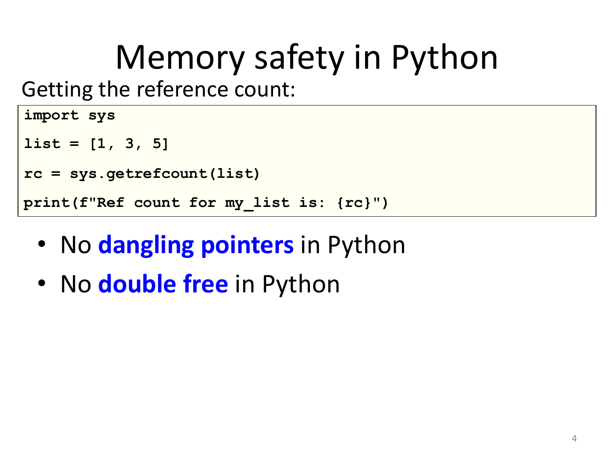

# 06 — Python: Memory Management and the GIL

> **Primary:** `lecture_notes/10-AP25-10-15-Python_and_GIL.pdf` (11 pp)
> **Supporting:** `DOCS/06-GM-ch5.pdf` — Gabbrielli–Martini ch.5, *Memory Management*
> **Cited as:** `[GIL p.n]` by PDF page
> **Related:** [05 — Rust](05-rust-ownership-borrowing.md) for the same problems solved differently

Lecture of 15 October 2025 (A. Corradini), immediately after the three Rust
lectures. The framing on the opening slide — *"and now, a few words on Memory
Management in…"* [GIL p.2] — makes it a deliberate contrast: Rust achieves memory
safety with compile-time ownership and no runtime; CPython achieves much of the
same with a runtime that counts references, and pays for it with the GIL.

---

## 6.1 Garbage collection in CPython

> CPython manages memory with a **reference counting + a mark&sweep cycle
> collector** scheme [GIL p.3]:
>
> - **Reference counting**: each object has a counter storing the **number of
>   references to it**. When it becomes **0**, memory can be reclaimed.
> - **Pros**: simple implementation, memory is reclaimed **as soon as possible**,
>   no need to freeze execution passing control to a garbage collector
> - **Cons**: **additional memory** needed for each object; **cyclic structures in
>   garbage cannot be identified** (thus the need of mark&sweep)

Two mechanisms, because neither suffices alone. Reference counting is *eager*: the
moment the last reference goes, the object is freed, so there is no pause and no
unpredictable delay — the property that makes tracing collectors unsuitable for
real-time work, as [ch.05 §5.4](05-rust-ownership-borrowing.md#54-memory-management-and-raii)
noted.

Its blind spot is cycles. If `a` refers to `b` and `b` refers to `a`, then even
after every external reference is dropped both counters remain at 1, so neither is
ever reclaimed. No amount of counting can detect this, because the references
holding the objects alive are inside the garbage itself. Hence the second
mechanism: a **mark & sweep** cycle collector that periodically traces from the
roots and reclaims unreachable groups.

The "additional memory" cost is one counter per object — small individually, but
paid by every object in the program.

Reading the count directly [GIL p.4]:

```python
import sys
list = [1, 3, 5]
rc = sys.getrefcount(list)
print(f"Ref count for my_list is: {rc}")
```

Note this is reflection in the sense of
[ch.12 §12.1](12-java-reflection-annotations.md#121-what-reflection-is): the program
inspects part of its own runtime state — the very bookkeeping the interpreter uses to
manage it.

## 6.2 Memory safety



*Figure 6.1 — Memory safety in Python [GIL p.4].*

> - **No explicit deallocation** on the heap
> - **`del` removes entries from the namespace**
>
> Therefore:
>
> - **No dangling pointers** in Python
> - **No double free** in Python
>
> [GIL p.4]

The argument is short and worth following, because it reaches the same conclusion as
Rust by opposite means. Two of the five defect classes of
[ch.05 §5.1](05-rust-ownership-borrowing.md#the-safety-guarantees) are excluded
*by construction*:

- A **dangling pointer** requires an object to be freed while a reference to it
  still exists. Reference counting makes that impossible: while a reference exists
  the count is at least 1, so the object is not freed.
- A **double free** requires the programmer to request deallocation twice. There is
  no way to request it once — freeing is the interpreter's decision alone.

`del x` does **not** free anything; it removes the name `x` from its namespace,
which is a dictionary in the sense of
[ch.13 §13.3](13-python-decorators-oop.md#133-namespaces-and-scopes). That
decrements the object's count, and the object is freed only if the count reaches 0.

The contrast with Rust is instructive. Rust proves at compile time that no reference
outlives its owner, then frees deterministically at the closing brace with no
runtime bookkeeping. Python keeps a counter at runtime and frees when it hits zero.
Both eliminate dangling pointers and double frees; Rust's guarantee is free at
runtime and constrains the programmer, Python's costs memory and time per object and
constrains nothing.

## 6.3 Race conditions


*Figure 6.2 — "Race conditions in Python? **NO**" [GIL p.5].*

The experiment is the same one Rust rejected at compile time in
[ch.05 §5.11](05-rust-ownership-borrowing.md#511-safe-concurrency): a shared counter
incremented 10 000 times in parallel by two threads.

```python
# counter in closure
def counter_factory():
  counter = 0
  def counter_increaser():
      nonlocal counter
      counter = counter + 1
  return counter_increaser
```

```python
# decorator: repeats fun ntimes
def times(ntimes):
     """Usage: times(ntimes)(fun)(args,kwargs)"""
     def times_dec(fun):
         def wrapper(*args,**kwargs):
             for i in range(ntimes):
                 fun(*args,**kwargs)
             return
         return wrapper
     return times_dec
```

```python
# Runs fun() in parallel
def thread_fun(nthreads, fun):
    threads = []
    for _ in range(nthreads):
        threads.append(Thread(target = fun))
        threads[-1].start()
    for t in threads:
        t.join()

inc = counter_factory()
thread_fun(2,times(10000)(inc))
inc.__closure__[0].cell_contents
```

Every technique of [ch.13](13-python-decorators-oop.md) appears here: `nonlocal`
for the closure variable ([§13.3](13-python-decorators-oop.md#133-namespaces-and-scopes)),
a decorator with arguments ([§13.2](13-python-decorators-oop.md#132-decorators)), and
`__closure__[0].cell_contents` to read the captured cell —
[ch.11 §11.2](11-java-lambdas-streams.md#variable-capture) showed the same attribute.

The result is **20000**, the correct total. In C++ the equivalent program printed
less than 20000 [ch.05 §5.3](05-rust-ownership-borrowing.md#race-conditions), because
`counter++` is read-modify-write and the two threads interleave. Here
`counter = counter + 1` is equally non-atomic, and yet no increment is lost. §6.5
explains why — and the reason is not that Python is careful, but that Python does not
actually run the two threads at once.

## 6.4 Why reference counting forces a lock

> - Updating the refcount of an object has to be done **atomically**
> - In case of **multi-threading** you need to **synchronize** all the times you
>   modify refcounts, or else you can have **wrong values**
> - Synchronization primitives are quite **expensive** on contemporary hardware
> - Since **almost every operation in CPython can cause a refcount to change**
>   somewhere, handling refcounts with some kind of synchronization would cause
>   **spending almost all the time on synchronization**
> - As a consequence…
>
> [GIL p.6]

This is the causal chain of the whole lecture, and it is worth stating as an
argument:

1. §6.1's memory management depends on reference counts being accurate.
2. A count is incremented and decremented by ordinary operations — binding a name,
   passing an argument, returning a value, dropping a local. So refcount updates are
   *everywhere*, at a rate comparable to bytecode execution itself.
3. An inaccurate count is not a lost increment but a **correctness catastrophe**: too
   low frees a live object (a dangling pointer, undoing §6.2), too high leaks it.
4. Therefore every one of those updates would need a lock.
5. Locks are expensive relative to the operations being protected, so fine-grained
   locking would cost more than the work it protects.

The conclusion is that per-object locking is not a viable implementation of
reference counting under threads. The alternative is one lock for everything.

## 6.5 The Global Interpreter Lock

> - The CPython interpreter assures that **only one native thread executes Python
>   bytecodes at a time**, thanks to the **Global Interpreter Lock**, which is a
>   **mutex on the Python interpreter**
> - The current thread **must hold the GIL** before it can safely access Python
>   objects
> - This **simplifies the CPython implementation** by making the object model
>   (including critical built-in types such as `dict`) **implicitly safe against
>   concurrent access: no race conditions**
> - Locking the **entire interpreter** makes it easier for the interpreter to be
>   multi-threaded, **at the expense of much of the parallelism** afforded by
>   multi-processor machines.
>
> [GIL p.8]

This answers §6.3. The two threads did not lose an increment because they never ran
simultaneously: each had to hold the GIL to execute bytecode, so the interleaving
that corrupts `counter = counter + 1` in C++ cannot occur. **Python's thread safety
here is a side effect of its memory management, not a design goal.**

The third bullet is the benefit, and it is broader than user code: `dict`, `list`
and every other built-in become concurrency-safe for free, which is a large amount
of implementation effort avoided. The fourth bullet is the price, stated plainly —
the parallelism of a multi-core machine is largely unavailable to threaded Python.

Note precisely what the GIL does and does not guarantee. It serialises **bytecode
execution**, so no two threads corrupt the interpreter's internal state. It does
**not** make a multi-bytecode operation atomic: a thread can be suspended between
the load and the store of `counter = counter + 1`. The example works because the
suspension points still serialise, but a program relying on that is relying on an
implementation detail — which is why `threading.Lock` still exists.

### The costs beyond lost parallelism

> However the GIL can **degrade performance even when it is not a bottleneck**. The
> system call overhead is significant, especially on multicore hardware
> [GIL p.9]:
>
> - **Two threads calling a function may take twice as much time as a single thread
>   calling the function twice.**
> - The GIL can cause **I/O-bound threads to be scheduled ahead of CPU-bound
>   threads**. And it **prevents signals from being delivered**.
> - Some extension modules, either standard or third-party, are designed so as to
>   **release the GIL** when doing computationally-intensive tasks such as
>   compression or hashing.
> - Also, **the GIL is always released when doing I/O**.

The first bullet is worse than "no speedup": threading can make a CPU-bound program
*slower* than the sequential version, because the threads pay for GIL acquisition
and release while gaining nothing.

The last two bullets explain when threading in Python is nonetheless useful. Since
the GIL is released during I/O and by compute-heavy C extensions, a program that
spends its time waiting on the network or inside NumPy **does** overlap work. The
rule of thumb follows directly: threads help I/O-bound Python, not CPU-bound
Python — for which the answer is separate processes, each with its own interpreter
and its own GIL.

## 6.6 Alternatives

> - Past efforts to create a **"free-threaded" interpreter** (one which locks shared
>   data at a much **finer granularity**) have **not been successful** because
>   **performance suffered in the common single-processor case**.
> - It is believed that overcoming this performance issue would make the
>   implementation **much more complicated** and therefore costlier to maintain.
> - **Guido van Rossum** has said he will **reject any proposal in this direction
>   that slows down single-threaded programs**.
> - **Jython** (on JVM, → 2017, Python 2.7) and **IronPython** (on .NET) have **no
>   GIL** and can fully exploit multiprocessor systems
> - **PyPy** (Python in Python, supporting JIT) currently **has a GIL** like CPython
> - in **Cython** (compiled, for CPython extension modules) the GIL exists, but
>   **can be released temporarily** using a `with` statement
>
> [GIL p.10]

The first three bullets are §6.4's argument reappearing as a design constraint:
fine-grained locking is exactly what step 5 ruled out, and the historical attempts
confirmed it empirically. The trade-off is between the *common* case (one thread) and
the *desirable* case (many threads), and the project chose the common one.

Jython and IronPython escaping the GIL is the diagnostic detail: they run on the
JVM and .NET, which use **tracing garbage collectors** rather than reference
counting. Removing reference counting removes the reason for the GIL — confirming
that the GIL is a consequence of the memory-management choice of §6.1, not of the
Python language.

## 6.7 Removing the GIL

> **Experimental feature: GIL optional in Python 3.13 (Oct. 2024)** [GIL p.11]
>
> - **Experimental Support for Free-Threaded Mode** where the GIL is **disabled**.
>   This is aimed at improving multi-threading capabilities and enabling better
>   performance in **CPU-bound tasks**.
> - **Specializing Interpreter Enhancements**: the specializing interpreter
>   (interpreter with some ad hoc optimizations) has undergone modifications to
>   ensure **thread safety without the GIL**.
> - **`sys._is_gil_enabled()`** to see if the current interpreter uses the GIL
> - The feature is **potentially reversible** if it breaks more of the current
>   implementation of CPython than expected.
>
> **Python 3.14 (7 Oct. 2025)**
>
> - Support for Free-Threaded Mode **improved**.
> - **Plan to be the default in future releases.**

Note the target: **CPU-bound** tasks, which are precisely the ones §6.5 identified
as unable to benefit from threads. The second bullet is where the work is — every
interpreter optimisation that assumed the GIL had to be made thread-safe without it,
which is the "much more complicated" cost predicted in §6.6.

The leading underscore in `sys._is_gil_enabled()` marks it as non-public API by the
convention of [ch.13 §13.6](13-python-decorators-oop.md#encapsulation-and-name-mangling)
— appropriate for a feature explicitly described as reversible.

---

## Summary

| Concept | Statement | Page |
|---|---|---|
| CPython scheme | **reference counting** + **mark & sweep** cycle collector | p.3 |
| Reference counting | count per object; freed at 0 — eager, no pauses | p.3 |
| Pros | simple, reclaims as soon as possible, no execution freeze | p.3 |
| Cons | one counter per object; **cannot detect garbage cycles** | p.3 |
| Inspecting | `sys.getrefcount(obj)` | p.4 |
| `del` | removes a **name from a namespace**, does not free memory | p.4 |
| No dangling pointers | a live reference keeps the count ≥ 1 | p.4 |
| No double free | there is no way to request deallocation at all | p.4 |
| Shared counter | two threads × 10000 gives the correct **20000** — no race | p.5 |
| Why a lock is needed | refcount updates must be atomic, happen almost everywhere, and locks are expensive | p.6 |
| **GIL** | a **mutex on the interpreter**: one native thread executes bytecode at a time | p.8 |
| Benefit | the object model, including `dict`, is **implicitly** concurrency-safe | p.8 |
| Cost | loses most of the parallelism of multi-processor machines | p.8 |
| Worse | two threads may take **twice** as long as one thread doing the work twice | p.9 |
| Released | during **I/O**, and by compute-heavy extension modules | p.9 |
| Free-threading attempts | failed because single-processor performance suffered | p.10 |
| No GIL | **Jython** (JVM), **IronPython** (.NET) — they do not use reference counting | p.10 |
| Has a GIL | **PyPy**; **Cython** can release it with `with` | p.10 |
| 3.13 (Oct 2024) | experimental **free-threaded mode**; `sys._is_gil_enabled()` | p.11 |
| 3.14 (Oct 2025) | improved; **planned to become the default** | p.11 |

## Exam-style checks

1. Why does CPython need a cycle collector in addition to reference counting? Give
   a concrete two-object example that reference counting cannot reclaim.
2. Explain why Python has no dangling pointers and no double frees, and contrast
   the mechanism with Rust's `[O2]`/`[O3]`.
3. What does `del x` actually do?
4. The shared-counter program prints 20000 in Python but less than 20000 in C++,
   although `counter = counter + 1` is not atomic in either. Explain.
5. Reconstruct the five-step argument of [GIL p.6] from "refcounts must be atomic"
   to "lock the whole interpreter".
6. Does the GIL make `counter = counter + 1` atomic? Justify your answer, and say
   what follows for programs that appear to work without a lock.
7. Under what conditions does multithreading speed up a Python program? Under what
   conditions can it slow one down?
8. Jython and IronPython have no GIL. What property of their runtimes makes that
   possible, and what does that tell you about the cause of the GIL?
9. Why were free-threaded CPython interpreters historically rejected, and which
   trade-off does that reflect?
10. Free-threaded mode targets CPU-bound tasks specifically. Why those?
