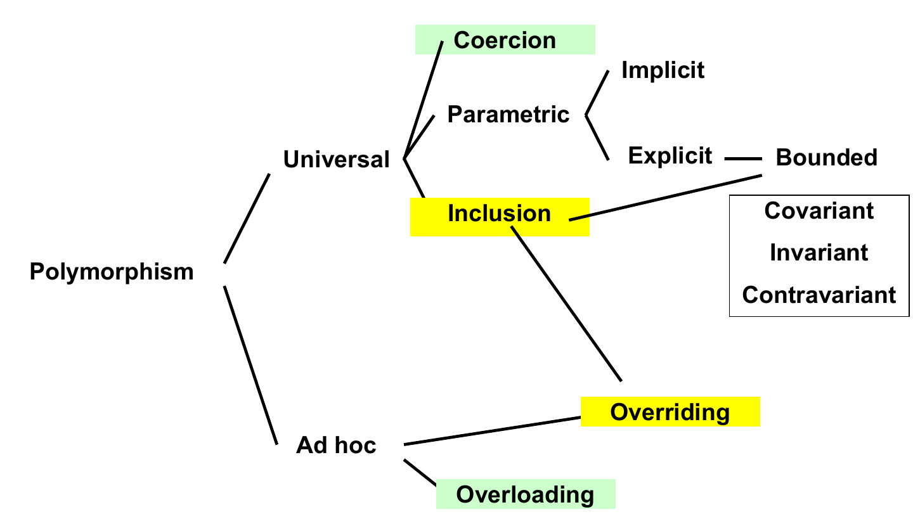
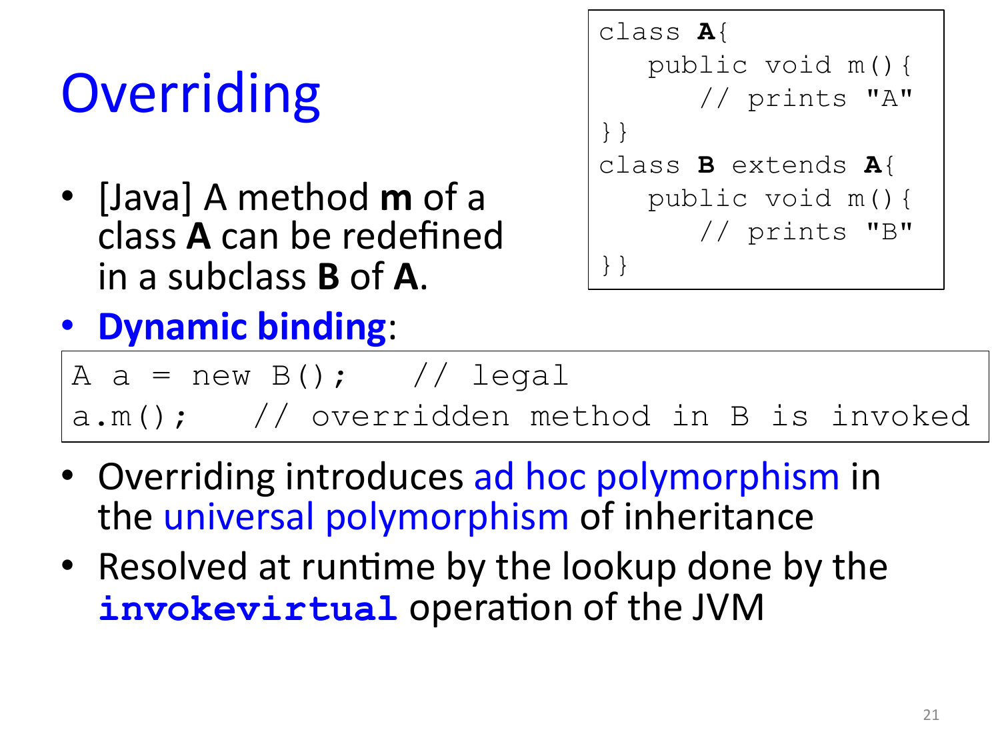

# 07 — Types and Polymorphism

> **Primary:** `lecture_notes/15-AP25-10-27-Types-Polymorphism.pdf` (23 pp)
> **Supporting:** `DOCS/15-Mitchell-CPL-Ch6.pdf` — Mitchell ch.6, *Type Systems, Type Inference, and Polymorphism*
> **Notation:** [`NOTATION.md`](../NOTATION.md) §4–5 — type-system vocabulary, `S <: T`
> **Cited as:** `[Types p.n]` by PDF page

Lecture of 27 October 2025 (A. Corradini). The deck's outline: type systems,
polymorphism as a classification, overloading, coercion, inclusion polymorphism,
overriding [Types p.2].

---

## 7.1 Types in programming languages

At the bottom there are no types at all — **hardware: just bits** [Types p.3].
Types are something a language imposes on top of that.

> PLs associate types with **language constructs which denote values**
> [Types p.3]:
>
> - named constants
> - variables
> - record fields
> - parameters
> - literal constants (e.g., 17, 3.14, "foo")
> - more complicated expressions containing these
> - and sometimes subroutines
>
> **Types limit the operations that can be applied to such entities.**

The list is worth reading as a spectrum of how far a language commits. Every typed
language types variables and parameters; typing *expressions* requires composing
those types compositionally; and typing **subroutines** is optional — §7.3 returns
to it. The final line is the operative one: a type is not primarily a description
of a value's shape but a **restriction on what you may do with it**. Everything
else in this chapter follows from that reading, since polymorphism is exactly the
question of how far a single operation's permission can be stretched across
types.

### Type systems

> A **type system** includes [Types p.4]:
>
> 1. a mechanism to **define types** and associate them with language constructs
>    that denote values, and
> 2. a set of rules for **type equivalence**, **type compatibility**, and **type
>    inference**.
>
> **Type checking**: the process of ensuring that a program obeys type
> compatibility rules.

The three kinds of rule answer three different questions, and it is worth keeping
them apart:

- *Type equivalence* — when are two type expressions the same type? (Is a
  `Celsius` defined as `float` the same type as `float`?)
- *Type compatibility* — when may a value of one type be used where another is
  expected? This is the weaker, directional relation, and it is what type
  checking actually enforces.
- *Type inference* — what is the type of an expression, given the types of its
  parts?

Mitchell ch.6 develops inference at length; the deck uses it mainly as the
setting in which overloading becomes difficult (§7.5).

### Strong, static, dynamic

> A programming language is [Types p.5]:
>
> - **Strongly typed** if no **type error** (*type clash*) can occur:
>   application of an operation to a value not supporting such operation
> - **Statically typed** if (most) type checking is performed at compile time
> - **Dynamically typed** otherwise
> - Note: languages with **dynamic binding** are dynamically typed

Two independent axes are being defined here, and conflating them is the standard
mistake. *Strong* is about whether type errors can happen at all; *static* versus
*dynamic* is about **when** the checking happens. A language can be strongly and
dynamically typed — Python raises a `TypeError` rather than reinterpreting the
bits — and a language can be statically but weakly typed, as C is, since a cast
can defeat the checker.

The note about dynamic binding is a consequence rather than a definition: if the
code that a name refers to is only determined at execution time, then the types
involved cannot in general be known before then. Compare §7.4, where binding time
is treated in its own right.

### Extensible type systems

> - Most PLs allows to define new types
> - Three views of types [Types p.6]:
>   1. **Denotational** (set of values)
>   2. **Constructive** (basic or composite type)
>   3. **Abstraction-based** (interface of operations)

The three views are three answers to "what *is* a type", and each one licenses a
different way of deciding type equivalence. Denotationally a type is the set of
values it contains, so two types are equal when they have the same members.
Constructively a type is a term built from base types by type constructors, so
equality is a question about the structure of that term. Abstractionally a type
is the set of operations you may perform, so what matters is the interface, and
two different representations with the same interface are interchangeable — which
is the view that object-oriented subtyping and Haskell type classes both take.

### Primitive data types

[Types p.7]

- Booleans
- Integers (unsigned, decimal, …)
- Floating point numbers (rational, complex, …)
- Characters
- Discrete / scalar / simple types
- Enumeration
- Subrange

### Composite types

[Types p.8]

| Type | Understood as |
|---|---|
| Records / Structures | *cartesian product* |
| Variant records / Unions | tagged or not |
| Arrays | *functions from `[1..n]` to base type* |
| Sets | |
| Pointers | e.g. recursive data types |
| Lists | have recursive definition |

The parenthetical glosses are the point of this slide: composite types are not an
arbitrary list of language features but the standard algebraic constructions.
A record is a product `A × B × …`, so its values are tuples of one value from each
field. A tagged union is a **sum** `A + B`, so its values are one value from
*either* side plus a tag saying which — which is why `match` on a tagged union can
be checked for completeness while reading a C union cannot. An array is a
*function* from an index range to the base type, which explains why array access
uses the same notation as function application in many languages. Pointers and
lists are the two constructions that introduce recursion, and hence the only ones
whose values can be unboundedly large.

Compare Rust's `enum` in [ch.05 §5.8](05-rust-ownership-borrowing.md), which is a
tagged union in exactly this sense, and the "no implicit boxing" rule that makes
the pointer explicit.

## 7.2 Subroutine types

> Only some PLs assign types to subroutines. Subroutines can be [Types p.9]:
>
> - **First-class**: can be passed as parameter, returned, assigned
> - **Second-class**: passed as parameter only
> - **Third class**: not even passed as parameter
>
> Parameter passing is subject to the type-compatibility rules.

The three classes form a hierarchy of what a language lets you do with a
subroutine *as a value*. Third class means subroutines are not values at all —
they can only be called. Second class allows passing them inward but not
outward, which is precisely the restriction that makes a stack discipline safe:
a subroutine passed downward cannot outlive the frame that supplied it. First
class removes that restriction, and it is the removal that forces a language to
deal with closures and with the question of what happens to the environment a
returned function captured.

The final line ties this back to §7.1: once subroutines have types, passing one
as an argument is checked by the same compatibility rules as any other value —
which is what makes the type of a higher-order function meaningful.

## 7.3 What polymorphism is

> From Greek: **πολυμορφος**, composed of **πολυ** (many) and **μορφή** (form),
> thus "having several forms" [Types p.10].
>
> - "Forms" are **types**
> - "Polymorphic" are **function names** (also *operators*, *methods*, …)
> - "Polymorphic" can also be **types** (parametric data types, type
>   constructors, generics, …)
>   - Usually as encapsulation of several related function names

The etymology fixes the two things that vary. The "forms" are always types. What
is *polymorphic* — what has several forms — is normally a **name**: one name,
several types, hence potentially several behaviours. The extension to polymorphic
*types* is derivative, and the sub-bullet says why: a parametric data type such as
`List<T>` is polymorphic because the operations it packages (`add`, `get`, …) are
each polymorphic in `T`.

### Flavors

The vocabulary in circulation is large, and the deck lists it before organising it
[Types p.11]:

| Flavors of polymorphism | Related concepts |
|---|---|
| Ad hoc | Coercion |
| Bounded | Generics |
| Contravariant | Inheritance |
| Covariant | Macros |
| Inclusion | Overloading |
| Invariant | Overriding |
| Parametric | Subtyping |
| Universal | Templates |

### The primary division

> - With **ad hoc** polymorphism the same function name denotes **different
>   algorithms**, determined by the actual types
> - With **universal** polymorphism there is only **one algorithm**: a single
>   (universal) solution applies to objects of different types
> - Ad hoc and universal polymorphism **can coexist**
>
> [Types p.12]

This is the distinction to memorise, because everything else in the taxonomy
hangs off it, and the test is simple: **count the algorithms.** If one name
selects among several distinct pieces of code, it is ad hoc. If one piece of code
serves every type, it is universal.

The practical consequences differ accordingly. Ad hoc polymorphism requires a
*selection* step — something must decide which implementation to run, and §7.4 is
about when that decision is taken. Universal polymorphism requires no selection
at all, but it constrains the code: to work uniformly across types, the single
algorithm can only rely on operations every admissible type supports.

That the two coexist is the normal situation. Java has both: generics are
universal, overloading is ad hoc, and a generic method may be overloaded.

### The classification


*Figure 7.1 — Classification of polymorphism [Types p.14].*



*Figure 7.2 — The same tree later in the deck, with the topics of §7.6 and §7.7
highlighted [Types p.19].*

This is the Cardelli–Wegner classification. Reading it:

- **Universal** → **Coercion** (§7.6), **Parametric**, **Inclusion** (§7.7)
- **Parametric** → **Implicit** / **Explicit**; explicit parametric polymorphism
  can be **Bounded**, and bounded polymorphism raises the variance question:
  **Covariant** / **Invariant** / **Contravariant**
- **Ad hoc** → **Overriding**, **Overloading** (§7.5)

Note that **Overriding** sits under *both* Inclusion and Ad hoc. That double
parentage is not an error in the diagram and §7.7 explains it: overriding is what
happens when inheritance, a universal mechanism, is used to supply
type-determined behaviour, which is ad hoc.

*Implicit* parametric polymorphism is what Haskell's type inference gives you —
you write no type parameters and the compiler generalises. *Explicit* is Java's
`<T>` and Rust's generics, where the parameter is written down; *bounded* is
`<T extends Comparable<T>>`, where the parameter is constrained. Both are covered
in [ch.08](08-java-generics.md), which is where variance is settled.

## 7.4 Binding time

> The **binding** of the function name with the actual code to execute can be
> [Types p.13]:
>
> - at **compile time** — *early, static binding*
> - at **linking time**
> - at **execution time** — *late, dynamic binding*
>
> If it spans over different phases, the **binding time** is the last one.
> **The earlier the better**, for debugging reasons.

This slide sits between the two halves of the taxonomy because it supplies the
missing dimension. Ad hoc polymorphism needs a selection step; binding time says
*when* that step happens. Overloading in Java binds early, at compile time, from
the static types of the arguments. Overriding binds late, at execution time, from
the runtime class of the receiver. Both are ad hoc; they differ only in binding
time — and that single difference accounts for nearly all the confusing behaviour
in §7.8.

The rule about spanning phases is a definition worth being precise about: partial
resolution early does not count. If any part of the decision is deferred to
execution, the binding time *is* execution time. And the preference for early
binding is justified on the ground of debugging rather than performance: an error
caught by the compiler is cheaper than one observed at runtime, and it is caught
for every path rather than only for the paths that get executed.

## 7.5 Overloading (ad hoc polymorphism)

> - Present in **all languages**, at least for built-in arithmetic operators:
>   `+`, `*`, `-`, …
> - Sometimes supported for **user defined functions** (Java, C++, …)
> - C++, Haskell, Python, … allow **overloading of primitive operators by user
>   defined functions**
> - The code to execute is determined by the **type of the arguments**, thus
>   - **early binding** in statically typed languages
>   - **late binding** in dynamically typed languages
>
> [Types p.15]

The first bullet is the observation that every reader has already met overloading
without noticing: `+` on integers and `+` on floats are different machine
operations sharing a name, chosen by the argument types. That is ad hoc
polymorphism in the sense of §7.3 — two algorithms, one name.

The three bullets after it are a ladder of increasing permissiveness: built-in
operators only, then user-defined *functions* too, then user-defined
*implementations of the built-in operators*. The last step is what lets a library
type behave like a number.

The final bullet applies §7.4. Selection depends on argument types either way;
what differs is whether those types are known statically. This is also why
overloading interacts badly with type inference — if the compiler is
simultaneously inferring the argument's type and using that type to pick the
implementation, the two tasks are circular. §7.5.2 is the resolution.

### An example

[Types p.16] The progression from no types to overloading:

```
// Function for squaring a number:
sqr(x) { return x * x; }

// Typed version (like in C):
int sqr(int x) { return x * x; }

// Multiple versions for different types (C):
int sqrInt(int x) { return x * x; }
double sqrDouble(double x) { return x * x; }

// Overloading (Java, C++):
int sqr(int x) { return x * x; }
double sqr(double x) { return x * x; }
```

The four stages isolate what overloading actually buys. An untyped `sqr` is
already "polymorphic" in a trivial sense, but nothing is checked. Adding types
makes it checkable but monomorphic. The C solution keeps types and regains the
two behaviours, at the cost of two *names* — so the caller must know which one to
use. Overloading gives back the single name while keeping both implementations
and the checking: the caller writes `sqr` and the compiler picks.

Note that the two bodies are textually identical (`return x * x;`). The reason
they are nonetheless different algorithms is that `*` inside them is itself
overloaded — integer multiplication in one, floating-point multiplication in the
other. This is ad hoc polymorphism resting on ad hoc polymorphism.

### Overloading in Haskell

> - Haskell introduces **type classes** for handling overloading in presence of
>   **type inference**
> - Very nice and clean solution, unlike most programming languages
> - Adopted by Rust: **traits**
> - We shall present this later in the course
>
> [Types p.17]

The phrase "in presence of type inference" names the circularity flagged above.
Haskell's answer is to make the constraint part of the type: `square :: Num n =>
n -> n` says that `square` works for any `n` that supports the `Num` operations,
so inference can proceed with `n` unknown and resolve the implementation once `n`
is determined. Developed in [ch.09](09-haskell-typeclasses.md); the Rust
counterpart is [ch.05 §5.8](05-rust-ownership-borrowing.md).

## 7.6 Coercion (universal polymorphism)

> - **Coercion**: automatic conversion of an object to a different type
> - Opposed to **casting**, which is explicit
>
> ```
> double sqrt(double x){…}
> double d = sqrt(5) // applied to int
> ```
>
> - Thus the same code is applied to arguments of different types
> - In well-designed languages, coercion only possible if there is **no loss of
>   information** (Java vs C++)
> - **Degenerate, uninteresting case of polymorphism**
>
> [Types p.18]

Coercion counts as *universal* by the test of §7.3: there is exactly one `sqrt`,
one algorithm, and it serves both `double` and `int` arguments. But the deck calls
it degenerate, and the reason is worth spelling out — the polymorphism is not in
the function at all. `sqrt` only ever operates on `double`; the compiler silently
converts the `5` before the call. The apparent flexibility belongs to the
*argument*, not to the code.

Contrast the neighbouring cases in the tree. Parametric polymorphism has one
algorithm that genuinely runs on many types. Overloading has many algorithms.
Coercion has one algorithm running on one type, with conversions arranged around
it, which is why it adds no expressive power.

The no-loss-of-information condition is what separates a safe coercion from a
dangerous one. `int` → `double` preserves the value; `double` → `int` would not.
Java permits only widening coercions implicitly, and requires a cast for
narrowing; C++ is more permissive, which is the comparison the slide is drawing.

## 7.7 Inclusion polymorphism

> - Also known as **subtyping polymorphism**, or just **inheritance**
> - Polymorphism ensured by (Barbara Liskov's) **Substitution principle**: an
>   object of a subtype (subclass) can be used in any context where an object of
>   the supertype (superclass) is expected
> - [Java, C++, …] methods/functions with a formal parameter of type **T** accept
>   an actual parameter of type **S <: T** (**S** subtype of **T**)
> - Methods/virtual functions declared in a class can be invoked on objects of
>   subclasses, if not redefined…
>
> [Types p.20]

The Liskov substitution principle is what makes this polymorphism rather than
mere code reuse. Inheritance by itself shares implementation; substitutability is
the guarantee that lets one piece of code — a method with a parameter of type `T`
— operate on values of unboundedly many types `S <: T`. One algorithm, many
types: universal, by §7.3's test.

The third bullet is the notation `S <: T`, read "`S` is a subtype of `T`", and it
states the compatibility rule of §7.1 for this case: a value of a subtype is
compatible with a context expecting the supertype. The direction matters — `S <: T`
licenses passing an `S` where a `T` is wanted, never the reverse. Where the same
question is asked about *constructed* types (is `List<S> <: List<T>`?), the answer
is the variance problem of [ch.08](08-java-generics.md).

The trailing "if not redefined…" is the hinge into §7.8. As long as a subclass
does not redefine an inherited method, the whole arrangement is purely universal:
one implementation, reached from many types. Redefinition breaks that, and
produces the double parentage seen in Figure 7.1.

### Overriding

> - [Java] A method **m** of a class **A** can be redefined in a subclass **B**
>   of **A**.
> - **Dynamic binding**
> - Overriding introduces **ad hoc polymorphism** in the **universal
>   polymorphism** of inheritance
> - Resolved at runtime by the lookup done by the `invokevirtual` operation of
>   the JVM
>
> [Types p.21]



*Figure 7.3 — Overriding and dynamic binding [Types p.21].*

```java
class A{
   public void m(){
      // prints "A"
}}
class B extends A{
   public void m(){
      // prints "B"
}}
```

```java
A a = new B();   // legal
a.m();   // overridden method in B is invoked
```

Read the two lines against §7.4. `A a = new B()` is legal by the substitution
principle: `B <: A`, so a `B` may be stored where an `A` is expected. The
*declared* type of `a` is `A`; its *runtime* class is `B`. Then `a.m()` runs `B`'s
version — so the selection used the runtime class, not the declared type, and the
binding is therefore late.

That is exactly the third bullet's claim. Inheritance supplies the universal
part: one call site serves every subtype of `A`. Overriding makes the behaviour
depend on the actual type, which is the ad hoc part. Hence Overriding's two
parents in Figure 7.1 — reached from Inclusion because it needs the subtype
relation, and from Ad hoc because it selects among several algorithms by type.

The mechanism named in the last bullet is the JVM's `invokevirtual`, which
performs the lookup at each call; see [ch.12](12-java-reflection-annotations.md)
for the reflective view of the same machinery.

## 7.8 Overloading + overriding together

Once both are present, and they bind at different times, their interaction is not
obvious. The deck contrasts C++ and Java on the same hierarchy [Types p.22].


*Figure 7.4 — The same hierarchy in C++ and in Java [Types p.22].*

```cpp
class A {
public:
   virtual void onFoo() {}
   virtual void onFoo(int i) {}
};

class B : public A {
public:
    virtual void onFoo(int i) {}
};

class C : public B {
};

int main() {
    C* c = new C();
    c->onFoo();      //Compile error – doesn't exist
}
```

```java
class A {
    public void onFoo() {}
    public void onFoo(int i) {}
}

class B extends A {
    public void onFoo(int i) {}
}

class C extends B {
}

class D {
public static void main(String[] s) {
        C c = new C();
        c.onFoo();               //Compiles !!
    }
}
```

The two hierarchies are identical and the calls are identical, but only Java
accepts `c.onFoo()`. The explanation [Types p.23]:

> - **[Java]** Overloading is **type-checked by the compiler**
> - Overriding resolved at runtime by the lookup done by `invokevirtual`
> - **[C++]** Dynamic method dispatch: C++ adds a **v-table** to each object from
>   a class having virtual methods
> - The compiler does not see any declaration of `onFoo` in `C`, so it continues
>   upwards in the hierarchy. When it checks `B`, it finds a declaration of
>   `void onFoo(int i)`, so it **stops lookup** and tries **overload
>   resolution**, but it fails due to the inconsistency in the arguments.
> - `void onFoo(int i)` **hides** the definitions of `onFoo` in the superclass.
> - Solution: add `using A::onFoo;` to class `B`

The C++ rule is *name*-based, and that is the whole difference. Lookup ascends the
hierarchy searching for the **name** `onFoo`, stops at the first class that
declares it — `B` — and only then performs overload resolution, among the
candidates found in `B` alone. Since `B` declares only the `int` version,
`onFoo()` with no argument has no candidate, and `A`'s zero-argument version is
never considered. It has been **hidden**, not overridden. Adding
`using A::onFoo;` to `B` re-imports the superclass overloads into `B`'s scope so
that resolution sees all three.

Java instead collects the applicable overloads from the whole hierarchy before
resolving, so `A`'s `onFoo()` remains a candidate for a `C` and the call compiles.

The two bindings are doing separate jobs in both languages, and separating them
is what makes the behaviour predictable:

| | Selects on | Bound at |
|---|---|---|
| Overloading | static types of the **arguments** | compile time (early) |
| Overriding | runtime class of the **receiver** | execution time (late) |

Overload resolution happens first and picks a *signature*; virtual dispatch
happens second and picks the *implementation* of that signature. C++'s hiding rule
interferes with the first step, which is why the program fails to compile rather
than behaving unexpectedly at runtime.

---

## Summary

| Concept | Statement | Page |
|---|---|---|
| Types | limit the operations that can be applied to entities denoting values | p.3 |
| Type system | mechanism to define types + rules for equivalence, compatibility, inference | p.4 |
| Type checking | ensuring a program obeys type compatibility rules | p.4 |
| Strongly typed | no type error (type clash) can occur | p.5 |
| Statically typed | (most) type checking at compile time; dynamically typed otherwise | p.5 |
| Three views of types | denotational (set of values), constructive, abstraction-based | p.6 |
| Composite types | record = cartesian product, array = function `[1..n]` → base type | p.8 |
| Subroutine classes | first-class (passed/returned/assigned), second-class (passed only), third class | p.9 |
| Polymorphism | πολυμορφος, "having several forms"; forms are types, polymorphic are names | p.10 |
| **Ad hoc** | same name, **different algorithms**, determined by actual types | p.12 |
| **Universal** | **one algorithm** serving objects of different types | p.12 |
| Classification | Universal → coercion, parametric, inclusion; Ad hoc → overriding, overloading | p.19 |
| Binding time | compile / linking / execution; if it spans phases, the **last** one | p.13 |
| Overloading | code determined by argument types; early binding if statically typed | p.15 |
| Type classes | Haskell's answer to overloading under type inference; Rust's traits | p.17 |
| Coercion | automatic conversion (vs explicit casting); degenerate polymorphism | p.18 |
| Inclusion | subtyping / inheritance; Liskov substitution; `S <: T` | p.20 |
| Overriding | redefinition in a subclass; **dynamic binding** via `invokevirtual` | p.21 |
| C++ hiding | lookup stops at the first class declaring the name, then resolves overloads | p.23 |

## Exam-style checks

1. Distinguish *strongly typed* from *statically typed*, and give a language that
   is one but not the other in each direction.
2. State the three views of types and say which notion of type equivalence each
   one suggests.
3. Why is an array described as "a function from `[1..n]` to base type"? What does
   the analogous description of a variant record tell you about `match`
   completeness?
4. Give the test that distinguishes ad hoc from universal polymorphism, and
   classify: Java generics, Java overloading, `int`→`double` conversion, Java
   overriding.
5. In Figure 7.1, Overriding has two parents. Explain both.
6. Why is coercion called a "degenerate, uninteresting case of polymorphism"
   despite being classified as universal?
7. `A a = new B(); a.m();` invokes `B`'s method. Which step uses the declared
   type of `a` and which uses its runtime class?
8. Explain why `c->onFoo()` fails in C++ but `c.onFoo()` compiles in Java for the
   hierarchy of Figure 7.4, and what `using A::onFoo;` changes.
9. Overload resolution and virtual dispatch both happen for a single Java call.
   Which runs first, what does each decide, and at what binding time?
