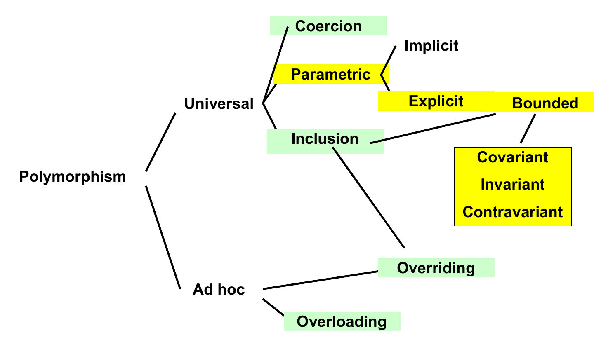
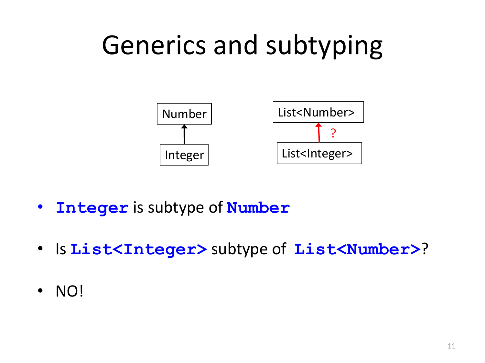
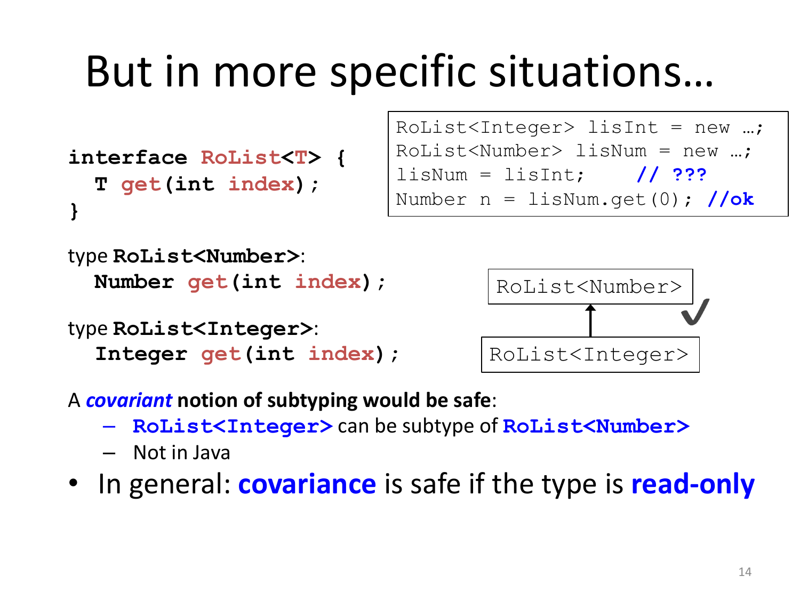

# 08 — Java Generics

> **Primary:** `lecture_notes/16-AP25-JavaGenerics.pdf` (29 pp)
> **Supporting:** `DOCS/15-Mitchell-CPL-Ch6.pdf` §6.4 — parametric polymorphism
> **Notation:** [`NOTATION.md`](../NOTATION.md) §5 — Java conventions, `S <: T`
> **Cited as:** `[Generics p.n]` by PDF page
> **Continues from:** [07 — Types and Polymorphism](07-types-and-polymorphism.md)

Java generics are the **explicit parametric** branch of the classification in
[ch.07 §7.3](07-types-and-polymorphism.md), and this chapter is the part of that
tree the previous one deferred: explicit, bounded, and the variance question.



*Figure 8.1 — The branch of the classification covered here [Generics p.3].*

The deck's outline: Java generics, type bounds, generics and subtyping,
covariance and contravariance in Java and other languages, subtyping and arrays
in Java, wildcards, type erasure, limitations of generics [Generics p.2].

---

## 8.1 What generics are for

> **Java Generics — Explicit Parametric Polymorphism**
>
> - Introduced in 2004 — J2SE 5.0 (was 1.5)
> - *Purpose: To enable **type-safe collections and reusable, type-parameterized
>   code**, eliminating most explicit casts and many runtime
>   `ClassCastException`s.*
>
> [Generics p.4]

![Two pairs of code boxes. Before Java 5.0: interface List with boolean add(Object n) and Object get(int index), and usage List list = new ArrayList(); list.add("Hello"); with the comment anything can be added, then String s = (String) list.get(0); with the comment manual cast required. With generics: interface List<E> with boolean add(E n) and E get(int index), and usage List<String> list = new ArrayList<>(); list.add("Hello"); with the comment only Strings can be added, then String s = list.get(0); with the comment no cast needed](assets/fig-16-AP25-JavaGenerics-p4-generics-before-and-after.png)

*Figure 8.2 — The classical example, before and after generics [Generics p.4].*

```java
// before Java 5.0                    // with generics
interface List {                      interface List<E> {
  boolean add(Object n);                boolean add(E n);
  Object get(int index);}               E get(int index);}
```

```java
// before Java 5.0                    // with generics
List list = new ArrayList();          List<String> list = new ArrayList<>();
list.add("Hello");                    list.add("Hello");
   // anything can be added              //only Strings can be added
String s = (String) list.get(0);      String s = list.get(0);
   // manual cast required               // no cast needed
```

The pre-generics collection is *universally polymorphic* in a crude way: because
everything is an `Object`, one `List` implementation serves every element type.
The cost is that the element type is not recorded anywhere, so two things go
wrong. Insertion is unchecked — nothing stops a caller adding an `Integer` to a
list intended for `String`s — and extraction requires a cast, which can only fail
at runtime with a `ClassCastException`.

Generics keep the single implementation and add the missing information. The
parameter `E` records what the list holds, so `add` is checked at the call and
`get` returns `E` with no cast. The failure that was deferred to runtime is moved
to compile time, which is the preference for early binding of
[ch.07 §7.4](07-types-and-polymorphism.md#74-binding-time).

### Where type parameters may appear

> - **Classes, Interfaces, Methods** can have type parameters
> - The type parameters can be used **arbitrarily** in the definition
> - They can be instantiated by providing arbitrary **(reference) type
>   arguments**
>
> [Generics p.5]

```java
interface List<E> {
  boolean add(E n);
  E get(int index);}
```

instantiated as `List<Integer>`, `List<Number>`, `List<String>`,
`List<List<String>>`, …

Note the parenthesis on "(reference)": type arguments must be reference types, so
`List<int>` is not allowed. §8.6 explains why this restriction exists rather than
being an oversight. Note also that instantiations nest — `List<List<String>>` — so
the type language is genuinely compositional.

### Generic methods

> - Methods can use the type parameters of the class where they are defined, if
>   any
> - They can also introduce **their own type parameters**
>
>       public static <T> T getFirst(T[] array)
>
> - Invocations of generic methods must instantiate all type parameters, either
>   explicitly or implicitly
> - A form of **type inference**
>
> [Generics p.6]

A generic *method* is independent of any generic class, which is why
`getFirst` can be `static`. The `<T>` before the return type declares the
parameter; it is bound afresh at each invocation. That the instantiation is
usually implicit — you write `getFirst(arr)` rather than `getFirst<String>(arr)` —
is the "form of type inference" mentioned: the compiler solves for `T` from the
argument types. This is a very restricted inference compared with Haskell's
(see [ch.09](09-haskell-typeclasses.md)), operating only on the type parameters of
a single call.

## 8.2 Bounded type parameters

> - Values whose type is a type variable are **like `Object`s**
> - Type bounds allow to assume they implement an API
>
> [Generics p.7]

```java
class NumList<E extends Number> {
  int duplicate(E arg) {
    return 2 * arg.intValue(); // OK, Number and its
                  // subtypes support intValue()
  }
}
```

> - Only classes implementing `Number` can be used as type arguments
> - Method defined in the bound (`Number`) can be invoked on objects of the type
>   parameter
>
> [Generics p.7]

The first bullet is the problem bounds solve. An unbounded `E` could be
instantiated at *any* reference type, so the only methods the compiler can allow
on an `E` value are the ones every type has — those of `Object`. That is a severe
restriction: a generic container can store and retrieve, but a generic *algorithm*
usually needs to do something with its elements.

A bound widens what the body may assume by narrowing what the parameter may be
instantiated at. Declaring `E extends Number` promises every caller supplies a
`Number` subtype, and in exchange the body may call `Number`'s methods such as
`intValue()`. This is the "bounded" node of Figure 8.1.

### Type bounds

> ```
> <TypeVar extends SuperType>
> ```
> — *upper bound*; `SuperType` and any of its subtype are ok.
>
> ```
> <TypeVar extends ClassA & InterfaceB & InterfaceC & …>
> ```
> — *Multiple* upper bounds
>
> - Type bounds for methods guarantee that the type argument supports the
>   operations used in the method body
> - *Unlike C++ where overloading is resolved and can fail after instantiating a
>   template, in Java type checking ensures that overloading will succeed*
>
> [Generics p.8]

Note that `extends` is used for both classes and interfaces in a bound, and that
multiple bounds are joined with `&`, not with a comma.

The comparison with C++ is the substantive point. A C++ template is checked
**after** substitution: the compiler instantiates the template with the actual
type and then type-checks the resulting code, so an unsupported operation
surfaces as an error inside library code, at each instantiation. Java checks the
generic definition **once**, against the bound, before any instantiation. The
bound is therefore a *contract*: it tells the compiler what the body may assume,
and it tells callers what they must supply. Errors are reported at the definition
if the body exceeds the bound, and at the call site if the argument violates it —
never from inside the generic code.

### A generic algorithm with type bounds

[Generics p.9] Without a bound, the algorithm does not compile:

```java
public static <T> int countGreaterThan(T[] anArray, T elem) {
    int count = 0;
    for (T e : anArray)
        if (e > elem) // compiler error
            ++count;
    return count;
}
```

`e > elem` fails because `T` is unbounded, hence effectively `Object`, and `>` is
not defined on `Object`. The fix is to require comparability:

```java
public interface Comparable<T> { // classes implementing
    public int compareTo(T o);   // Comparable provide a
}      // default way to compare their objects

public static <T extends Comparable<T>>
    int countGreaterThan(T[] anArray, T elem) {
    int count = 0;
    for (T e : anArray)
        if (e.compareTo(elem) > 0) // ok, it compiles
                ++count;
    return count;
}
```

The bound `<T extends Comparable<T>>` is worth pausing on: it is *recursive*, in
that `T` occurs inside its own bound. Read it as "`T` is a type that can be
compared to itself". This is stronger than `T extends Comparable<?>`, which would
only promise that `T` can be compared with *something*, and would not license
`e.compareTo(elem)` where both are `T`.

Note also the change in the comparison itself. `>` is a built-in operator on
primitives that cannot be overloaded in Java, so the bound cannot make `e > elem`
legal; the algorithm must be rewritten to use the interface method. In C++, where
operators *can* be overloaded, the original form would work — the difference is
the one on [Generics p.8].

## 8.3 Generics and subtyping

> Introduction of generics in Java 5 has been **pervasive** [Generics p.10]:
>
> - All the API were "generified"
> - Backward compatibility thanks to **"type erasure"**
>
> Generics are compatible with most language features, but not all. The deck
> discusses the problems caused by the introduction of generics with respect to
> two important aspects of Java (and other languages):
>
> - **Inheritance (subtyping)**
> - **Arrays**

### The question



*Figure 8.3 — Is `List<Integer>` a subtype of `List<Number>`? [Generics p.11].*

> - `Integer` is subtype of `Number`
> - Is `List<Integer>` subtype of `List<Number>`?
> - **NO!**
>
> [Generics p.11]

### The Java rule

> - Given two concrete types `A` and `B`, `MyClass<A>` has **no relationship** to
>   `MyClass<B>`, regardless of whether or not `A` and `B` are related.
> - Formally: **subtyping in Java is invariant for generic classes.**
> - Note: The common parent of `MyClass<A>` and `MyClass<B>` is `MyClass<?>`: the
>   "wildcard" `?` will be discussed later.
> - On the other hand, as expected, if `A extends B` and they are generic
>   classes, for each type `C` we have that `A<C> extends B<C>`.
> - Thus, for example, `ArrayList<Integer>` is subtype of `List<Integer>`
>
> [Generics p.12]

Two different subtyping questions are being separated here, and keeping them
apart is essential:

- Varying the **type argument** with the generic class fixed:
  `List<Integer>` vs `List<Number>` → **no relationship** (invariance).
- Varying the **generic class** with the type argument fixed:
  `ArrayList<Integer>` vs `List<Integer>` → the ordinary relationship holds,
  because `ArrayList` implements `List`.

Only the first is the variance question. The second is plain inheritance carried
through the parameter unchanged.

The consequence is a real inconvenience:

```java
void sort(List<Number> l){
// efficient sorting for numbers
}
...
List<Integer> lisInt = new ArrayList<Integer>();
// initialize the list of integers
sort(lisInt);   // does not compile
```

A method written for lists of numbers cannot be applied to a list of integers,
even though every element of it *is* a number. §8.5 recovers this with wildcards.

### Why invariance is right here


*Figure 8.4 — Neither direction satisfies the substitution principle
[Generics p.13].*

```java
interface List<T> {          List<Integer> lisInt = new …;
  boolean add(T elt);        List<Number> lisNum = new …;
  T get(int index);          lisNum = lisInt;    // ???
}                            lisNum.add(new Number(…));//no
                             listInt = lisNum;   // ???
                             Integer n = lisInt.get(0); //no
```

Expanding the parameter makes the argument visible [Generics p.13]:

| `List<Number>` has | `List<Integer>` has |
|---|---|
| `boolean add(Number elt);` | `boolean add(Integer elt);` |
| `Number get(int index);` | `Integer get(int index);` |

> Is the Substitution Principle satisfied in either direction?
>
> Thus `List<Number>` is neither a supertype nor a subtype of `List<Integer>`:
> Java rules are adequate here.

Test each direction against the substitution principle of
[ch.07 §7.7](07-types-and-polymorphism.md#77-inclusion-polymorphism) — a value of
the subtype must be usable wherever the supertype is expected, *for every
operation*:

- Suppose `List<Integer> <: List<Number>`, so `lisNum = lisInt` were allowed.
  Then `lisNum.add(new Number(…))` is legal on the declared type, but it would
  insert a bare `Number` into a list that `lisInt` still views as
  `List<Integer>`. A later `lisInt.get(0)` would return something that is not an
  `Integer`. Unsound because of **`add`**.
- Suppose the reverse, `List<Number> <: List<Integer>`, so `lisInt = lisNum`
  were allowed. Then `Integer n = lisInt.get(0)` is legal on the declared type,
  but the underlying list may hold any `Number`, so the retrieved value need not
  be an `Integer`. Unsound because of **`get`**.

Each direction is defeated by a different method, and that is the key
observation: `add` *consumes* a `T`, `get` *produces* a `T`, and a type with both
cannot vary safely in either direction. The next two slides remove one method at
a time.

## 8.4 Covariance and contravariance

### Covariance is safe for read-only types



*Figure 8.5 — A read-only list could safely be covariant [Generics p.14].*

```java
interface RoList<T> {       RoList<Integer> lisInt = new …;
  T get(int index);         RoList<Number> lisNum = new …;
}                           lisNum = lisInt;    // ???
                            Number n = lisNum.get(0); //ok
```

| `RoList<Number>` | `RoList<Integer>` |
|---|---|
| `Number get(int index);` | `Integer get(int index);` |

> A **covariant** notion of subtyping would be safe:
>
> - `RoList<Integer>` can be subtype of `RoList<Number>`
> - Not in Java
>
> In general: **covariance is safe if the type is read-only**.
>
> [Generics p.14]

With `add` removed, the counterexample of §8.3 disappears. Every operation
`RoList<Integer>` offers *produces* an `Integer`, and an `Integer` is acceptable
wherever a `Number` is expected, so substitution holds for all operations. The
subtyping follows the direction of the parameter — `Integer <: Number` gives
`RoList<Integer> <: RoList<Number>` — which is what *covariant* means.

### Contravariance is safe for write-only types


*Figure 8.6 — A write-only list could safely be contravariant [Generics p.15].*

```java
interface WoList<T> {              WoList<Integer> lisInt = new …;
  boolean add(T elt);              WoList<Number> lisNum = new …;
}                                  lisInt = lisNum;    // ???
                                   lisInt.add(new Integer(…)); //ok
```

| `WoList<Number>` | `WoList<Integer>` |
|---|---|
| `boolean add(Number elt);` | `boolean add(Integer elt);` |

> A **contravariant** notion of subtyping would be safe:
>
> - `WoList<Number>` can be a subtype of `WoList<Integer>`
> - But Java …
>
> In general: **contravariance is safe if the type is write-only**.
>
> [Generics p.15]

This direction is the one that looks backwards at first sight, so it is worth
reading slowly. A `WoList<Number>` accepts *any* `Number`. Anywhere a
`WoList<Integer>` is expected, the only thing that will be done is adding
`Integer`s — and a thing that accepts any `Number` certainly accepts an
`Integer`. So the `Number` version is usable wherever the `Integer` version is
expected, i.e. `WoList<Number> <: WoList<Integer>`: the subtyping runs *against*
the direction of the parameter, which is what *contravariant* means.

The general principle behind both slides: a type parameter used only in
**output** positions may vary covariantly; one used only in **input** positions
may vary contravariantly; one used in both must be invariant. Java's blanket
invariance is sound but conservative — it forbids the safe cases along with the
unsafe ones.

### Other languages: declaration-site variance

C# lets the class author state the variance once [Generics p.16]:

> In C#, the type parameter of a generic class can be annotated `out`
> (covariant) or `in` (contravariant), otherwise it is invariant.
>
> `IEnumerator` is covariant, because the only method returns an enumerator,
> which accesses the collection in read-only:
>
> ```csharp
> public interface IEnumerable<out T> : […] {
>    public […]IEnumerator<out T> GetEnumerator ();
> }
> ```
>
> `IComparable` is contravariant, because the only method has an argument of
> type `T`:
>
> ```csharp
> public interface IComparable<in T> {
>    public int CompareTo (T other);
> }
> ```

The keywords are chosen to match the analysis above: `out` marks a parameter that
appears only in output positions, `in` only in input positions. Scala uses `+`
and `-` for the same thing [Generics p.17]:

```scala
class VendingMachine[+A]{…}
class GarbageCan[-A]{…}
trait Function1[-T, +R] extends AnyRef
{ def apply(v1: T): R }
```

`Function1[-T, +R]` is the canonical illustration: a function is contravariant in
its argument type and covariant in its result type. A function accepting any
`Animal` and returning a `Cat` can stand in wherever a function accepting `Cat`s
and returning `Animal`s is required.

This is **declaration-site** variance — declared once by the author, applying at
every use. Java's alternative is **use-site** variance, which is §8.5.

## 8.5 Arrays

Arrays raise the same question and Java answers it differently.

> Arrays are like built-in containers [Generics p.18]:
>
> - Let `Type1` be a subtype of `Type2`.
> - How are `Type1[]` and `Type2[]` related?
>
> Consider the following generic class, mimicking arrays:
>
> ```java
> class Array<T> {
>    public T get(int i) { … }
>    public T set(T newVal, int i) { … }
> }
> ```
>
> According with Java rules, `Array<Type1>` and `Array<Type2>` are **not related
> by subtyping**.

The mimicking class has `T` in both an output position (`get`) and an input
position (`set`), so by §8.4 it must be invariant — and by the rule of §8.3 it is.
But real arrays behave differently:

> - In Java, if `Type1` is a subtype of `Type2`, then `Type1[]` is a subtype of
>   `Type2[]`. Thus **Java arrays are covariant.**
> - Java (and also C#, .NET) fixed this rule **before** the introduction of
>   generics.
> - Why? Think to `void sort(Object[] o);`
> - Without covariance, a new `sort` method is needed for each reference type
>   different from `Object`!
> - But sorting does not insert new objects in the array, thus it cannot cause
>   type errors if used covariantly
>
> [Generics p.19]

The historical reasoning is sound as far as it goes. Before generics there was no
way to write a single `sort` for arrays of arbitrary element type, so array
covariance was the only route to a reusable library. And the justification given
is precisely §8.4's criterion — `sort` only reads and permutes, never inserts a
new object, so it uses the array read-only.

The flaw is that the covariance was granted to *all* uses, not just read-only
ones:

> Even if it works for `sort`, covariance may cause type errors in general
> [Generics p.20]:
>
> ```java
> Apple[] apples = new Apple[1];
> Fruit[] fruits = apples; //ok, covariance
> fruits[0] = new Strawberry(); // compiles!
> ```
>
> This breaks the general Java rule: **For each reference variable, the dynamic
> type (type of the object referred by it) must be a subtype of the static one
> (type of declaration).**

Line 3 writes a `Strawberry` into an array whose actual element type is `Apple`.
Statically it is unimpeachable — `fruits` is a `Fruit[]` and a `Strawberry` is a
`Fruit`. So Java must catch it at runtime:

> - The dynamic type of an array is known at **runtime**
>   - During execution the JVM knows that the array bound to `fruits` is of type
>     `Apple[]` (or better `[LApple;` in JVM type syntax)
> - **Every array update includes a run-time check**
> - Assigning to an array element an object of a non-compatible type throws an
>   `ArrayStoreException`
>   - Line (3) above throws an exception
>
> [Generics p.21]

So array covariance is paid for twice: once in safety, since a type error becomes
a runtime exception instead of a compile error, and once in speed, since **every**
array store carries a check. This is the trade-off generics were designed to
avoid.

### Type erasure

> All type parameters of generic types are transformed to `Object` or to their
> first bound **after compilation** [Generics p.22]:
>
> - Main reason: **backward compatibility with legacy code**
> - Thus at run-time, all the instances of the same generic type have the same
>   type
>
> ```java
> List<String> lst1 = new ArrayList<String>();
> List<Integer> lst2 = new ArrayList<Integer>();
> lst1.getClass() == lst2.getClass() // true
> ```

Erasure is what let generified APIs keep working with pre-Java-5 code: after
compilation `List<String>` is just `List`, so old and new code share one runtime
representation. The price is that **generic type information does not exist at
runtime**, which is the source of nearly every limitation in §8.6.

### Why arrays of generics are forbidden

> - Every Java array-update includes run-time check, but
> - Generic types are not present at runtime due to type erasure, thus
> - **Arrays of generics are not supported in Java**
> - In fact they would cause type errors not detectable at runtime, breaking
>   Java strong type safety
>
> ```java
> List<String>[] lsa = new List<String>[10]; // illegal
> Object[] oa = lsa;   // OK by covariance of arrays
> List<Integer> li = new ArrayList<Integer>();
> li.add(new Integer(3));
> oa[0] = li;   // should throw ArrayStoreExeception,
>    // but JVM only sees "oa[0]:List = li:ArrayList"
> String s = lsa[0].get(0); // type error !!
> ```
>
> [Generics p.23]

This is the collision of the two mechanisms, and it is the reason the first line
is illegal. Array covariance relies on a runtime check; erasure removes the
information that check would need. The JVM comparing `oa[0]`'s element type
against `li`'s class sees `List` against `ArrayList` — compatible — and permits
the store. The final line then retrieves an `Integer` where a `String` is
declared, with no cast to fail and no check to throw. Java's strong type safety
would be broken, so the language forbids the array creation instead.

## 8.6 Wildcards

Invariance is sound but restrictive (§8.3). Wildcards recover the safe cases
identified in §8.4, at the point of *use*.

> - Invariance of generic classes is restrictive
> - Wildcards can alleviate the problem
> - What is a "general enough" type for `addAll`?
>
> ```java
> interface Set<E> {
>   // Adds to this all elements of c
>   // (not already in this)
>   void addAll(??? c);
> }
> ```
>
> - `void addAll(Set<E> c)` — and `List<E>`?
> - `void addAll(Collection<E> c)` — and collections of `T <: E`?
> - `void addAll(Collection<? extends E> c);` — **ok**
>
> [Generics p.24]

The three candidates are a search for the weakest precondition. `Set<E>` excludes
lists. `Collection<E>` admits any collection but only of exactly `E`, so a
`Collection<Integer>` cannot be added to a `Set<Number>`. `Collection<? extends
E>` admits collections of any subtype of `E`, which is what the method actually
needs — it only reads from `c`.

> - **wildcard = anonymous variable** [Generics p.25]
>   - `?` — unknown type
>   - Wildcards are used when a type is used exactly once, and the name is
>     unknown
>   - They are used for **use-site variance** (not **declaration-site**
>     variance)
> - Syntax of wildcards:
>   - `? extends Type`, denotes an unknown **subtype** of `Type`
>   - `?`, shorthand for `? extends Object`
>   - `? super Type`, denotes an unknown **supertype** of `Type`

The contrast with C# and Scala is now explicit. There, the class author declares
the variance once and every use inherits it. In Java the class stays invariant and
each *use* opts into covariance (`? extends`) or contravariance (`? super`). The
advantage is that a single class can be used covariantly in one place and
contravariantly in another; the cost is that the annotation must be repeated at
every use, and that the resulting types are awkward to work with (§8.6.2).

### The PECS principle

> **The "PECS principle": Producer Extends, Consumer Super** [Generics p.26]
>
> When should wildcards be used?
>
> - Use `? extends T` when you want to **get** values (from a **producer**):
>   supports covariance
> - Use `? super T` when you want to **insert** values (in a **consumer**):
>   supports contravariance
> - Do **not** use `?` (`T` is enough) when you both obtain and produce values.
>
> Example:
>
> ```java
> <T> void copy(List<? super T> dst,
>               List<? extends T> src);
> ```

PECS is §8.4's criterion turned into a usage rule. A parameter you only read from
is in an output position for you, hence covariant, hence `extends`. A parameter
you only write to is in an input position, hence contravariant, hence `super`. Do
both and you are back to invariance.

The `copy` signature applies it perfectly: `src` is read, so `? extends T`;
`dst` is written, so `? super T`. This makes `copy` maximally general — it will
accept, say, a `List<Object>` destination and a `List<Integer>` source with
`T = Number`.

### Type safety regained

> - Problems with arrays covariance:
>
>   ```java
>   Apple[] apples = new Apple[1];
>   Fruit[] fruits = apples;
>   fruits[0] = new Strawberry();
>    // JVM throws ArrayStoreException
>   ```
>
> - Covariance with wildcards:
>
>   ```java
>   List<Apple> apples = new ArrayList<Apple>();
>   List<? extends Fruit> fruits = apples;
>   fruits.add(new Strawberry());
>      // compile-time error!!!
>   ```
>
> [Generics p.27]

The two blocks are the same mistake in the two mechanisms, and the difference is
where it is caught. Arrays permit the store and detect it at runtime; wildcards
reject it at compile time. The reason `add` is refused is that the element type of
`fruits` is *unknown* — some subtype of `Fruit`, but the compiler does not know
which — so no argument can be proved acceptable. That ignorance is exactly what
makes the type safe.

### The price to pay

> A wildcard type is **anonymous/unknown**, and almost nothing can be done
> [Generics p.28]:
>
> ```java
> List<Apple> apples = new ArrayList<Apple>();
> List<? extends Fruit> fruits = apples; //covariance
> fruits.add(new Strawberry()); // compile-time error! OK
> Fruits f = fruits.get(0); // OK
> fruits.add(new Apple()); // compile-time error???
> fruits.add(null); //ok, the only thing you can add
> ```
>
> ```java
> List<Fruit> fruits = new ArrayList<Fruits>();
> List<? super Apples> apples = fruits; //contravariance
> apples.add(new Apple()); // OK
> apples.add(new FujiApple()); // OK
> apples.add(new Fruit()); // compile-time error, OK
> Fruits f = apples.get(0); // compile-time error???
> Object o = apples.get(0); //ok, the only way to get
> ```

The two lines marked `???` are the ones to understand, because they show the
restriction biting where it is not strictly necessary:

- `fruits.add(new Apple())` is rejected even though `fruits` really does refer to
  a `List<Apple>`. The compiler only knows the type as `? extends Fruit`, and for
  all it knows the list is a `List<Strawberry>`. Adding an `Apple` cannot be
  proved safe, so it is refused. Only `null` is addable, since `null` belongs to
  every reference type.
- `Fruits f = apples.get(0)` is rejected because `? super Apples` says the element
  type is *some supertype* of `Apple` — possibly `Object`. So the only guaranteed
  supertype of whatever comes out is `Object`.

The pattern is symmetric and worth memorising: `? extends T` gives you a usable
`get` and an unusable `add`; `? super T` gives you a usable `add` and a `get` that
only yields `Object`. Each wildcard buys variance in one direction by surrendering
the operation in the other.

## 8.7 Limitations of Java generics

> Mostly due to **"Type Erasure"** [Generics p.29]:
>
> - **Cannot Instantiate Generic Types with Primitive Types**
>
>       ArrayList<int> a = …       //does not compile
>
> - **Cannot Create Instances of Type Parameters**
> - **Cannot Declare Static Fields Whose Types are Type Parameters**
>
>       public class C<T>{ public static T local; …}
>
> - **Cannot Use casts or `instanceof` With Parameterized Types**
>
>       (list instanceof ArrayList<Integer>) // does not compile
>       (list instanceof ArrayList<?>) // ok
>
> - **Cannot Create Arrays of Parameterized Types**
> - **Cannot Create, Catch, or Throw Objects of Parameterized Types**
> - **Cannot Overload a Method Where the Formal Parameter Types of Each Overload
>   Erase to the Same Raw Type**
>
>       public class Example { // does not compile
>       public void print(Set<String> strSet) { }
>       public void print(Set<Integer> intSet) { } }

Each limitation traces back to erasure, and it is worth doing the trace:

- **Primitive types** — after erasure a type parameter becomes `Object`, and an
  `int` is not an `Object`. Autoboxing gives `ArrayList<Integer>` instead.
- **Instances of type parameters** — `new T()` would need `T`'s constructor at
  runtime, and `T` no longer exists then.
- **Static fields** — a static field is shared by all instances of the class, but
  after erasure `C<String>` and `C<Integer>` *are* one class, so there is only one
  field and no single type for it.
- **Casts and `instanceof`** — the runtime has no record of the type argument, so
  it cannot distinguish `ArrayList<Integer>` from `ArrayList<String>`. The
  wildcard form `ArrayList<?>` is allowed because it asks only about the erased
  class.
- **Arrays of parameterized types** — the argument of §8.5: array stores need a
  runtime element type, which erasure has removed.
- **Overloading on erased-equal signatures** — both `print` methods erase to
  `print(Set)`, so the two overloads would collide. This is also why the
  early-bound overload resolution of
  [ch.07 §7.8](07-types-and-polymorphism.md#78-overloading--overriding-together)
  cannot use type arguments to discriminate.

---

## Summary

| Concept | Statement | Page |
|---|---|---|
| Purpose | type-safe collections and reusable type-parameterized code; fewer casts and `ClassCastException`s | p.4 |
| Where | classes, interfaces, methods; instantiated with **reference** types | p.5 |
| Generic methods | may introduce their own `<T>`; instantiation usually inferred | p.6 |
| Unbounded `T` | values are like `Object`s — only `Object`'s methods available | p.7 |
| Upper bound | `<TypeVar extends SuperType>`; multiple bounds joined with `&` | p.8 |
| vs C++ | Java checks the generic definition once against the bound, not after instantiation | p.8 |
| Recursive bound | `<T extends Comparable<T>>` — "comparable to itself" | p.9 |
| **Invariance** | `MyClass<A>` has no relationship to `MyClass<B>` whatever `A`, `B` | p.12 |
| but | `A extends B` implies `A<C> extends B<C>` | p.12 |
| Why invariant | `add` defeats one direction, `get` the other | p.13 |
| Covariance | safe if the type is **read-only** | p.14 |
| Contravariance | safe if the type is **write-only** | p.15 |
| Declaration-site | C# `out`/`in`, Scala `+`/`-`; `Function1[-T,+R]` | pp.16–17 |
| Java arrays | **covariant**, fixed before generics; `sort(Object[])` motivation | p.19 |
| Cost | every array update carries a run-time check; `ArrayStoreException` | pp.20–21 |
| Type erasure | parameters become `Object` or their first bound; backward compatibility | p.22 |
| Arrays of generics | forbidden — covariance needs a runtime check that erasure removed | p.23 |
| Wildcards | `? extends Type`, `?` = `? extends Object`, `? super Type`; **use-site** variance | p.25 |
| **PECS** | Producer Extends, Consumer Super; plain `T` if you do both | p.26 |
| Wildcard cost | `? extends T`: `get` ok, `add` only `null`. `? super T`: `add` ok, `get` yields `Object` | p.28 |
| Limitations | no primitives, no `new T()`, no static fields of type `T`, no `instanceof`, no arrays, no erased-equal overloads | p.29 |

## Exam-style checks

1. Show what goes wrong without generics in the pre-Java-5 `List` example, and
   say which failure moves from runtime to compile time.
2. Why can the body of `class NumList<E extends Number>` call `arg.intValue()`
   while an unbounded `<E>` could not?
3. Explain `<T extends Comparable<T>>`. Why is `<T extends Comparable<?>>` not
   enough for `e.compareTo(elem)`?
4. Java checks a generic definition once; C++ checks a template after
   instantiation. Give a consequence of each for where errors are reported.
5. Prove that neither `List<Integer> <: List<Number>` nor the reverse is sound,
   naming the method that defeats each direction.
6. State the read-only / write-only criterion for covariance and contravariance,
   and use it to explain `Function1[-T, +R]`.
7. Java arrays are covariant and generics are invariant. Give the historical
   reason for the array rule and the runtime cost it imposes.
8. Why is `new List<String>[10]` illegal? Trace the unsound program it would
   permit.
9. Apply PECS to `<T> void copy(List<? super T> dst, List<? extends T> src)` and
   say why each wildcard is the one it is.
10. Given `List<? extends Fruit> fruits = apples;` where `apples` is a
    `List<Apple>`, explain why `fruits.add(new Apple())` is rejected and what is
    the only value that may be added.
11. Pick three limitations from [Generics p.29] (*limitations of Java generics*) and
    derive each from type erasure.

<details>
<summary>Answers</summary>

1. Without generics, `List.add(Object n)` accepts any object, so nothing stops
   `list.add(new Integer(5))` on a list intended for `String`s — insertion is
   unchecked. Extraction needs an explicit cast, `String s = (String)
   list.get(0)`, which fails at runtime with a `ClassCastException` if the
   stored object is not actually a `String`. Generics record the element type
   in `E`, so `add(E n)` rejects the wrong type at the call and `get` returns
   `E` with no cast — the failure (a runtime `ClassCastException`) moves to a
   compile-time type error.
2. `E extends Number` is a bound: it restricts instantiation of `E` to
   `Number` and its subtypes, and in exchange licenses calling `Number`'s
   methods (`intValue()`) on values of type `E` inside the body. An unbounded
   `<E>` could be instantiated at *any* reference type, so a value of type `E`
   is "like an `Object`" — only `Object`'s methods are available, and
   `intValue()` is not one of them.
3. `<T extends Comparable<T>>` reads "`T` is a type comparable to itself" —
   the bound is recursive, `T` occurs inside its own bound, so `compareTo`
   takes a `T`, which licenses `e.compareTo(elem)` where both `e` and `elem`
   are `T`. `<T extends Comparable<?>>` only promises `T` is comparable to
   *some* unknown type, not necessarily `T` itself; `compareTo`'s parameter is
   then that unknown type, not `T`, so passing `elem:T` to it cannot be shown
   to type-check.
4. Java checks the generic definition once, against the bound, before any
   instantiation: an error in the body (using an operation the bound doesn't
   support) is reported at the *definition*; an error in a caller's type
   argument (violating the bound) is reported at the *call site*. Errors never
   surface from inside generic code itself. C++ checks a template *after*
   substitution, once per instantiation: an unsupported operation surfaces as
   a compile error *inside* the template's body, at each site that
   instantiates it with a bad type — pointing into library internals rather
   than the caller's own code.
5. ```java
   List<Integer> lisInt = new ArrayList<Integer>();
   List<Number> lisNum = new ArrayList<Number>();
   ```
   Suppose `List<Integer> <: List<Number>`, so `lisNum = lisInt` were allowed:
   then `lisNum.add(new Number(...))` type-checks on the declared type
   `List<Number>`, but it inserts a bare `Number` into the object `lisInt`
   still views as `List<Integer>`; a later `lisInt.get(0)` returns something
   that is not an `Integer`. Unsound because of **`add`**. Suppose the
   reverse, `List<Number> <: List<Integer>`, so `lisInt = lisNum` were
   allowed: then `Integer n = lisInt.get(0)` type-checks on the declared type
   `List<Integer>`, but the underlying list may hold any `Number`, so the
   retrieved value need not be an `Integer`. Unsound because of **`get`**.
6. A type parameter used only in output positions (methods that *produce* it,
   like `get`) may vary covariantly; used only in input positions (methods
   that *consume* it, like `add`) may vary contravariantly; used in both must
   be invariant. `Function1[-T, +R]`'s only method is `apply(v1: T): R` — `T`
   is consumed (input position), hence contravariant (`-T`); `R` is produced
   (output position), hence covariant (`+R`). A function accepting any
   `Animal` and returning a `Cat` can stand in wherever a function accepting
   `Cat`s and returning `Animal`s is required.
7. Historical reason: before generics there was no way to write a single
   reusable `sort(Object[] o)` for arrays of arbitrary reference type —
   without covariance a separate `sort` would be needed for each element type
   — and `sort` only reads and permutes, never inserts a new object, so using
   the array covariantly (read-only) is safe for that case. Runtime cost:
   covariance was granted to *all* uses, not just read-only ones
   (`fruits[0] = new Strawberry()` on an actual `Apple[]` compiles), so every
   array store must carry a run-time check of the dynamic element type,
   throwing `ArrayStoreException` on mismatch — a cost in both safety (a
   compile-time error becomes a runtime exception) and speed (every store is
   checked).
8. Illegal because array covariance depends on a run-time element-type check,
   and type erasure removes generic type information at run time, so the
   check the JVM would need does not exist. If it were allowed:
   ```java
   List<String>[] lsa = new List<String>[10]; // hypothetically allowed
   Object[] oa = lsa;                          // ok, array covariance
   List<Integer> li = new ArrayList<Integer>();
   li.add(new Integer(3));
   oa[0] = li;      // should throw ArrayStoreException, but the JVM only sees
                     // oa[0]:List = li:ArrayList — compatible, erasure hides <String> vs <Integer>
   String s = lsa[0].get(0);  // type error: retrieves an Integer where a String
                               // is declared, no cast to fail, no check to throw
   ```
9. `src` is only read from (a **producer**) → `? extends T` (Producer
   Extends, covariant); `dst` is only written to (a **consumer**) → `? super
   T` (Consumer Super, contravariant). Neither parameter is both read and
   written, so plain `T` would be unnecessarily restrictive; the wildcards
   make `copy` maximally general, e.g. accepting a `List<Object> dst` and a
   `List<Integer> src` with `T = Number`.
10. `fruits` is declared `List<? extends Fruit>`; the compiler only knows its
    element type is *some* unknown subtype of `Fruit` — it does not know it is
    actually `Apple`, it could equally be a `List<Strawberry>` as far as the
    static type is concerned. Passing `new Apple()` to `add` cannot be proven
    safe for every subtype the wildcard could denote, so it is rejected. The
    only value that may be added is `null`, since `null` belongs to every
    reference type.
11. Three, each traced to erasure (all type parameters become `Object` or
    their first bound after compilation, so generic type information does not
    exist at run time): **Primitives** — `ArrayList<int> a = …` fails because
    a type parameter erases to `Object`, and `int` is not an `Object`
    (autoboxing to `ArrayList<Integer>` is the fix). **Casts/`instanceof`** —
    `list instanceof ArrayList<Integer>` fails because the runtime has no
    record of the type argument after erasure, so it cannot distinguish
    `ArrayList<Integer>` from `ArrayList<String>`; `list instanceof
    ArrayList<?>` is allowed because it only asks about the erased raw class.
    **Overloading on erased-equal signatures** — `print(Set<String>)` and
    `print(Set<Integer>)` both erase to `print(Set)`, so the two overloads
    would collide at the one runtime signature, with no way left to tell them
    apart.

</details>
