# 09 — Haskell: Type Classes and Type Inference

> **Primary:** `lecture_notes/17-AP25-Haskell-TypeClasses.pdf` (65 pp)
> **Supporting:** `DOCS/17-Mitchell-CPL-Ch7.pdf` — Mitchell ch.7, *Type Classes*
> **Notation:** [`NOTATION.md`](../NOTATION.md) §6 — Haskell conventions
> **Cited as:** `[Haskell p.n]` by PDF page
> **Continues from:** [07 — Types and Polymorphism](07-types-and-polymorphism.md)

> **Scope note.** Slide [Haskell p.37] reads: *"The following slides about type
> inference were not presented during the lessons."* Sections §9.1–§9.8 below
> cover pp.3–36, the lectured material. The type-inference algorithm of
> pp.38–65 is in [§9.9](#99-appendix-type-inference-not-lectured), marked as
> not lectured.

---

## 9.1 Where type classes sit

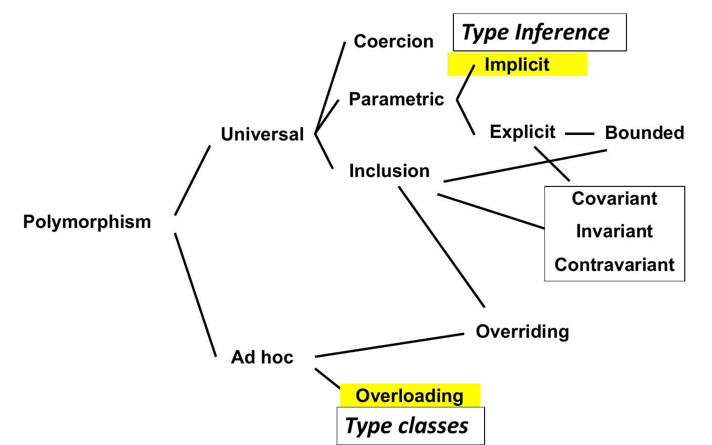

*Figure 9.1 — Polymorphism in Haskell [Haskell p.3, repeated at p.33].*

The same tree as [ch.07 §7.3](07-types-and-polymorphism.md), with the two nodes
Haskell fills in labelled:

- **Implicit parametric** polymorphism ← **type inference**
- **Ad hoc / overloading** ← **type classes**

Haskell therefore occupies the two branches Java does not. Java's parametric
polymorphism is *explicit* (`<T>` is written down) and its ad hoc polymorphism is
overloading resolved by argument types. Haskell infers its type parameters and
handles overloading through a mechanism that, as §9.4 shows, compiles down to
ordinary parametric polymorphism plus an extra argument.

The two nodes are not independent, and that is the whole difficulty of this
chapter: inference wants to determine a type from a body, overloading wants the
type in order to choose a body. §9.2 walks through the failed attempts to have
both.

## 9.2 The problem: overloading under type inference

### Overloading, restated

> - Present in all languages, at least for built-in arithmetic operators: `+`,
>   `*`, `-`, …
> - Sometimes supported for user defined functions (Java, C++, …)
> - C++, Haskell allow overloading of primitive operators
> - The code to execute is determined by the **type of the arguments**, thus
>   - **early binding** in statically typed languages
>   - **late binding** in dynamically typed languages
>
> [Haskell p.4]

The progression from untyped `sqr` through C's two names to Java's overloaded
`sqr` is the same as [ch.07 §7.5](07-types-and-polymorphism.md#75-overloading-ad-hoc-polymorphism)
[Haskell p.5], but the deck ends it with a new question:

> But which type can be inferred by ML/Haskell?
>
>     > sqr x = x * x
>
> [Haskell p.5]

Nothing in `sqr x = x * x` says what `x` is. An inferring compiler must produce a
type, and the only honest answers are either "many types" — which is not a type —
or a type that mentions the requirement that `*` exists.

### The problem is not only arithmetic

> - Some functions are "fully polymorphic"
>
>       length :: [w] -> Int
>
> - Many useful functions are **less polymorphic**
>
>       member :: [w] -> w -> Bool
>
> - Membership only works for types that support **equality**.
>
>       sort :: [w] -> [w]
>
> - List sorting only works for types that support **ordering**.
>
> [Haskell p.6]

This is the essential observation of the chapter. `length` is genuinely universal:
it counts cells and never inspects an element, so `[w] -> Int` is the truth. But
`member` must compare elements and `sort` must order them, so their honest types
are *not* `[w] -> w -> Bool` and `[w] -> [w]` — those claim more generality than
the definitions can deliver. Between "fully polymorphic" and "monomorphic" there
is a middle class of functions that work for *some* types, and neither
conventional polymorphism nor conventional overloading describes it.

### Four failed attempts

The deck works through the alternatives that were actually tried in real
languages.

**Overloading arithmetic, take 1** — let a function with overloaded symbols define
several functions [Haskell p.7]:

```haskell
square x = x * x        -- legal
-- Defines two versions:
-- Int -> Int and Float -> Float
```

but then

```haskell
squares (x,y,z) =
   (square x, square y, square z)
-- There are 8 possible versions!
```

> Approach not widely used because of **exponential growth** in number of
> versions. [Haskell p.7]

Three independent argument positions with two choices each give 2³ = 8
definitions, and the blow-up is multiplicative in the number of overloaded
positions. The approach fails on space, not on soundness.

**Overloading arithmetic, take 2** — overload the primitives but not functions
built from them [Haskell p.8]:

```haskell
3 * 3              -- legal
3.14 * 3.14        -- legal
square x = x * x   -- Int -> Int
square 3           -- legal
square 3.14        -- illegal
```

> Standard ML uses this approach. Not satisfactory: **Programmers cannot define
> functions that implementation might support.** [Haskell p.8]

Here `square` gets *one* type by defaulting, and the user-defined function is
less general than the operator it is built from. The complaint is precise: the
implementation could perfectly well run `square` on a `Float`, but the language
gives no way to say so.

**Overloading equality, take 1** — treat `==` like `+` [Haskell p.9]:

```haskell
3 * 3 == 9             -- legal
'a' == 'b'             -- legal
\x->x == \y->y+1       -- illegal
```

```haskell
member [] y     = False
member (x:xs) y = (x==y) || member xs y
member [1,2,3] 3          -- ok if default is Int
member "Haskell" 'k'      -- illegal
```

> Approach adopted in first version of SML. [Haskell p.9]

Equality is defined only for types that admit it — those not containing function
types or abstract types — but since `member` is defined *using* `==`, it inherits
take 2's problem: `member` gets fixed to one element type.

**Overloading equality, take 2** — make `==` fully polymorphic [Haskell p.10]:

```haskell
(==) :: a -> a -> Bool
member :: [a] -> a -> Bool
```

> Miranda used this approach. But…
>
> - equality applied to a function yields a **runtime error**
> - equality applied to an abstract type compares the **underlying
>   representation**, which violates abstraction principles
>
> [Haskell p.10]

This one is soundly typed and still wrong. Claiming `==` works at every type is a
lie the type checker now cannot catch, so the error resurfaces at runtime — which
is exactly what a static type system exists to prevent. The second bullet is
subtler: comparing representations breaks abstraction, since two values that the
abstraction regards as equal (a set stored in two different orders) compare
unequal.

**Overloading equality, take 3** — restrict the variable [Haskell p.11]:

```haskell
(==) :: a(==) -> a(==) -> Bool
```

where `a(==)` is a type variable restricted to types with equality. Now `member`
can be typed:

```haskell
member :: a(==) -> [a(==)] -> Bool
member 4          [2,3] :: Bool
member 'c'        ['a', 'b', 'c'] :: Bool
member (\y -> y*2) [\x -> x, \x -> x+2] -- type error
```

> Approach used in SML today, where the type `a(==)` is called an **eqtype
> variable** and is written `''a` (while normal type variables are written `'a`).
> [Haskell p.11]

This is the right idea, and the third example shows it working: the function type
is rejected *statically*, where take 2 would have failed at runtime. Its
limitation is that it is hard-wired — `==` is privileged, and there is no way for
a user to introduce an analogous restriction for their own operations.

### What type classes must achieve

> Type classes solve these problems [Haskell p.12]:
>
> - Idea: **Generalize ML's eqtypes to arbitrary types**
> - Provide **concise types** to describe overloaded functions, so **no
>   exponential blow-up**
> - Allow users to **define functions using overloaded operations**, e.g.
>   `square`, `squares`, and `member`
> - Allow users to **declare new collections of overloaded functions**: equality
>   and arithmetic operators are not privileged built-ins
> - **Fit within type inference framework**

Each bullet answers one of the failures: generalising eqtypes answers take 3's
lack of extensibility, conciseness answers take 1's blow-up, defining functions
from overloaded operations answers take 2, and the last bullet is the constraint
that rules out any solution requiring type annotations everywhere.

## 9.3 The intuition: dictionaries

Before the syntax, the deck derives the implementation by hand.

> Consider a function to sort lists [Haskell p.13]:
>
> ```haskell
> qsort:: [a] -> [a]
> qsort [] = []
> qsort (x:xs) = qsort (filter (<= x) xs)
>                ++ [x] ++
>                    qsort (filter (> x) xs)
> ```
>
> It works only for lists whose base type supports comparison (`<=` and `>`).
>
> We can make this constraint **explicit in the signature, adding an argument: a
> comparison operator**
>
> ```haskell
> qsort:: (a -> a -> Bool) -> [a] -> [a]
> qsort cmp [] = []
> qsort cmp (x:xs) = qsort cmp (filter (cmp x) xs)
>                ++ [x] ++
>                    qsort cmp (filter (not.cmp x) xs)
> ```
>
> **No implicit assumption on the base type.**

The move is to turn an implicit requirement into an explicit parameter. The second
`qsort` is honestly `[a] -> [a]` for *every* `a`, because whatever `a`-specific
knowledge it needs is now supplied by the caller. It is genuinely universally
polymorphic — and it works precisely because the ad hoc part was extracted.

The same move on an arithmetic example [Haskell p.14]:

```haskell
parabola x = (x * x) + x
```

```haskell
parabola' (plus, times) x = plus (times x x) x
```

> - The extra parameter is a **"dictionary"** that provides implementations for
>   the overloaded ops.
> - We have to rewrite all calls to pass appropriate implementations for `plus`
>   and `times`:
>
>       y = parabola'(intPlus,intTimes) 10
>       z = parabola'(floatPlus, floatTimes) 3.14
>
> [Haskell p.14]

One definition of `parabola'` now serves both `Int` and `Float`, with no
duplication and no blow-up — the exponential explosion of take 1 is avoided
because the choice is made by an *argument* rather than by generating a version
per combination.

### Doing it systematically


*Figure 9.2 — Dictionary-passing style [Haskell p.15].*

```haskell
-- Dictionary type
data MathDict a = MkMathDict (a->a->a) (a->a->a)

-- Accessor functions
get_plus :: MathDict a -> (a->a->a)
get_plus (MkMathDict p t) = p

get_times :: MathDict a -> (a->a->a)
get_times (MkMathDict p t) = t

-- "Dictionary-passing style"
parabola :: MathDict a -> a -> a
parabola dict x = let plus = get_plus dict
                      times = get_times dict
                  in plus (times x x) x
```

> Type class declarations will generate Dictionary type and selector functions.
> [Haskell p.15]


*Figure 9.3 — Dictionary construction [Haskell p.16].*

```haskell
-- Dictionary type
data MathDict a = MkMathDict (a->a->a) (a->a->a)

-- Dictionary construction
intDict   = MkMathDict intPlus   intTimes
floatDict = MkMathDict floatPlus floatTimes

-- Passing dictionaries
y = parabola intDict   10
z = parabola floatDict 3.14
```

> Type class instance declarations produce instances of the Dictionary. Compiler
> will add a dictionary parameter and rewrite the body as necessary.
> [Haskell p.16]

The three annotations across Figures 9.2 and 9.3 give the whole implementation
scheme in advance, and §9.5 confirms it piece by piece:

| Haskell construct | Generated |
|---|---|
| `class` declaration | dictionary **type** + **selector** functions |
| `instance` declaration | a dictionary **value** |
| qualified type `C a => …` | an extra dictionary **parameter** |

## 9.4 Type classes proper

> **Type Class Design Overview** [Haskell p.17]
>
> - **Type class declarations**
>   - Define a set of operations, give the set a name
>   - Example: `Eq a` type class — operations `==` and `\=` with type
>     `a -> a -> Bool`
> - **Type class instance declarations**
>   - Specify the implementations for a particular type
>   - For `Int` instance, `==` is defined to be integer equality
> - **Qualified types** (or **Type Constraints**)
>   - Concisely express the operations required on otherwise polymorphic type
>
>         member:: Eq w => w -> [w] -> Bool

Three constructs, matching the three rows of the table above. The class names a
group of operations; the instance supplies them for one type; the qualified type
records, in a function's signature, which groups that function needs.


*Figure 9.4 — Class and instance declarations [Haskell p.19].*

```haskell
square :: Num n => n -> n     -- works for any type 'n' that
square x = x*x                -- supports the Num operations

class Num a where             -- says what the Num operations are
   (+)    :: a -> a -> a
   (*)    :: a -> a -> a
   negate :: a -> a
   ...etc...

instance Num Int where        -- says how they are implemented on Ints
   a + b    = intPlus  a b
   a * b    = intTimes a b
   negate a = intNeg a
   ...etc...
```

with `intPlus :: Int -> Int -> Int` and `intTimes :: Int -> Int -> Int` defined as
primitives. Note the division of labour: the class fixes the *signatures*, the
instance fixes the *implementations*, and `square` mentions neither — it names
only the class it depends on. Adding a new numeric type later requires a new
`instance` and no change to `square`.

### Qualified types

> *"for all types `w` that support the `Eq` operations"*
>
>     member :: Eq w => w -> [w] -> Bool
>
> If a function works for every type with particular properties, the type of the
> function **says just that** [Haskell p.18]:
>
> ```haskell
> sort      :: Ord a => [a] -> [a]
> serialise :: Show a => a -> String
> square    :: Num n => n -> n
> squares   ::(Num t, Num t1, Num t2) =>
>                 (t, t1, t2) -> (t, t1, t2)
> ```
>
> Otherwise, it must work for **any** type
>
> ```haskell
> reverse :: [a] -> [a]
> filter :: (a -> Bool) -> [a] -> [a]
> ```

Read `=>` as separating a *constraint* from a *type*. Everything left of `=>` is a
requirement on the type variables; everything right of it is the type proper. The
gloss on the slide — "for all types `w` that support the `Eq` operations" — is the
exact reading.

The contrast at the bottom resolves §9.2's difficulty. `reverse` has no
constraint, so it really is fully polymorphic; `sort` carries `Ord a`, so it is
polymorphic over exactly the ordered types. The middle class of functions now has
a notation, and `squares` shows the conciseness promised in §9.2: three
constraints in one signature rather than eight generated versions.

## 9.5 How the compiler implements it

Three slides, one construct each, with the same `square` in the corner
throughout.

### Qualified types become dictionary parameters


*Figure 9.5 — Compiling overloaded functions [Haskell p.20].*

```haskell
-- you write                     -- compiler generates
square :: Num n => n -> n        square :: Num n -> n -> n
square x = x*x                   square d x = (*) d x x
```

> The "`Num n =>`" turns into an extra **value argument** to the function. It is a
> value of data type `Num n` and it represents a **dictionary** of the required
> operations. [Haskell p.20]

The single most important line in the chapter is the change from `=>` to `->`. A
constraint becomes an argument. After translation there is no overloading left at
all — `square` is an ordinary parametrically polymorphic function of two
arguments. **Ad hoc polymorphism has been compiled into universal polymorphism
plus a parameter.**

### Class declarations become data types and selectors


*Figure 9.6 — Compiling type classes [Haskell p.21].*

```haskell
-- you write                  -- compiler generates
class Num n where             data Num n
  (+)    :: n -> n -> n         = MkNum (n -> n -> n)
  (*)    :: n -> n -> n                (n -> n -> n)
  negate :: n -> n                     (n -> n)
  ...etc...                            ...etc...
                              ...
                              (*) :: Num n -> n -> n -> n
                              (*) (MkNum _ m _ ...) = m
```

> The class decl translates to: a data type decl for `Num`, a selector function
> for each class operation. A value of type `(Num n)` is a **dictionary of the
> `Num` operations for type `n`**. [Haskell p.21]

The class becomes a **record type** with one field per operation, and each
operation becomes a **field selector**. So `(*)` is not a primitive after
translation: it is a function that takes a dictionary and projects out the second
field. The pattern `MkNum _ m _ ...` discards the other fields.

### Instance declarations become dictionary values


*Figure 9.7 — Compiling instance declarations [Haskell p.22].*

```haskell
-- you write                  -- compiler generates
instance Num Int where        dNumInt :: Num Int
  a + b     = intPlus a b     dNumInt = MkNum intPlus
  a * b     = intTimes a b                    intTimes
  negate a = intNeg a                         intNeg
  ...etc...                                   ...
```

> An instance decl for type `T` translates to a **value declaration** for the
> `Num` dictionary for `T`. [Haskell p.22]

The instance is a record *value*, built once and named after the class and type.
Note that `dNumInt` is an ordinary top-level constant — the compiler will supply it
wherever a `Num Int` dictionary is needed.

### The scheme, stated

> **Implementation Summary** [Haskell p.23]
>
> - Each overloaded symbol has to be introduced in at least one type class.
> - The compiler translates each function that uses an overloaded symbol into a
>   function with an **extra parameter: the dictionary**.
> - References to overloaded symbols are rewritten by the compiler to **lookup
>   the symbol in the dictionary**.
> - The compiler converts each **type class declaration** into a dictionary type
>   declaration and a set of selector functions.
> - The compiler converts each **instance declaration** into a dictionary of the
>   appropriate type.
> - The compiler rewrites calls to overloaded functions to pass a dictionary. It
>   uses the **static, qualified type** of the function to select the dictionary.

The final clause is where the binding time is settled: selection uses the static
type, so type classes are **early bound**, like Java's overloading and unlike its
overriding. The dictionary a call site passes is decided at compile time; nothing
is looked up by inspecting a value at runtime.

## 9.6 Composing dictionaries

### Several constraints, several dictionaries


*Figure 9.8 — Functions with multiple dictionaries [Haskell p.24].*

```haskell
squares :: (Num a, Num b, Num c) => (a, b, c) -> (a, b, c)
squares(x,y,z) = (square x, square y, square z)

-- translates to
squares :: (Num a, Num b, Num c) -> (a, b, c) -> (a, b, c)
squares (da,db,dc) (x, y, z) =
                 (square da x, square db y, square dc z)
```

This is the direct answer to take 1's exponential blow-up [Haskell p.7]. Where
that approach generated 8 definitions, there is **one** definition taking three
dictionaries. The eight combinations still exist, but as eight possible *argument
tuples* at call sites, not as eight bodies. Cost moves from code size to a few
extra pointers per call.

### Overloaded functions from overloaded functions

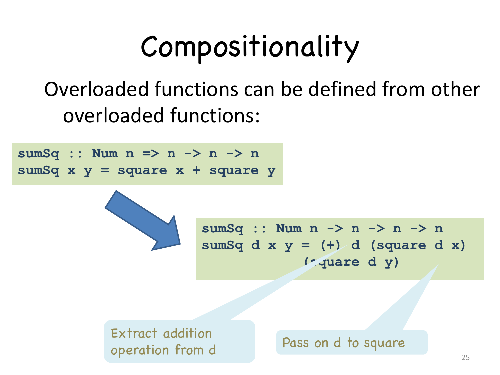

*Figure 9.9 — Compositionality of overloaded functions [Haskell p.25].*

```haskell
sumSq :: Num n => n -> n -> n
sumSq x y = square x + square y

-- translates to
sumSq :: Num n -> n -> n -> n
sumSq d x y = (+) d (square d x)
            (square d y)
```

One dictionary `d` serves two purposes: `(+) d` extracts the addition operation
from it, and `square d` passes it on to the nested overloaded call. This is the
third bullet of §9.2's requirements — users can define functions *using*
overloaded operations, and those functions are themselves overloaded, to any
depth.

### Compound instances

> Build compound instances from simpler ones [Haskell p.26]:
>
> ```haskell
> class Eq a where
>   (==) :: a -> a -> Bool
>
> instance Eq Int where
>   (==) = intEq     -- intEq primitive equality
>
> instance (Eq a, Eq b) => Eq(a,b) where
>   (u,v) == (x,y)     = (u == x) && (v == y)
>
> instance Eq a => Eq [a] where
>   (==) []     []     = True
>   (==) (x:xs) (y:ys) = x==y && xs == ys
>   (==) _      _      = False
> ```

Instances may themselves be *qualified*. `instance Eq a => Eq [a]` says: if you
can compare `a`s, then you can compare lists of `a`s — and gives the recipe. So
`Eq [[Int]]` is obtained by applying the list rule twice to `Eq Int`, with no
declaration written for it.

![The Eq class and the qualified list instance above their translation: a dictionary type data Eq = MkEq, a selector, and dEqList :: Eq a -> Eq [a] defined as a function from a dictionary to a dictionary, building eql by recursion](assets/fig-17-AP25-Haskell-TypeClasses-p27-compound-translation.png)

*Figure 9.10 — Compound translation [Haskell p.27].*

```haskell
data Eq = MkEq (a->a->Bool)    -- Dictionary type
(==) (MkEq eq) = eq            -- Selector

dEqList :: Eq a -> Eq [a]      -- List Dictionary
dEqList d = MkEq eql
  where
    eql []     []     = True
    eql (x:xs) (y:ys) = (==) d x y && eql xs ys
    eql _      _      = False
```

The translation makes the recursion concrete: a qualified instance becomes a
**function from dictionary to dictionary**. `dEqList` takes an `Eq a` dictionary
and returns an `Eq [a]` dictionary, so the compiler builds the dictionary for
`[[Int]]` by evaluating `dEqList (dEqList dEqInt)`. Dictionaries are ordinary
values, so they can be computed like any other.

## 9.7 Using type classes

### The standard classes

> **Many Type Classes** [Haskell p.28]
>
> - `Eq`: equality
> - `Ord`: comparison
> - `Num`: numerical operations
> - `Show`: convert to string
> - `Read`: convert from string
> - `Testable`, `Arbitrary`: testing
> - `Enum`: ops on sequentially ordered types
> - `Bounded`: upper and lower values of a type
> - Generic programming, reflection, monads, …
> - And many more.

"Monads" in that list is [ch.10](10-haskell-monads.md): `Monad` is a type class
like the others, differing only in that its parameter is a type *constructor*.

### Default methods

> Type classes can define **"default methods"** [Haskell p.29]:
>
> ```haskell
> -- Minimal complete definition:
> --     (==) or (/=)
> class Eq a where
>     (==) :: a -> a -> Bool
>     x == y    = not (x /= y)
>     (/=) :: a -> a -> Bool
>     x /= y    = not (x == y)
> ```
>
> Instance declarations can **override** default by providing a more specific
> definition.

Each operation is defined in terms of the other, so an instance need supply only
one and inherit the other — hence "minimal complete definition: `(==)` or
`(/=)`". An instance may still define both, typically for efficiency. Compare
Rust's traits, which have the same concrete-default feature
([ch.05 §5.8](05-rust-ownership-borrowing.md#traits)).

### Deriving

> For `Read`, `Show`, `Bounded`, `Enum`, `Eq`, and `Ord`, the compiler can
> **generate instance declarations automatically** [Haskell p.30]:
>
> ```haskell
> data Color = Red | Green | Blue
>      deriving (Show, Read, Eq, Ord)
>
> Main>:t show
> show :: Show a => a -> String
> Main> show Red
> "Red"
> Main> Red < Green
> True
> Main>:t read
> read :: Read a => String -> a
> Main> let c :: Color = read "Red"
> Main> c
> Red
> ```
>
> **Ad hoc**: derivations apply only to types where derivation code works.

The generated `Ord` instance orders by declaration order, which is why
`Red < Green` is `True`. Note `read :: Read a => String -> a`: the constraint is
on the **result** type, so `read "Red"` cannot be resolved without knowing what
is expected — hence the annotation `c :: Color`. This is a return-type-polymorphic
function, which conventional overloading cannot express at all, since there are no
argument types to dispatch on. Rust's `#[derive]`
([ch.05 §5.8](05-rust-ownership-borrowing.md#system-traits)) is the same
mechanism.

### Numeric literals

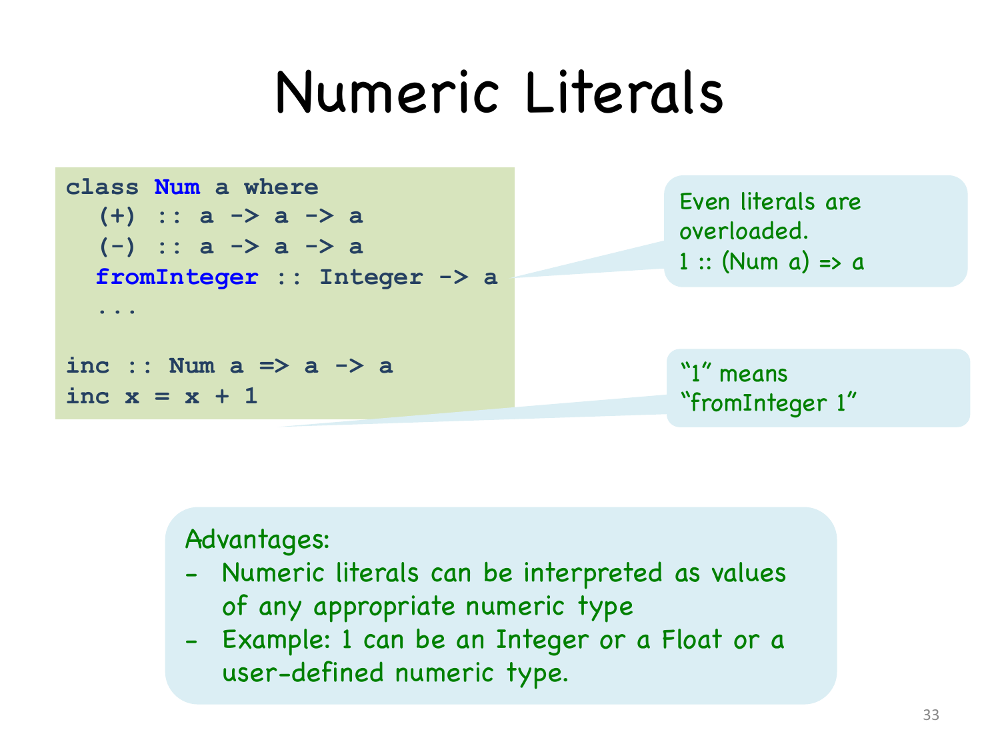

*Figure 9.11 — Numeric literals are overloaded [Haskell p.31].*

```haskell
class Num a where
  (+) :: a -> a -> a
  (-) :: a -> a -> a
  fromInteger :: Integer -> a
  ...

inc :: Num a => a -> a
inc x = x + 1
```

> Even **literals** are overloaded. `1 :: (Num a) => a`. "`1`" means
> "`fromInteger 1`".
>
> Advantages:
>
> - Numeric literals can be interpreted as values of **any appropriate numeric
>   type**
> - Example: `1` can be an `Integer` or a `Float` or a **user-defined numeric
>   type**
>
> [Haskell p.31]

`fromInteger` in the class is what makes this work: the literal `1` is not a value
of a fixed type but a call to a class operation, so it takes whatever numeric type
the context demands. This is why `inc` can stay `Num a => a -> a` — the `1` inside
it is as polymorphic as the `x`. Contrast Rust, which requires type annotations to
disambiguate literals since it has **no** overloading for them
([ch.05 §5.2](05-rust-ownership-borrowing.md#primitive-types)).

### Detecting errors

> Errors are detected when predicates are known **not to hold** [Haskell p.32]:
>
> ```
> Prelude> 'a' + 1
>  <interactive>:33:1: error:
>     • No instance for (Num Char) arising from a use of '+'
>     • In the expression: 1 + 'a'
>       In an equation for 'it': it = 1 + 'a'
>
> Prelude> (\x -> x)
>  <interactive>:34:1: error:
>     • No instance for (Show (p0 -> p0)) arising from a use of 'print'
>         (maybe you haven't applied a function to enough arguments?)
>     • In a stmt of an interactive GHCi command: print it
> ```

Both messages have the form "no instance for *constraint*", which is the
characteristic shape of a type class error: inference succeeded in deriving a
constraint, and no instance satisfies it. The first fails because there is no
`Num Char`. The second is take 2's runtime error from [Haskell p.10] turned into a
compile-time one — printing a function needs `Show (p0 -> p0)`, and no such
instance exists, so what Miranda deferred to runtime GHC rejects statically.

## 9.8 Type checking versus type inference

> - **Standard type checking**:
>
>       int f(int x) { return x+1; };
>       int g(int y) { return f(y+1)*2; };
>
>   - Examine body of each function
>   - Use **declared** types to check agreement
>
> - **Type inference**:
>
>       int f(int x) { return x+1; };
>       int g(int y) { return f(y+1)*2; };
>
>   - Examine code **without** type information. Infer the **most general** types
>     that could have been declared.
>
> ML and Haskell are designed to make type inference feasible.
>
> [Haskell p.34]

The two code blocks are deliberately identical, with the type annotations struck
through in the second. Checking verifies a claim the programmer made; inference
reconstructs the claim from the code. The phrase "most general" is the substantive
requirement — an inference algorithm that returned *some* valid type would be
useless if it returned an unnecessarily specific one.

### Six kinds of type inference

[Haskell pp.35–36]

1. **Rule-based (Local) Type Inference** — the simplest form, deducing the type of
   an expression directly from the types of its operands, using typing rules:
   `x: Int, y: Int ⇒ x + y: Int`. Languages: Java, C, most statically typed
   languages.
2. **Constraint-based (Global) Type Inference** — the compiler collects
   constraints on types throughout a program and solves them simultaneously,
   allowing function types to be inferred without explicit annotations:
   `f x = x + 1 ⇒ f: Int → Int`. Algorithm: **Hindley–Milner (HM)** or its
   extensions. Languages: ML, Haskell, OCaml.
3. **Contextual (Bidirectional) Type Inference** — infers types both bottom-up
   (expression structure) and top-down (expected context); useful for lambdas or
   generic functions: `list.stream().map(x -> x + 1);` where the type of `x` is
   inferred from `List<Integer>`. Languages: Scala, Kotlin, Java (lambdas).
4. **Polymorphic (Generic) Type Inference** — infers type variables and
   quantifiers, allowing generic functions and parametric polymorphism:
   `id x = x ⇒ id: ∀α. α → α`. Languages: Haskell, ML, Rust (for generics).
5. **Flow-sensitive / Type Propagation Inference** — the inferred type of a
   variable may depend on control flow or runtime checks, allowing type narrowing
   in branches, as in `if isinstance(x, int): y = x + 1`. Languages: Python
   (mypy), TypeScript, Kotlin.
6. **Partial / Local Type Inference** [Haskell p.36].

Kind 2 is the one Haskell uses and the one §9.9 implements. Kind 3 is what Java's
lambda parameters use, which is why `x -> x + 1` needs no annotation in a stream
pipeline ([ch.11](11-java-lambdas-streams.md)). Kind 1 is the weakest and is what
"type inference" means in most imperative languages: local, and unable to infer a
function's signature.

---

## 9.9 Appendix: type inference (not lectured)

> [Haskell p.37]: *"The following slides about type inference were not presented
> during the lessons."*
>
> Recorded for completeness. Everything from here to the end of the chapter comes
> from pp.38–65.

### Motivation and history

> Why study type inference? [Haskell p.38]
>
> - Reduces syntactic overhead of expressive types, still allowing for static
>   type checking
> - **Guaranteed to produce most general type**
> - Originally developed for functional languages, now used more and more in any
>   kind of languages
> - Illustrative example of a **flow-insensitive static analysis** algorithm

> **History & Complexity** [Haskell p.39]
>
> - Original type inference algorithm invented by **Haskell Curry and Robert
>   Feys** for the simply typed lambda calculus in **1958**
> - In **1969**, **J. Roger Hindley** extended the algorithm to a richer language
>   and proved it always produced the most general type
> - In **1978**, **Robin Milner** independently developed an equivalent
>   algorithm, called **algorithm W**, during his work designing ML
> - In **1982**, **Luis Damas** proved the algorithm was complete
> - When the Hindley/Milner algorithm was developed its complexity was unknown.
>   In **1989**, **Kanellakis, Mairson and Mitchell** proved the problem was
>   **exponential-time complete**
> - Usually **linear in practice** though — running time is exponential in the
>   **depth of polymorphic declarations**

The gap between exponential-time-complete and linear-in-practice is explained by
the last line: the exponent is the nesting depth of polymorphic `let`s, which in
real programs is small.

### uHaskell

> Subset of Haskell to explain type inference. Haskell and ML both have
> overloading; will not consider overloading now [Haskell p.40]:
>
> ```
> <decl> ::= <name> <pat> = <exp>
> <pat> ::= Id | (<pat>, <pat>) | <pat> : <pat> | []
> <exp> ::= Int | Bool | [] | Id | (<exp>)
>           | <exp> <op> <exp>
>           | <exp> <exp> | (<exp>, <exp>)
>           | if <exp> then <exp> else <exp>
> ```

Overloading is set aside so that plain Hindley–Milner can be presented; §9.9.4
puts it back.

### The basic idea

> Example [Haskell p.41]:
>
>     f x = 2 + x    -- a simple declaration
>
> What is the type of `f`?
>
> - `+` has type `Int → Int → Int` (with overloading it would be
>   `Num a => a → a → a`)
> - `2` has type `Int`
> - Since we are applying `+` to `x` we need `x :: Int`
> - Therefore `f x = 2 + x` has type `Int → Int`
>
>       f x = 2 + x
>       > f :: Int -> Int

### The algorithm

> **Type Inference Algorithm** [Haskell p.49]
>
> - Parse program to build parse tree
> - Assign type variables to nodes in tree
> - Generate constraints:
>   - From environment: constants (`2`), built-in operators (`+`), known
>     functions (`tail`).
>   - From shape of parse tree: e.g., application and abstraction nodes.
> - **Solve constraints using unification**
> - Determine types of top-level declarations

**Step 1: parse** [Haskell p.42]

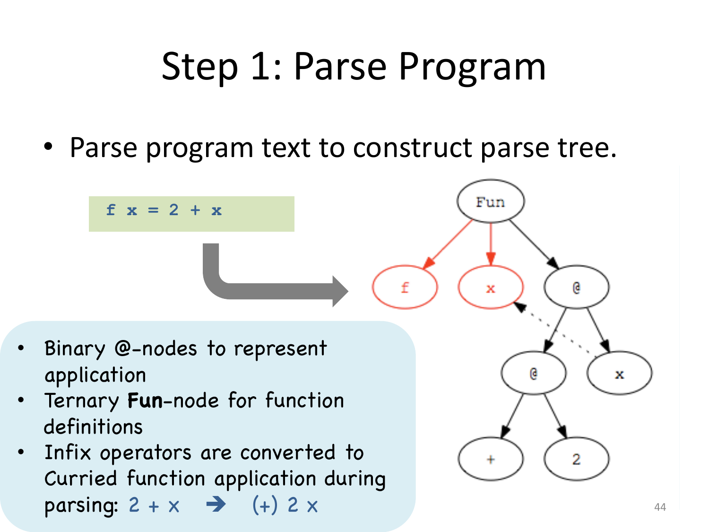

*Figure 9.12 — Parse tree [Haskell p.42].*

> - Binary `@`-nodes to represent application
> - Ternary `Fun`-node for function definitions
> - Infix operators are converted to Curried function application during parsing:
>   `2 + x` → `(+) 2 x`

**Step 2: assign type variables** [Haskell p.43]

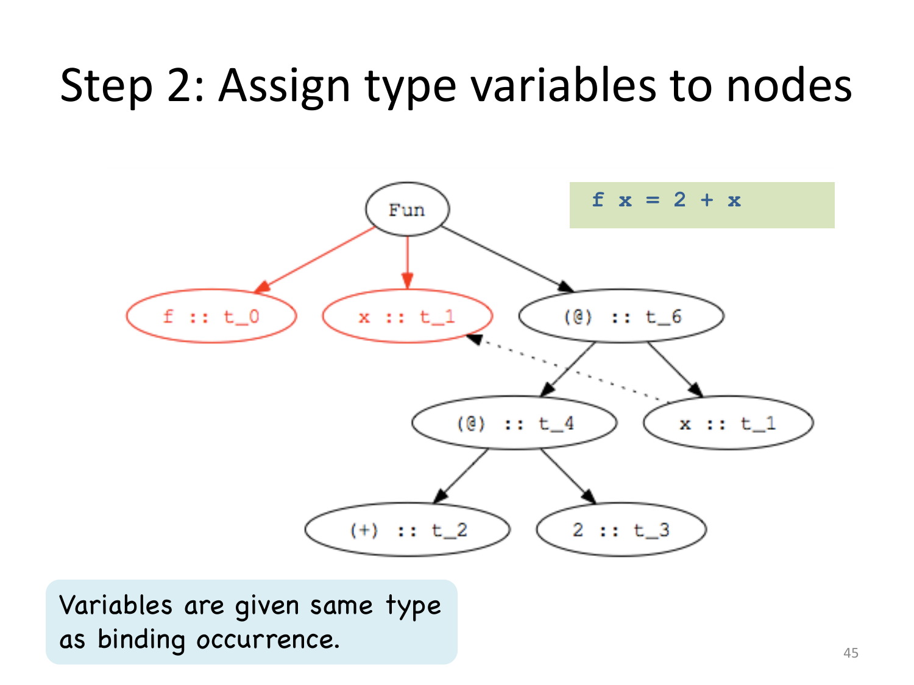

*Figure 9.13 — Type variables assigned to nodes [Haskell p.43].* Variables are
given the same type as their binding occurrence.

**The two structural constraint rules.** For an application `f x` [Haskell p.44]:

> - Type of `f` (`t_0`) must be domain → range
> - Domain of `f` must be type of argument `x` (`t_1`)
> - Range of `f` must be result of application (`t_2`)
> - Constraint: `t_0 = t_1 -> t_2`

For a declaration `f x = e` [Haskell p.45]:

> - Type of `f` (`t_0`) must be domain → range
> - Domain is type of abstracted variable `x` (`t_1`)
> - Range is type of function body `e` (`t_2`)
> - Constraint: `t_0 = t_1 -> t_2`

**Step 3: add constraints** [Haskell p.46]

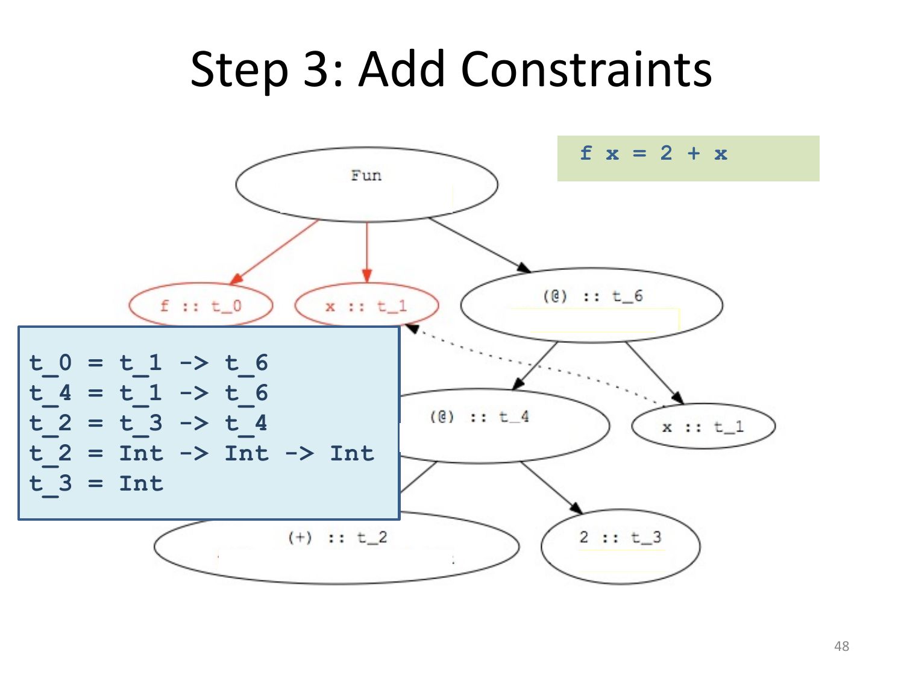

*Figure 9.14 — Constraints generated [Haskell p.46].*

```
t_0 = t_1 -> t_6
t_4 = t_1 -> t_6
t_2 = t_3 -> t_4
t_2 = Int -> Int -> Int
t_3 = Int
```

**Step 4: solve by unification** [Haskell p.47]

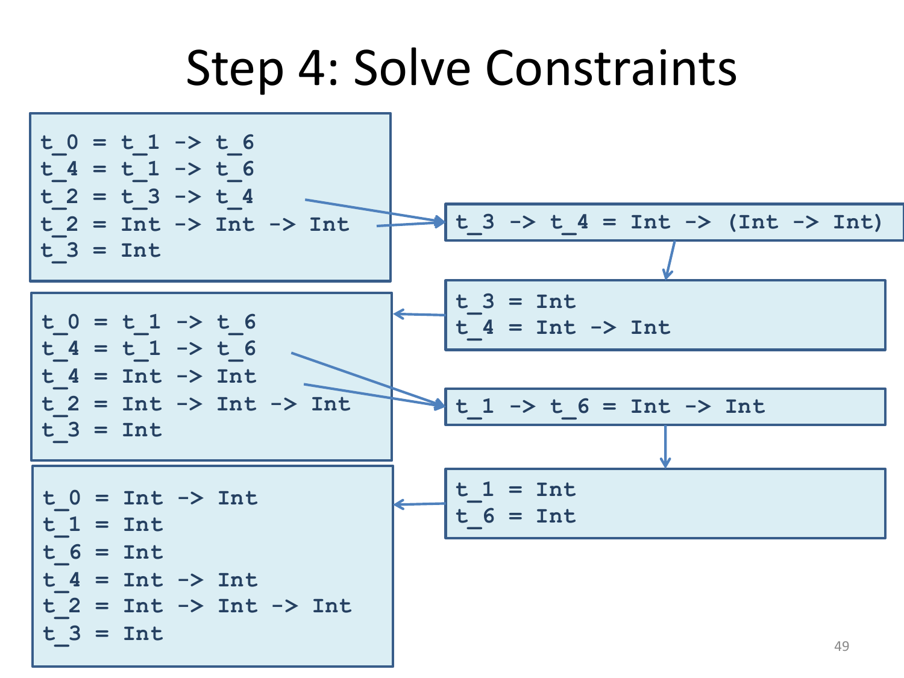

*Figure 9.15 — Solving the constraints [Haskell p.47].*

```
t_3 -> t_4 = Int -> (Int -> Int)     gives  t_3 = Int,  t_4 = Int -> Int
t_1 -> t_6 = Int -> Int              gives  t_1 = Int,  t_6 = Int
```

leaving

```
t_0 = Int -> Int
t_1 = Int
t_6 = Int
t_4 = Int -> Int
t_2 = Int -> Int -> Int
t_3 = Int
```

**Step 5: read off the declaration's type** [Haskell p.48]

    f x = 2 + x
    > f :: Int -> Int

### Polymorphic types

For `f g = g 2` [Haskell pp.50–54]:

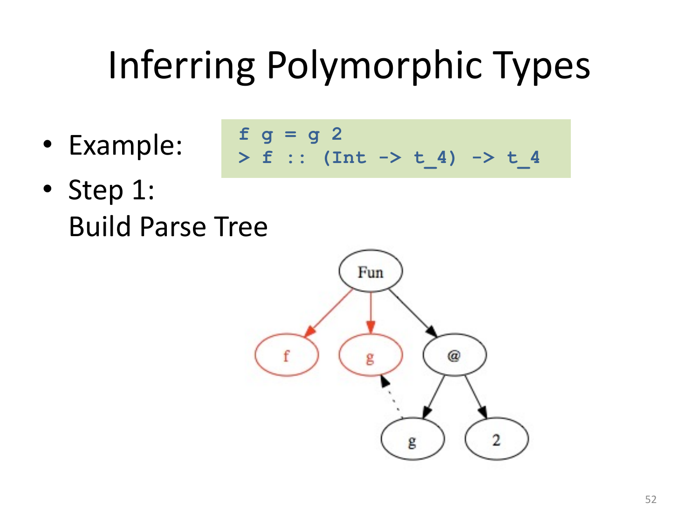

*Figure 9.16 — `f g = g 2`, parse tree [Haskell p.50].*

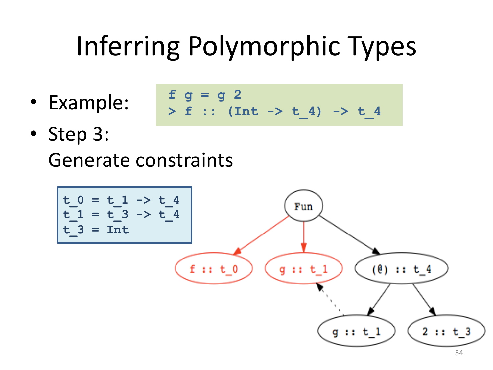

*Figure 9.17 — Constraints for `f g = g 2` [Haskell p.52].*

```
t_0 = t_1 -> t_4
t_1 = t_3 -> t_4
t_3 = Int

solves to
t_0 = (Int -> t_4) -> t_4
t_1 = Int -> t_4
t_3 = Int

> f :: (Int -> t_4) -> t_4
```

> **Unconstrained type variables become polymorphic types.** [Haskell p.54]

`t_4` never appears in a constraint that pins it down, so it is generalised — this
is the step that produces polymorphism. Applications [Haskell p.55]:

```haskell
add x = 2 + x             isEven x = mod (x, 2) == 0
> add :: Int -> Int       > isEven:: Int -> Bool
f add                     f isEven
> 4 :: Int                > True :: Bool
```

### Datatypes and multiple clauses

> Functions may have multiple clauses [Haskell p.56]:
>
>     length [] = 0
>     length (x:rest) = 1 + (length rest)
>
> Type inference:
>
> - Infer separate type for **each clause**
> - Combine by adding constraint that all clauses must have the **same type**
> - **Recursive calls**: function has same type as its definition

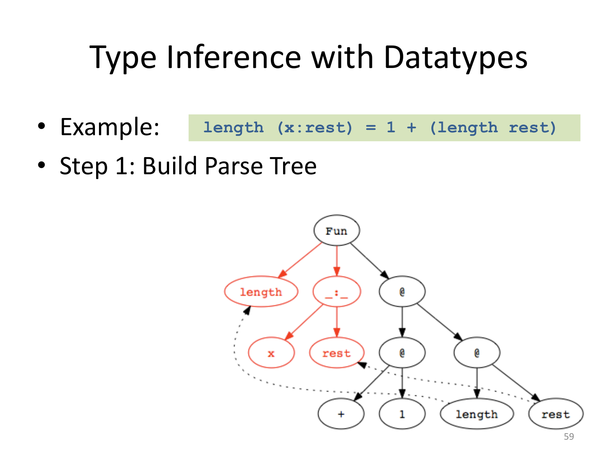

*Figure 9.18 — Parse tree with a datatype pattern [Haskell p.57].*

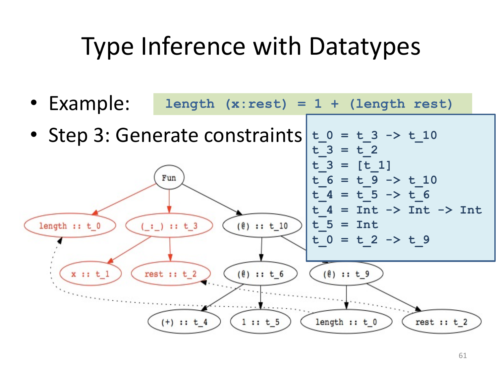

*Figure 9.19 — Constraints for the `length` clause [Haskell p.59].*

```
t_0 = t_3 -> t_10
t_3 = t_2
t_3 = [t_1]
t_6 = t_9 -> t_10
t_4 = t_5 -> t_6
t_4 = Int -> Int -> Int
t_5 = Int
t_0 = t_2 -> t_9

solves to   t_0 = [t_1] -> Int
```

Combining clauses [Haskell p.61]:

```haskell
append ([],r) = r
append (x:xs, r) = x : append (xs, r)

-- First clause:   > append :: ([t_1], t_2) -> t_2
-- Second clause:  > append :: ([t_3], t_4) -> [t_3]
-- Combined:       > append :: ([t_1], [t_1]) -> [t_1]
```

### Most general type

> Type inference produces the **most general type** [Haskell p.62]:
>
> ```haskell
> map (f, [] ) = []
> map (f, x:xs) = f x : map (f, xs)
> > map :: (t_1 -> t_2, [t_1]) -> [t_2]
> ```
>
> Functions may have many **less general** types:
>
> ```haskell
> > map :: (t_1 -> Int, [t_1]) -> [Int]
> > map :: (Bool -> t_2, [Bool]) -> [t_2]
> > map :: (Char -> Int, [Char]) -> [Int]
> ```
>
> Less general types are all **instances** of the most general type, also called
> the **principal type**.

### Inference with overloading

> In presence of overloading (type classes), type inference infers a **qualified
> type `Q => T`** [Haskell p.63]:
>
> - `T` is a Hindley–Milner type, inferred as seen before
> - `Q` is a set of type class predicates, called a **constraint**
>
> ```haskell
> example z xs =
>    case xs of
>      []     -> False
>      (y:ys) -> y > z || (y==z && ys == [z])
> ```
>
> - Type `T` is `a -> [a] -> Bool`
> - Constraint `Q` is `{ Ord a, Eq a, Eq [a]}` —
>   `Ord a` because `y>z`, `Eq a` because `y==z`, `Eq [a]` because `ys == [z]`

> **Simplifying Type Constraints** [Haskell p.64]
>
> Constraint sets `Q` can be simplified:
>
> - Eliminate duplicates — `(Eq a, Eq a)` simplifies to `Eq a`
> - Use an **instance declaration** — if we have `instance Eq a => Eq [a]`, then
>   `(Eq a, Eq [a])` simplifies to `Eq a`
> - Use a **class declaration** — if we have `class Eq a => Ord a where ...`,
>   then `(Ord a, Eq a)` simplifies to `Ord a`
>
> Applying these rules, `(Ord a, Eq a, Eq [a])` simplifies to `Ord a`

Putting it together [Haskell p.65]:

```
T = a -> [a] -> Bool
Q = (Ord a, Eq a, Eq [a])
Q simplifies to Ord a
example :: Ord a => a -> [a] -> Bool
```

The simplification is what makes inferred signatures readable: the raw constraint
set has three predicates, and two of them are consequences of the third — `Eq [a]`
follows from `Eq a` by the list instance, and `Eq a` follows from `Ord a` because
`Eq` is a **superclass** of `Ord`.

---

## Summary

| Concept | Statement | Page |
|---|---|---|
| Haskell's two nodes | implicit parametric ← type inference; ad hoc ← type classes | p.3 |
| The problem | `member`/`sort` are neither fully polymorphic nor monomorphic | p.6 |
| Take 1 | one definition per type combination → **exponential blow-up** | p.7 |
| Take 2 | overload primitives only → user functions cannot be overloaded | p.8 |
| Take 3 (equality) | fully polymorphic `==` → **runtime** errors, breaks abstraction | p.10 |
| Take 4 (eqtype) | restricted variable `a(==)`, SML's `''a` — right idea, not extensible | p.11 |
| Goal | generalize eqtypes, concise types, user-definable classes, fit inference | p.12 |
| Intuition | make the requirement an explicit **dictionary** argument | pp.13–14 |
| `class` | → dictionary **type** + **selector** per operation | p.21 |
| `instance` | → dictionary **value** | p.22 |
| `C a => T` | → extra dictionary **parameter**; `=>` becomes `->` | p.20 |
| Selection | uses the **static, qualified type** — early binding | p.23 |
| Qualified instance | → function from dictionary to dictionary (`dEqList :: Eq a -> Eq [a]`) | p.27 |
| Default methods | class supplies definitions; minimal complete definition | p.29 |
| `deriving` | automatic instances for `Read`, `Show`, `Bounded`, `Enum`, `Eq`, `Ord` | p.30 |
| Literals | `1 :: Num a => a`, meaning `fromInteger 1` | p.31 |
| Errors | "no instance for *constraint*" | p.32 |
| Checking vs inference | verify a declared type vs reconstruct the **most general** one | p.34 |
| Six kinds | rule-based, constraint-based (HM), bidirectional, polymorphic, flow-sensitive, partial | pp.35–36 |
| **HM algorithm** *(not lectured)* | parse → assign variables → generate constraints → unify → read off | p.49 |
| Application rule | `t_0 = t_1 -> t_2` | p.44 |
| Generalisation | unconstrained type variables become polymorphic | p.54 |
| Principal type | the most general type; others are instances of it | p.62 |
| Qualified inference | infer `Q => T`, then simplify `Q` via duplicates, instances, superclasses | pp.63–64 |

## Exam-style checks

1. Why is `length :: [w] -> Int` honest while `member :: [w] -> w -> Bool` is
   not? What class of functions does this gap identify?
2. Take 1 defines one version per type combination. Show that `squares (x,y,z)`
   needs 8, and say how type classes reduce this to one definition.
3. Miranda's fully polymorphic `==` is soundly typed yet criticised on two
   grounds. Give both.
4. What is an eqtype variable, and what does the type-class approach add that
   `''a` does not?
5. Rewrite `parabola x = (x * x) + x` in dictionary-passing style and explain
   what the dictionary parameter buys.
6. State what a `class` declaration, an `instance` declaration, and a `C a =>`
   constraint each compile to.
7. `square :: Num n => n -> n` becomes `square :: Num n -> n -> n`. Explain the
   significance of `=>` becoming `->` for the classification of Figure 9.1.
8. Are type classes early or late bound? Cite the clause of [Haskell p.23] that
   settles it.
9. Explain how the compiler obtains a dictionary for `Eq [[Int]]` given only
   `instance Eq Int` and `instance Eq a => Eq [a]`.
10. Why does `read "Red"` require a type annotation while `show Red` does not?
11. Why is `'a' + 1` rejected with "No instance for `(Num Char)`" rather than a
    type mismatch?
12. *(appendix)* Infer the type of `f g = g 2` by the five steps, and say which
    step introduces polymorphism.
13. *(appendix)* Simplify `(Ord a, Eq a, Eq [a])` to `Ord a`, naming the rule used
    at each step.
