# 10 — Haskell: Laziness, Constructor Classes and Monads

> **Primary:** `lecture_notes/21-AP25-Monads.pdf` (61 pp)
> **Supporting:** `DOCS/25-MonadsInJava_by_MarioFusco.pdf` — *Monadic Java*
> **Notation:** [`NOTATION.md`](../NOTATION.md) §6 — Haskell conventions, the `Monad` class as the deck defines it
> **Cited as:** `[Monads p.n]` by PDF page
> **Continues from:** [09 — Haskell Type Classes](09-haskell-typeclasses.md)

The deck's summary [Monads p.2]: laziness in Haskell, type constructor classes,
`Functor` and `fmap`, towards monads via `Maybe` and partial functions, monads as
containers and as computations, introducing side effects with the IO monad,
control structures on monads.

> **Note on the `Monad` class.** The deck defines `Monad` with `return`, `>>=`
> and `>>`. Modern GHC makes `Applicative` a superclass of `Monad` and defines
> `return = pure`. This chapter uses the deck's form throughout.

---

## 10.1 Laziness

> In programming, **laziness** (or **lazy evaluation**) means that expressions are
> **not evaluated until their values are actually needed**.
>
> **Pros**: programs can
>
> - avoid unnecessary computations,
> - handle (potentially) infinite data structures, and
> - improve efficiency by delaying or skipping work.
>
> **Cons**:
>
> - unpredictable performance
> - unpredictable memory usage
> - debugging and profiling difficulty
> - **interfacing with side effects (like I/O) requires special handling**
>
> [Monads p.3]

The last "con" is the thread that runs through this whole chapter. Laziness means
the programmer no longer controls *when* an expression is evaluated, and side
effects are precisely operations for which the timing matters. §10.5 onwards is
the resolution.

### Laziness in other languages

> Most languages have built-in forms of lazy evaluation (`if-then-else`, `&&`,
> `||` — shortcut operators) [Monads p.4]:
>
> ```c
> if (x != 0) return y/x; else return 0; //ok
> bool b = (x !=0 && y/x > 5); //ok
> bool b = (x !=0 & y/x > 5); //no
> ```
>
> but laziness does **not lift to user-defined functions**
>
> ```c
> int choose(bool e1, bool e2){
>    if (e1 && e2) return 0; else return 1;
> }
> choose(x!=0, y/x > 5) //no
> ```

The difference between `&&` and `&` is exactly laziness: `&&` does not evaluate
its right operand when the left is false, `&` does. So the first two lines are
safe when `x == 0` and the third divides by zero.

`choose` shows why this is a language-level limitation rather than a library one.
The body uses `&&`, so it *would* short-circuit — but the arguments are evaluated
**before** the call under call-by-value, so `y/x` is computed regardless. A
strict language cannot let users define their own short-circuiting operators.

### Evaluation orders in λ-calculus


*Figure 10.1 — Applicative and normal order evaluation in λ-calculus
[Monads p.5].*

β-conversion in λ-calculus: `(λx.t) t' = t [t'/x]`.

> - **Applicative Order evaluation** — arguments are evaluated before applying the
>   function; aka **eager** evaluation, parameter passing **by value**
> - **Normal Order evaluation** — function evaluated first, arguments if and when
>   needed; sort of parameter passing **by name**; some evaluation can be
>   **repeated**
> - **Church–Rosser**:
>   - If evaluation terminates, the result (normal form) is **unique**
>   - If **some** evaluation terminates, **normal order** evaluation terminates
>
> [Monads p.5]

The worked examples make the difference concrete. With `Ω = (λx.x x)`:

```
ΩΩ = (λx.x x) (λx.x x)  →  x x [(λx.x x)/x]  →  (λx.x x) (λx.x x) = ΩΩ  →  … non-terminating
```

so `ΩΩ` diverges. Then

```
(λx. 0) (ΩΩ)   →  {Applicative order}  … non-terminating
(λx. 0) (ΩΩ)   →  {Normal order}       0
```

Applicative order evaluates the argument first and never returns. Normal order
substitutes the argument into a body that discards it, so the divergent term is
never touched. The second Church–Rosser property is the general statement of this:
normal order is the **most terminating** strategy — if any order gives an answer,
normal order does.

The other example shows the cost:

```
Applicative order              Normal order
(λx.(+ x x)) (+ 3 2)           (λx.(+ x x)) (+ 3 2)
→ (λx.(+ x x)) 5               → (+ (+ 3 2) (+ 3 2))
→ (+ 5 5)                      → (+ 5 (+ 3 2))
→ 10                           → (+ 5 5)
                               → 10
```

Normal order duplicated `(+ 3 2)` and computed it twice — the "some evaluation can
be repeated" of the second bullet. That waste is what §10.1.3's memoization fixes.

### Laziness in Haskell

> - Haskell is a **lazy** language
> - **Infinite data structures** can be defined easily
> - Parameter passing is **Call by Need**: normal order evaluation **+
>   memoization**
> - **Lazy operators can be defined easily**
>
> ```haskell
> cond True t e = t
> cond False t e = e
> cond :: Bool -> a -> a -> a
> cond True [] [1..]   => []
> ```
>
> ```haskell
> (||) :: Bool -> Bool -> Bool     -- short-circuiting "or"
> True || x = True
> False || x = x
> ```
>
> [Monads p.6]

**Call by need = normal order + memoization** is the key definition. Normal order
gives the termination properties of Figure 10.1; memoization means a delayed
expression, once forced, is evaluated at most once — recovering applicative
order's efficiency without its strictness.

The two examples are the payoff denied to C in §10.1.1. `cond True [] [1..]`
returns `[]` without evaluating the infinite list `[1..]`; and `||` is an ordinary
user-level function definition that nonetheless short-circuits, because
`True || x = True` never uses `x`.

### Binding variables

> - Variables (names) are bound to **expressions, without evaluating them**
>   (because of lazy evaluation)
> - The scope of the binding is the rest of the session
>
> [Monads p.7]

| Haskell | OCaml |
|---|---|
| `Prelude> let a = 6` — no output | `# let a = 6 ;;` → `val a : int = 6` |
| `Prelude> b = a + 2` — `let` optional | `# let b = a + 2 ;;` → `val b : int = 8` |
| `Prelude> b` — now `b` is evaluated → `8` | `# b ;;` → `- : int = 8` |
| `Prelude> a = a + 1` — no output | `# let a = a + 1 ;;` → `val a : int = 7` |
| `Prelude> a` → `^CInterrupted. – loop broken` | |

The last row is the instructive one. OCaml evaluates `a + 1` at binding time using
the *old* `a`, giving `7`. Haskell binds `a` to the unevaluated expression
`a + 1`, in which `a` refers to the new binding — so forcing it loops forever.
Lazy binding makes definitions **recursive by default**, which is what you want
for `ones = 1 : ones` and a trap for shadowing.

## 10.2 Type constructor classes

> - Type Classes are **predicates over types**
> - [Type] **Constructor Classes** are **predicates over type constructors**
> - Allow to define overloaded functions common to several type constructors
>
> [Monads p.8]

The motivating observation is that `map` has an analogue on many types
[Monads pp.8–9]:

```haskell
map :: (a -> b) -> [a] -> [b]
map f [] = []
map f (x:xs) = f x : map f xs
> map (\x->x+1) [1,2,4]
[2,3,5]
```

```haskell
data Tree a = Leaf a | Node(Tree a, Tree a)
    deriving Show

mapTree :: (a -> b) -> Tree a -> Tree b
mapTree f (Leaf x) = Leaf (f x)
mapTree f (Node(l,r)) = Node (mapTree f l, mapTree f r)

> t1 = Node(Node(Leaf 3, Leaf 4), Leaf 5)
> mapTree (\x->x+1) t1
Node (Node (Leaf 4,Leaf 5),Leaf 6)
```

```haskell
data Maybe a = Nothing | Just a
 deriving Show

mapMaybe :: (a -> b) -> Maybe a -> Maybe b
mapMaybe f Nothing = Nothing
mapMaybe f (Just x) = Just (f x)

> o1 = Just 10
> mapMaybe (\x->x+1) o1
Just 11
```

> All `map` functions share the same structure [Monads p.10]:
>
> ```haskell
> map        :: (a -> b) -> [a] -> [b]
> mapTree    :: (a -> b) -> Tree a -> Tree b
> mapMaybe   :: (a -> b) -> Maybe a -> Maybe b
> ```
>
> They can all be written as:
>
> ```haskell
> fmap:: (a -> b) -> g a -> g b
> ```
>
> where `g` is `[-]` for lists, `Tree` for trees, and `Maybe` for options.
>
> Note that **`g` is a function from types to types, i.e. a type constructor**.

This is the step that requires a new kind of abstraction. In
[ch.09](09-haskell-typeclasses.md) a class quantified over a *type* — `Eq a`
ranges over `Int`, `Char`, and so on. Here the thing that varies is `g`, and its
instances are `[]`, `Tree`, `Maybe` — none of which is a type. `[]` is not a type;
`[Int]` is. `g` ranges over **type constructors**, functions from types to types,
so the class abstracts at one level up.

### `Functor`

> This pattern can be captured in a constructor class `Functor` [Monads p.11]:
>
> ```haskell
> class Functor g where
>   fmap :: (a -> b) -> g a -> g b
> ```
>
> A constructor class is simply a type class where the predicate is over a **type
> constructor** rather than on a type. Compare with the definition of a standard
> type class:
>
> ```haskell
> class Eq a where
>   (==) :: a -> a -> Bool
> ```

Note the syntax is *identical* — nothing marks `Functor` as different. What
distinguishes it is how the parameter is used: `g` appears applied to another type
(`g a`), which forces it to be a constructor, whereas `a` in `Eq a` stands alone.

Instances [Monads p.12]:

```haskell
class Functor f where
  fmap :: (a -> b) -> f a -> f b

instance Functor [] where       -- [] is an instance of Functor
  fmap f [] = []
  fmap f (x:xs) = f x : fmap f xs

instance Functor Tree where     -- Tree is an instance of Functor
  fmap f (Leaf x) = Leaf (f x)
  fmap f (Node(t1,t2)) = Node(fmap f t1, fmap f t2)

instance Functor Maybe where    -- Maybe is an instance of Functor
  fmap f (Just s) = Just(f s)
  fmap f Nothing = Nothing
```

or, more briefly, by reusing the existing definitions [Monads p.13]:

```haskell
instance Functor [] where
  fmap = map
instance Functor Tree where
  fmap = mapTree
instance Functor Maybe where
  fmap = mapMaybe
```

and then one overloaded symbol serves all three [Monads p.14]:

```
*Main> fmap (\x->x+1) [1,2,3]
[2,3,4]
it :: [Integer]
*Main> fmap (\x->x+1) (Node(Leaf 1, Leaf 2))
Node (Leaf 2,Leaf 3)
it :: Tree Integer
*Main> fmap (\x->x+1) (Just 1)
Just 2
it :: Maybe Integer
```

> The `Functor` constructor class is part of the standard Prelude for Haskell.
> [Monads p.14]

The dictionary translation of [ch.09 §9.5](09-haskell-typeclasses.md#95-how-the-compiler-implements-it)
applies unchanged: `fmap` takes a hidden `Functor g` dictionary and projects out
the single operation. Nothing new is needed in the implementation.

## 10.3 Towards monads

> - Often type constructors can be thought of as defining **"boxes"** for values
> - Functors with `fmap` allow to **apply functions inside "boxes"**
> - **Monad** is a constructor class introducing operations for
>   - Putting a value **into** a "box" (`return`)
>   - **Compose** functions that return "boxed" values (`bind`)
> - "Monads" are type constructors that are **instances of `Monad`**
>
> [Monads p.15]

The three bullets identify what `Functor` cannot do. `fmap` applies an
`a -> b` inside a box, giving `g b`. But a function that *itself* produces a box —
`a -> g b` — cannot be used with `fmap`: the result would be `g (g b)`, a box in a
box. Composing such functions is precisely what `bind` is for, and `return` is
what gets a plain value into a box in the first place.

### `Maybe` and partial functions

> Type constructor: a generic type with one or more type variables [Monads p.16]
>
> ```haskell
> data Maybe a = Nothing | Just a
> ```
>
> - A value of type `Maybe a` is a **possibly undefined value** of type `a`
> - A function `f :: a -> Maybe b` is a **partial function** from `a` to `b`
>
> ```haskell
> max [] = Nothing
> max (x:xs) = Just
>             (foldr (\y z -> if y > z then y else z) x xs)
> max :: Ord a => [a] -> Maybe a
> ```

Reading `a -> Maybe b` as a partial function is the interpretive move that makes
the rest work: `Nothing` is "undefined here", `Just y` is "defined, with value
`y`". `max` is partial because the maximum of an empty list does not exist.

### The problem: composing partial functions

> ```haskell
> father :: Person -> Maybe Person   -- partial function
> mother :: Person -> Maybe Person   -- (lookup in a DB)
>
> maternalGrandfather :: Person -> Maybe Person
> maternalGrandfather p =
>     case mother p of
>         Nothing -> Nothing
>         Just mom -> father mom   -- Nothing or a Person
> ```
>
> [Monads p.17]

One composition already needs a `case`. Two get unmanageable:

```haskell
bothGrandfathers :: Person -> Maybe (Person, Person)
bothGrandfathers p =
    case father p of
        Nothing -> Nothing
        Just dad ->
            case father dad of
                Nothing -> Nothing
                Just gf1 ->                     -- found first grandfather
                    case mother p of
                        Nothing -> Nothing
                        Just mom ->
                            case father mom of
                                Nothing -> Nothing
                                Just gf2 ->     -- found second grandfather
                                    Just (gf1, gf2)
```

Four lookups produce four nested `case`s and four identical `Nothing -> Nothing`
lines. The *interesting* content is one line at the bottom; everything else is
plumbing that repeats the same undefinedness-propagation.

### `bind`

> We introduce a **higher order operator** to compose partial functions in order
> to **"propagate" undefinedness automatically** [Monads p.18]:
>
> ```haskell
> y >>= g   = case y of         -- y "bind" g
>                Nothing -> Nothing
>                Just x -> g x
>
> (>>=) :: Maybe a -> (a -> Maybe b) -> Maybe b
> ```
>
> The bind operator will be part of the definition of a monad.

The definition is exactly the repeated `case` from above, written **once**. Read
the type as: given a possibly-undefined `a` and a partial function from `a` to
`b`, produce a possibly-undefined `b`.

The rewrite [Monads p.19]:

```haskell
maternalGrandfather p = mother p >>= father

bothGrandfathers :: Person -> Maybe(Person, Person)
bothGrandfathers p =
       father p >>=
           (\dad -> father dad >>=
               (\gf1 -> mother p >>=
                    (\mom -> father mom >>=
                        (\gf2 -> return (gf1,gf2) ))))
```

`maternalGrandfather` has become a one-line composition. `bothGrandfathers` is
still nested, but the nesting is now lambdas rather than `case`s, and the
`Nothing` cases have vanished entirely — each `>>=` handles them. §10.4 removes the
remaining syntactic noise.

### The `Monad` class

> ```haskell
> class Monad m where
>         return :: a -> m a
>         (>>=) :: m a -> (a -> m b) -> m b   -- "bind"
>          ... -- + something more
> ```
>
> - `m` is a **type constructor**
> - `m a` is the type of **monadic values**
>
> ```haskell
> instance Monad Maybe where
>         return :: a -> Maybe a
>         return x = Just x
>         (>>=) :: Maybe a -> (a -> Maybe b) -> Maybe b
>         y >>= g = case y of
>                      Nothing -> Nothing
>                      Just x -> g x
> ```
>
> bind (`>>=`) shows how to **"propagate" undefinedness**.
>
> [Monads p.20]

`Monad` is a constructor class exactly like `Functor` — the parameter `m` appears
applied, as `m a`. For `Maybe`, `return` is `Just` and `>>=` is the propagation
operator just derived.

### `do` notation

> **Alternative, imperative-style syntax: `do`** [Monads p.21]
>
> ```haskell
> bothGrandfathers p = do {        bothGrandfathers p = do
>        dad <- father p;                 dad <- father p
>        gf1 <- father dad;               gf1 <- father dad
>        mom <- mother p;                 mom <- mother p
>        gf2 <- father mom;               gf2 <- father mom
>        return (gf1, gf2);               return (gf1, gf2)
>      }
> ```
>
> **`do` syntax is just syntactic sugar for `>>=`.**

Compare with the four nested `case`s of §10.3.2. The `do` block is the same
computation, and it reads like imperative code — but `<-` is not assignment, it is
the binding of a lambda parameter under a `>>=`. Every `Nothing` short-circuit is
still there, supplied by `Maybe`'s bind. §10.6.5 gives the desugaring rules.

## 10.4 Two readings of `Monad`

### Monads as containers

> ```haskell
> class Monad m where -- definition of Monad type class
>         return :: a -> m a
>         (>>=) :: m a -> (a -> m b) -> m b   -- "bind"
>          ... -- + something more + a few axioms
> ```
>
> The monadic constructor can be seen as a **container**: let's see this for
> lists. **Getting bind from more basic operations** [Monads p.22]:
>
> ```haskell
> map :: (a -> b) -> [a] -> [b] -- seen. "fmap" for Functors
>
> return :: a -> [a] -- container with single element
> return x = [x]
>
> concat :: [[a]] -> [a] -- flattens two-level containers
>        -- Example: concat [[1,2],[],[4]] = [1,2,4]
>
> (>>=) :: [a] -> (a -> [b]) -> [b]
> xs >>= f = concat(map f xs)
> ```
>
> Exercise: define `map` and `concat` using `bind` and `return`.

This decomposition is the container reading in one line. `map f xs` applies a
box-producing function to every element, giving `[[b]]` — the doubled box
identified in §10.3. `concat` flattens it. So **bind = map then flatten**, and the
"something more" in the class is the map/flatten structure that `Functor` already
supplied half of.

Note that `return x = [x]` is the single-element container — the smallest box
holding `x`.

### Monads as computations

> ```haskell
> class Monad m where -- definition of Monad type class
>         return :: a -> m a
>         (>>=) :: m a -> (a -> m b) -> m b   -- "bind"
>         (>>)   :: m a -> m b -> m b         -- "then"
>          ... -- + something more + a few axioms
> ```
>
> - A value of type `m a` is a **"computation returning a value of type `a`"**
> - For any value, there is a computation which **"does nothing"** and produces
>   that result. This is given by function `return`
> - Given two computations `x` and `y`, one can form the computation `x >> y`
>   which intuitively **"runs" `x`, throws away its result, then runs `y`**
>   returning its result
> - Given computation `x`, we can **use its result to decide what to do next**.
>   Given `f: a -> m b`, computation `x >>= f` runs `x`, then applies `f` to its
>   result, and runs the resulting computation.
>
> Note that we can define `then` using `bind`:
>
> ```haskell
> x >> y = x >>= (\_ -> y)
> ```
>
> [Monads p.23]

The same three operations, read as control flow rather than data. `return` is the
trivial computation; `>>` is sequencing; `>>=` is sequencing *with* a
data dependency, since the second computation is chosen using the first's result.
`>>` is definable from `>>=` by discarding the value with `\_ ->`, so it is a
convenience, not extra power.

This reading is what makes `do` notation more than a trick: a `do` block genuinely
is a sequence of computations, and `<-` genuinely does name the result of one for
use by the rest.

> - `return`, `bind` and `then` define **basic ways to compose computations**
> - They are used in Haskell libraries to define more complex composition
>   operators and control structures (`sequence`, for-each loops, …)
> - **If a type constructor defining a library of computations is monadic, one
>   gets automatically benefit of such libraries**
>
> Example: **MAYBE**
> - `f: a -> Maybe b` is a **partial function**
> - bind applies a partial function to a possibly undefined value, **propagating
>   undefinedness**
>
> Example: **LISTS**
> - `f: a -> [b]` is a **non-deterministic function**
> - bind applies a non-deterministic function to a list of values, **collecting
>   all possible results**
>
> Example: Parsing, handling errors, IO, backtracking…
>
> [Monads p.24]

The third bullet is the practical argument for the abstraction: `sequence`, `for`
and the rest (§10.6.6) are written once against the class and work for every
instance. Implementing `return` and `>>=` for a new type constructor buys the
whole library.

The two examples show how much interpretation the same two operations support.
For `Maybe`, bind propagates failure. For lists, `a -> [b]` is a
*non-deterministic* function — one input, several possible outputs — and
`concat(map f xs)` collects every result of every choice. Same operator, entirely
different computational idea.

### The standard monads

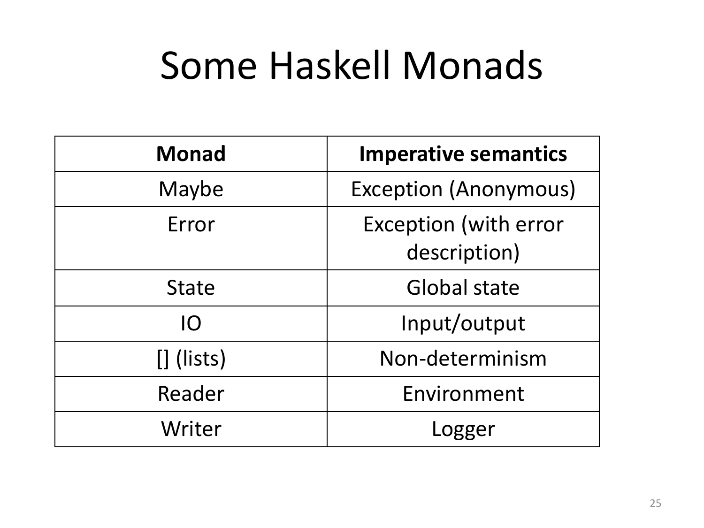

*Figure 10.2 — Some Haskell monads [Monads p.25].*

| Monad | Imperative semantics |
|---|---|
| `Maybe` | Exception (anonymous) |
| `Error` | Exception (with error description) |
| `State` | Global state |
| `IO` | Input/output |
| `[]` (lists) | Non-determinism |
| `Reader` | Environment |
| `Writer` | Logger |

The right-hand column is the point: each of these is a language *feature* in an
imperative language, and here each is a library type constructor. Exceptions,
mutable state, I/O and logging are not built into Haskell — they are monads.

## 10.5 Why side effects are a problem

### What functional programming gets right

> **Functional programming is beautiful** [Monads p.27]:
>
> - Concise and powerful abstractions — higher-order functions, algebraic data
>   types, parametric polymorphism, principled overloading, …
> - Close correspondence with mathematics
>   - Semantics of a code function **is** the mathematical function
>   - **Equational reasoning**: if `x = y`, then `f x = f y`
>   - Independence of order-of-evaluation (**Confluence**, aka Church–Rosser)

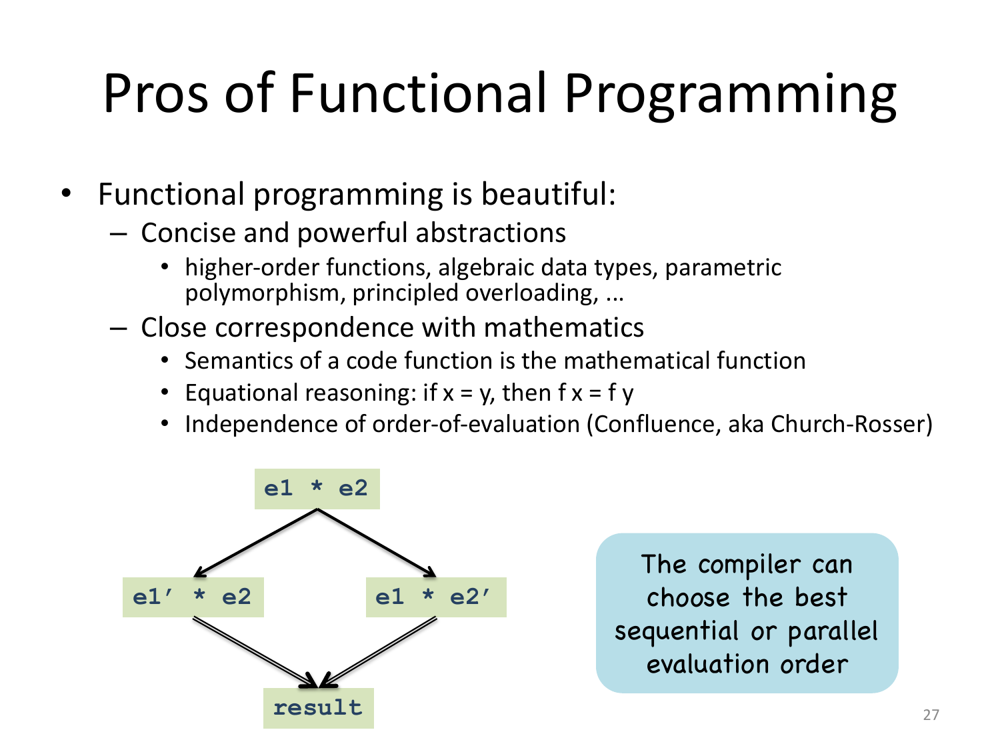

*Figure 10.3 — Confluence [Monads p.27].*

The diamond is the Church–Rosser property of Figure 10.1 drawn as a picture:
reducing `e1` first or `e2` first converges on the same result. The consequence
noted on the slide is practical — **the compiler can choose the best sequential or
parallel evaluation order**, because the answer does not depend on the choice.

Everything in that list depends on purity. Equational reasoning fails the moment
`f` has an effect, since two calls with equal arguments need not behave alike.

### But programs must interact

> But to be useful, a language must be able to manage **"impure features"**
> [Monads p.28]:
>
> - Input/Output
> - Imperative update
> - Error recovery (e.g. timeout, divide by zero, etc.)
> - Foreign-language interfaces
> - Concurrency control
>
> **The whole point of running a program is to interact with the external
> environment and affect it.**

### The direct approach, and why laziness rules it out

> Just add imperative constructs "the usual way" [Monads p.29]:
>
> - I/O via "functions" with side effects: `putchar 'x' + putchar 'y'`
> - Imperative operations via assignable reference cells:
>
>       z = ref 0; z := !z + 1;
>       f(z);
>       w = !z    (* What is the value of w? *)
>
> - Error recovery via exceptions
> - Foreign language procedures mapped to "functions"
> - Concurrency via operating system threads
>
> Can work **if language determines evaluation order** — OCaml, Standard ML are
> good examples of this approach.

> **But what if we are "lazy"?** In a lazy functional language, like Haskell, the
> order of evaluation is **undefined** [Monads p.30]:
>
> - `res = putchar 'x' + putchar 'y'` — output depends upon the evaluation order
>   of `(+)`.
> - `ls = [putchar 'x', putchar 'y']` — output depends on how the list is used.
>   If only used in `length ls`, **nothing will be printed**, because `length`
>   does not evaluate elements of the list.

The two examples show effects becoming unpredictable in two different ways.
`putchar 'x' + putchar 'y'` prints `xy` or `yx` depending on which operand `(+)`
forces first — and by Church–Rosser the compiler is entitled to choose either. The
list example is worse: whether the effect happens *at all* depends on what a
*consumer* does with the list. Laziness and unrestricted side effects are simply
incompatible.

> **Fundamental question**: Is it possible to add imperative features **without
> changing the meaning of pure Haskell expressions**?
>
> **Yes!** Exploiting the concept of monad. The IO monad defines monadic values
> which are called **actions**, and prescribes how to **compose them
> sequentially**.
>
> [Monads p.31]

## 10.6 The IO monad

> A functional program defines a pure function, with no side effects — but the
> whole point of running a program is to have some side effect. *The term "side
> effect" itself is misleading.* [Monads p.32]

### What came before

> **Before Monads** [Monads p.33]:
>
> - **Streams** — a program sends a stream of requests to the OS, receives a
>   stream of responses
> - **Continuations** — user supplies continuations to I/O routines to specify how
>   to process results
> - The Haskell 1.0 Report adopted the **Stream model**; stream and continuation
>   models were proved to be **inter-definable**

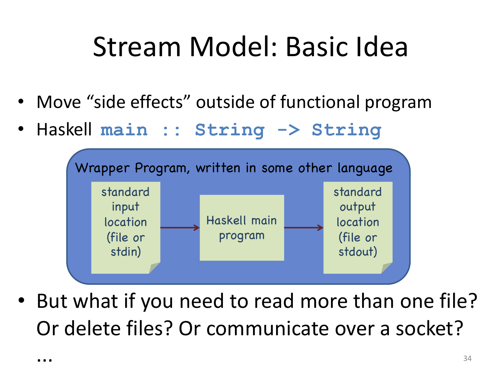

*Figure 10.4 — The stream model, basic idea [Monads p.34].*

> **Move "side effects" outside of functional program.** Haskell
> `main :: String -> String`, with a wrapper program written in some other
> language connecting standard input to standard output.
>
> But what if you need to read more than one file? Or delete files? Or communicate
> over a socket?
>
> [Monads p.34]

The answer was to enrich the types [Monads p.35]:

```haskell
main :: [Response] -> [Request]

data Request = ReadFile Filename
       | WriteFile FileName String
       | …

data Response = RequestFailed
       | ReadOK String
       | WriteOk
       | Success | …
```

with the wrapper interpreting requests and adding responses to the input.

![Diagram showing a Haskell program with a [Response] list flowing in and a [Request] list flowing out](assets/fig-21-AP25-Monads-p36-slide.png)

*Figure 10.5 — The stream model and its problems [Monads p.36].*

> - **Problem**: Laziness allows the program to generate requests **prior to
>   processing any responses**.
> - **Hard to extend** — new I/O operations require adding new constructors to
>   `Request` and `Response` types, modifying the wrapper
> - **Does not associate `Request` with `Response`** — easy to get
>   "out-of-step", which can lead to **deadlock**
> - **Not composable** — no easy way to combine two "main" programs
> - … and other problems!!!
>
> [Monads p.36]

The third problem is the fatal one: the correspondence between the *n*-th request
and the *n*-th response is a convention the type system does not enforce, so
getting out of step is a silent error rather than a type error.

### The key ideas

> **Monadic I/O: The Key Ideas** [Monads p.37]
>
> - `IO` is a **type constructor**, instance of `Monad`
> - A value of type `(IO t)` is a **computation or "action"** that, when
>   performed, may do some input/output before delivering a result of type `t`
> - `return` returns the value **without making I/O**
> - `then` (`>>`) [and also `bind` (`>>=`)] composes two actions **sequentially**
>   into a larger action
> - The **only** way to perform an action is to call it at some point, directly or
>   indirectly, from `Main.main`

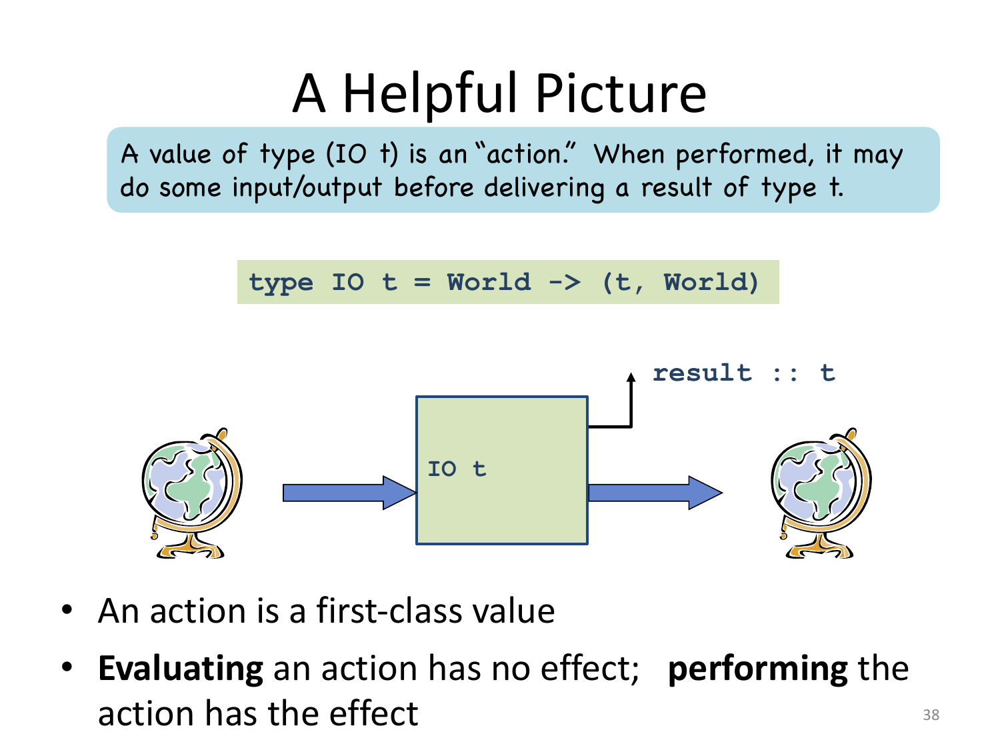

*Figure 10.6 — A helpful picture [Monads p.38].*

    type IO t = World -> (t, World)

> - An action is a **first-class value**
> - **Evaluating** an action has **no effect**; **performing** the action has the
>   effect
>
> [Monads p.38]

The last bullet is the whole solution to §10.5's problem. An `IO t` is a *value*
describing an effect, not the effect itself. Laziness can evaluate it, duplicate
it, put it in a list, never force it — none of that performs any I/O. Purity is
untouched, and the examples of [Monads p.30] are no longer ambiguous: `[putchar
'x', putchar 'y']` is a list of two harmless values.

The type synonym explains where sequencing comes from. An action is a function
from a `World` to a result *and a new `World`*. To run two actions you must feed
the first's output world into the second, which forces an order — and since each
world is consumed once, the chain is single-threaded.

> GHC uses **"world-passing semantics"** for the IO monad [Monads p.39]:
>
> ```haskell
> type IO t = World -> (t, World)
>
> return :: a -> IO a
> return a = \w -> (a,w)
>
> (>>=) :: IO a -> (a -> IO b) -> IO b
> (>>=) m k = \w -> case m w of (r,w') -> k r w'
> ```
>
> It represents the "world" by an **un-forgeable token** of type `World`. Using
> this form, the compiler can do its normal optimizations. The dependence on the
> world ensures the resulting code will still be **single-threaded**. The code
> generator then converts the code to modify the world **"in-place."**

The two definitions repay reading. `return a` produces the world unchanged — no
I/O, as promised. `>>=` threads `w` into `m`, extracts the pair `(r, w')`, and
passes *both* the result and the new world into `k`. The data dependency on `w'` is
what makes the ordering unavoidable, and the token being un-forgeable is what
stops a program from fabricating a world and running an action out of turn.

### The combinators

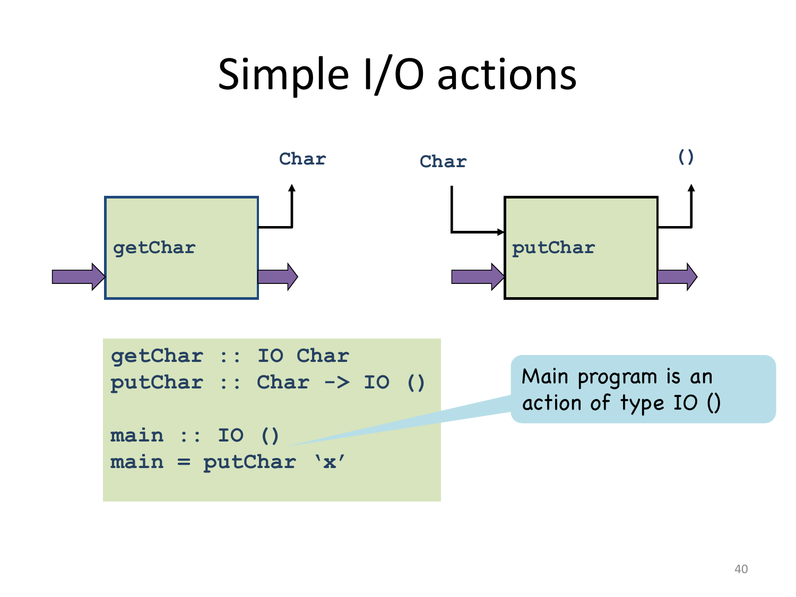

*Figure 10.7 — Simple I/O actions [Monads p.40].*

```haskell
getChar :: IO Char
putChar :: Char -> IO ()

main :: IO ()          -- Main program is an action of type IO ()
main = putChar 'x'
```

The two primitives are asymmetric in a way worth noting. `getChar` is an action
delivering a `Char`; `putChar` is a *function* from `Char` to an action. So
`putChar` must be applied before there is an action at all, whereas `getChar`
already is one — which is exactly the shape `>>=` expects on its two sides.

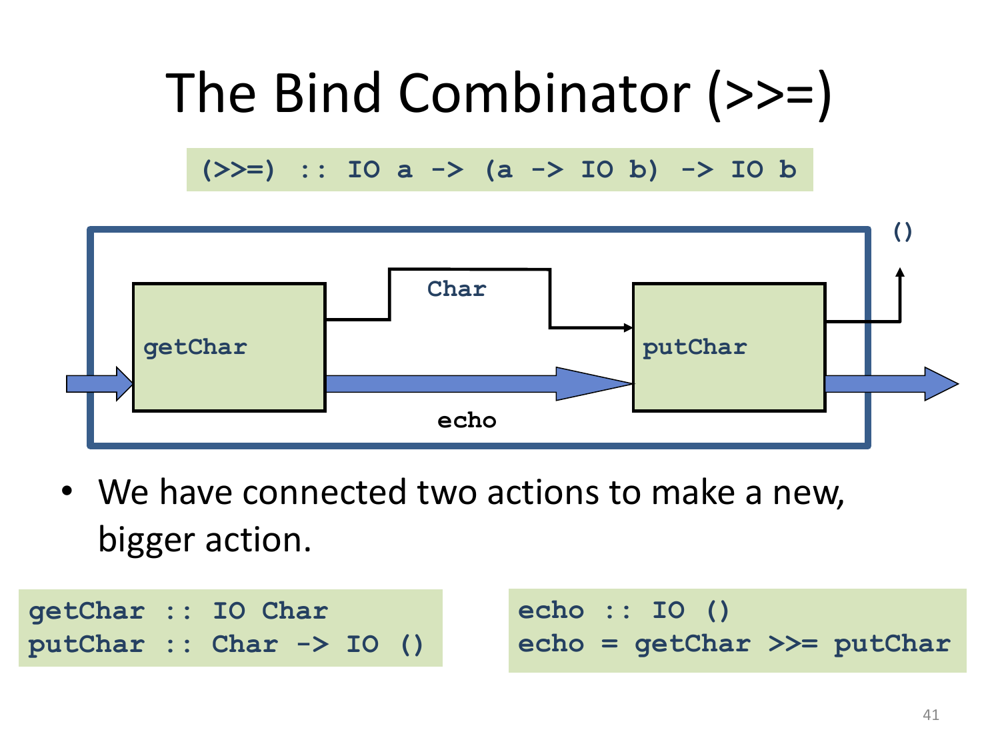

*Figure 10.8 — The bind combinator [Monads p.41].*

```haskell
(>>=) :: IO a -> (a -> IO b) -> IO b

getChar :: IO Char                echo :: IO ()
putChar :: Char -> IO ()          echo = getChar >>= putChar
```

> We have connected two actions to make a new, **bigger** action. [Monads p.41]

The enclosing box in the figure is the point: `echo` is itself an `IO ()`, the same
kind of thing as its parts. Actions compose into actions, which is what makes
programs of arbitrary size out of `getChar` and `putChar`.

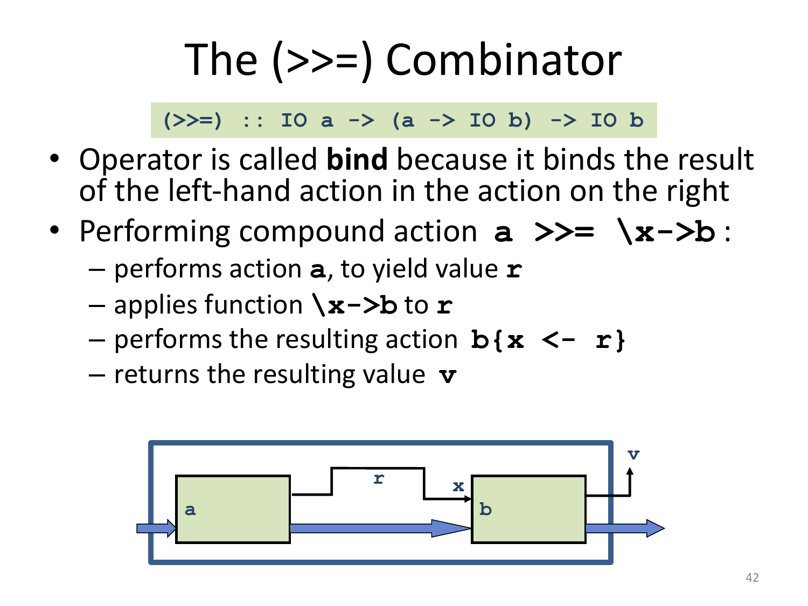

*Figure 10.9 — Performing `a >>= \x->b` [Monads p.42].*

> Operator is called **bind** because it **binds the result of the left-hand
> action in the action on the right**. Performing compound action `a >>= \x->b`
> [Monads p.42]:
>
> - performs action `a`, to yield value `r`
> - applies function `\x->b` to `r`
> - performs the resulting action `b{x <- r}`
> - returns the resulting value `v`

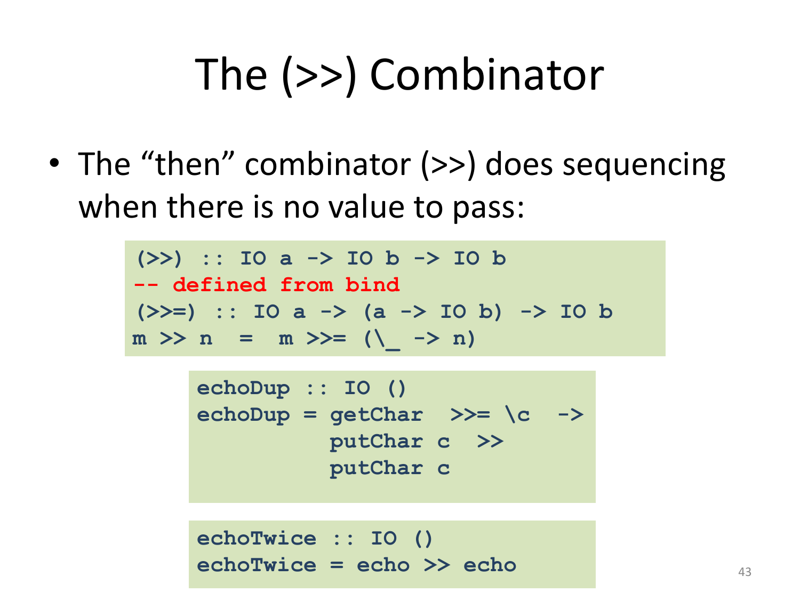

*Figure 10.10 — The `then` combinator [Monads p.43].*

> The **"then"** combinator `(>>)` does sequencing when there is **no value to
> pass** [Monads p.43]:
>
> ```haskell
> (>>) :: IO a -> IO b -> IO b
> -- defined from bind
> m >> n = m >>= (\_ -> n)
>
> echoDup :: IO ()
> echoDup = getChar >>= \c   ->
>           putChar c >>
>           putChar c
>
> echoTwice :: IO ()
> echoTwice = echo >> echo
> ```

`echoDup` uses both combinators in one expression: `>>=` after `getChar` because
the character is needed, then `>>` between the two `putChar c` calls because the
unit result of the first is not.

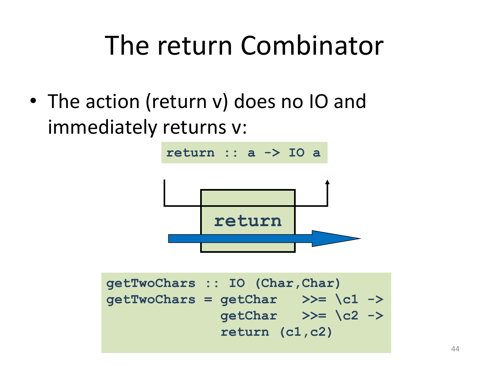

*Figure 10.11 — The `return` combinator [Monads p.44].*

> The action `(return v)` does **no IO** and immediately returns `v`
> [Monads p.44]:
>
> ```haskell
> return :: a -> IO a
>
> getTwoChars :: IO (Char,Char)
> getTwoChars = getChar   >>= \c1 ->
>               getChar   >>= \c2 ->
>               return (c1,c2)
> ```

`return` is what lets a computation end with a pure value. Without it,
`getTwoChars` could not package its two characters into a pair, since a pair is
not an action.

### `do` notation, precisely

> The **"do" notation** adds syntactic sugar to make monadic code easier to read
> [Monads p.45]:
>
> ```haskell
> -- Plain Syntax
> getTwoChars :: IO (Char,Char)
> getTwoChars = getChar >>= \c1 ->
>               getChar >>= \c2 ->
>               return (c1,c2)
>
> -- Do Notation
> getTwoCharsDo :: IO(Char,Char)
> getTwoCharsDo = do { c1 <- getChar ;
>                      c2 <- getChar ;
>                      return (c1,c2) }
> ```
>
> `do` syntax designed to **look imperative**.

> **Desugaring "do" Notation** — the `do` notation only adds syntactic sugar
> [Monads p.46]:
>
> ```haskell
> do { x }              = x
> do { x; stmts }       = x >> do { stmts }
> do { v<-x; stmts }    = x >>= \v -> do { stmts }
> do {let ds; stmts }   = let ds in do { stmts }
> ```
>
> The scope of variables bound in a generator is the **rest of the "do"
> expression**.
>
> The following are equivalent:
>
> ```haskell
> do { x1 <- p1; ...; xn <- pn; q }
> do   x1 <- p1; ...; xn <- pn; q
> ```

The four rules are the whole story, and the second and third are the substantive
ones: a statement without a binding becomes `>>`, one with `v <-` becomes `>>=`
with `v` as the lambda parameter. The scope rule follows immediately — `v` is bound
by a lambda whose body is everything after it, so it is visible for the rest of the
block and no longer.

A larger example, mixing pure and monadic code [Monads p.47]:

```haskell
getLine :: IO [Char]
getLine = do { c <- getChar ;
               if c == '\n' then
                     return []
               else
                     do { cs <- getLine;
                          return (c:cs) }}
```

Note the "regular" code mixed with the monadic operations and the nested `do`
expression. The `if` is ordinary pure Haskell whose branches happen to be actions,
and the recursion is ordinary recursion — the monad adds no new control
construct here.

### Control structures on monads

> Exploiting the monadic combinators, we can define control structures that work
> for **any** monad [Monads p.48]:
>
> ```haskell
> repeatN 0 x = return ()
> repeatN n x = x >> repeatN (n-1) x
> repeatN :: (Num a, Monad m, Eq a) => a -> m a1 -> m ()
>
>         Main> repeatN 5 (putChar 'h')
>
> for []     fa = return ()
> for (x:xs) fa = fa x >> for xs fa
> for :: Monad m => [t] -> (t -> m a) -> m ()
>
>        Main> for [1..10] (\x -> putStr (show x))
> ```

Both inferred types carry `Monad m` and nothing IO-specific, so these are loops
for *every* monad — a `for` over the `Maybe` monad short-circuits on the first
`Nothing`, and over lists it explores every combination. This is the payoff
promised on [Monads p.24].

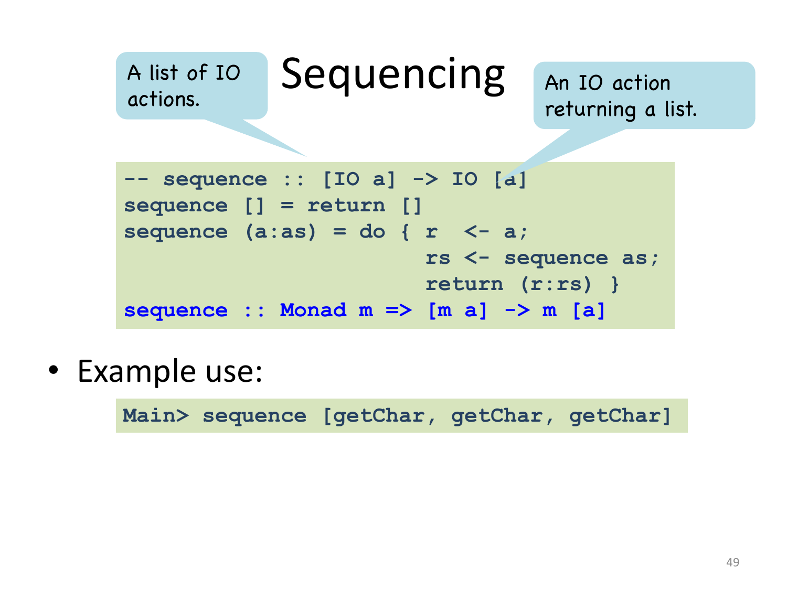

*Figure 10.12 — `sequence` [Monads p.49].*

```haskell
-- sequence :: [IO a] -> IO [a]
sequence [] = return []
sequence (a:as) = do { r <- a;
                        rs <- sequence as;
                        return (r:rs) }
sequence :: Monad m => [m a] -> m [a]

Main> sequence [getChar, getChar, getChar]
```

`sequence` turns a *list of actions* into an *action returning a list* — it
converts a data structure of computations into a computation producing a data
structure. The commented monomorphic type shows the IO case; the inferred type
generalises to any monad.

### Files and references

> The IO Monad provides a large collection of operations for interacting with the
> "World." For example, it provides a direct analogy to the Standard C library
> functions for files [Monads p.50]:
>
> ```haskell
> openFile :: FilePath -> IOMode -> IO Handle
> hPutStr :: Handle -> String -> IO ()
> hGetLine :: Handle -> IO String
> hClose   :: Handle -> IO ()
> ```

> The IO operations let us write programs that do I/O in a **strictly sequential,
> imperative** fashion. **Idea**: We can leverage the sequential nature of the IO
> monad to do other imperative things [Monads p.51]:
>
> ```haskell
> data IORef a   -- Abstract type
> newIORef   :: a -> IO (IORef a)
> readIORef :: IORef a -> IO a
> writeIORef :: IORef a -> a -> IO ()
> ```
>
> A value of type `IORef a` is a reference to a **mutable cell** holding a value
> of type `a`.

Mutable state comes for free once sequencing exists. All three operations return
`IO`, so a read or write can only happen inside the ordered chain — which is
exactly what makes mutation meaningful.

The deck is candid about the result [Monads p.52]:

```haskell
import Data.IORef -- import reference functions

-- Compute the sum of the first n integers
count :: Int -> IO Int
count n = do
   { r <- newIORef 0;
     addToN r 1 }
  where
    addToN :: IORef Int -> Int -> IO Int
    addToN r i | i > n     = readIORef r
               | otherwise = do
                  { v <- readIORef r
                  ; writeIORef r (v + i)
                  ; addToN r (i+1)}
```

> **This is terrible**: contrast with `sum [1..n]`.

Imperative style is *available* in Haskell, not *recommended*. The monad makes
effects possible without making them convenient.

## 10.7 The IO monad as an abstract data type

> ```haskell
> return :: a -> IO a
> (>>=) :: IO a -> (a -> IO b) -> IO b
> getChar :: IO Char
> putChar :: Char -> IO ()
> ... more operations on characters ...
> openFile :: [Char] -> IOMode -> IO Handle
> ... more operations on files ...
> newIORef :: a -> IO (IORef a)
> ... more operations on references …
> ```
>
> - All operations **return** an IO action, but **only bind (`>>=`) takes one as an
>   argument**.
> - Bind is the **only** operation that combines IO actions, which **forces
>   sequentiality**.
> - **In pure Haskell, there is no way to transform a value of type `IO a` into a
>   value of type `a`.**
>
> [Monads p.53]

This is the design argument in its cleanest form. Look at the signatures: actions
come *out* of everything and go *into* only `>>=`. Since the sole way to consume an
action is to bind it into a chain, and the chain is ordered, there is no way to
express an unordered effect — the ambiguity of [Monads p.30] is not merely
discouraged but inexpressible.

The third point is the one-way door: no function `IO a -> a` exists. Effects can be
built up and passed around but never escaped from, so pure code can never depend
on one.

### The restriction bites

> **Unreasonable Restriction?** [Monads p.54]
>
> Suppose you wanted to read a configuration file at the beginning of your
> program:
>
> ```haskell
> configFileContents :: [String]
> configFileContents = lines (readFile "config") -- WRONG!
>
> useOptimisation :: Bool
> useOptimisation = "optimise" `elem` configFileContents
> ```
>
> The problem is that `readFile` returns an `IO String`, not a `String`.
>
> - **Option 1**: Write the entire program in the IO monad. But then we lose the
>   simplicity of pure code.
> - **Option 2**: Escape from the IO Monad using a function from
>   `IO String -> String`. But this is **disallowed**!

### `unsafePerformIO`

> - Reading a file is an I/O action, so **in general** it matters *when* we read
>   the file.
> - But we know the configuration file will **not change** during the program, so
>   it doesn't matter when we read it.
> - This situation arises sufficiently often that Haskell implementations offer
>   one last **unsafe** I/O primitive: `unsafePerformIO`.
>
> ```haskell
> unsafePerformIO :: IO a -> a
>
> configFileContents :: [String]
> configFileContents = lines(unsafePerformIO(readFile "config"))
> ```
>
> [Monads p.55]

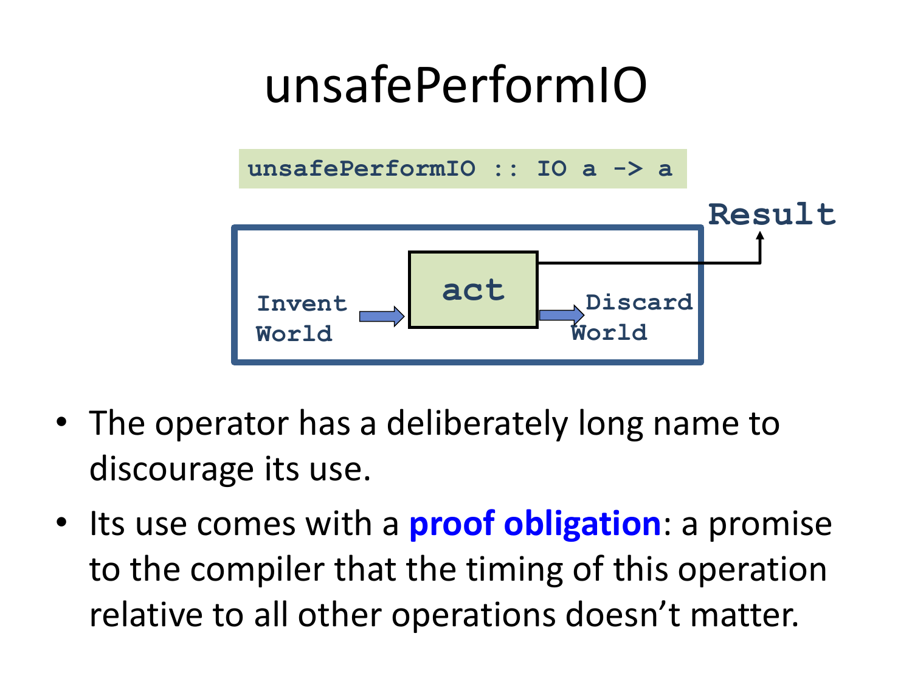

*Figure 10.13 — `unsafePerformIO` [Monads p.56].*

> - The operator has a **deliberately long name** to discourage its use.
> - Its use comes with a **proof obligation**: a promise to the compiler that the
>   timing of this operation relative to all other operations doesn't matter.
>
> [Monads p.56]

The figure shows exactly what it does: invent a `World` out of nothing, run the
action on it, keep the result and throw the resulting world away. Discarding the
world is what breaks the chain of §10.6.2 — with no output world, nothing downstream
depends on this action, so the compiler is free to move, duplicate or delete it.
That freedom is harmless only under the promise stated in the second bullet.

> **Warning**: As its name suggests, `unsafePerformIO` breaks the **soundness of
> the type system** [Monads p.57]:
>
> ```haskell
> r = unsafePerformIO (newIORef (error "urk"))
> r :: IORef a  -- Type of the stored value is generic
>
> cast x = unsafePerformIO (do {writeIORef r x;
>                               readIORef r     })
> > :t cast
> cast :: a1 -> a2
> > cast 65:: Char
> 'A'
> ```
>
> - So claims that Haskell is type safe only apply to programs that **don't use
>   `unsafePerformIO`**.
> - Similar examples are what caused difficulties in integrating references with
>   Hindley/Milner type inference in ML.

Follow the construction: `r` escapes the monad with a *generic* element type
`IORef a`, so it can be written at one type and read at another. `cast :: a1 -> a2`
is a function from any type to any other — and `cast 65 :: Char` duly returns
`'A'`. Every guarantee of [ch.09](09-haskell-typeclasses.md) is void in a program
that does this.

Compare Rust's `unsafe`, which is deliberately narrower: it enables five specific
operations and, as [ch.05 §5.12](05-rust-ownership-borrowing.md#unsafe-superpowers)
notes, does *not* switch off the borrow checker.

## 10.8 Summary of the IO monad

> - A complete Haskell program is a **single IO action called `main`**. Inside IO,
>   code is **single-threaded**.
> - Big IO actions are built by gluing together smaller ones with **bind
>   (`>>=`)** and by converting pure code into actions with **`return`**.
> - **IO actions are first-class.** They can be passed to functions, returned from
>   functions, and stored in data structures. So it is easy to define new "glue"
>   combinators.
> - **The IO Monad allows Haskell to be pure while efficiently supporting side
>   effects.**
>
> [Monads p.58]

### Comparison with other languages

> - In languages like **ML or Java**, the fact that the language is **in the IO
>   monad is baked into the language**. There is no need to mark anything in the
>   type system because it is **everywhere**.
> - In **Haskell**, the programmer can **choose** when to live in the IO monad and
>   when to live in the realm of pure functional programming.
> - So it is **not Haskell that lacks imperative features**, but rather the other
>   languages that lack the ability to have a **statically distinguishable pure
>   subset**.
>
> [Monads p.59]

This reframes the whole chapter. The `IO` in a Haskell type is not a restriction
Haskell imposes; it is information other languages cannot express. In Java every
method is implicitly in `IO`, so a signature tells you nothing about whether
calling it prints, writes a file or mutates a field. Haskell's types distinguish
the two worlds, and the cost of that information is the `IO` marker and the
combinators of §10.6.

## 10.9 Appendix: monad laws

The "few axioms" alluded to on [Monads pp.22–24] are stated at the end of the deck.

> **Monad Laws** [Monads p.60]
>
> 1. `return x >>= f  =  f x`
> 2. `m >>= return  =  m`
> 3. `(x >>= f) >>= g  =  x >>= (\v -> f v >>= g)`
>
> In `do`-notation:
>
> 1. `do { w <- return v; f w }` = `do { f v }`
> 2. `do { v <- x; return v }` = `do { x }`
> 3. `do { x <- m1; y <- m2; m3 }` = `do { y <- do { x <- m1; m2 }; m3 }`
>    — where `x` is not in the free variables of `m3`

Laws 1 and 2 say `return` is a **left and right identity** for `>>=`: binding a
value that was just wrapped is the same as using it directly, and binding a
computation to `return` changes nothing. Law 3 is **associativity** — how you
bracket a chain of binds does not matter, which is what licenses the flat
appearance of a `do` block.

Together they mean a monad is a *monoid-like* structure on computations, and they
are what make the desugaring of §10.6.5 sound: without them, adding or removing a
`do` nesting level could change a program's meaning.

> **Derived Laws for `(>>)` and `done`** [Monads p.61]
>
> ```haskell
> (>>) :: IO a -> IO b -> IO b
> m >> n = m >>= (\_ -> n)
>
> done :: IO ()
> done = return ()
> ```
>
> ```haskell
> done >> m          = m
> m >> done          = m
> m1 >> (m2 >> m3)   = (m1 >> m2) >> m3
> ```

Specialising the three laws to the value-free case gives exactly a monoid:
`done` is the unit and `>>` is an associative operation. This is why sequencing
actions behaves as intuitively expected — `done` can be inserted or dropped
anywhere, and a sequence needs no brackets.

---

## Summary

| Concept | Statement | Page |
|---|---|---|
| Laziness | expressions not evaluated until their values are needed | p.3 |
| In other languages | `&&`, `\|\|`, `if` are lazy, but laziness does not lift to user functions | p.4 |
| Applicative order | arguments evaluated before applying — eager, by value | p.5 |
| Normal order | function first, arguments if and when needed — by name; may repeat work | p.5 |
| Church–Rosser | normal form is unique; if any order terminates, normal order does | p.5 |
| Call by need | **normal order + memoization** — Haskell's strategy | p.6 |
| Lazy binding | names bound to unevaluated expressions; definitions are recursive | p.7 |
| Constructor class | predicate over **type constructors**, not types | p.8 |
| `Functor` | `class Functor g where fmap :: (a -> b) -> g a -> g b` | p.11 |
| Monad, informally | `return` puts a value in a box; `bind` composes box-returning functions | p.15 |
| `Maybe a` | possibly undefined value; `a -> Maybe b` is a **partial function** | p.16 |
| `Monad` class | `return :: a -> m a`, `(>>=) :: m a -> (a -> m b) -> m b`, `(>>)` | pp.20, 23 |
| `do` | syntactic sugar for `>>=` | p.21 |
| Container reading | `xs >>= f = concat(map f xs)` — bind is map then flatten | p.22 |
| Computation reading | `m a` is a computation returning `a`; `>>` sequences, `>>=` sequences with a dependency | p.23 |
| `x >> y` | `= x >>= (\_ -> y)` | p.23 |
| Instances | `Maybe` = exception, `State` = global state, `[]` = non-determinism, `Writer` = logger | p.25 |
| Purity buys | equational reasoning + confluence → compiler picks the evaluation order | p.27 |
| Laziness vs effects | with undefined evaluation order, effects are unordered and may not happen | p.30 |
| Stream model | `main :: [Response] -> [Request]`; not extensible, not composable, deadlock-prone | pp.34–36 |
| `IO t` | an **action**; `type IO t = World -> (t, World)` | p.38 |
| Key insight | **evaluating** an action has no effect; **performing** it does | p.38 |
| World passing | `return a = \w -> (a,w)`; `(>>=) m k = \w -> case m w of (r,w') -> k r w'` | p.39 |
| ADT argument | only `>>=` takes an action as an argument, so sequentiality is forced | p.53 |
| One-way door | in pure Haskell there is no `IO a -> a` | p.53 |
| `do` desugaring | `do{x;s} = x >> do{s}`; `do{v<-x;s} = x >>= \v -> do{s}` | p.46 |
| Generic control | `repeatN`, `for`, `sequence :: Monad m => [m a] -> m [a]` | pp.48–49 |
| `IORef` | mutable cells, all operations in `IO` | p.51 |
| `unsafePerformIO` | `:: IO a -> a`; invents a world, discards it; breaks type soundness | pp.55–57 |

## Exam-style checks

1. Why does `bool b = (x != 0 && y/x > 5)` work while `&` does not, and why can
   `choose(x!=0, y/x>5)` not be fixed by defining `choose` with `&&`?
2. Show that `(λx. 0) (ΩΩ)` terminates under normal order and diverges under
   applicative order. Which Church–Rosser property does this illustrate?
3. Define call by need, and say what each of its two components contributes.
4. In the Haskell/OCaml comparison of [Monads p.7], `a = a + 1` then `a` loops in
   Haskell but gives `7` in OCaml. Explain.
5. What distinguishes a constructor class from a type class? Why is `[]` a legal
   instance of `Functor` but not of `Eq`?
6. `fmap` cannot compose functions of type `a -> g b`. Show what goes wrong and
   which operation fixes it.
7. Rewrite `bothGrandfathers` from nested `case`s to `>>=` and then to `do`, and
   say where the `Nothing -> Nothing` cases went.
8. Derive list bind from `map` and `concat`, and explain the container reading of
   `>>=`.
9. Give the computation reading of `return`, `>>` and `>>=`, and define `>>` from
   `>>=`.
10. Give two examples from [Monads p.30] of laziness making side effects
    ill-defined, and say how `type IO t = World -> (t, World)` resolves each.
11. Distinguish *evaluating* an action from *performing* it, and explain why the
    distinction preserves purity.
12. Why does the world-passing definition of `>>=` force single-threading?
13. Give the argument of [Monads p.53] that sequentiality is forced by the IO
    interface alone.
14. Desugar `do { c <- getChar; putChar c; return () }` completely.
15. Explain how `unsafePerformIO` lets one write `cast :: a1 -> a2`, and what
    proof obligation its use carries.
