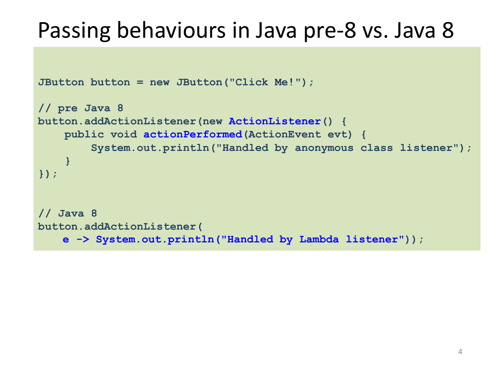
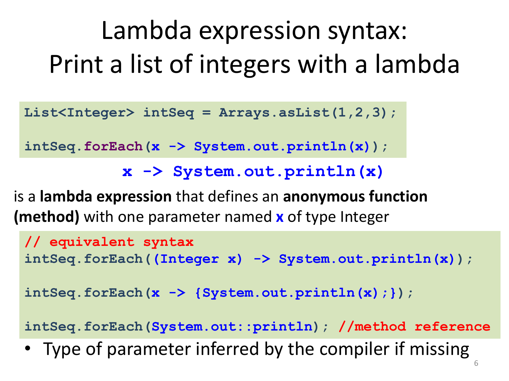
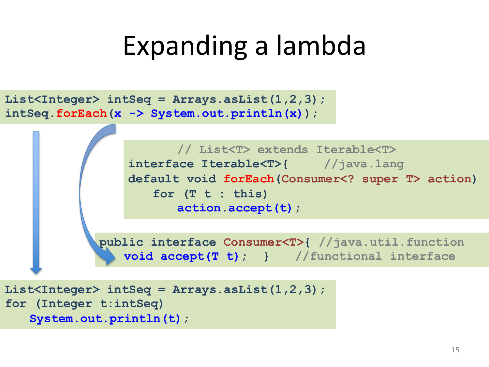
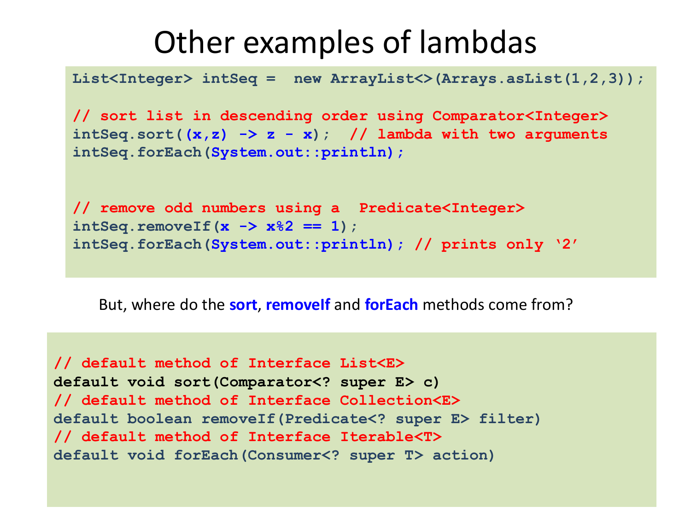
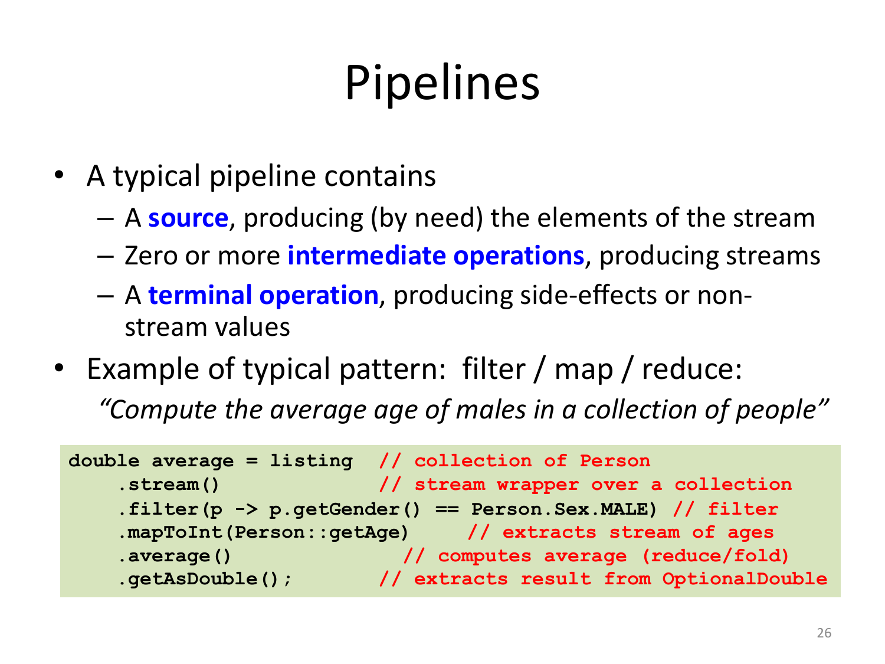
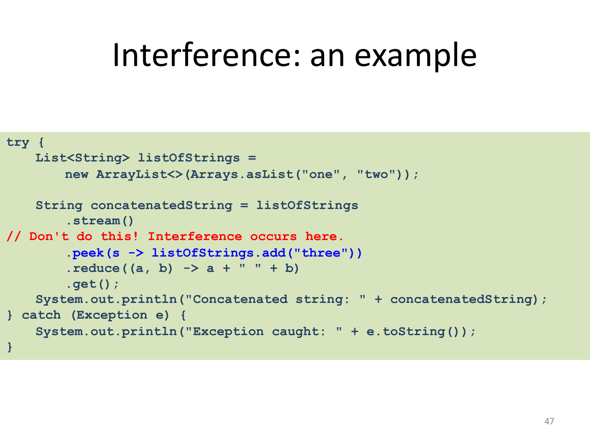

# 11 — Java 8: Lambdas and Streams

> **Primary:** `lecture_notes/24-AP25-JLambdas.pdf` (43 pp)
> **Supporting:** `DOCS/25-MonadsInJava_by_MarioFusco.pdf` — *Monadic Java*
> **Notation:** [`NOTATION.md`](../NOTATION.md) §5 — Java conventions
> **Cited as:** `[JLambdas p.n]` by PDF page

> Java 8 is the biggest change to Java since the inception of the language. Main
> new features [JLambdas p.2]:
>
> - **Lambda expressions** (anonymous functions)
>   - Method references
>   - Default methods in interfaces
>   - Improved type inference
>
>   *A big challenge was to introduce lambdas without requiring recompilation of
>   existing binaries.*
> - **The Stream API**
>   - Conceptually, working with streams in Java is very much like working with
>     lists in Haskell using **higher order combinators** (not recursion)

The italicised constraint drives most of the design decisions in this chapter:
§11.3's functional interfaces, §11.4's default methods and §11.5's
`invokedynamic` are all consequences of not being allowed to break existing
compiled code. The comparison with Haskell connects §11.6 onwards to
[ch.10](10-haskell-monads.md).

---

## 11.1 Why lambdas

> **Benefits of Lambdas in Java 8** [JLambdas p.3]
>
> - **Enabling functional programming**
>   - Being able to pass **behaviors** as well as data to functions
>   - Introduction of **lazy evaluation** with stream processing
> - Writing **cleaner and more compact** code
> - Facilitating **parallel** programming
> - Developing more **generic, flexible and reusable** APIs

"Passing behaviours as well as data" is the capability Java lacked. Before Java 8
a method could receive an `int` or a `List`, but to receive *code* it had to
receive an **object** whose class implemented an agreed interface — which is
verbose enough that most APIs avoided the pattern.



*Figure 11.1 — Passing behaviour before and after Java 8 [JLambdas p.4].*

```java
JButton button = new JButton("Click Me!");

// pre Java 8
button.addActionListener(new ActionListener() {
    public void actionPerformed(ActionEvent evt) {
        System.out.println("Handled by anonymous class listener");
    }
});

// Java 8
button.addActionListener(
    e -> System.out.println("Handled by Lambda listener"));
```

Five lines of ceremony — `new ActionListener()`, the method signature, two sets of
braces — surround one line of actual behaviour. The lambda keeps the behaviour and
drops the rest. Crucially the *method being called* is unchanged:
`addActionListener` still takes an `ActionListener`. §11.3 explains how the lambda
becomes one.

The same contrast with `Runnable` [JLambdas p.5]:

```java
public class ThreadTest {// using functional interface Runnable
  public static void main(String[] args) {
    Runnable r1 = new Runnable() { // anonymous inner class
       @Override
       public void run() {
         System.out.println("Old Java Way");
       }
    };
        new Thread(r1).start();
        // using lambda expression
        Runnable r2 = () -> { System.out.println("New Java Way"); };
        new Thread(r2).start();
    }
}
// constructor of class Thread
public Thread(Runnable target)
```

## 11.2 Lambda syntax



*Figure 11.2 — Lambda expression syntax [JLambdas p.6].*

```java
List<Integer> intSeq = Arrays.asList(1,2,3);
intSeq.forEach(x -> System.out.println(x));
```

> `x -> System.out.println(x)` is a lambda expression that defines an **anonymous
> function (method)** with one parameter named `x` of type `Integer`.
>
> ```java
> // equivalent syntax
> intSeq.forEach((Integer x) -> System.out.println(x));
> intSeq.forEach(x -> {System.out.println(x);});
> intSeq.forEach(System.out::println); //method reference
> ```
>
> Type of parameter **inferred by the compiler** if missing.
>
> [JLambdas p.6]

Four spellings of one function. The parameter type may be given or inferred; the
body may be an expression or a braced block; and if the body does nothing but call
an existing method, a **method reference** (§11.4) replaces the lambda entirely.

### Blocks, locals, and scope

> **Multiline lambda, local variables, no new scope** [JLambdas p.7]
>
> ```java
> List<Integer> intSeq = Arrays.asList(1,2,3);
> // multiline: curly brackets necessary
> // local variable declaration
> intSeq.forEach(x -> {
>     int y = x + 2;
>     System.out.println(y);
> });
>
> // no new scope!!!
> int x = 0, y = 0;
> intSeq.forEach(x -> {      //error: x already defined
>     double y = 2.0;        //error: y already defined
>     System.out.println(x + y);
> });
> ```

The second block is the surprising one. A lambda body does **not** open a new
scope: its parameters and locals live in the enclosing method's scope, so they
collide with names already declared there. This differs from an anonymous inner
class, whose body *is* a new scope and may freely shadow. The rule matters in
practice because it makes short parameter names like `x` unusable in methods that
already have an `x`.

### Lambdas as values

> Lambda expressions can be **assigned** and **returned** [JLambdas p.8]:
>
> ```java
> import java.util.*;
> import java.util.function.*;
> class Lambdas {
>     public static void main(String... args){
>         Arrays.asList(args).forEach(print());
>     }
>      public static Consumer<String> print(){
>          Consumer<String> cons = (y -> System.out.println(y));
>          return cons;
>      }
> }
> ```

A lambda is a first-class value in the sense of
[ch.07 §7.2](07-types-and-polymorphism.md#72-subroutine-types): it can be
assigned to a variable, passed as a parameter and returned from a method. Note
that the *type* it is assigned to is `Consumer<String>` — an interface, not a
function type. Java has no function types; §11.3 is how it copes.

### Variable capture

> **Recap: Closures** — closures needed in general when functions can be passed to
> or returned by functions [JLambdas p.9]:
>
> ```python
> def counter_factory():                      # Python
>   counter = 0
>   def counter_increaser():
>       nonlocal counter
>       counter = counter + 1
>       return counter
>   return counter_increaser
>
> >>> f = counter_factory()
> >>> f()
> 1
> >>> f()
> 2
> >>> f.__closure__
> (<cell at 0x1033ace88: int object at 0x10096dce0>,)
> ```

The Python function returned by `counter_factory` outlives the call that created
`counter`, yet still reads and *writes* it. That requires the variable to be
stored somewhere other than the stack frame — the `__closure__` attribute shows
the cell holding it. Java takes a deliberately weaker position:

> **Local variables** used inside the body of a lambda must be **final or
> effectively final** [JLambdas p.10]:
>
> ```java
> public class LVCExample {     // local variable capture
>   public static void main(String[] args) {
>     List<Integer> intSeq = Arrays.asList(1,2,3);
>         int var = 10;         // must be [effectively] final
>         intSeq.forEach(x -> System.out.println(x + var));
>         // var = 3; // uncommenting this line it does not compile
>     }
> }
> ```
>
> *This is a fundamental design choice, as it makes closures not necessary.*
>
> ```java
> public class SVCExample {     // static variable capture
>   private static int var = 10;
>   public static void main(String[] args) {
>     List<Integer> intSeq = Arrays.asList(1,2,3);
>         intSeq.forEach(x -> System.out.println(x + var));
>         var = 3;       // it compiles
>     }
> }
> ```

The italicised sentence is the design argument. Because a captured local can never
change, the lambda can be given a **copy** of its value at creation time — no
shared cell, no closure in the Python sense, and the copy can live in the lambda
object itself. "Effectively final" means not actually declared `final` but never
reassigned, so the compiler can prove the copy is safe.

The contrast with `SVCExample` shows the restriction is about *locals* only. A
static field lives in the class, not a stack frame, so it outlives any method
call and can be mutated freely — `var = 3` compiles. The asymmetry is not about
mutation but about lifetime: a local's storage disappears when the method returns,
a field's does not.

## 11.3 Functional interfaces

> The Java 8 compiler conceptually first **converts a lambda expression into a
> function**, compiling its code, then generates code to **call the compiled
> function** where needed. For example, `x -> System.out.println(x)` could be
> converted into a generated static function
>
> ```java
> public static void genName(Integer x) {
>    System.out.println(x);
> }
> ```
>
> But **what type should be generated for this function? How should it be called?
> What class should it go in?**
>
> [JLambdas p.11]

Those three questions have no answer in pre-8 Java, because the language has no
function types — there is no way to write "the type of a function from `Integer`
to `void`".

> **Design decision: Java 8 lambdas are instances of functional interfaces.**
>
> A **functional interface** is a Java interface with **exactly one abstract
> method**. E.g. [JLambdas p.12]:
>
> ```java
> public interface Comparator<T> { //java.util
>    int compare(T o1, T o2);
> }
> public interface Runnable {     //java.lang
>    void run();
> }
> public interface Consumer<T>{     //java.util.function
>     void accept(T t)
> }
> public interface Callable<V> {//java.util.concurrent
>    V call() throws Exception;
> }
> ```

This is the pivotal decision of the chapter. Rather than add function types, Java
reuses interfaces: a lambda's type is an interface with one abstract method, and
the lambda *is* the implementation of that method. Note that `Comparator`,
`Runnable` and `Callable` already existed — they were retroactively recognised as
functional, which is how existing APIs like `addActionListener` and
`new Thread(...)` accept lambdas with no change at all.

> **Functional interfaces and lambdas** [JLambdas p.13]
>
> - Functional Interfaces can be used as **target type** of lambda expressions,
>   i.e.
>   - As type of variable to which the lambda is assigned
>   - As type of formal parameter to which the lambda is passed
> - The compiler uses **type inference based on target type**
> - Arguments and result types of the lambda must **match** those of the unique
>   abstract method of the functional interface
> - The lambda is invoked by **calling the only abstract method** of the functional
>   interface
> - Lambdas can be interpreted as instances of **anonymous inner classes**
>   implementing the functional interface

"Type inference based on target type" is the bidirectional inference of
[ch.09 §9.8](09-haskell-typeclasses.md#six-kinds-of-type-inference), kind 3: the
type of `x` in `x -> ...` is not derivable from the lambda itself but from the
context expecting it. Given `forEach(Consumer<? super T>)` on a `List<Integer>`,
the compiler works out that `x` must be an `Integer`. The same lambda text placed
in a different context gets a different type.

The requirement of **exactly one** abstract method is what makes this
unambiguous: there is precisely one signature to match against, and precisely one
method to invoke.

### Expanding a lambda



*Figure 11.3 — Expanding a lambda [JLambdas p.14].*

```java
List<Integer> intSeq = Arrays.asList(1,2,3);
intSeq.forEach(x -> System.out.println(x));
```

```java
                // List<T> extends Iterable<T>
interface Iterable<T>{     //java.lang
default void forEach(Consumer<? super T> action)
   for (T t : this)
       action.accept(t);

public interface Consumer<T>{ //java.util.function
   void accept(T t); }     //functional interface
```

is equivalent to

```java
List<Integer> intSeq = Arrays.asList(1,2,3);
for (Integer t:intSeq)
   System.out.println(t);
```

Follow the chain: the lambda becomes a `Consumer<Integer>`, `forEach` iterates
and calls `accept` on each element, and `accept` runs the lambda body. The result
is the plain `for` loop at the bottom. Note the wildcard `Consumer<? super T>` —
by PECS ([ch.08 §8.6](08-java-generics.md#the-pecs-principle)), `action` is a
consumer, so `super`.

### Before and after

[JLambdas p.15] Pre-Java 8, two ways to supply behaviour, both requiring a class:

```java
public class Calculator1 {     // Pre Java 8
   interface IntegerMath { // (inner) functional interface
       int operation(int a, int b);
   }
   public int operateBinary(int a, int b, IntegerMath op) {
       return op.operation(a, b);
   } // parameter type is functional interface
   // inner class implementing the interface
   static class IntMath$Add implements IntegerMath{
       public int operation(int a, int b){
           return a + b;
       }}
   public static void main(String... args) {
       Calculator1 myApp = new Calculator1();
       System.out.println("40 + 2 = " +
              myApp.operateBinary(40, 2, new IntMath$Add()));
   // anonymous inner class implementing the interface
        IntegerMath subtraction = new IntegerMath(){
               public int operation(int a, int b){
                   return a - b;
               };
       };
        System.out.println("20 - 10 = " +
              myApp.operateBinary(20, 10, subtraction)); }}
```

[JLambdas p.16] and with lambdas:

```java
public class Calculator {
    interface IntegerMath { // (inner) functional interface
        int operation(int a, int b);
    }
    public int operateBinary(int a, int b, IntegerMath op) {
        return op.operation(a, b);
    }     // parameter type is functional interface
    public static void main(String... args) {
        Calculator myApp = new Calculator();
           // lambda assigned to functional interface variables
        IntegerMath addition = (a, b) -> a + b;
        System.out.println("40 + 2 = " +
            myApp.operateBinary(40, 2, addition));
           // lambda passed to functional interface formal parameter
        System.out.println("20 - 10 = " +
           myApp.operateBinary(20, 10, (a, b) -> a - b));
    }
}
```

`IntegerMath` and `operateBinary` are **identical** in both versions — only the
call sites changed. This is the point of the design: a pre-8 API written in terms
of single-method interfaces is already lambda-ready. Note also that `(a, b) -> a + b`
needs no types: they are inferred from `IntegerMath.operation(int, int)`.

### Compiling to bytecode

> Lambdas can, **in principle**, be compiled as instances of anonymous inner
> classes [JLambdas p.17]:
>
> ```java
> List<Integer> intSeq = Arrays.asList(1,2,3);
> intSeq.forEach(x -> System.out.println(x));
> ```
>
> ```java
> List<Integer> intSeq = Arrays.asList(1,2,3);
> intSeq.forEach(new Consumer<Integer>(){
>    public void accept(Integer x){
>        System.out.println(x);
> }});
> ```
>
> - Neither **JLS 8** nor **JVMS 8** prescribe a specific compilation strategy for
>   lambdas.
> - Current compilers use the **`invokedynamic`** instruction of the JVM. It
>   allows to **defer to runtime the computation of a call-site**.

The specification deliberately leaves the strategy open, which lets
implementations improve without breaking programs. `invokedynamic` avoids
generating a class file per lambda: the call site is linked on first execution,
and the runtime can then share or specialise the implementation as it sees fit.
Compare [ch.12](12-java-reflection-annotations.md) for the reflective machinery
that inspects such call sites.

### The standard functional interfaces

> **New Functional Interfaces in package `java.util.function`** [JLambdas p.18]
>
> ```java
> public interface Consumer<T> {      //java.util.function
>    void accept(T t);
> }
> public interface Supplier<T> {      //java.util.function
>    T get();
> }
> public interface Predicate<T> {     //java.util.function
>    boolean test(T t);
> }
> public interface Function <T,R> {   //java.util.function
>    R apply(T t);
> }
> ```

The four cover the four useful shapes: a `Consumer` takes and returns nothing, a
`Supplier` returns without taking, a `Predicate` takes and returns `boolean`, and
a `Function` takes and returns. Every stream operation in §11.6 is parameterised
by one of these.

## 11.4 Default methods and method references



*Figure 11.4 — Other examples of lambdas [JLambdas p.19].*

```java
List<Integer> intSeq = new ArrayList<>(Arrays.asList(1,2,3));
// sort list in descending order using Comparator<Integer>
intSeq.sort((x,z) -> z - x); // lambda with two arguments
intSeq.forEach(System.out::println);
// remove odd numbers using a Predicate<Integer>
intSeq.removeIf(x -> x%2 == 1);
intSeq.forEach(System.out::println); // prints only '2'
```

> But, where do the `sort`, `removeIf` and `forEach` methods come from?
>
> ```java
> // default method of Interface List<E>
> default void sort(Comparator<? super E> c)
> // default method of Interface Collection<E>
> default boolean removeIf(Predicate<? super E> filter)
> // default method of Interface Iterable<T>
> default void forEach(Consumer<? super T> action)
> ```
>
> [JLambdas p.19]

### Default methods

> **Problem**: Adding new abstract methods to an interface **breaks existing
> implementations** of the interface.
>
> Java 8 allows interfaces to include [JLambdas p.20]:
>
> - **Abstract (instance) methods**, as usual
> - **Static methods**
> - **Default methods**, defined in terms of other possibly abstract methods
>
> Java 8 uses lambda expressions and default methods **in conjunction** with the
> Java collections framework to achieve **backward compatibility** with existing
> published interfaces.

This solves the problem stated in the chapter opening. `forEach` had to be added
to `Iterable`, an interface implemented by thousands of existing classes. As an
abstract method it would have broken every one of them. As a **default** method it
carries an implementation, so existing classes inherit it and continue to compile.

Note the resemblance to Haskell's default methods
([ch.09 §9.7](09-haskell-typeclasses.md#default-methods)) and Rust's trait
defaults ([ch.05 §5.8](05-rust-ownership-borrowing.md#traits)): a default method
must be "defined in terms of other possibly abstract methods", exactly as
Haskell's `(==)` is defined from `(/=)`.

A default method does not break §11.3's counting rule either: a functional
interface has one **abstract** method, and defaults do not count — which is why
`Iterable` can have `forEach` and `Comparator` many defaults while remaining
usable as lambda targets.

### Method references

> - Method references can be used to **pass an existing function** in places where
>   a lambda is expected
> - The signature of the referenced method needs to **match** the signature of the
>   functional interface method
>
> [JLambdas p.21]

| Method Reference Type | Syntax | Example |
|---|---|---|
| static | `ClassName::StaticMethodName` | `String::valueOf` |
| constructor | `ClassName::new` | `ArrayList::new` |
| specific object instance | `objectReference::MethodName` | `x::toString` |
| arbitrary object of a given type | `ClassName::InstanceMethodName` | `Object::toString` |

The fourth row is the one that needs care. `Object::toString` looks like the third
but behaves differently: the receiver becomes the *first parameter*, so
`Object::toString` is a `Function<Object,String>` rather than a `Supplier<String>`.
`x::toString` fixes the receiver to `x`, giving the `Supplier`.

## 11.5 Streams

> The `java.util.stream` package provides utilities to support **functional-style
> operations on streams of values**. Streams differ from collections in several
> ways [JLambdas p.22]:
>
> - **No storage.** A stream is not a data structure that stores elements;
>   instead, it **conveys** elements from a source (a data structure, an array, a
>   generator function, an I/O channel, …) through a **pipeline** of computational
>   operations.
> - **Functional in nature.** An operation on a stream produces a result, but
>   **does not modify its source**.

> [JLambdas p.23]
>
> - **Laziness-seeking.** Many stream operations can be implemented **lazily**,
>   exposing opportunities for optimization. Stream operations are divided into
>   **intermediate** (stream-producing) operations and **terminal** (value- or
>   side-effect-producing) operations. **Intermediate operations are always lazy.**
> - **Possibly unbounded.** Collections have a finite size, streams need not.
>   **Short-circuiting** operations such as `limit(n)` or `findFirst()` can allow
>   computations on **infinite streams** to complete in finite time.
> - **Consumable.** The elements of a stream are only visited **once** during the
>   life of a stream. Like an `Iterator`, a new stream must be generated to revisit
>   the same elements of the source.

These five properties are the design in miniature, and each has a consequence.
*No storage* + *functional in nature* mean a pipeline is safe to share and cannot
corrupt its source. *Laziness-seeking* is what makes the intermediate/terminal
split meaningful: nothing runs until a terminal operation demands it, so the
library can fuse operations and skip work. *Possibly unbounded* is exactly the
infinite-data-structure benefit of laziness from
[ch.10 §10.1](10-haskell-monads.md#101-laziness), now available in Java.
*Consumable* is the one that trips people up — a stream is not a collection, and
reusing one throws.

### Pipelines

> A typical pipeline contains [JLambdas p.24]:
>
> - A **source**, producing (by need) the elements of the stream
> - **Zero or more intermediate operations**, producing streams
> - A **terminal operation**, producing side-effects or non-stream values
>
> Example of typical pattern: **filter / map / reduce**:
> *"Compute the average age of males in a collection of people"*



*Figure 11.5 — A filter/map/reduce pipeline [JLambdas p.24].*

```java
double average = listing // collection of Person
    .stream()             // stream wrapper over a collection
    .filter(p -> p.getGender() == Person.Sex.MALE) // filter
    .mapToInt(Person::getAge)     // extracts stream of ages
    .average()              // computes average (reduce/fold)
    .getAsDouble();       // extracts result from OptionalDouble
```

The same computation written by hand [JLambdas p.25]:

```java
import java.util.NoSuchElementException;
// listing: Collection<Person>
double average;
int sum = 0;
int count = 0;
for (Person p : listing) {
    if (p.getGender() == Person.Sex.MALE) {
        sum += p.getAge(); // mapToInt(Person::getAge)
        count++;            // used for the average
    }
}
if (count == 0) {
    throw new NoSuchElementException("No value present"); // like OptionalDouble.getAsDouble()
}
average = (double) sum / (double) count;
```

The loop version interleaves three separate concerns — selecting males, extracting
ages, and averaging — into one body with two accumulators. The pipeline names each
concern in its own stage. The comparison also shows what `getAsDouble()` is doing:
`average()` returns an `OptionalDouble` because the average of no elements does not
exist, and the hand-written version has to throw explicitly. Compare
[ch.10 §10.3](10-haskell-monads.md#maybe-and-partial-functions) — `Optional` is
Java's `Maybe`.

> **Anatomy of the Stream Pipeline** [JLambdas p.26]
>
> - A Stream is processed through a **pipeline** of operations
> - A Stream starts with a **source**
> - **Intermediate** methods are performed on the Stream elements. These methods
>   produce Streams and are **not processed until the terminal method is called**.
> - The Stream is considered **consumed** when a terminal operation is invoked. No
>   other operation can be performed on the Stream elements afterwards.
> - Some intermediate or terminal methods can be **short-circuit** methods: they
>   cause the earlier intermediate methods to be processed **only until the
>   short-circuit method can be evaluated**.

### Sources

> Streams can be obtained in a number of ways [JLambdas p.27]:
>
> - From a `Collection` via the `stream()` and `parallelStream()` methods
> - From an array via `Arrays.stream(Object[])`
> - From static factory methods on the stream classes, such as
>   `Stream.of(Object[])`, `IntStream.range(int, int)` or
>   `Stream.iterate(Object, UnaryOperator)`
> - The lines of a file can be obtained from `BufferedReader.lines()`
> - Streams of file paths can be obtained from methods in `Files`
> - Streams of random numbers can be obtained from `Random.ints()`
> - Generators, like `generate` or `iterate`
> - Several other methods in the JDK…

### Intermediate operations

> - An intermediate operation **keeps a stream open** for further operations.
>   Intermediate operations are **lazy**.
> - Several intermediate operations are conceptually **higher-order**: they have
>   arguments of functional interfaces, thus lambdas can be used
>
> ```java
> interface Stream<T>{...
> Stream<T> filter(Predicate<? super T> predicate)         // filter
> IntStream mapToInt(ToIntFunction<? super T> mapper) // map f:T -> int
> <R> Stream<R> map(Function<? super T,? extends R> mapper) // map f:T->R
> Stream<T> peek(Consumer<? super T> action) //performs action on elements
> Stream<T> distinct() // remove duplicates – stateful
> Stream<T> sorted() // sort elements of the stream – stateful
> Stream<T> limit(long maxSize) // truncate
> Stream<T> skip(long n) // skips first n elements
> }
> ```
>
> [JLambdas p.28]

Note the `// stateful` annotations on `distinct` and `sorted`. A stateless
operation such as `filter` can process each element independently; a stateful one
must retain information about elements already seen — and `sorted` must in fact
consume the *whole* stream before emitting anything, which defeats laziness and
makes it unusable on infinite streams.

Every parameter type is one of §11.3's functional interfaces, with wildcards
placed by PECS: the mappers and predicates are consumed, so `? super T`.

### `peek`

> - `peek` **does not affect** the stream
> - A typical use is for **debugging**
>
> ```java
> IntStream.of(1, 2, 3, 4)
>         .filter(e -> e > 2)
>         .peek(e -> System.out.println("Filtered value: " + e))
>         .map(e -> e * e)
>         .peek(e -> System.out.println("Mapped value: " + e))
>         .sum();
> ```
>
> What does it print?
>
> [JLambdas p.29]

The answer demonstrates laziness. Elements are **not** processed stage by stage;
each element is pushed through the entire pipeline before the next one starts:

```
Filtered value: 3
Mapped value: 9
Filtered value: 4
Mapped value: 16
```

If the stages ran one at a time over the whole stream, both "Filtered" lines would
print first. They do not, because `filter` produces nothing until `sum` pulls —
and it then pulls one element at a time. This is also why `1` and `2` never appear:
they fail the filter and are never mapped.

### Terminal operations

> - A terminal operation is the **final** operation on a stream. Once a terminal
>   operation is invoked, the stream is **consumed** and is no longer usable.
> - Typical use: collect values in a data structure, reduce to a value, print or
>   other side effects.
>
> ```java
> interface Stream<T>{...
> void forEach(Consumer<? super T> action)
> Object[] toArray()
> T reduce(T identity, BinaryOperator<T> accumulator)       // fold
> Optional<T> reduce(BinaryOperator<T> accumulator) // fold
> Optional<T> min(Comparator<? super T> comparator)
> boolean allMatch(Predicate<? super T> predicate) // short-circuiting
> boolean anyMatch(Predicate<? super T> predicate) // short-circuiting
> Optional<T> findAny() // short-circuiting
> }
> ```
>
> [JLambdas p.30]

`reduce` is Haskell's `fold`, as the comments say. The two overloads differ in
whether an identity element is supplied: with one, the result is a `T`; without,
an empty stream has no result, so the return type is `Optional<T>`.

The short-circuiting operations are what make infinite streams usable:
`anyMatch` stops at the first success, so it terminates even if the stream does
not.

### Types of streams

> Streams only for **reference types**, `int`, `long` and `double` — minor
> primitive types are missing [JLambdas p.31]:
>
> ```java
> "Hello world!".chars()
>     .forEach(System.out::print);
> // prints
> 721011081081113211911111410810033
>
> // fixing it:
> "Hello world!".chars()
>     .forEach(x -> System.out.print((char) x));
> ```

`chars()` returns an `IntStream`, not a stream of `char` — there is no
`CharStream`. So `System.out::print` resolves to the `int` overload and prints
character codes. This is the erasure-adjacent restriction of
[ch.08 §8.7](08-java-generics.md#87-limitations-of-java-generics): generics cannot
be instantiated at primitive types, so the library provides three hand-written
specialisations and nothing more.

## 11.6 Mutable reduction: `collect`

> Suppose we want to concatenate a stream of strings. The following works:
>
> ```java
> String concatenated = listOfStrings
>                       .stream()
>                       .reduce("", String::concat)
> ```
>
> …but is **highly inefficient** (it builds one new string for each element).
>
> Better to **"accumulate" the elements in a mutable object** (a `StringBuilder`,
> a collection, …). The mutable reduction operation is called `collect()`. It
> requires **three functions** [JLambdas p.32]:
>
> - a **supplier** function to construct new instances of the result container,
> - an **accumulator** function to incorporate an input element into a result
>   container,
> - a **combining** function to merge the contents of one result container into
>   another.
>
> ```java
> <R> R collect( Supplier<R> supplier,
>                BiConsumer<R, ? super T> accumulator,
>                BiConsumer<R, R> combiner);
> ```

The inefficiency is a consequence of immutability: `String::concat` cannot modify
its argument, so each step allocates a new string, giving quadratic total work.
Mutable reduction keeps one container and mutates it.

The **combiner** is the interesting third function, and it exists for §11.7: in a
parallel run, different threads build separate containers that must then be
merged. In a serial run it is never called.

Examples [JLambdas p.33]:

```java
// no streams
ArrayList<String> strings = new ArrayList<>();
for (T element : stream) {
     strings.add(element.toString());
}

// with streams and lambdas
ArrayList<String> strings =
    stream.collect(() -> new ArrayList<>(), //Supplier
    (c, e) -> c.add(e.toString()),    // Accumulator
    (c1, c2) -> c1.addAll(c2));       //Combining

// with streams and method references
ArrayList<String> strings = stream.map(Object::toString)
    .collect(ArrayList::new, ArrayList::add, ArrayList::addAll);
```

The third version is worth studying: `ArrayList::new` is a constructor reference
(row 2 of §11.4's table) serving as the `Supplier`, while `ArrayList::add` and
`ArrayList::addAll` are arbitrary-object instance references (row 4) whose
receivers become the containers. Every one of the three functions is an existing
method.

### Collectors

> Method `collect` can also be invoked with a **`Collector`** argument
> [JLambdas p.34]:
>
> ```java
> <R,A> R collect(Collector<? super T,A,R> collector)
> ```
>
> A `Collector` **encapsulates** the functions used as arguments to
> `collect(Supplier, BiConsumer, BiConsumer)`, allowing for **reuse** of
> collection strategies and **composition** of collect operations.
>
> ```java
> // The following will accumulate strings into an ArrayList:
> List<String> asList = stringStream.collect(Collectors.toList());
>
> // The following will classify Person objects by city:
> Map<String, List<Person>> peopleByCity =
> personStream.collect(Collectors.groupingBy(Person::getCity));
> ```

`groupingBy` shows what composition buys: it takes a classifier function and
produces a `Map` from keys to lists, which would be tedious to write as three
explicit functions.

## 11.7 Infinite streams and parallelism

> - Streams wrapping collections are **finite**
> - **Infinite streams** can be generated with `iterate` and `generate`
>
> ```java
> static <T> Stream<T> iterate(T seed, UnaryOperator<T> f)
> // Example: summing first 10 elements of an infinite stream
> int sum = Stream.iterate(0,x -> x+1).limit(10).reduce(0,(x,s) -> x+s);
>
> static <T> Stream<T> generate(Supplier<T> s)
> // Example: printing 10 random mumbers
> Stream.generate(Math::random).limit(10).forEach(System.out::println);
> ```
>
> [JLambdas p.35]

The two differ in whether the next element depends on the previous. `iterate`
applies `f` repeatedly to build `0, 1, 2, …`; `generate` calls a `Supplier` that
ignores history, which is right for random numbers. Both are infinite, and both
need `limit` before a terminal operation, which is exactly the short-circuiting of
§11.5.

### Parallelism

> - Streams **facilitate parallel execution**
> - Stream operations can execute either in **serial (default)** or in **parallel**
>
> ```java
> double average = persons //average age of all male
>     .parallelStream()     // members in parallel
>     .filter(p -> p.getGender() == Person.Sex.MALE)
>     .mapToInt(Person::getAge)
>     .average()
>     .getAsDouble();
> ```
>
> - The runtime support takes care of using **multithreading** for parallel
>   execution, **in a transparent way**
> - If operations **don't have side-effects**, thread-safety is guaranteed even if
>   non-thread-safe collections are used (e.g. `ArrayList`)
>
> [JLambdas p.36]

Only `stream()` became `parallelStream()`; the pipeline is untouched. This is the
confluence argument of [ch.10 §10.5](10-haskell-monads.md#what-functional-programming-gets-right)
applied to Java: if the stages are pure, the order of processing does not affect
the result, so the runtime is free to split the work. The proviso in the last
bullet is where the guarantee comes from — purity, not locking.

> - **Concurrent mutable reduction** supported for parallel streams — via suitable
>   methods of `Collector`
> - **Order of processing** stream elements depends on serial/parallel execution
>   and intermediate operations
>
> ```java
> Integer[] intArray = {1, 2, 3, 4, 5, 6, 7, 8 };
> List<Integer> listOfIntegers = new ArrayList<>(Arrays.asList(intArray));
>     listOfIntegers .stream()
>                    .forEach(e -> System.out.print(e + " "));
>         // prints: 1 2 3 4 5 6 7 8
>     listOfIntegers .parallelStream()
>                    .forEach(e -> System.out.print(e + " "));
>         // may print: 3 4 1 6 2 5 7 8
> ```
>
> [JLambdas p.37]

Note "**may** print". Order is not merely different but *unspecified*, so a
`forEach` with output is exactly the kind of side effect the purity proviso
excludes.

### Spliterators

> - A stream wrapping a collection uses a **`Spliterator`** over the collection
> - This is the **parallel analogue of an `Iterator`**: it describes a (possibly
>   infinite) collection of elements with support for
>   - applying an action to the next element — `boolean tryAdvance(Consumer<? super T> action)`
>   - applying an action to all remaining elements — `void forEachRemaining(Consumer<? super T> action)`
>   - **splitting off some portion of the input into another spliterator** which
>     can be processed in parallel — `Spliterator<T> trySplit()`
> - At the lowest level, **all streams are driven by a spliterator**.
>
> [JLambdas p.38]

`trySplit` is the operation an `Iterator` lacks and parallelism requires: it
divides the remaining elements into two independently traversable halves. The
recursive application of `trySplit` is how the runtime produces work for however
many threads it has.

## 11.8 Critical issues

> **Non-interference** [JLambdas p.39]
>
> - Behavioural parameters (like lambdas) of stream operations should **not affect
>   the source** (non-interfering behaviour)
> - Risk of `ConcurrentModificationException`s, **even if in single thread**
>
> **Stateless behaviours**
>
> - Stateless behaviour for intermediate operations is encouraged, as it
>   facilitates parallelism, and functional style, thus maintenance
>
> **Parallelism and thread safety**
>
> - For parallel streams **with side-effects**, ensuring thread safety is the
>   **programmers' responsibility**



*Figure 11.6 — Interference [JLambdas p.40].*

```java
try {
    List<String> listOfStrings =
        new ArrayList<>(Arrays.asList("one", "two"));
    String concatenatedString = listOfStrings
        .stream()
// Don't do this! Interference occurs here.
        .peek(s -> listOfStrings.add("three"))
        .reduce((a, b) -> a + " " + b)
        .get();
    System.out.println("Concatenated string: " + concatenatedString);
} catch (Exception e) {
    System.out.println("Exception caught: " + e.toString());
}
```

The `peek` lambda modifies the very list being streamed. Note the emphasis on the
second bullet — this fails in a **single thread**, so it is not a concurrency bug
but a violation of the "does not modify its source" property of §11.5. The stream
detects the modification and throws.

## 11.9 Monads in Java

> **Monads in Java: `Optional` and `Stream`** [JLambdas p.42]
>
> ```java
> public static <T> Optional<T> of(T value)
> // Returns an Optional with the specified present non-null value.
>
> <U> Optional<U> flatMap(Function<? super T,Optional<U>> mapper)
> /* If a value is present, apply the provided Optional-bearing mapping
> function to it, return that result, otherwise return an empty
> Optional. */
> ```
>
> ```java
> static <T> Stream<T> of(T t)
> // Returns a sequential Stream containing a single element.
>
> <R> Stream<R> flatMap(
>        Function<? super T,? extends Stream<? extends R>> mapper)
> /* Returns a stream consisting of the results of replacing each element
> of this stream with the contents of a mapped stream produced by applying
> the provided mapping function to each element. */
> ```

Compare [ch.10 §10.3](10-haskell-monads.md#the-monad-class). The correspondence is
exact:

| Haskell | Java `Optional` | Java `Stream` |
|---|---|---|
| `return :: a -> m a` | `Optional.of` | `Stream.of` |
| `(>>=) :: m a -> (a -> m b) -> m b` | `flatMap` | `flatMap` |

`Optional` is the `Maybe` monad and `Stream` is the list monad, with `flatMap`
playing the part of `>>=` in both. The documented behaviour matches too:
`Optional.flatMap` propagates emptiness exactly as `Maybe`'s bind propagates
`Nothing`, and `Stream.flatMap` replaces each element with the contents of a
mapped stream — the `concat(map f xs)` of
[ch.10 §10.4](10-haskell-monads.md#monads-as-containers).

What Java lacks is the *abstraction*: there is no `Monad` interface, so `flatMap`
is duplicated on each type rather than being one class operation, and no generic
`sequence` or `for` can be written over all monads. Java has monads without having
`Monad`.

> About the way monads entered the Java landscape I suggest reading the slides on
> **Monadic Java** by Mario Fusco. More on functional programming in Java in the
> book **Java 8 in action**. [JLambdas p.43]

---

## Summary

| Concept | Statement | Page |
|---|---|---|
| Benefits | pass behaviours, lazy stream processing, compact code, parallelism | p.3 |
| Constraint | lambdas had to be added **without recompiling existing binaries** | p.2 |
| Syntax | `x -> expr`, `(Type x) -> expr`, `x -> { … }`, `Class::method` | p.6 |
| No new scope | a lambda body shares the enclosing method's scope — names collide | p.7 |
| Local capture | captured locals must be **final or effectively final** | p.10 |
| Why | so the value can be **copied** — "makes closures not necessary" | p.10 |
| Static capture | static fields may be mutated freely — they outlive the frame | p.10 |
| **Functional interface** | a Java interface with **exactly one abstract method** | p.12 |
| Target typing | the lambda's type comes from the **context** expecting it | p.13 |
| Bytecode | unspecified strategy; compilers use **`invokedynamic`** | p.17 |
| Standard interfaces | `Consumer<T>`, `Supplier<T>`, `Predicate<T>`, `Function<T,R>` | p.18 |
| Default methods | carry an implementation, so adding one does not break implementors | p.20 |
| Method references | static / constructor / bound instance / arbitrary instance | p.21 |
| Streams | no storage, functional, laziness-seeking, possibly unbounded, **consumable** | pp.22–23 |
| Pipeline | source → zero or more **intermediate** (lazy) → one **terminal** | p.24 |
| Stateful ops | `distinct`, `sorted` — must retain or consume everything | p.28 |
| `peek` order | one element traverses the whole pipeline before the next starts | p.29 |
| `reduce` | fold; without an identity the result is `Optional<T>` | p.30 |
| Primitive streams | only reference types, `int`, `long`, `double` — no `CharStream` | p.31 |
| `collect` | mutable reduction from **supplier + accumulator + combiner** | p.32 |
| `Collector` | encapsulates the three functions; `Collectors.toList`, `groupingBy` | p.34 |
| Infinite streams | `iterate(seed, f)` and `generate(supplier)`; need `limit` | p.35 |
| Parallelism | `parallelStream()`; thread-safe **if the operations have no side-effects** | p.36 |
| `Spliterator` | parallel `Iterator`: `tryAdvance`, `forEachRemaining`, **`trySplit`** | p.38 |
| Interference | modifying the source from a lambda throws — **even single-threaded** | pp.39–40 |
| Monads | `Optional`/`Stream` `of` = `return`, `flatMap` = `>>=`; no `Monad` interface | p.42 |

## Exam-style checks

1. Why does a lambda body not open a new scope, and what error does that produce
   in the second example of [JLambdas p.7]?
2. Java requires captured locals to be effectively final but lets static fields be
   mutated. Explain both, in terms of where the storage lives.
3. What is a functional interface? Why must it have exactly **one** abstract
   method, and why do default methods not count?
4. `intSeq.forEach(x -> System.out.println(x))` — trace the expansion through
   `Iterable.forEach` and `Consumer.accept` to the equivalent `for` loop.
5. How do default methods let `forEach` be added to `Iterable` without breaking
   existing implementations?
6. Distinguish `x::toString` from `Object::toString`, giving the functional
   interface each one satisfies.
7. Name the five properties of streams from [JLambdas pp.22–23] and give one
   practical consequence of each.
8. Predict the output of the `peek` pipeline on [JLambdas p.29], and say what the
   result shows about laziness.
9. Why is `.reduce("", String::concat)` inefficient, and what do the three
   functions of `collect` contribute? When is the combiner called?
10. Why does `"Hello world!".chars().forEach(System.out::print)` print digits?
11. `parallelStream()` needs no other change to the pipeline. What property makes
    that sound, and where does the guarantee fail?
12. What does `trySplit` provide that `Iterator` cannot, and why is it needed?
13. The interference example throws in a single thread. Which stream property does
    it violate?
14. Map `Optional` and `Stream` onto the `Monad` class of ch.10. What does Java
    have, and what is it missing?
