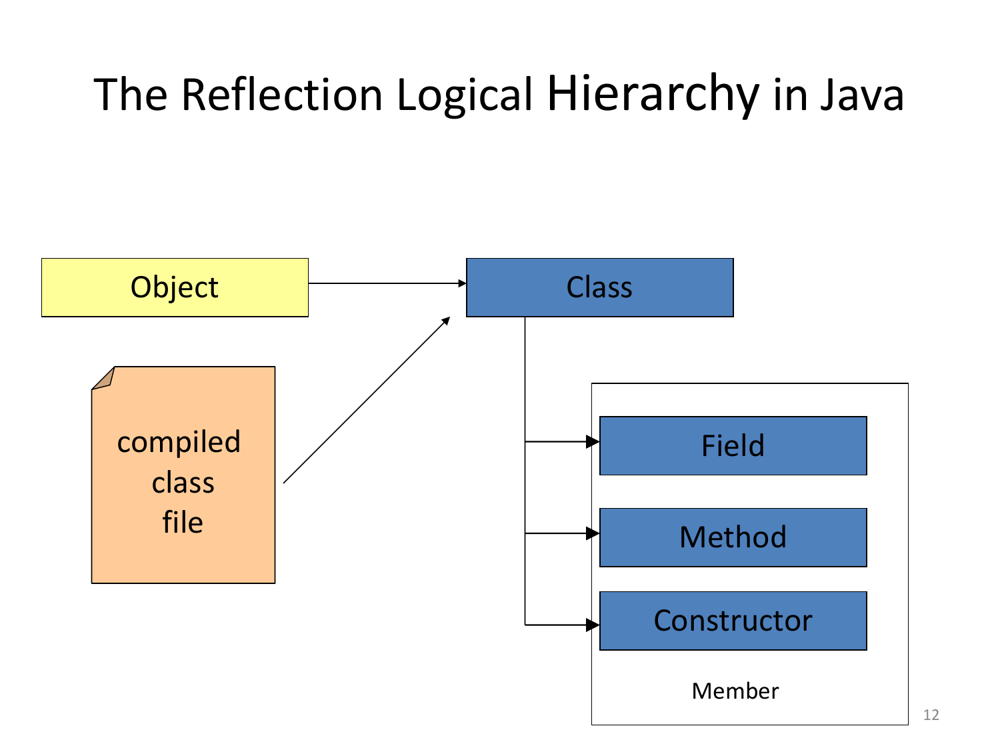
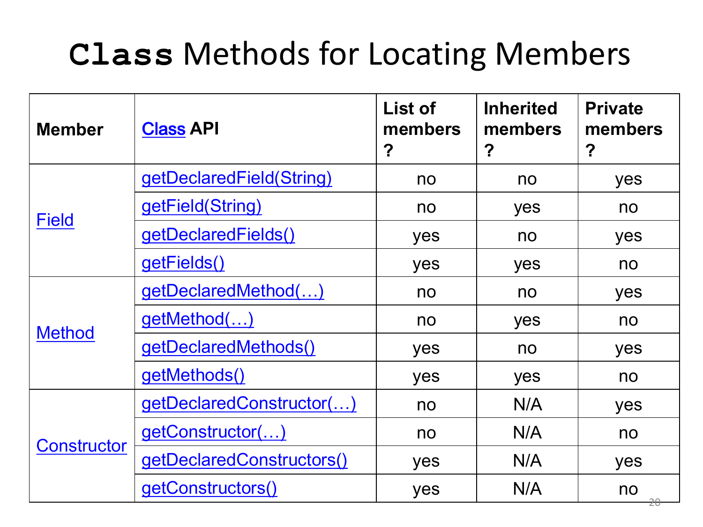
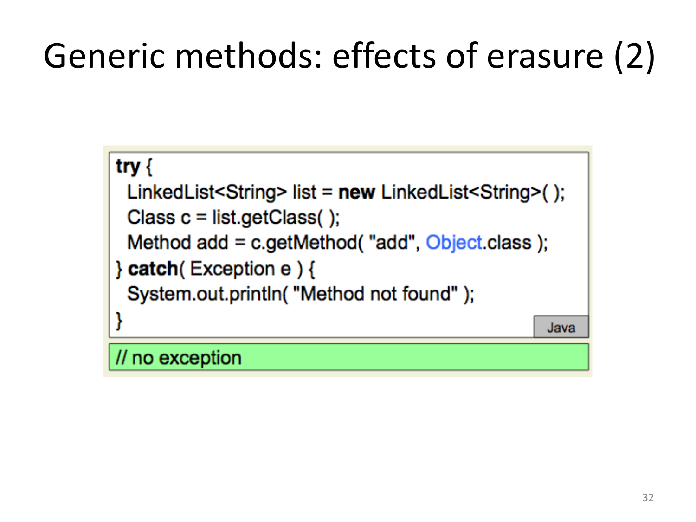
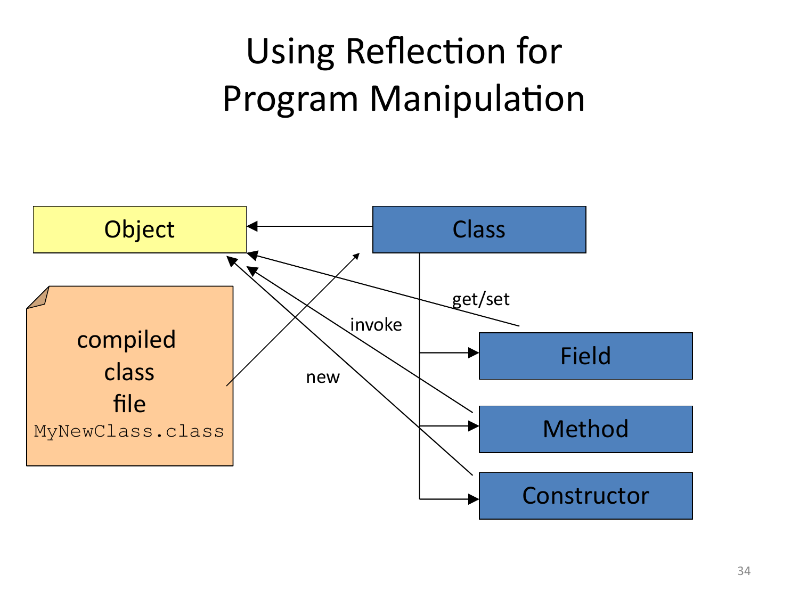
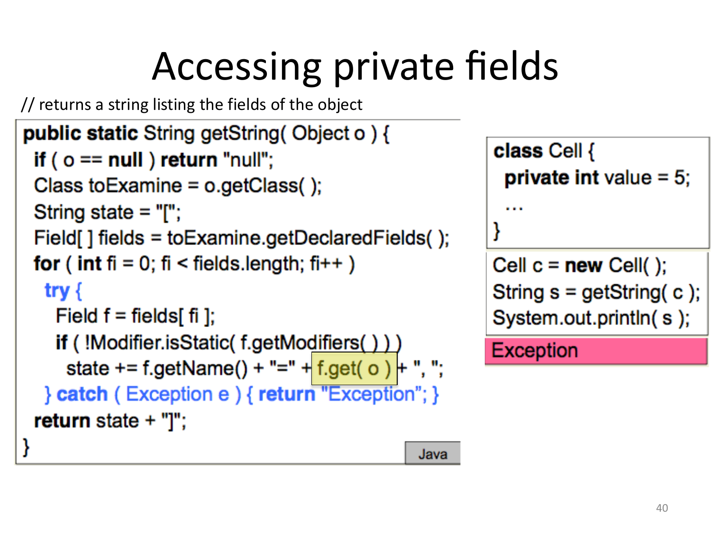

# 12 — Reflection and Annotations in Java

> **Primary:** `lecture_notes/25-AP25-Reflection_Annotations_in_Java.pdf` (53 pp)
> **Notation:** [`NOTATION.md`](../NOTATION.md) §5 — Java conventions
> **Cited as:** `[Reflection p.n]` by PDF page
> **Java tutorials linked from the deck** [Reflection p.2]:
> <https://docs.oracle.com/javase/tutorial/reflect/index.html> ·
> <https://docs.oracle.com/javase/tutorial/java/annotations/index.html>

The deck's overview [Reflection p.2]: reflection in programming languages, pros
and cons; runtime reflection in Java — `Class` objects, retrieving members of a
class, invoking methods and constructors, accessing fields, accessibility; and
annotations in Java.

---

## 12.1 What reflection is

> **Reflection**: ability of a program to **manipulate as data** something
> representing the **state of the program during its own execution**.
>
> Kinds of reflection [Reflection p.3]:
>
> - **Introspection** is the ability of a program to **observe** and therefore
>   reason about its own state
> - **Intercession** is the ability for a program to **modify** its own execution
>   state or alter its own interpretation or meaning
> - Both aspects require a mechanism for **encoding execution state as data**:
>   providing such an encoding is called **reification**.

Three terms, and keeping them distinct is what the rest of the chapter depends on.
*Reification* is the prerequisite: unless the program's own structure exists as
data, neither of the other two is possible. Given reification, *introspection* is
read access and *intercession* is write access. Java, as §12.3 shows, provides
reification and introspection generously, intercession only partially.


*Figure 12.1 — Reflection and reification [Reflection p.4, © Oscar Nierstrasz].*

The picture puts the vocabulary in place: **metaobjects** live above the line and
**objects** below. Reification is the mapping from an object to the metaobject that
describes it; introspection reads that description; intercession changes the object
through it. The line is the meta-level boundary that reflection lets a program
cross.

### Structural and behavioral reflection

> - **Structural reflection** is concerned with the ability of the language to
>   provide a complete **reification** of both
>   - the program currently executed
>   - its abstract data types.
> - **Behavioral reflection** is concerned with the ability of the language to
>   provide a complete reification of
>   - its own **semantics and implementation** (processor)
>   - the data and implementation of the **run-time system**.
>
> [Reflection p.5]

The distinction is what the program can see: its own *structure* (classes, fields,
method signatures) versus its own *execution machinery* (the interpreter, the
runtime). Java offers structural reflection — you can enumerate a class's methods
— but not behavioral: there is no way to reify or replace the JVM's method-dispatch
mechanism from within a Java program.

## 12.2 The wider metaprogramming landscape

### LISP-style reflection

> **LISP-style reflection & metaprogramming (metacircularity)** [Reflection p.6]
>
> - **Homoiconicity**: code is data (S-expressions) → programs can easily
>   manipulate other programs.
> - **Metacircular interpreter**: implement `eval` in the language itself; the
>   language can describe and extend itself.
> - **Macros** (`defmacro`): source-to-source transformations at expansion time
>   - Define new syntactic constructs/DSLs by rewriting the AST before evaluation
> - **REPL + `eval`**: execute generated code at runtime; experimentation and
>   meta-level tooling become trivial.

```lisp
;; A tiny taste: defining new syntax via macros
(defmacro unless (cond &body body)
  `(if (not ,cond)
       (progn ,@body)))

;; Metacircular flavor (highly simplified):
(defun my-eval (expr env)
  (cond ((atom expr) (lookup expr env))
        ((eq (car expr) 'quote) (cadr expr))
        ((eq (car expr) 'if)
         (if (my-eval (cadr expr) env)
             (my-eval (caddr expr) env)
             (my-eval (cadddr expr) env)))
        (t (apply (my-eval (car expr) env)
                  (mapcar (lambda (e) (my-eval e env)) (cdr expr))))))
```

[Reflection p.7]

Homoiconicity is the key enabler: because Lisp programs *are* lists, and lists are
ordinary data, no separate reification step is needed. `unless` is genuinely new
syntax defined in the language — the macro receives the unevaluated `cond` and
`body` and produces replacement code. Compare
[ch.10 §10.1](10-haskell-monads.md#laziness-in-other-languages), where the same
short-circuiting behaviour required *laziness*; a macro achieves it by never
generating the evaluation at all.

### How this relates to Java

> **What runtime reflection usually means (Java/.NET)** [Reflection p.8]
>
> - **Inspect metadata**: types, fields, methods, attributes/annotations
> - **Invoke by name**, create instances dynamically; **not code-as-data**
>
> **Metaprogramming spectrum**
>
> - **Compile-time macros** (Lisp/Clojure, Rust proc-macros, Template Haskell,
>   Scala 3)
> - **Runtime reflection** (Java/.NET, Python introspection)
> - **Code generation** (source/IL/bytecode) and `eval` in dynamic languages
>
> **Trade-offs**
>
> - **Safety**: macros fail at **compile-time**; reflection errors surface at
>   **runtime**
> - **Performance**: macros are **zero-cost**; reflection has invocation
>   overhead/AOT trimming concerns
> - **Expressiveness**: homoiconicity enables **AST-level rewrites and new
>   syntax**; reflection exposes only **runtime metadata**
>
> **When to use which**
>
> - **Macros**: DSLs, boilerplate elimination, domain invariants
> - **Reflection**: plugin systems, late binding, dynamic loading, serialization
>   of unknown types

"Not code-as-data" is the essential limitation. Java reflection lets a program ask
*what* methods a class has and call them by name, but never see or rewrite their
bodies. The trade-off table explains why both approaches survive: macros run before
the program does, so they are checked and cost nothing at runtime but cannot react
to types discovered later; reflection runs during execution, so it handles classes
unknown at compile time but pays for it in both safety and speed.

The binding-time framing of
[ch.07 §7.4](07-types-and-polymorphism.md#74-binding-time) applies directly: macros
are compile-time, reflection is execution-time, and the deck's preference for the
earlier one is the same "the earlier the better, for debugging reasons".

### Uses and drawbacks

> **Uses of Reflection** [Reflection p.9]
>
> - **Class Browsers** need to be able to enumerate the members of classes
> - **Visual Development Environments** can exploit type information available in
>   reflection to aid the developer in writing correct code
> - **Debuggers** need to be able to examine private members on classes
> - **Test Tools** can make use of reflection to ensure a high level of code
>   coverage in a test suite
> - **Extensibility Features** — an application may make use of external,
>   user-defined classes by creating instances of extensibility objects

Every one of these is a *tool*, and that is the pattern: reflection is for programs
that operate on other programs. §12.6 develops the test-tool case into JUnit.

> If it is possible to perform an operation **without** using reflection, then it
> is **preferable to avoid using it**, because reflection brings
> [Reflection p.10]:
>
> - **Performance Overhead** — reflection involves types that are **dynamically
>   resolved**, thus optimizations cannot be performed, and reflective operations
>   have slower performance than their non-reflective counterparts.
> - **Security Restrictions** — reflection requires a **runtime permission** which
>   may not be present when running under a security manager. This affects code
>   which has to run in a restricted security context.
> - **Exposure of Internals** — reflective code may access internals (like private
>   fields), thus it **breaks abstractions** and may change behavior with upgrades
>   of the platform, **destroying portability**.

The three drawbacks are consequences of the three capabilities. Dynamic resolution
is what makes late binding possible *and* what defeats optimisation. Access to
private members is what makes debuggers possible *and* what breaks encapsulation —
and the portability warning follows: code depending on a private field breaks when
the platform renames it.

## 12.3 Reflection in Java

> - Java supports **introspection** and **reflexive invocation**, but **not code
>   modification**.
> - For every type (primitive, loaded or synthesized), the JVM maintains an
>   associated object of class **`java.lang.Class`**
> - This object **"reflects"** the type it represents
> - It is the **"entry point"** for reflection. All relevant information about the
>   type can be obtained from it:
>   - Class name & modifiers
>   - Superclass & Interfaces implemented
>   - Methods, fields, constructors, etc.
> - API: **`java.lang.reflect`**
>
> [Reflection p.11]

Java's position on the taxonomy of §12.1: full structural reification, full
introspection, and *reflexive invocation* — which is a limited intercession, since
a program can call a method it chooses at runtime but cannot alter the method
itself.



*Figure 12.2 — The reflection logical hierarchy in Java [Reflection p.12].*

The hierarchy: a compiled class file gives rise to a `Class` object; from that
`Class` one obtains `Field`, `Method` and `Constructor` objects; and all three are
`Member`s. Everything reflective starts from a `Class`.

### Getting a `Class` object

Three ways. First, from an instance [Reflection p.13]:

```java
Class c = "foo".getClass();          // String
byte[] bytes = new byte[1024];
Class c = bytes.getClass();          //byte array
Set<String> s = new HashSet<String>();
Class c = s.getClass();              // HashSet
```

Note the third: `s` is declared `Set<String>` but `getClass()` returns
`HashSet` — the **runtime** class, not the declared type.

Second, from the `.class` field of a type, which works for primitives and arrays
too:

```java
Class c = String.class;
Class c = boolean.class;
Class c = int[][][].class;
```

Third, from a name at runtime [Reflection p.14]:

```java
Class c = Class.forName("java.util.List");
Class c = Class.forName("[D");                      // double[]
Class c = Class.forName("[[Ljava.lang.String;");
```

`Class.forName` is the one that enables genuinely dynamic behaviour — the string
can be read from a configuration file, so a class unknown at compile time can be
loaded. The other two require the type to be named in the source. The odd spellings
`[D` and `[[Ljava.lang.String;` are **JVM type descriptors**: `[` prefixes an array
type, `D` is `double`, and `L…;` wraps a class name.

> - Instances of the class `Class` represent **classes and interfaces** in a
>   running Java application.
> - `Class` objects are constructed **automatically by the JVM** as classes are
>   loaded.
> - They provide access to the information read from the **class file**.
>
> [Reflection p.15]

### Where the information comes from

> **Class file structure** [Reflection p.16]
>
> ```java
> ClassFile {
>       u4 magic;                                        // 0xCAFEBABE
>       u2 minor_version;                                // Java Language Version
>       u2 major_version;
>       u2 constant_pool_count;
>       cp_info   contant_pool[constant_pool_count–1];   // Constant Pool
>       u2 access_flags;                  // access modifiers and other info
>       u2 this_class;                    // References to Class and Superclass
>       u2 super_class;
>       u2 interfaces_count;
>       u2 interfaces[interfaces_count];  // References to Direct Interfaces
>       u2 fields_count;
>       field_info fields[fields_count];  // Static and Instance Variables
>       u2 methods_count;
>       method_info methods[methods_count];              // Methods
>       u2 attributes_count;
>       attribute_info attributes[attributes_count];     // Other Info on the Class
> }
> ```

This slide answers the "how is it possible" question. The `.class` file already
contains the class's full structure — its name, superclass, interfaces, fields and
methods — because the JVM needs that information for linking and verification.
Reflection does not add data to the runtime; it **exposes data that had to be there
anyway**. The final `attributes` array is where annotations live (§12.8), which is
why runtime-retained annotations cost nothing extra to store.

### Inspecting a class

> After we obtain a `Class` object `myClass`, we can [Reflection p.17]:
>
> ```java
> // Get the class name
> String s = myClass.getName() ;
>
> // Get the class modifiers
> int m = myClass.getModifiers() ;
> bool isPublic = Modifier.isPublic(m) ;
> bool isAbstract = Modifier.isAbstract(m) ;
> bool isFinal = Modifier.isFinal(m) ;
>
> // Test if it is an interface
> bool isInterface = myClass.isInterface() ;
>
> // Get the interfaces implemented by a class
> Class [] itfs = myClass.getInterfaces() ;
>
> // Get the superclass
> Class super = myClass.getSuperClass() ;
> ```

`getModifiers()` returns an `int` **bit mask**, not a structured object, which is
why the static predicates on `Modifier` are needed to decode it. This mirrors the
`access_flags` field of the class file directly.

## 12.4 Class members

> - Fields, methods, and constructors
> - `java.lang.reflect.*` [Reflection p.18]:
>   - `Member` interface
>   - `Field` class
>   - `Method` class
>   - `Constructor` class

> For each member, the reflection API provides support to retrieve **declaration
> and type information**, and **operations unique to the member**
> [Reflection p.21]:
>
> - **`Field`** — fields have a **type** and a **value**. The class supports
>   accessing type information and **setting and getting** values of a field on a
>   given object.
> - **`Method`** — methods have **return values, parameters** and may **throw
>   exceptions**. The class supports accessing type information for return type
>   and parameters and **invoking** the method on a given object.
> - **`Constructor`** — similar to `Method`, but:
>   - constructors have **no return values**
>   - the invocation of a constructor **creates a new instance** of an object for a
>     given class

### Locating members: the four-way pattern



*Figure 12.3 — Class methods for locating members [Reflection p.19].*

| Member | Class API | List of members? | Inherited members? | Private members? |
|---|---|---|---|---|
| `Field` | `getDeclaredField(String)` | no | no | **yes** |
| | `getField(String)` | no | **yes** | no |
| | `getDeclaredFields()` | **yes** | no | **yes** |
| | `getFields()` | **yes** | **yes** | no |
| `Method` | `getDeclaredMethod(…)` | no | no | **yes** |
| | `getMethod(…)` | no | **yes** | no |
| | `getDeclaredMethods()` | **yes** | no | **yes** |
| | `getMethods()` | **yes** | **yes** | no |
| `Constructor` | `getDeclaredConstructor(…)` | no | N/A | **yes** |
| | `getConstructor(…)` | no | N/A | no |
| | `getDeclaredConstructors()` | **yes** | N/A | **yes** |
| | `getConstructors()` | **yes** | N/A | no |

The whole table is generated by two independent binary choices, and learning them
is easier than learning twelve methods:

- **Singular vs plural** — `getField(name)` returns one member by name;
  `getFields()` returns an array of all of them.
- **`Declared` vs not** — this is the important one, and the naming is
  counter-intuitive. `getDeclaredX` means "declared *in this class*": it therefore
  **includes private** members but **excludes inherited** ones. Plain `getX` means
  "publicly accessible": it **includes inherited** members but **excludes
  private** ones.

There is deliberately **no** method giving both inherited and private members —
private members of a superclass are not accessible even reflectively without
walking the hierarchy class by class.

`Constructor` has `N/A` in the inherited column because **constructors are not
inherited** in Java.

> - `getDeclaredMethod(String name, Class<?>... parameterTypes)`: returns a
>   `Method` object corresponding to the specified method, **declared in this
>   class**
> - `getMethod(String name, Class<?>... parameterTypes)`: returns a `Method`
>   object corresponding to the **public** specified method
> - `getDeclaredMethods()`: returns an array of `Method` objects reflecting **all
>   (public and private)** the methods declared by the class or interface
>   represented by this `Class` object.
> - `getMethods()`: returns an array containing `Method` objects reflecting all the
>   **accessible public** methods of the class or interface represented by this
>   `Class` object.
>
> [Reflection p.20]

Note that a method is identified by **name plus parameter types** — the signature —
not by name alone, because of overloading
([ch.07 §7.5](07-types-and-polymorphism.md#75-overloading-ad-hoc-polymorphism)).

### The running example

[Reflection p.22]

```java
public class Btest
{
   public String aPublicString;
   private String aPrivateString;
   public Btest(String aString) {
     // …
   }
   public Btest() {
     // …
   }
   public Btest(String s1,String s2)
   {
     // …
   }
   private void Op1(String s) {
     // …
   }
   protected String Op2(int x) {
     // …
   }
   public void Op3()    {
     // …
   }
}
```

```java
public class Dtest extends Btest
{
   public int aPublicInt;
   private int aPrivateInt;

   public Dtest(int x)
   {
    // …
   }

   private void OpD1(String s) {
    // …
   }

   public String OpD2(int x){
    // …
   }
}
```

**Public fields** — `getFields()`, inherited yes, private no [Reflection p.23]:

```java
try{
    Class c = Class.forName("Dtest");
    Field[] publicFields = c.getFields();
    for (int i = 0; i < publicFields.length; ++i) {
        String fieldName = publicFields[i].getName();
        Class typeClass = publicFields[i].getType();
        System.out.println("Field: " + fieldName +
           " of type " + typeClass.getName());
    }
} catch (ClassNotFoundException e){
    System.out.println("Class not found...");
}
```

```
Field: aPublicInt of type int
Field: aPublicString of type java.lang.String
```

Both `Dtest`'s own `aPublicInt` and `Btest`'s inherited `aPublicString` appear;
neither private field does.

**Declared fields** — `getDeclaredFields()`, inherited no, private yes
[Reflection p.24]:

```java
Class c = Class.forName("Dtest");
Field[] publicFields = c.getDeclaredFields();
for (int i = 0; i < publicFields.length; ++i) {
   String fieldName = publicFields[i].getName();
   Class typeClass = publicFields[i].getType();
   System.out.println("Field: " + fieldName + " of type " +
                    typeClass.getName());
   }
```

```
Field: aPublicInt of type int
Field: aPrivateInt of type int
```

Exactly the complementary answer: both of `Dtest`'s own fields, and nothing from
`Btest`.

**Public constructors** [Reflection p.25]:

```java
Constructor[] ctors = c.getConstructors();
for (int i = 0; i < ctors.length; ++i) {
   System.out.print("Constructor (");
   Class[] params = ctors[i].getParameterTypes();
   for (int k = 0; k < params.length; ++k){
    String paramType = params[k].getName();
    System.out.print(paramType + " ");
    }
   System.out.println(")");
}
```

```
Constructor (int)
```

Only `Dtest(int)` — `Btest`'s three constructors are **not inherited**, confirming
the `N/A` column.

**Public methods** [Reflection p.26]:

```java
Method[] ms = c.getMethods();
// … prints name, return type and parameter types …
```

```
Method : OpD2 returns java.lang.String parameters : ( int )
Method : Op3 returns void parameters : ( )
Method : wait returns void parameters : ( )
Method : wait returns void parameters : ( long int )
Method : wait returns void parameters : ( long )
Method : hashCode returns int parameters : ( )
Method : getClass returns java.lang.Class parameters : ( )
Method : equals returns boolean parameters : ( java.lang.Object )
Method : toString returns java.lang.String parameters : ( )
Method : notify returns void parameters : ( )
Method : notifyAll returns void parameters : ( )
```

The list is longer than expected because "inherited" reaches all the way to
`java.lang.Object` — hence `wait`, `hashCode`, `equals`, `toString`, `notify`. Note
`Op2` is missing: it is `protected`, and `getMethods()` returns only public ones.

**Declared methods** [Reflection p.27]:

```java
Method[] ms = c.getDeclaredMethods();
```

```
Method : OpD1 returns void parameters : ( java.lang.String )
Method : OpD2 returns java.lang.String parameters : ( int )
```

Just `Dtest`'s two, including the private `OpD1`.

### Generics and erasure

> - `getMethod(String name, Class<?>... parameterTypes)`: returns a `Method`
>   object corresponding to the public specified method
> - Due to Java's **erasure semantics, generic type information is not represented
>   at run time**
>
> [Reflection p.28]



*Figure 12.4 — Generic methods: effects of erasure [Reflection p.29].*

```java
try {
  LinkedList<String> list = new LinkedList<String>( );
  Class c = list.getClass( );
  Method add = c.getMethod( "add", Object.class );
} catch( Exception e ) {
  System.out.println( "Method not found" );
}
// no exception
```

The lookup asks for `add(Object)` on a `LinkedList<String>` and **succeeds**.
After erasure ([ch.08 §8.5](08-java-generics.md#type-erasure)) the method really is
`add(Object)`; `add(String)` never existed at the bytecode level. So the reflective
view of a generic class is its **erased** view — another instance of the
[ch.08 §8.7](08-java-generics.md#87-limitations-of-java-generics) limitations, and
the reason a reflective framework cannot discover a collection's element type.

## 12.5 Intercession: manipulating the program

> Previous examples used reflection for **introspection only**. Reflection is a
> powerful tool to [Reflection p.30]:
>
> - **Creating new objects** of a type that was not known at compile time
> - **Accessing members** (accessing fields or invoking methods) that are not known
>   at compile time



*Figure 12.5 — Using reflection for program manipulation [Reflection p.31].*

The arrows added to Figure 12.2 are the three intercession operations: `new` from a
`Class` or `Constructor` to a fresh object, `invoke` from a `Method`, and
`get`/`set` from a `Field`.

### Creating objects

> Using **default constructors** — `java.lang.Class.newInstance()`
> [Reflection p.32]:
>
> ```java
> Rectangle r = new Rectangle();
> // becomes
> Class c = Class.forName("java.awt.Rectangle") ;
> Rectangle r = (Rectangle) c.newInstance() ;
> ```
>
> Using **constructors with arguments** —
> `java.lang.reflect.Constructor.newInstance(Object... initargs)`:
>
> ```java
> Rectangle r = new Rectangle(12,24);
> // becomes
> Class c = Class.forName("java.awt.Rectangle");
> Class[] intArgsClass = new Class[]{ int.class, int.class };
> Object[] intArgs = new Object[]{new Integer(12),new Integer(24)};
> Constructor ctor = c.getConstructor(intArgsClass);
> Rectangle r = (Rectangle) ctor.newInstance(intArgs);
> ```

Each pair shows the direct form and the reflective form. Two things recur
throughout §12.5: selecting a member requires an **array of `Class` objects** for
the parameter types, and supplying arguments requires an **array of `Object`** —
so primitives must be boxed (`new Integer(12)`). The cast on the result is needed
because the static return type is `Object`, and it is unchecked: a wrong cast
fails at runtime, which is the "errors surface at runtime" trade-off of §12.2.

### Accessing fields

> **Getting field values** [Reflection p.33]:
>
> ```java
> Rectangle r = new Rectangle(12,24) ;
> // h = r.height
> Class c = r.getClass() ;
> Field f = c.getField("height") ;
> Integer h = (Integer) f.get(r) ;
> ```
>
> **Setting field values**:
>
> ```java
> Rectangle r = new Rectangle(12,24) ;
> // r.width=30
> Class c = r.getClass() ;
> Field f = c.getField("width") ;
> f.set(r, new Integer(30)) ;
> r.width = new Integer(30) ;
> ```

A `Field` object represents the field *of the class*, not of any particular object,
which is why both `get` and `set` take the **target object** as an argument. One
`Field` can be reused across many instances.

### Invoking methods

> [Reflection p.34]
>
> ```java
> String s1 = "Hello" ;
> String s2 = "World" ;
> // result = s1.concat(s2);
> Class c = String.class ;
> Class[] paramtypes = new Class[] { String.class } ;
> Object[] args = new Object[] { s2 } ;
> Method concatMethod =
>          c.getMethod("concat",paramtypes) ;
> String result =
>          (String) concatMethod.invoke(s1,args) ;
> ```

`invoke(receiver, args)` mirrors `Field.get(target)`: the `Method` is the class's
method, and the receiver is passed at call time. Compare
[ch.07 §7.7](07-types-and-polymorphism.md#overriding) — `invoke` still performs
**virtual dispatch**, so if `s1`'s runtime class overrides `concat`, the override
runs. Reflection selects the signature; dynamic binding still selects the
implementation.

## 12.6 Accessibility

> Certain operations are **forbidden by privacy rules** [Reflection p.35]:
>
> - Changing a `final` field
> - Reading or writing a `private` field
> - Invoking a `private` method…
>
> Such operations **fail also if invoked through reflection**.
>
> - The programmer can **request** that `Field`, `Method`, and `Constructor`
>   objects be **"accessible."**
>   - Request granted if no security manager, or if the existing security manager
>     allows it
> - In this case you can invoke method or access field, **even if inaccessible via
>   privacy rules!**
> - **`AccessibleObject`** class: the superclass of `Field`, `Method`, and
>   `Constructor`

The first line matters: reflection does **not** bypass access control by default.
Obtaining a private `Field` via `getDeclaredField` is permitted, but *using* it
throws. Suppression is a separate, explicit request.

> `AccessibleObject` provides the methods [Reflection p.36]:
>
> - `boolean isAccessible( )` — gets the value of the accessible flag for this
>   object
> - `void setAccessible(boolean flag)` — sets the accessible flag for this object
>   to the indicated boolean value
> - `static void setAccessible(AccessibleObject[] array, boolean flag)` — sets the
>   accessible flag for an array of objects with a **single security check**

### Worked example



*Figure 12.6 — Accessing private fields: the attempt fails [Reflection p.37].*

```java
// returns a string listing the fields of the object
public static String getString( Object o ) {
  if ( o == null ) return "null";
  Class toExamine = o.getClass( );
  String state = "[";
  Field[ ] fields = toExamine.getDeclaredFields( );
  for ( int fi = 0; fi < fields.length; fi++ )
    try {
      Field f = fields[ fi ];
      if ( !Modifier.isStatic( f.getModifiers( ) ) )
        state += f.getName() + "=" + f.get( o ) + ", ";
    } catch ( Exception e ) { return "Exception"; }
  return state + "]";
}
```

```java
class Cell {
  private int value = 5;
  …
}

Cell c = new Cell( );
String s = getString( c );
System.out.println( s );
// Exception
```

`getDeclaredFields()` found the private `value` — that is introspection and it is
allowed. But `f.get(o)` on line highlighted in the slide throws, because reading a
private field is forbidden. The documented behaviour [Reflection p.38]:

> `public Object get(Object obj) throws IllegalArgumentException,
> IllegalAccessException`
>
> Returns the value of the field represented by this `Field`, on the specified
> object. The value is automatically **wrapped in an object** if it has a primitive
> type.
>
> The underlying field's value is obtained as follows:
>
> - `<omissis>`
> - If this `Field` object is **enforcing Java language access control**, and the
>   underlying field is inaccessible, the method throws an
>   `IllegalAccessException`. If the underlying field is static, the class that
>   declared the field is initialized if it has not already been initialized.

![The same getString method with the line f.setAccessible(true) added and annotated Suppress Java's access checking, now producing the output [value=5, ]](assets/fig-25-AP25-Reflection_Annotations_in_Java-p39-slide.png)

*Figure 12.7 — With `setAccessible(true)` the private field is readable
[Reflection p.39].*

```java
      Field f = fields[ fi ];
      f.setAccessible( true );        // Suppress Java's access checking
      if ( !Modifier.isStatic( f.getModifiers( ) ) )
        state += f.getName() + "=" + f.get( o ) + ", ";
```

```
[value=5, ]
```

One added line turns the exception into the value. This is the "exposure of
internals" drawback of §12.2 in its most concrete form — and also exactly the
capability a debugger or serializer needs.

### Unit testing

> **Exploiting Reflection: Unit Testing** [Reflection p.40]
>
> ```java
> class Cell {                     class TestCell {
>   int value;                        void testSet( ) { ... }
>   Cell( int v ) { value = v; }      void testSwap( ) {
>   int get( ) { return value; }         Cell c1 = new Cell( 5 );
>   void set( int v )                    Cell c2 = new Cell( 7 );
>        { value = v; }                  c1.swap( c2 );
>   void swap( Cell c ) {                assert c1.get( ) == 7;
>     int tmp = value;                   assert c2.get( ) == 5;
>     value = c.value;                }
>     c.value = tmp;               }
>     }
>  }
> ```

```java
public static void testDriver( String testClass ) {
   Class c = Class.forName( testClass );
   Object tc = c.newInstance( );
   Method[ ] methods = c.getDeclaredMethods( );
    for( int i = 0; i < methods.length; i++ ) {
     if( methods[ i ].getName( ).startsWith( "test" ) &&
         methods[ i ].getParameterTypes( ).length == 0 )
        methods[ i ].invoke( tc );
     }
}
```

> A **generic driver**; the basic mechanism behind **JUnit**. [Reflection p.41]

This is the chapter's best argument for reflection. The driver takes a class *name
as a string*, so it works for test classes that did not exist when the driver was
compiled. It uses `Class.forName` (dynamic loading), `newInstance` (dynamic
construction), `getDeclaredMethods` (introspection) and `invoke` (reflexive
invocation) — four of the mechanisms above, in eight lines.

Note the selection criterion: methods whose name **starts with `test`** and take
**no parameters**. That naming convention is precisely what annotations replace —
§12.7 turns `startsWith("test")` into `@Test`.

## 12.7 Annotations

> **From Modifiers to Annotations** [Reflection p.43]
>
> - Modifiers in Java (`static`, `final`, `public`, …) are **meta-data** describing
>   properties of program elements
> - Modifiers are **reserved keywords**, thus **wired-in** in the language
> - Need for additional mechanisms for providing meta-data, **without changing the
>   language**
> - Annotations can be understood as **(user-) definable modifiers**

The framing is exact and worth remembering: an annotation is a modifier you can
define yourself. `public` and `@Override` occupy the same syntactic position and
play the same role — attaching metadata to a declaration — but one is fixed in the
grammar and the other is a library declaration.

### Structure

> Annotations are made of [Reflection p.44]:
>
> - **Annotation name**
> - A finite number of **attributes**, i.e. "name = value" pairs, possibly none
>
> Syntax:
>
> - `@annName` — e.g. `@Override`
> - `@annName{constExp}` — shorthand for `@annName{value=constExp}`
> - `@annName{name_1 = constExp_1, ..., name_k = constExp_k}`
>
> - `constExp`'s are expressions that can be evaluated at **compile time**
> - Attributes have a **type**, thus the supplied values have to be **convertible**
>   to that type

The compile-time constraint on attribute values is what keeps annotations
metadata rather than code: an annotation cannot compute anything, so it can be
stored in the class file's `attributes` array (§12.3) as literal data.

> **Which elements can be annotated?** Annotations can be applied to **almost any
> syntactic element** [Reflection p.45]:
>
> - package declarations
> - classes (including enumeration types)
> - interfaces (including annotations)
> - fields and local variables
> - methods and constructors
> - parameters
> - (recently) any type use
>
> - They can occur, **in any number**, together with other modifiers
> - An annotation **associates the name and set of indicated attributes to the
>   annotated element**

### Predefined annotations

> The Java compiler **defines and recognizes a small set of predefined
> annotations**. **User defined annotations are ignored on compilation, but can be
> used by other tools** [Reflection p.46]:
>
> - **`@Override`** — makes explicit the intention of the programmer that the
>   declared method overrides a method defined in a superclass. The compiler can
>   issue a warning if no method is overridden.
> - **`@Deprecated`** — declares that the annotated element is not necessarily
>   included in future releases of the Java API. Typically applied to methods, but
>   also to classes and interfaces.
> - **`@SuppressWarnings`** — instruct the compiler to avoid issuing warnings for
>   the specified situations (e.g. `all`, `cast`, `deprecation`, `divzero`,
>   `overrides`, `unchecked`, `empty`, …). Example:
>
>   ```java
>   @SuppressWarnings({"deprecation","empty"})
>   void antiqueMethod () {
>      OldClass.deprecatedMethod();
>      ; // why not?
>   }
>   ```
>
> - **`@FunctionalInterface`** — declares an interface to be functional.

The sentence about user-defined annotations being *ignored on compilation* is the
key division of labour: the compiler understands only these few; everything else is
inert data for tools to read (§12.9). `@FunctionalInterface` connects to
[ch.11 §11.3](11-java-lambdas-streams.md#113-functional-interfaces) — it makes the
one-abstract-method requirement a checked assertion rather than an accident.

### Defining your own

> Programmers can define new annotations, to be used [Reflection p.47]:
>
> - for **documentation** purposes of the source
> - to implement **tools that process the content of the `.class` files** generated
>   by the compiler
> - to **inspect the annotations placed on a class at runtime**
>
> - The annotations have a declaration syntax **similar to interfaces** (but
>   starting with `@interface`).
> - Typically, an annotation type is an interface defining **fields corresponding
>   to the attributes**.

```java
@interface InfoCode {
       String author ();
       String date ();
       int ver () default 1;
       int rev () default 0;
       String [] changes () default {};
}
```

> - Each **method** determines the **name of an attribute and its type** (the
>   return type).
> - A **default** value can be specified for each attribute (as for `ver`, `rev`
>   and `changes`).
> - Attribute types can only be **primitive, `String`, `Class`, an `Enum`, an
>   `Annotation`, or an array of those types**.
> - Additionally (like any interface) an `@interface` can contain constant
>   declarations (with explicit initialization), internal classes and interfaces,
>   enumerations, but rarely used.
>
> [Reflection p.48]

The declaration is a *method* per attribute, with the method's **return type**
giving the attribute's type — an unusual encoding, but it is what lets the same
methods be called to read the values back at runtime (§12.9). The restricted set of
attribute types is again the compile-time-constant requirement: each of those has a
literal form storable in a class file.

Applying it [Reflection p.49]:

```java
@InfoCode(author="Beppe", date="10/12/07")
public class C {
   public static void m1() { /* ... */ }
   @InfoCode(author="Gianni",
          date="4/8/08", ver=1, rev=2)
   public static void m2() { /* ... */ }
}
```

`author` and `date` must be supplied since they have no defaults; `ver` and `rev`
are optional and given explicitly on `m2`.

### Meta-annotations

> Annotation definitions can be **annotated in turn**, to describe their meta-data.
> Some predefined **meta-annotations** [Reflection p.50]:
>
> - **`@Target`** — constrains the program elements to which the annotation can be
>   applied. The value type is `annotation.ElementType []`, an enum including
>   `ANNOTATION_TYPE`, `CONSTRUCTOR`, `FIELD`, `LOCAL_VARIABLE`, `METHOD`,
>   `PACKAGE`, `PARAMETER`, `TYPE_PARAMETER`, `TYPE_USE`.
> - **`@Retention`** — till when should the annotation be present? Three options
>   (values of enum `RetentionPolicy`): **`SOURCE`**, **`CLASS`** (default),
>   **`RUNTIME`**
> - **`@Inherited`** — marker annotation. The annotation is **inherited by
>   subclasses**.

`@Retention` is the one that determines whether §12.9 is possible at all:

| Policy | Present in | Visible to |
|---|---|---|
| `SOURCE` | source only, discarded by the compiler | source-processing tools |
| `CLASS` (default) | the `.class` file | bytecode tools |
| `RUNTIME` | the `.class` file, loaded by the JVM | **the Reflection API** |

Since `CLASS` is the default, an annotation intended for runtime retrieval **must**
say `@Retention(RetentionPolicy.RUNTIME)` explicitly — otherwise reflection will
never find it.

## 12.8 Reading annotations reflectively

> - Annotations in class files can be exploited by appropriate tools for **program
>   analysis**. Package `javax.annotation.processing` provides a Java API for
>   writing such tools.
> - **Retrieval of annotations at runtime occurs through the Reflection API.**
> - Relevant classes in `java.lang.reflect` (and `java.lang.Class`) provide
>   suitable methods for retrieving annotations. For example
>   - `Annotation[] getAnnotations()` in class `Class`: returns an array of
>     `Annotation` instances
>   - `<T extends Annotation> T getAnnotation(Class<T> annotationClass)` in class
>     `Method`: returns this element's annotation for the specified type if such an
>     annotation is present, else **`null`**
>
> [Reflection p.51]

This is where the two halves of the chapter meet: annotations put metadata into the
class file, and reflection is what reads it back.

A comprehensive example [Reflection p.52]:

```java
import java.lang.annotation.*;

@Retention(RetentionPolicy.RUNTIME)
@Target({ElementType.TYPE,ElementType.PACKAGE})
@interface InfoCode {
    String author ();
    String date ();
    int ver() default 1;
    int rev() default 0;
    String[] changes() default {};
}

@InfoCode(author="Gigi", date="8/12/2008")
public class TestAnno {
    @SuppressWarnings("unchecked")
    public static void main(String[] args) {
       Class c = TestAnno.class;
       System.out.print("I am: " + c.toString());
       InfoCode ic = (InfoCode)c.getAnnotation(InfoCode.class);
       if (ic != null)
          System.out.print(" v" + ic.ver() + "." + ic.rev()
               + " by " + ic.author());
       System.out.println();
   }
}      // prints:       I am: class TestAnno v1.0 by Gigi
```

Four things to notice:

1. `@Retention(RetentionPolicy.RUNTIME)` is mandatory here — with the default
   `CLASS`, `getAnnotation` would return `null`.
2. `@Target({TYPE, PACKAGE})` restricts `InfoCode` to classes and packages, so
   applying it to a method would now be a compile error.
3. The attributes are read by **calling the methods** declared in the
   `@interface`: `ic.ver()`, `ic.rev()`, `ic.author()`. This is why attributes are
   declared as methods.
4. The output shows `v1.0` although the annotation supplied neither `ver` nor
   `rev` — the **defaults** were used.

Compare the JUnit driver of §12.6: replacing `getName().startsWith("test")` with
`getAnnotation(Test.class) != null` is exactly how modern JUnit works, and it is
better because the marker is checked by the compiler (via `@Target`) rather than
being a naming convention.

## 12.9 Conclusions

> **Reflective capabilities need special support at the levels of language (APIs)
> and compiler** [Reflection p.53]
>
> - **Language (API) level**:
>   - Java: `java.lang.reflection`
>   - .NET: `System.Reflection`
>   - Very similar hierarchy of classes supporting reflection (**Metaclasses**)
> - **Compiler level**:
>   - Specific **type information is saved together with the generated code**
>     (needed for type discovery and introspection)
>   - The generated code must contain also code for **automatically creating
>     instances of the Metaclasses** every time a new type is defined in the
>     application code

The compiler-level requirements explain the cost of reflection even in programs
that never use it: type information must be emitted for every class, and the
runtime must build a `Class` object for each loaded type. That is the price of
reification (§12.1), paid at compile and load time so that introspection is
available at runtime.

---

## Summary

| Concept | Statement | Page |
|---|---|---|
| Reflection | manipulating as data something representing the program's own execution state | p.3 |
| Introspection | **observe** own state | p.3 |
| Intercession | **modify** own execution state or meaning | p.3 |
| Reification | encoding execution state as data — prerequisite for both | p.3 |
| Structural reflection | reifies the program and its data types | p.5 |
| Behavioral reflection | reifies the language's own semantics and runtime | p.5 |
| Homoiconicity | code is data → macros, metacircular `eval` | p.6 |
| Macros vs reflection | compile-time and zero-cost vs runtime, overhead, errors at runtime | p.8 |
| Java's position | introspection + reflexive invocation, **not** code modification | p.11 |
| Entry point | `java.lang.Class`; API `java.lang.reflect` | p.11 |
| Getting a `Class` | `o.getClass()`, `Type.class`, `Class.forName(String)` | pp.13–14 |
| Why possible | the `.class` file already stores the full structure | p.16 |
| `getModifiers()` | returns a bit mask; decode with `Modifier.isPublic` etc. | p.17 |
| `getDeclaredX` | this class only → **includes private, excludes inherited** | p.19 |
| `getX` | publicly accessible → **includes inherited, excludes private** | p.19 |
| Constructors | never inherited (`N/A` column) | p.19 |
| Member identity | name **plus parameter types** — because of overloading | p.20 |
| Erasure | reflection sees the **erased** signature: `add(Object)`, not `add(String)` | pp.28–29 |
| Creating objects | `Class.newInstance()`, `Constructor.newInstance(Object...)` | p.32 |
| Fields | `Field.get(obj)` / `Field.set(obj, v)` — the object is an argument | p.33 |
| Methods | `Method.invoke(receiver, args)`; virtual dispatch still applies | p.34 |
| Access control | privacy rules **still apply** through reflection | p.35 |
| `AccessibleObject` | `setAccessible(true)` suppresses access checking | p.36 |
| JUnit mechanism | `forName` + `newInstance` + `getDeclaredMethods` + `invoke` | p.41 |
| Annotations | **user-definable modifiers**; name + attributes | pp.43–44 |
| Attribute values | must be **compile-time** constants; restricted types | pp.44, 48 |
| Declaration | `@interface` with one **method per attribute**, optional `default` | p.48 |
| Predefined | `@Override`, `@Deprecated`, `@SuppressWarnings`, `@FunctionalInterface` | p.46 |
| Meta-annotations | `@Target`, `@Retention` (`SOURCE`/`CLASS`/`RUNTIME`), `@Inherited` | p.50 |
| Runtime retrieval | needs `RetentionPolicy.RUNTIME`; `getAnnotation(X.class)` or `null` | pp.50–51 |
| Reading attributes | **call the methods** declared in the `@interface` | p.52 |

## Exam-style checks

1. Define introspection, intercession and reification, and say which of the three
   the other two depend on.
2. Distinguish structural from behavioral reflection, and say which Java provides.
3. Give two advantages of compile-time macros over runtime reflection, and two of
   reflection over macros.
4. Why is reflection possible at all in Java? Point to the part of the class file
   that makes it so.
5. For the `Btest`/`Dtest` hierarchy, predict the output of `getFields()`,
   `getDeclaredFields()`, `getConstructors()` and `getMethods()` on `Dtest`, and
   explain each omission.
6. Why is there no API method returning both inherited **and** private members?
7. Why does `c.getMethod("add", Object.class)` succeed on a `LinkedList<String>`?
   What does this tell you about reflecting on generic code?
8. `getDeclaredField` on a private field succeeds but `f.get(o)` throws. Explain,
   and give the one line that changes the outcome.
9. Write the eight-line JUnit-style driver from [Reflection p.41] and name the four
   reflective mechanisms it uses.
10. In what sense is an annotation a "user-definable modifier"? Why must attribute
    values be compile-time constants?
11. An annotation is declared with `@interface` and attributes as methods. Give the
    two reasons this encoding is convenient.
12. A colleague's `@InfoCode` annotation is not found by `getAnnotation` at
    runtime. Give the most likely cause.
13. Rewrite the JUnit-style test driver of §12.6 (*unit testing*) to use an
    annotation instead of a naming convention, and say what is gained.

<details>
<summary>Answers</summary>

1. **Reification** is encoding the program's own execution state as data; it is
   the prerequisite the other two depend on. **Introspection** is read access to
   that data (observing state); **intercession** is write access (modifying
   execution state or its interpretation). Without reification neither is
   possible — there is nothing to read or write.
2. **Structural** reflection reifies the program itself and its abstract data
   types (classes, fields, methods). **Behavioral** reflection reifies the
   language's own semantics/implementation and the runtime system. Java provides
   only structural reflection — you can enumerate a class's methods, but you
   cannot reify or replace the JVM's dispatch mechanism from inside a Java
   program.
3. Macros over reflection: (a) **safety** — macro misuse fails at *compile time*,
   reflection errors (bad cast, missing member) surface at *runtime*; (b)
   **performance** — macros are zero-cost, reflective calls carry invocation
   overhead. Reflection over macros: (a) it can act on **types unknown at
   compile time** (`Class.forName` on a name read from config), which a macro
   — expanded before the program runs — cannot; (b) it needs **no
   homoiconicity/macro facility** in the language, so it works in a language
   like Java that has neither.
4. Because the `.class` file already contains the class's full structure —
   `fields_count`/`field_info`, `methods_count`/`method_info`,
   `interfaces`, `attributes` — since the JVM needs it for linking and
   verification anyway. Reflection does not add data to the runtime; it exposes
   data that had to be there already.
5. On `Dtest`: `getFields()` → `aPublicInt` (declared) and `aPublicString`
   (inherited from `Btest`) — both private fields excluded. `getDeclaredFields()`
   → `aPublicInt` and `aPrivateInt` — both declared in `Dtest`, nothing
   inherited. `getConstructors()` → only `Dtest(int)`; `Btest`'s three
   constructors are omitted because **constructors are never inherited**.
   `getMethods()` → `OpD2`, `Op3`, plus `Object`'s public methods (`wait` ×3,
   `hashCode`, `getClass`, `equals`, `toString`, `notify`, `notifyAll`); `OpD1`
   is omitted (private), `Op1` is omitted (private, in `Btest`), `Op2` is
   omitted (protected, not public).
6. Because private members of a superclass are not accessible even reflectively
   without walking the class hierarchy one class at a time — there is
   deliberately no shortcut API that would expose a superclass's private state
   in one call, since that would erase encapsulation across the whole hierarchy
   rather than just within one class.
7. Because of **type erasure**: at the bytecode level `LinkedList<String>`'s
   method really is `add(Object)` — `add(String)` never existed as a compiled
   signature. `getMethod("add", Object.class)` matches the erased signature and
   succeeds. This shows reflection only ever sees the **erased** view of generic
   code, so it cannot recover a generic collection's element type.
8. `getDeclaredField`/`getDeclaredFields` only locate the member — that is
   introspection, and it is always permitted, even for private members. `f.get(o)`
   actually reads the value, and Java's privacy rules **still apply** to
   reflective access by default, so it throws `IllegalAccessException`. The one
   line that changes the outcome is `f.setAccessible(true);`, which suppresses
   access checking on that `Field` object.
9. ```java
   public static void testDriver( String testClass ) {
      Class c = Class.forName( testClass );
      Object tc = c.newInstance( );
      Method[ ] methods = c.getDeclaredMethods( );
       for( int i = 0; i < methods.length; i++ ) {
        if( methods[ i ].getName( ).startsWith( "test" ) &&
            methods[ i ].getParameterTypes( ).length == 0 )
           methods[ i ].invoke( tc );
        }
   }
   ```
   Four mechanisms: `Class.forName` (dynamic loading), `newInstance` (dynamic
   construction), `getDeclaredMethods` (introspection), `invoke` (reflexive
   invocation).
10. It is user-definable in the sense that `@InfoCode` and `public` occupy the
    same syntactic position and both attach metadata to a declaration — but
    `public` is a reserved keyword wired into the grammar, while `@InfoCode` is
    a library-level declaration (`@interface`) the programmer writes. Attribute
    values must be compile-time constants because an annotation cannot compute
    anything: it has to be stored as literal data in the class file's
    `attributes` array, so its values must already be fully resolved when that
    file is written.
11. (a) It reuses familiar interface-declaration syntax, and each attribute's
    **method return type doubles as its type declaration**, so no separate
    type-annotation syntax is needed. (b) The **same methods** declared in the
    `@interface` are called both to *supply* values (via `default`) and to
    *read* them back reflectively (`ic.author()`, `ic.ver()`), so one
    declaration serves definition and retrieval without a separate accessor
    mechanism.
12. Most likely cause: the annotation type was not declared with
    `@Retention(RetentionPolicy.RUNTIME)`. The default policy is `CLASS`, which
    keeps the annotation in the `.class` file but never loads it into the JVM,
    so `getAnnotation` finds nothing and returns `null` even though the
    annotation was applied correctly in source.
13. ```java
    @Retention(RetentionPolicy.RUNTIME)
    @Target(ElementType.METHOD)
    @interface Test {}

    class TestCell {
      @Test void testSet( ) { ... }
      @Test void testSwap( ) { ... }
    }

    public static void testDriver( String testClass ) throws Exception {
       Class c = Class.forName( testClass );
       Object tc = c.newInstance( );
       Method[ ] methods = c.getDeclaredMethods( );
       for( int i = 0; i < methods.length; i++ ) {
          if( methods[ i ].getAnnotation( Test.class ) != null &&
              methods[ i ].getParameterTypes( ).length == 0 )
             methods[ i ].invoke( tc );
       }
    }
    ```
    Gained: the marker moves from a **string-matching naming convention**
    (`startsWith("test")`) to a declaration the **compiler checks** — `@Target`
    restricts `@Test` to methods, so misapplying it is a compile error instead
    of a silently-skipped method — and test methods are no longer forced to
    start their name with `test`.

</details>
