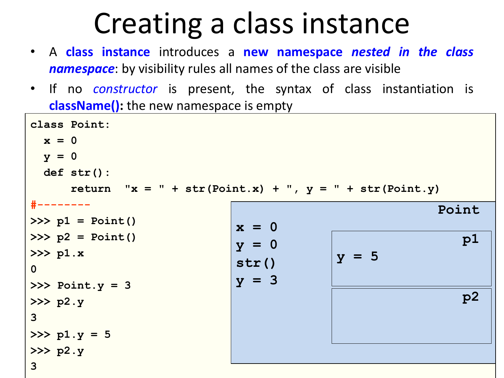

# 13 — Python: Functions, Decorators, OOP

> **Primary:** `lecture_notes/26-AP25-Python-Decorators-OOP.pdf` (40 pp)
> **Notation:** [`NOTATION.md`](../NOTATION.md) — Python source reproduced verbatim
> **Cited as:** `[Python p.n]` by PDF page

> **Functions in Python — Essentials** [Python p.2]
>
> - Functions are **first-class objects**
> - All functions **return** some value (possibly `None`)
> - Function call **creates a new scope**
> - Parameters are passed **by object reference**
> - Functions can have optional **keyword** arguments
> - Functions can take a **variable number** of `args` and `kwargs`
> - **No overloading!**
> - **Higher-order** functions are supported

This list frames the chapter. "No overloading" is the surprising entry given
[ch.07 §7.5](07-types-and-polymorphism.md#75-overloading-ad-hoc-polymorphism), and
§13.1 explains what replaces it. First-class functions plus nested definitions are
what make §13.2's decorators possible, and the scope rule of the third bullet is
developed in §13.3.

---

## 13.1 Functions

### Positional, keyword and default parameters

> [Python p.3] Dynamic typing + duck typing + optional args **compensate lack of
> overloading**.
>
> ```python
> def sum(n,m):
>     """ adds two values """
>     return n+m
>
> >>> sum(3,4)
> 7
> >>> sum('hel','lo')
> 'hello'
> >>> sum(m='lo',n='hel') # keyword parameters
> 'hello'
> #--------------------------------------
> def sum(n,m=5): # default parameter
>     """ adds two values, or increments by 5 """
>     return n+m
> >>> sum(3)
> 8
> ```

The annotation explains how Python manages without overloading. In Java, `sum(int,
int)` and `sum(String, String)` are two methods selected by argument type. Here
there is **one** function: `n+m` works on integers and on strings because `+` is
resolved on the actual objects at runtime (**duck typing**), so no static dispatch
is needed. Default parameters cover the other common use of overloading — offering
a two-argument and a one-argument version — with a single definition.

Note that `sum(m='lo', n='hel')` supplies arguments **by name**, so order is
irrelevant.

### Variable numbers of arguments

> [Python p.4] Arbitrary number of parameters (varargs)
>
> ```python
> def print_args(*items): # arguments are put in a tuple
>     print(type(items))
>     return items
> >>> print_args(1,"hello",4.5)
> <class 'tuple'>
> (1, 'hello', 4.5)
> #--------------------------------------
> def print_kwargs(**items): # args are put in a dict
>     print(type(items))
>     return items
> >>> print_kwargs(a=2,b=3,c=3)
> <class 'dict'>
> {'a': 2, 'b': 3, 'c': 3}
> ```

`*items` collects positional arguments into a **tuple**, `**items` collects keyword
arguments into a **dict**. The two mechanisms are what §13.2 uses to write a
decorator that works for *any* function signature.

### Functions are objects

> As everything in Python, also functions are objects, of class `function`
> [Python p.5]:
>
> ```python
> def echo(arg): return arg
> type(echo)        # <class 'function'>
> hex(id(echo))     # 0x1003c2bf8
> print(echo)       # <function echo at 0x1003c2bf8>
> foo = echo
> hex(id(foo))      # '0x1003c2bf8'
> print(foo)        # <function echo at 0x1003c2bf8>
> isinstance(echo, object)      # => True
> ```

`foo = echo` copies a **reference**: both names have the same `id`, so they denote
one object. There is no separate notion of "function name" — a function is a value
bound to a name like any other, which is why rebinding it (as §13.2 does) is
straightforward.

> The comment after the function's header is bound to the **`__doc__` special
> attribute** [Python p.6]:
>
> ```python
> def my_function():
>     """Summary line: do nothing, but document it.
>     Description: No, really, it doesn't do anything.
>     """
>     pass
> print(my_function.__doc__)
> # try also 'help(my_function)'
> ```

`__doc__` is the first of several **special attributes** (dunder names) that make
function objects introspectable — §13.2 has to preserve it explicitly.

### Higher-order functions

> - Functions can be **passed as argument** and **returned as result**
> - Main combinators (`map`, `filter`) predefined: allow standard functional
>   programming style in Python
> - Heavy use of **iterators**, which support **laziness**
> - **Lambdas** supported for use with combinators — `lambda arguments: expression`
>   - The body can only be a **single expression**
>
> [Python p.7]

The single-expression restriction on lambdas is a real limitation compared with
Java's braced lambda bodies
([ch.11 §11.2](11-java-lambdas-streams.md#112-lambda-syntax)); anything longer must
be a named `def`.

**`map`** [Python p.8]:

```python
>>> print(map.__doc__)
map(func, *iterables) --> map object
Make an iterator that computes the function using
arguments from each of the iterables. Stops when the
shortest iterable is exhausted.

>>> map(lambda x:x+1, range(4))      # lazyness: returns
<map object at 0x10195b278>          # an iterator
>>> list(_)
[1, 2, 3, 4]
>>> list(map(lambda x, y : x+y, range(4), range(10)))
[0, 2, 4, 6]      # map of a binary function
>>> z = 5         # variable capture
>>> list(map(lambda x : x+z, range(4)))
[5, 6, 7, 8]
```

Three points. `map` returns an **iterator**, not a list — the values are produced
on demand, which is the laziness of
[ch.10 §10.1](10-haskell-monads.md#101-laziness) and why `list()` is needed to see
them. With two iterables it maps a binary function and **stops at the shortest**,
so `range(4)` and `range(10)` give four results. And the lambda **captures** `z`
from the enclosing scope, which §13.3 makes precise.

**List comprehensions** can replace `map` [Python p.9]:

```python
>>> list(map(lambda x:x+1, range(4)))
[1, 2, 3, 4]
>>> [x+1 for x in range(4)]
[1, 2, 3, 4]

>>> list(map(lambda x, y : x+y, range(4), range(10)))
[0, 2, 4, 6]   # map of a binary function
>>> [x+y for x in range(4) for y in range(10)]
[0, 1, 2, 3, 4, 5, 6, 7, 8, 9, 1, 2, 3, 4, 5,...   # NO!
>>> [x+y for (x,y) in zip(range(4),range(10))]     # OK
[0, 2, 4, 6]
```

The middle line is the trap: two `for` clauses in a comprehension produce the
**cartesian product** (40 results), not the pairwise combination (4 results). The
binary `map` pairs its iterables, so the comprehension equivalent needs `zip`,
which — like `map` — stops at the shortest iterable and raises `StopIteration`
[Python p.9].

**`filter`** [Python p.10]:

```python
>>> print(filter.__doc__)
filter(function or None, iterable) --> filter object
Return an iterator yielding those items of iterable for
which function(item) is true. If function is None,
return the items that are true.

>>> filter(lambda x : x % 2 == 0,[1,2,3,4,5,6])
<filter object at 0x102288a58>   # lazyness
>>> list(_)                      # '_' is the last value
[2, 4, 6]
>>> [x for x in [1,2,3,4,5,6] if x % 2 == 0]
[2, 4, 6]   # same using list comprehension

# How to say "false" in Python
>>> list(filter(None,
       [1,0,-1,"","Hello",None,[],[1],(),True,False]))
[1, -1, 'Hello', [1], True]
```

The last example is a compact definition of falsehood in Python: passing `None` as
the predicate keeps the items that are *truthy*, and the survivors show what is
false — `0`, `""`, `None`, `[]`, `()` and `False`. Note `-1` **is** truthy.

### More functional modules

> - **`functools`**: higher-order functions and operations on callable objects,
>   including `reduce(fun, iterable[, initializer])`
> - **`itertools`**: functions creating iterators for efficient looping. Inspired
>   by constructs from **APL, Haskell, and SML**:
>   - `count(10)` → `10 11 12 13 14 ...`
>   - `cycle('ABCD')` → `A B C D A B C D ...`
>   - `repeat(10, 3)` → `10 10 10`
>   - `takewhile(lambda x: x<5, [1,4,6,4,1])` → `1 4`
>   - `accumulate([1,2,3,4,5])` → `1 3 6 10 15`
>
> [Python p.11]

`count` and `cycle` are **infinite** iterators, usable only because of laziness —
the same combination as [ch.11 §11.7](11-java-lambdas-streams.md#117-infinite-streams-and-parallelism).
`takewhile` is the short-circuiting operation that makes them terminate.

## 13.2 Decorators

> - A **decorator** is any **callable** Python object that is used to **modify a
>   function, method or class definition**.
> - A decorator is **passed the original object** being defined and **returns a
>   modified object**, which is then **bound to the name** in the definition.
> - (Function) Decorators exploit Python higher-order features:
>   - Passing functions as argument
>   - Nested definition of functions
>   - Returning function
> - Widely used in Python (system) programming
> - Support several features of **meta-programming**
>
> [Python p.12]

The second bullet is the whole mechanism, and it explains why decorators need no
new language machinery: they use only the three higher-order features listed, all
of which §13.1 established.

Compare Java annotations
([ch.12 §12.7](12-java-reflection-annotations.md#127-annotations)): both attach
something to a declaration using an `@` prefix, but a Java annotation is **inert
metadata** that a separate tool must read, whereas a Python decorator **actively
replaces** the thing it decorates, at definition time.

### The basic idea

> **Wrapping a function** [Python p.13]
>
> ```python
> def my_decorator(func):       # function as argument
>     def wrapper(): # defines an inner function
>         print("Something happens before the function.")
>         func() # that calls the parameter
>         print("Something happens after the function.")
>     return wrapper # returns the inner function
>
> def say_hello():    # a sample function
>     print("Hello!")
>
> # 'say_hello' is bound to the result of my_decorator
> say_hello = my_decorator(say_hello) # function as arg
>
> >>> say_hello()   # the wrapper is called
> Something happens before the function.
> Hello!
> Something happens after the function.
> ```

Trace the names. `my_decorator(say_hello)` returns `wrapper`, which closes over
`func` — still bound to the original function. Assigning the result back to
`say_hello` means the name now denotes the wrapper, and the original is reachable
only through the closure. Calling `say_hello()` therefore runs the wrapper, which
runs the original in the middle.

Nothing here is special syntax: this is ordinary rebinding of the kind §13.1's
`foo = echo` showed.

### The pie syntax

> **Syntactic sugar: the "pie" syntax** [Python p.14]
>
> ```python
> def say_hello():        ## HEAVY! 'say_hello' typed 3x
>     print("Hello!")
> say_hello = my_decorator(say_hello)
> ```
>
> Alternative, equivalent syntax
>
> ```python
> @my_decorator
> def say_hello():
>     print("Hello!")
> ```

`@my_decorator` above a `def` means exactly the explicit rebinding below it. The
complaint being addressed is that the name appears three times in the manual form —
once in the `def`, twice in the assignment — which is both verbose and easy to get
wrong.

### Decorating functions with parameters

> **Another decorator: `do_twice`** [Python p.15]
>
> ```python
> def do_twice(func):
>     def wrapper_do_twice():
>         func()      # the wrapper calls the
>         func()      #      argument twice
>     return wrapper_do_twice
>
> @do_twice          # decorate the following
> def say_hello():   # a sample function
>     print("Hello!")
>
> >>> say_hello()    # the wrapper is called
> Hello!
> Hello!
>
> @do_twice         # does not work with parameters!!
> def echo(str):    # a function with one parameter
>     print(str)
>
> >>> echo("Hi...") # the wrapper is called
> TypErr: wrapper_do_twice() takes 0 pos args but 1 was given
> >>> echo()
> TypErr: echo() missing 1 required positional argument: 'str'
> ```

Both errors are informative. `echo("Hi...")` fails because the name `echo` is now
bound to `wrapper_do_twice`, which takes **no** arguments — and the error message
names the wrapper, revealing the substitution. `echo()` then fails inside, because
the *original* `echo` does need its argument.

The fix is `*args` and `**kwargs` from §13.1:

> **`do_twice` for functions with parameters** [Python p.16]
>
> ```python
> def do_twice_args(func):
>     def wrapper_do_twice(*args, **kwargs):
>         func(*args, **kwargs)
>         func(*args, **kwargs)
>     return wrapper_do_twice
>
> @do_twice_args              @do_twice_args
> def say_hello():            def echo(str):
>     print("Hello!")             print(str)
>
> >>> say_hello()             >>> echo("Hi... ")
> Hello!                      Hi...
> Hello!                      Hi...
> ```

The wrapper now accepts **any** arguments and forwards them unchanged, so one
decorator serves both a zero-argument and a one-argument function. Note `*args`
appears twice with two different meanings: in the `def` it **collects** arguments,
in the call it **unpacks** them.

### The general pattern

> - Besides passing arguments, the wrapper also **forwards the result** of the
>   decorated function
> - Supports **introspection** redefining `__name__` and `__doc__`
>
> ```python
> import functools
> def decorator(func):
>     @functools.wraps(func)    #supports introspection
>     def wrapper_decorator(*args, **kwargs):
>         # Do something before
>         value = func(*args, **kwargs)
>         # Do something after
>         return value
>     return wrapper_decorator
> ```
>
> [Python p.17]

This is the template to memorise, and it fixes the three defects of the naive
versions:

1. `*args, **kwargs` — works for any signature.
2. `value = func(...)` then `return value` — the result is not swallowed. The
   earlier `do_twice` returned `None`.
3. `@functools.wraps(func)` — copies `__name__`, `__doc__` and other special
   attributes from the original onto the wrapper. Without it, `say_hello.__name__`
   would report `"wrapper_do_twice"`, breaking the introspection of §13.1 and any
   documentation tool relying on it. Note that `wraps` is itself a decorator,
   applied to the wrapper.

### Examples

**Measuring running time** [Python p.18]:

```python
import functools
import time

def timer(func):
    """Print the runtime of the decorated function"""
    @functools.wraps(func)
    def wrapper_timer(*args, **kwargs):
        start_time = time.perf_counter()
        value = func(*args, **kwargs)
        end_time = time.perf_counter()
        run_time = end_time - start_time
        print(f"Finished {func.__name__!r} in {run_time:.4f} secs")
        return value
    return wrapper_timer

@timer
def waste_some_time(num_times):
    for _ in range(num_times):
        sum([i**2 for i in range(10000)])
```

The `func.__name__` in the message is why `functools.wraps` matters: the decorator
reads the *original*'s name through its closure, and `wraps` ensures anyone
inspecting the decorated function sees the same name.

**Caching return values** [Python p.20]:

```python
import functools
from decorators import count_calls

def cache(func):
    """Keep a cache of previous function calls"""
    @functools.wraps(func)
    def wrapper_cache(*args, **kwargs):
        cache_key = args + tuple(kwargs.items())
        if cache_key not in wrapper_cache.cache:
            wrapper_cache.cache[cache_key] = func(*args, **kwargs)
        return wrapper_cache.cache[cache_key]
    wrapper_cache.cache = dict()
    return wrapper_cache

@cache
@count_calls    # decorator that counts the invocations
def fibonacci(num):
    if num < 2:
        return num
    return fibonacci(num - 1) + fibonacci(num - 2)
```

Two things worth noticing. `wrapper_cache.cache = dict()` attaches state **to the
function object** — possible because functions are objects (§13.1), and it gives
each decorated function its own cache without a global. And the decorators are
**stacked**: `@cache` above `@count_calls` means
`fibonacci = cache(count_calls(fibonacci))`, so the cache is outermost and
`count_calls` sees only the calls that miss the cache. Since naive `fibonacci` is
exponential, memoization here is the difference between exponential and linear.

### Other uses

> [Python p.19]
>
> - **Debugging**: prints argument list and result of calls to decorated function
> - **Registering plugins**: adds a reference to the decorated function, **without
>   changing it**
> - In a **web application**, can wrap some code to check that the user is logged
>   in
> - **`@staticmethod`** and **`@classmethod`** make a function invocable on the
>   class name or on an object of the class
> - More: decorators can be **nested**, can have **arguments**, can be defined as
>   **classes**…

The plugin-registration case is the one where the decorator returns the function
**unchanged** and its only effect is the side effect of recording it — the
decorator as pure metadata, which is the closest Python comes to a Java annotation.
`@staticmethod` and `@classmethod` are covered in §13.6.

## 13.3 Namespaces and scopes

> A **namespace** is a **mapping from names to objects**: typically implemented as
> a **dictionary**. Examples [Python p.21]:
>
> - **builtins**: pre-defined functions, exception names, … — created at
>   interpreter's start-up
> - **global names of a module** — created when the module definition is read.
>   *Note: names created in interpreter are in module `__main__`*
> - **local names of a function invocation** — created when function is called,
>   deleted when it completes
> - and also **names of a class, names of an object** … see later
>
> Name `x` of a module `m` is an **attribute** of `m`
>
> - accessible (read/write) with "qualified name" `m.x`
> - if writable, it can be **deleted** with `del`

That namespaces are literally dictionaries is the key to §13.4: a class and an
object are *also* namespaces, so class members and instance attributes are dict
entries that can be added and removed at runtime.

> A **scope** is a **textual region** of a Python program where a namespace is
> **directly accessible**, i.e. a reference to a name attempts to find the name in
> the namespace.
>
> **Scopes are determined statically, but are used dynamically.**
>
> During execution at least three namespaces are directly accessible, searched in
> the following order [Python p.22]:
>
> - the scope containing the **local** names
> - the scopes of any **enclosing functions**, containing non-local, but also
>   non-global names
> - the next-to-last scope containing the current module's **global** names
> - the outermost scope is the namespace containing **built-in** names
>
> - **Assignments to names go in the local scope**
> - Non-local variables can be accessed using **`nonlocal`** or **`global`**

This is the **LEGB rule** — Local, Enclosing, Global, Builtins — and the two
statements at the bottom are what make it subtle. *Reading* a name searches all four
levels outward; *assigning* a name always creates or updates a **local** binding,
regardless of what exists outside. So an assignment silently shadows rather than
updating, unless `nonlocal` or `global` says otherwise.

### The scoping example


*Figure 13.1 — Scoping rules [Python p.23].*

```python
def scope_test():
    def do_local():
        spam = "local spam"
    def do_nonlocal():
        nonlocal spam
        spam = "nonlocal spam"
    def do_global():
        global spam
        spam = "global spam"
    spam = "test spam"
    do_local()
    print("After local assignment:", spam)      # not affected
    do_nonlocal()
    print("After nonlocal assignment:", spam)   # affected
    do_global()
    print("After global assignment:", spam)     # not affected

scope_test()
print("In global scope:", spam)
```

```
After local assignment: test spam
After nonlocal assignment: nonlocal spam
After global assignment: nonlocal spam
In global scope: global spam
```

Each of the four lines demonstrates one rule:

- `do_local` assigns without a declaration, so it creates a **new local** `spam`
  inside `do_local` and `scope_test`'s `spam` is untouched.
- `do_nonlocal` declares `nonlocal spam`, so the assignment rebinds
  **`scope_test`'s** `spam` — the enclosing function scope. Hence "affected".
- `do_global` declares `global spam`, so it rebinds the **module-level** `spam`,
  leaving `scope_test`'s alone — which is why the third print still shows
  `nonlocal spam`.
- The final print, at module level, sees the global that `do_global` created.

Compare Java's lambda capture
([ch.11 §11.2](11-java-lambdas-streams.md#variable-capture)): Java forbids writing
to a captured local entirely, so it needs no `nonlocal` keyword; Python allows it
but requires the declaration.

## 13.4 Classes as namespaces

> Typical ingredients of the Object Oriented Paradigm [Python p.24]:
>
> - **Encapsulation**: dividing the code into a public interface, and a private
>   implementation of that interface;
> - **Inheritance**: the ability to create subclasses that contain specializations
>   of their parent classes.
> - **Polymorphism**: the ability to **override** methods of a class by extending it
>   with a subclass (inheritance) with a more specific implementation (**inclusion
>   polymorphism**)
>
> From <https://docs.python.org/3/tutorial/classes.html>:
>
> *"Python classes provide all the standard features of Object Oriented
> Programming: the class inheritance mechanism allows multiple base classes, a
> derived class can override any methods of its base class or classes, and a method
> can call the method of a base class with the same name. Objects can contain
> arbitrary amounts and kinds of data. As is true for modules, classes partake of
> the dynamic nature of Python: they are created at runtime, and can be modified
> further after creation."*

"Inclusion polymorphism" is the term from
[ch.07 §7.7](07-types-and-polymorphism.md#77-inclusion-polymorphism). The final
sentence of the quotation is what distinguishes Python's version: classes are
runtime objects that can be **modified after creation**.

### Class definition

> - A class is a **blueprint** for a new data type with specific internal
>   attributes (like a `struct` in C) and internal functions (methods).
> - Syntax:
>
>       class className:
>          <statement-1>
>          …
>          <statement-n>
>
> - statements are **assignments or function definitions**
> - **A new namespace is created**, where all names introduced in the statements
>   will go.
> - When the class definition is left, a **class object** is created, bound to
>   `className`, on which two operations are defined: **attribute reference** and
>   **class instantiation**.
> - Attribute reference allows to access the names in the namespace in the usual
>   way
>
> [Python p.25]

The class body is **executed**, not merely declared: its statements run once and
their effects populate the class namespace. This is why a class body can contain
arbitrary code, and why the resulting class object is just another namespace.


*Figure 13.2 — Attribute reference on a class object [Python p.26].*

```python
class Point:
  x = 0
  y = 0
  def str(): # no capture: needs qualified names to refer to x and y
      return "x = " + (str) (Point.x) + ", y = " + (str) (Point.y)
```

```python
>>> Point.x
0
>>> Point.y = 3
>>> Point.z = 5 # adding new name
>>> Point.z
5
>>> def add(m,n):
      return m+n
>>> Point.sum = add # adding new function
>>> Point.sum(3,4)
7
```

Two consequences of "a class is a namespace". A class attribute can be **added
after the fact** (`Point.z = 5`), and so can a **method** (`Point.sum = add`) —
there is no distinction between the two, since a method is just a name bound to a
function.

The comment on `str` is the first sign of a rule that recurs: the class body does
**not** create an enclosing scope for its methods. `str` cannot refer to `x` and
`y` directly and must qualify them as `Point.x`, `Point.y`.

### Instances

> - A class instance introduces a **new namespace nested in the class namespace**:
>   by visibility rules all names of the class are **visible**
> - If no constructor is present, the syntax of class instantiation is
>   `className()`: the new namespace is **empty**
>
> [Python p.27]



*Figure 13.3 — Creating class instances [Python p.27].*

```python
>>> p1 = Point()
>>> p2 = Point()
>>> p1.x
0
>>> Point.y = 3
>>> p2.y
3
>>> p1.y = 5
>>> p2.y
3
```

This is the LEGB rule of §13.3 applied to objects. `p1.x` finds nothing in `p1`'s
own (empty) namespace and falls through to the class, returning `0`. Changing
`Point.y` is therefore visible through `p2`. But `p1.y = 5` is an **assignment**,
so — exactly as in §13.3 — it creates a *new local* binding in `p1`'s namespace
rather than updating the class's. `p2.y` still resolves to the class attribute, and
still prints `3`.

Reading an attribute searches instance then class; writing one always writes to the
instance.

### Instance methods

> - A class can define a set of **instance methods**, which are just functions:
>
>       def methodname(self, parameter1, ..., parametern):
>                  statements
>
> - The first argument, usually called **`self`**, represents the **implicit
>   parameter** (`this` in Java)
> - A method must access the object's attributes through the `self` reference (e.g.
>   `self.x`) and the class attributes using `className.<attrName>` (or
>   `self.__class__.<attrName>`)
> - The first parameter **must not be passed** when the method is called with
>   dot-notation on an object. It is bound to the target object:
>   `obj.methodname(arg1, ..., argn)`
> - But it **can** be passed explicitly:
>   `className.methodname(obj, arg1, ..., argn)`
>
> [Python p.28]

> Any function with **at least one parameter** defined in a class can be invoked on
> an instance of the class with the dot notation [Python p.29]:
>
> ```python
> class Foo
>      def fun(par-0, par-1, ..., par-n):
>              statements
> #----
> >>> obj = Foo()
> >>> obj.fun(arg-1,...,arg-n)
> # is syntactic sugar for
> >>> obj.__class__.fun(obj,arg-1,...,arg-n)
> ```
>
> - Since the instance `obj` is bound to the first parameter, `par-0` is usually
>   called `self`.
> - A name `x` defined in the (namespace of the) instance is accessed as `par-0.x`
>   (i.e., usually `self.x`)
> - A name `x` defined in the class is accessed as `className.x` (or
>   `self.__class__.x`)

The desugaring is the important line: `obj.fun(args)` **is**
`obj.__class__.fun(obj, args)`. So `self` is not a keyword and gets no special
treatment — it is simply the conventional name for the first parameter, which the
dot notation fills in with the receiver. Any name would work; `self` is convention
only. Note the deck's careful phrasing "instance methods" in quotation marks on
p.29: there is no such category, only functions in a class namespace.

### Constructors

> A **constructor** is a special instance method with name **`__init__`**
> [Python p.30]:
>
>     def __init__(self, parameter1, ..., parametern):
>             statements
>
> - Invocation: `obj = className(arg1, …, argn)`
> - The first parameter `self` is bound to the **new object**.
> - statements typically initialize (thus **create**) "instance variables", i.e.
>   names in the new object namespace.
> - Note: **at most ONE constructor (no overloading in Python!)**

![Python class Point with a class attribute instances = [] and an __init__ setting self.x and self.y and appending self to Point.instances, beside a diagram of the Point namespace holding instances and a nested p1 namespace holding x = 3 and y = 4](assets/fig-26-AP25-Python-Decorators-OOP-p30-slide.png)

*Figure 13.4 — Constructors [Python p.30].*

```python
class Point:
   instances = []
   def __init__(self, x=0, y=0):
      self.x = x
      self.y = y
      Point.instances.append(self)
#--------
>>> p1 = Point(3,4)
```

The example distinguishes the two namespaces precisely. `self.x = x` writes into the
**instance**, so each `Point` has its own `x`; `Point.instances.append(self)` reaches
the **class** attribute, shared by all instances. The `x=0, y=0` defaults are how
Python compensates for having no constructor overloading — one `__init__` covering
`Point()`, `Point(3)` and `Point(3,4)`.

### Methods in instances

> - Instances are **themselves namespaces**: we can add functions to them.
> - Applying the usual rules, they can **hide "instance methods"**
>
> [Python p.31]


*Figure 13.5 — Methods in instances [Python p.31].*

```python
class Point:
   def __init__(self, x, y):
      self.x = x
      self.y = y
      def move(z,t):
         self.x -= z
         self.y -= t
      self.move = move
   def move(self,dx,dy):
      self.x += dx
      self.y += dy
```

```python
>>> p = Point(1,1)
>>> p.x
1
>>> p.move(1,1)
>>> p.x
0
>>> p.__class__.move(p,2,2)
>>> p.x
2
```

The class has a `move` that **adds** and the instance has one that **subtracts**.
`p.move(1,1)` finds `move` in `p`'s own namespace first, so it subtracts: `1 → 0`.
The explicit `p.__class__.move(p,2,2)` bypasses the instance and reaches the class
version, which adds: `0 → 2`.

This is the attribute lookup rule of §13.4.2 with nothing added, applied to
functions rather than data — and it shows that "method" is not a distinct concept in
Python. The instance's `move` also takes `(z,t)` rather than `(self,z,t)`, because
it is a closure over `self` rather than being reached through the class.

## 13.5 Special methods

> It is often useful to have a **textual representation** of an object with the
> values of its attributes [Python p.32]:
>
>     def __str__(self) :
>              return <string>
>
> This is equivalent to Java's `toString` (converts object to a string) and it is
> invoked automatically when `str` or `print` is called.

> **Method overloading**: you can define special instance methods so that Python's
> **built-in operators** can be used with your class [Python p.33]


*Figure 13.6 — Special methods for operators [Python p.33].*

| Operator | Class Method | Operator | Class Method |
|---|---|---|---|
| `-` | `__sub__(self, other)` | `==` | `__eq__(self, other)` |
| `+` | `__add__(self, other)` | `!=` | `__ne__(self, other)` |
| `*` | `__mul__(self, other)` | `<` | `__lt__(self, other)` |
| `/` | `__truediv__(self, other)` | `>` | `__gt__(self, other)` |
| | | `<=` | `__le__(self, other)` |
| | | `>=` | `__ge__(self, other)` |

Unary operators: `-` → `__neg__(self)`, `+` → `__pos__(self)`.

```python
class Point: # example
  ...
  def __add__(self,other):
      return Point(self.x + other.x,
                   self.y + other.y)
  def __neg__(self):
      return Point(-self.x, - self.y)
```

> - Analogous to **C++ overloading mechanism**:
>   - **Pros**: very compact syntax
>   - **Cons**: may be more difficult to read if not used with care
>
> [Python p.33]

This is the "overloading of primitive operators by user defined functions" of
[ch.07 §7.5](07-types-and-polymorphism.md#75-overloading-ad-hoc-polymorphism), and
Python's mechanism is uniform: every operator is defined as a call to a dunder
method, so `a + b` *means* `a.__add__(b)`. Since dispatch is on the runtime type of
`a`, this is **late-bound** ad hoc polymorphism, matching the deck's claim that
dynamically typed languages bind overloading late.

Note that the general statement of §13.1 — "no overloading!" — refers to
*functions*: you still cannot give two definitions of one name. Operator overloading
is different, because one definition per operator per class suffices.

## 13.6 Inheritance and encapsulation

> **(Multiple) Inheritance, in one slide** [Python p.34]
>
> - A class can be defined as a derived class
>
>       class derived(baseClass):
>            statements
>
> - **No need of additional mechanisms**: the namespace of `derived` is **nested in
>   the namespace of `baseClass`**, and uses it as the **next non-local scope** to
>   resolve names
> - **All instance methods are automatically virtual**: lookup starts from the
>   instance (namespace) where they are invoked
> - Python supports **multiple inheritance**
>
>       class derived(base1,..., basen):
>            statements
>
> - **Diamond problem** solved by an algorithm that **linearizes** the set of all
>   (directly or indirectly) inherited classes: the **Method Resolution Order
>   (MRO)**, using the **C3 algorithm** → `ClassName.mro()`
> - <https://www.python.org/download/releases/2.3/mro/>

The first sub-bullet is the chapter's unifying claim: inheritance needs **no new
mechanism** because it is namespace nesting, the same rule as §13.3 and §13.4. A
name not found in the instance is looked up in the class, then in the base class,
and so on — one lookup rule serving locals, instance attributes, class attributes
and inherited members alike.

"Automatically virtual" follows directly: lookup always begins at the instance, so
the most derived definition is always found first. There is no `virtual` keyword to
write and no non-virtual option, unlike C++
([ch.07 §7.8](07-types-and-polymorphism.md#78-overloading--overriding-together)).

Multiple inheritance makes the lookup order ambiguous in a diamond, which is what
MRO resolves: C3 linearises the inheritance graph into a single sequence, and lookup
walks it in order. `ClassName.mro()` shows the result.

### Encapsulation and name mangling

> - **Private instance variables (not accessible except from inside an object)
>   don't exist in Python.**
> - **Convention**: a name prefixed with underscore (e.g. `_spam`) is treated as
>   **non-public** part of the API (function, method or data member). It should be
>   considered an implementation detail and subject to change without notice.
>
> **Name mangling** ("storpiatura")
>
> - Sometimes **class-private** members are needed to avoid clashes with names
>   defined by subclasses. Limited support for such a mechanism, called **name
>   mangling**.
> - Any name with **at least two leading underscores and at most one trailing
>   underscore** like e.g. `__spam` is **textually replaced with `_Class__spam`**,
>   where `Class` is the current class name.
>
> [Python p.35]

The distinction between the two mechanisms is the point. `_spam` is **pure
convention** — nothing enforces it. `__spam` triggers a **textual transformation**
performed by the compiler, and its purpose is stated precisely: to avoid **clashes
with subclass names**, not to prevent access. Python has no privacy; it has
collision avoidance.

> **Uses of Name Mangling** [Python p.36]
>
> - **Avoiding Name Clashes**: when designing a class hierarchy, you might define
>   attributes intended to be used only within a specific class. Name mangling
>   helps avoid accidental name clashes when a subclass defines an attribute with
>   the same name.
> - **Implementing Encapsulation**: while Python does not have private variables in
>   the strict sense, name mangling provides a way to make attributes **less
>   accessible** from outside the class, thus enforcing encapsulation **to some
>   extent**.
> - **Frameworks and Libraries**: to avoid conflicts with attributes defined by the
>   users of your framework or library.

**Avoiding name clashes** [Python p.37]:

```python
class BaseClass:
    def __init__(self):
        self.__mangled_attr = "BaseClass attribute"
    def get_mangled_attr(self):
        return self.__mangled_attr

class SubClass(BaseClass):
    def __init__(self):
        super().__init__()
        self.__mangled_attr = "SubClass attribute"
    def get_subclass_attr(self):
        return self.__mangled_attr

base_obj = BaseClass()
sub_obj = SubClass()
print(base_obj.get_mangled_attr())   # "BaseClass attribute"
print(sub_obj.get_mangled_attr())    # "BaseClass attribute"
print(sub_obj.get_subclass_attr())   # "SubClass attribute"
```

The middle line is the one to understand. `sub_obj` has **two** attributes, because
mangling rewrote them differently: `_BaseClass__mangled_attr` and
`_SubClass__mangled_attr`. Each getter reads the one mangled with *its own* class
name, so `get_mangled_attr` still sees the base value even on a subclass instance.
Without mangling, `SubClass.__init__` would have overwritten the base's attribute
and both getters would report `"SubClass attribute"`.

**Avoiding broken logic** [Python p.38]:

```python
class Mapping:
    def __init__(self, iterable):
        self.items_list = []
        self.update(iterable)    # comment this
#       self.__update(iterable) # uncomment this
    def update(self, iterable):
        for item in iterable:
            self.items_list.append(item)
#    __update = update # copy of update(): uncomment

class MappingSubclass(Mapping):
       def update(self, keys, values):
           # provides new signature for update()
           # but does not break __init__()
           for item in zip(keys, values):
               self.items_list.append(item)
```

> Name mangling is helpful for letting subclasses **override methods without
> breaking intraclass method calls**. [Python p.38]

As written (with `self.update(iterable)`), constructing a `MappingSubclass` breaks:
`__init__` calls `self.update`, virtual lookup finds the subclass's two-argument
version, and the single argument is a `TypeError`. Uncommenting the two lines makes
`__init__` call `self.__update` — mangled to `_Mapping__update` — which resolves to
`Mapping`'s own copy regardless of what the subclass defines. Mangling here is
effectively a **non-virtual call**, the only way to get one in a language where all
methods are virtual.

> **Limitations** [Python p.39]
>
> - **Name mangling is not foolproof**: while it makes attribute names harder to
>   access, it is still possible to access them if one knows the mangled name. For
>   instance, `_ClassName__attr` can be used to access the attribute directly.
> - **Readability**: overuse of name mangling can make the code harder to read and
>   understand.
> - **Dynamic Class Names**: if you use dynamic class names (e.g. using `type()` to
>   create classes), name mangling can become **less predictable** and harder to
>   manage.

### Static and class methods

> - **Static methods** are simple functions defined in a class with **no `self`
>   argument**, preceded by the **`@staticmethod`** decorator
> - They are defined inside a class but they **cannot access instance attributes
>   and methods**
> - They can be called through **both the class and any instance** of that class!
> - They allow subclasses to customize the static methods with inheritance. Classes
>   can **inherit static methods** without redefining them.
>
> - **Class methods** are similar to static methods but they have a **first
>   parameter which is the class name**
> - Definition must be preceded by the **`@classmethod`** decorator
> - Can be invoked on the class or on an instance
>
> [Python p.40]

The three kinds of method differ only in what is bound to the first parameter:

| Kind | Decorator | First parameter receives |
|---|---|---|
| instance method | — | the **instance** |
| class method | `@classmethod` | the **class** |
| static method | `@staticmethod` | nothing |

And both are **decorators** in the sense of §13.2 — `@staticmethod` and
`@classmethod` are library callables that wrap the function to change how the first
parameter is supplied. The chapter thus closes where it began: the OOP features are
built from the higher-order function features, with no new language mechanism.

---

## Summary

| Concept | Statement | Page |
|---|---|---|
| Essentials | first-class functions, by-object-reference, kwargs, **no overloading**, higher-order | p.2 |
| No overloading | compensated by dynamic + duck typing and optional args | p.3 |
| `*args` / `**kwargs` | collect positional args into a **tuple** / keyword args into a **dict** | p.4 |
| Functions are objects | `type(echo)` is `class 'function'`; `foo = echo` shares one `id` | p.5 |
| `__doc__` | the docstring is bound to a special attribute | p.6 |
| Lambdas | `lambda args: expression` — body is a **single expression** only | p.7 |
| `map`, `filter` | return **iterators** (lazy); stop at the shortest iterable | pp.8, 10 |
| Comprehensions | two `for` clauses give the **cartesian product**, not pairs — use `zip` | p.9 |
| Falsehood | `filter(None, …)` keeps truthy items; `0`, `""`, `None`, `[]`, `()`, `False` drop out | p.10 |
| `itertools` | `count`, `cycle` (infinite), `takewhile`, `accumulate` | p.11 |
| **Decorator** | a callable that takes the defined object and returns a replacement bound to its name | p.12 |
| Mechanism | passing functions + nested defs + returning functions — no new machinery | p.12 |
| Pie syntax | `@dec` above `def f` **is** `f = dec(f)` | p.14 |
| Any signature | wrapper takes `*args, **kwargs` and forwards them | p.16 |
| General pattern | `functools.wraps` + forward args + **return the value** | p.17 |
| `functools.wraps` | copies `__name__`, `__doc__` — preserves introspection | p.17 |
| Stacking | `@cache` over `@count_calls` means `cache(count_calls(f))` | p.20 |
| Namespace | a mapping from names to objects — **a dictionary** | p.21 |
| Scope | textual region where a namespace is directly accessible | p.22 |
| **LEGB** | Local → Enclosing → Global → Builtins | p.22 |
| Assignment rule | **assignments always go in the local scope**; use `nonlocal`/`global` otherwise | p.22 |
| Class body | is **executed**; creates a namespace, then a class object | p.25 |
| Dynamic classes | attributes **and methods** can be added after creation | p.26 |
| Instance lookup | read searches instance then class; **write always creates in the instance** | p.27 |
| `self` | not a keyword — `obj.f(a)` is `obj.__class__.f(obj,a)` | p.29 |
| `__init__` | the constructor; **at most one**, no overloading — use defaults | p.30 |
| Instance methods | can be hidden by a function stored in the instance | p.31 |
| Operators | `a + b` is `a.__add__(b)`; `__str__` is Java's `toString` | pp.32–33 |
| Inheritance | **namespace nesting** — no additional mechanism needed | p.34 |
| Virtual | all instance methods are automatically virtual (lookup starts at the instance) | p.34 |
| MRO | multiple inheritance linearised by the **C3** algorithm; `ClassName.mro()` | p.34 |
| Privacy | **does not exist**; `_spam` is convention only | p.35 |
| Name mangling | `__spam` → `_Class__spam`; for **clash avoidance**, not privacy | p.35 |
| Non-virtual trick | `self.__update` resolves to the defining class's copy | p.38 |
| `@staticmethod` | no first parameter bound; callable on class or instance | p.40 |
| `@classmethod` | first parameter receives the **class** | p.40 |

## Exam-style checks

1. Python has no function overloading. Name the three features that compensate,
   and show each on `sum`.
2. Distinguish the two meanings of `*args` in
   `def w(*args): f(*args)`.
3. `[x+y for x in range(4) for y in range(10)]` does not do what
   `map(lambda x,y: x+y, range(4), range(10))` does. Explain, and give the correct
   comprehension.
4. Which values does `filter(None, …)` remove? Is `-1` among them?
5. Write out `@my_decorator / def say_hello(): …` as an explicit assignment, and
   say what `say_hello` is bound to afterwards.
6. `@do_twice` on `def echo(str)` produces two different `TypeError`s. Explain
   each.
7. Give the general decorator pattern and say what each of its three features
   fixes.
8. What does `functools.wraps` do, and what breaks without it?
9. State the LEGB rule and the assignment rule. Then explain all four output lines
   of the `scope_test` example.
10. `Point.y = 3; p1.y = 5; p2.y` prints `3`. Explain using the instance-lookup
    rule.
11. `obj.f(a)` is sugar for what? What follows about the status of `self`?
12. Why is there at most one `__init__`, and how is the missing overloading
    supplied?
13. In the Figure 13.5 example, why does `p.move(1,1)` subtract while
    `p.__class__.move(p,2,2)` adds?
14. Python needs "no additional mechanisms" for inheritance. Which single rule does
    it reuse, and why does that make all methods virtual?
15. `__spam` is not private. What is name mangling actually for? Give the two
    examples from [Python pp.37–38].
16. In the `Mapping` example, why does `self.__update(iterable)` fix what
    `self.update(iterable)` breaks?
17. Distinguish instance, class and static methods by what their first parameter
    receives.
